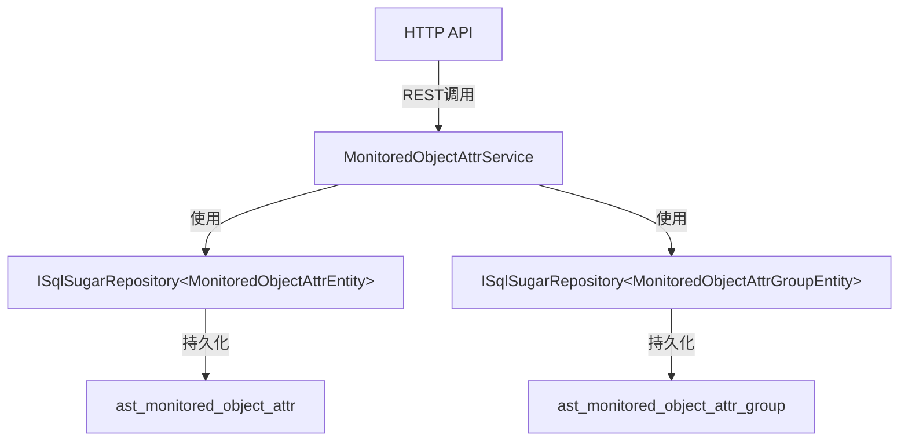

# MonitoredObjectAttrService

## 概述

监测对象属性服务，管理设备的静态属性信息（如生产厂商、生产日期、规格型号等）的 CRUD 操作，属性按属性组进行分类管理。

**位置**：`module/ast-intellisub/Ast.IntelliSub.Application/Services/MonitoredObjectAttrService.cs`
**层**：Application
**模块**：ast-intellisub
**依赖注入**：Scoped

---

## 架构位置



## 核心职责

1. 设备属性的创建、更新、删除操作
2. 设备属性列表查询（分页）
3. 属性名称在同一属性组下的唯一性验证
4. 属性分组的存在性验证

## 主要接口

### 基础 CRUD

```csharp
/// <summary>
/// 创建设备属性
/// </summary>
/// <exception cref="UserFriendlyException">
/// 当属性组不存在时抛出异常
/// 当属性名称在同一组内重复时抛出异常
/// </exception>
[OperLog("创建监测对象属性", OperEnum.Insert)]
Task<MonitoredObjectAttrDto> CreateAsync(MonitoredObjectAttrCreateUpdateDto input);

/// <summary>
/// 更新设备属性
/// </summary>
/// <exception cref="UserFriendlyException">
/// 当属性组不存在时抛出异常
/// 当属性名称在同一组内重复时抛出异常
/// </exception>
[OperLog("更新监测对象属性", OperEnum.Update)]
Task<MonitoredObjectAttrDto> UpdateAsync(Guid id, MonitoredObjectAttrCreateUpdateDto input);

/// <summary>
/// 删除设备属性
/// </summary>
[OperLog("删除监测对象属性", OperEnum.Delete)]
Task DeleteAsync(Guid id);
```

### 查询接口

```csharp
/// <summary>
/// 获取设备属性列表（分页）
/// </summary>
/// <param name="input">查询参数，必须指定属性组ID</param>
/// <returns>分页的属性列表，按创建时间升序排序</returns>
Task<PagedResultDto<MonitoredObjectAttrDto>> GetListAsync(MonitoredObjectAttrGetListInputDto input);
```

---

## 数据处理流程

### 创建设备属性

```
前端请求
  ↓
[验证属性分组存在]
  ↓
[验证属性名称在同一分组下唯一]
  ↓
[创建属性记录]
  ↓
[返回创建结果]
```

### 更新设备属性

```
前端请求
  ↓
[验证属性名称在同一分组下唯一]（排除自身）
  ↓
[更新属性记录]
  ↓
[返回更新结果]
```

### 查询设备属性列表

```
前端请求（属性组ID）
  ↓
[按属性组ID筛选]
  ↓
[按创建时间升序排序]
  ↓
[分页返回结果]
```

---

## 依赖服务

| 服务 | 用途 |
|------|------|
| `ISqlSugarRepository<MonitoredObjectAttrEntity, Guid>` | 设备属性数据访问 |
| `ISqlSugarRepository<MonitoredObjectAttrGroupEntity, Guid>` | 属性分组数据访问 |
| `ILogger<MonitoredObjectAttrService>` | 日志记录 |

---

## 相关实体

### MonitoredObjectAttrEntity

```csharp
[SugarTable("ast_monitored_object_attr")]
public class MonitoredObjectAttrEntity : Entity<Guid>
{
    public string Name { get; set; }                               // 显示名称
    public long? Val { get; set; }                                 // 属性值（整数类型）
    public string? StrVal { get; set; }                           // 属性值（字符串类型）
    public AttrValueTypeEnum ValueType { get; set; }               // 值类型
    public string? Description { get; set; }                       // 描述
    public Guid MonitoredObjectAttrGroupId { get; set; }          // 属性组ID
    public DateTime? CreationTime { get; set; }                   // 创建时间

    [Navigate(NavigateType.OneToOne, nameof(MonitoredObjectAttrGroupId))]
    public MonitoredObjectAttrGroupEntity AttrGroup { get; set; }  // 导航属性：属性组
}
```

### MonitoredObjectAttrGroupEntity

属性分组实体，用于对设备属性进行分类管理（如"基本信息"、"技术参数"等分组）。

---

## 相关 DTO

### MonitoredObjectAttrDto

```csharp
public class MonitoredObjectAttrDto : EntityDto<Guid>
{
    public string Name { get; set; }                    // 名称
    public Guid MonitoredObjectAttrGroupId { get; set; } // 属性组ID
    public long? Val { get; set; }                      // 数值型属性值
    public string? StrVal { get; set; }                 // 字符串型属性值
    public AttrValueTypeEnum ValueType { get; set; }    // 值类型
    public string? Description { get; set; }            // 描述
}
```

### MonitoredObjectAttrCreateUpdateDto

```csharp
public class MonitoredObjectAttrCreateUpdateDto
{
    public string Name { get; set; }                    // 属性名称
    public Guid MonitoredObjectAttrGroupId { get; set; } // 属性组ID
    public long? Val { get; set; }                      // 数值型属性值
    public string? StrVal { get; set; }                // 字符串型属性值
    public AttrValueTypeEnum ValueType { get; set; }   // 值类型
    public string? Description { get; set; }            // 描述
}
```

### MonitoredObjectAttrGetListInputDto

```csharp
public class MonitoredObjectAttrGetListInputDto : PagedAndSortedResultRequestDto
{
    public Guid MonitoredObjectAttrGroupId { get; set; }  // 必填：属性组ID
}
```

---

## 值类型枚举

### AttrValueTypeEnum

属性值类型枚举，用于区分属性存储的是数值还是字符串：

- **数值型**：使用 `Val` 字段存储
- **字符串型**：使用 `StrVal` 字段存储

---

## 权限控制

服务使用 `[Authorize]` 特性进行权限控制，所有操作需要用户认证。

---

## 配置项

无特定配置项，依赖全局 ABP 配置。

---

## 注意事项

### 创建验证

1. **属性组存在性**：创建时必须验证属性分组存在
2. **名称唯一性**：属性名称在同一属性组下必须唯一

### 更新验证

1. **名称唯一性**：验证名称唯一性时排除自身
2. **跨组移动**：如果更新时修改了 `MonitoredObjectAttrGroupId`，需要确保新分组下名称唯一

### 数据模型

1. **双值存储**：属性支持数值（`Val`）和字符串（`StrVal`）两种存储方式，通过 `ValueType` 区分
2. **分组管理**：属性必须归属于某个属性分组，通过 `MonitoredObjectAttrGroupId` 关联
3. **排序方式**：列表查询按创建时间升序排序，不支持自定义排序

### 业务场景

设备属性用于存储设备的静态信息，常见的属性分组包括：

- **基本信息组**：设备名称、设备编号、生产厂家等
- **技术参数组**：额定电压、额定电流、功率等
- **安装信息组**：安装位置、安装日期、维护人员等

---

## 相关文档

- [[MonitoredObjectAttrGroupService]] - 属性分组服务
- [[MonitoredObjectService]] - 监测对象服务
- [[Modules/ast-intellisub/DeviceService]] - 设备管理相关文档
- [[设备属性配置流程]] - 设备属性配置和使用流程

---

**状态**：🟡 学习中
