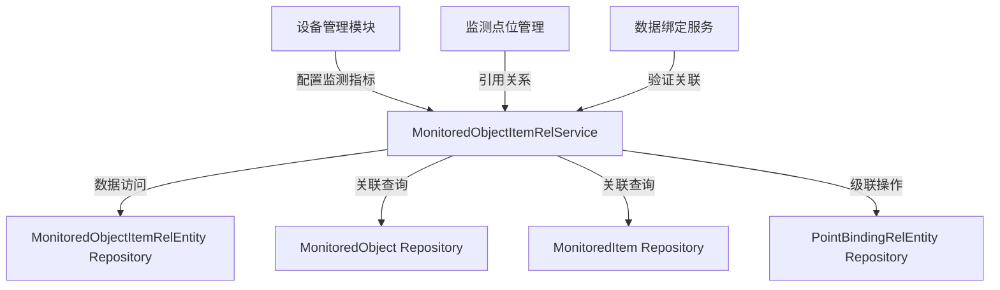

# MonitoredObjectItemRelService

## 概述

管理监测对象（设备）与监测项之间的关联关系，定义每个设备需要监测的具体指标。此服务是设备监测配置的核心，支持级联删除和关系验证。

**位置**：`module/ast-intellisub/Ast.IntelliSub.Application/Services/MonitoredObjectItemRelService.cs`
**层**：Application
**模块**：ast-intellisub
**依赖注入**：Scoped

---

## 架构位置



## 核心职责

1. **关联管理**：创建、更新、删除监测对象与监测项的关联关系
2. **数据验证**：确保关联关系的唯一性和有效性
3. **级联删除**：删除关联时自动清理相关的点位绑定关系
4. **查询服务**：支持按监测对象和监测项筛选关联关系

## 关键接口

```csharp
// 创建监测对象-监测项关联
public override Task<MonitoredObjectItemRelDto> CreateAsync(MonitoredObjectItemRelCreateUpdateDto input);

// 更新关联关系
public override Task<MonitoredObjectItemRelDto> UpdateAsync(Guid id, MonitoredObjectItemRelCreateUpdateDto input);

// 删除关联关系（级联删除点位绑定）
public override Task DeleteAsync(Guid id);

// 获取关联列表（支持筛选）
public override Task<PagedResultDto<MonitoredObjectItemRelDto>> GetListAsync(MonitoredObjectItemRelGetListInputDto input);
```

## 依赖注入配置

```csharp
// 服务通过 ABP 自动注册机制注入
public class MonitoredObjectItemRelService : YiCrudAppService<
    MonitoredObjectItemRelEntity,
    MonitoredObjectItemRelDto,
    MonitoredObjectItemRelDto,
    Guid,
    MonitoredObjectItemRelGetListInputDto,
    MonitoredObjectItemRelCreateUpdateDto,
    MonitoredObjectItemRelCreateUpdateDto>,
    IMonitoredObjectItemRelService
```

## 数据流

```
客户端请求创建关联
  → 验证监测对象存在性
    → 验证监测项存在性
      → 验证关联唯一性
        → 创建关联记录
          → 返回关联信息（包含监测对象和监测项详情）
```

## 重要方法

### `CreateAsync()`

**作用**：创建监测对象与监测项的关联关系

**调用链**：
```
客户端.POST /api/app/ast-intellisub/monitored-object-item-rel
  → MonitoredObjectItemRelService.CreateAsync()
    → MonitoredObjectRepository.GetAsync() [验证监测对象]
    → MonitoredItemRepository.GetAsync() [验证监测项]
    → Repository.InsertAsync() [创建关联]
```

**业务逻辑**：
1. 验证监测对象是否存在
2. 验证监测项是否存在
3. 验证关联关系唯一性（同一监测对象+监测项组合只能存在一次）
4. 如果未指定名称，自动使用监测项名称
5. 创建关联记录并返回

### `DeleteAsync()`

**作用**：删除关联关系，支持级联删除点位绑定关系

**调用链**：
```
客户端.DELETE /api/app/ast-intellisub/monitored-object-item-rel/{id}
  → MonitoredObjectItemRelService.DeleteAsync()
    → PointBindingRelRepository.GetListAsync() [查找关联的点位绑定]
    → PointBindingRelRepository.DeleteAsync() [级联删除点位绑定]
    → Repository.DeleteAsync() [删除关联]
```

**级联删除逻辑**：
1. 查找所有引用此关联的点位绑定关系
2. 记录日志，显示将删除的绑定关系数量
3. 逐个删除相关的点位绑定关系
4. 删除监测对象-监测项关联关系

**日志记录**：
```
[级联删除] 监测项关系 {id} 被 {count} 个点位绑定关系引用，将一并删除
  └─ 已删除点位绑定关系: ID={bindingId}, 监测点位={pointId}, 数据绑定项={bindingItemId}
[删除完成] 监测项关系: ID={id}, 级联删除了 {count} 个点位绑定关系
```

### `GetListAsync()`

**作用**：获取关联关系列表，支持按监测对象和监测项筛选

**查询能力**：
- 按 `MonitoredObjectId` 筛选（获取某设备的所有监测项）
- 按 `MonitoredItemId` 筛选（获取某监测项的所有设备）
- 分页查询支持

## 源码片段

### 关键实现：创建关联关系

```csharp
// 文件路径: module/ast-intellisub/Ast.IntelliSub.Application/Services/MonitoredObjectItemRelService.cs:64-102
[OperLog("创建监测对象监测项关系", OperEnum.Insert)]
public override async Task<MonitoredObjectItemRelDto> CreateAsync(MonitoredObjectItemRelCreateUpdateDto input)
{
    // 验证监测对象是否存在
    var monitoredObject = await _monitoredObjectRepository.GetAsync(input.MonitoredObjectId);
    if (monitoredObject == null)
    {
        throw new UserFriendlyException("监测对象不存在");
    }

    // 验证监测项是否存在
    var monitoredItem = await _monitoredItemRepository.GetAsync(input.MonitoredItemId);
    if (monitoredItem == null)
    {
        throw new UserFriendlyException("监测项不存在");
    }

    // 验证关联关系唯一性
    var exists = await _repository._DbQueryable
        .AnyAsync(x => x.MonitoredObjectId == input.MonitoredObjectId && 
                      x.MonitoredItemId == input.MonitoredItemId);
    if (exists)
    {
        throw new UserFriendlyException("该监测项已关联到此监测对象");
    }

    // 如果未指定名称，则使用监测项名称
    if (string.IsNullOrWhiteSpace(input.Name))
    {
        input.Name = monitoredItem.Name;
    }

    var entity = MapToEntity(input);
    entity.Name = input.Name;

    await _repository.InsertAsync(entity);

    return await MapToGetOutputDtoAsync(entity);
}
```

### 关键实现：级联删除逻辑

```csharp
// 文件路径: module/ast-intellisub/Ast.IntelliSub.Application/Services/MonitoredObjectItemRelService.cs:138-161
[OperLog("删除监测对象监测项关系", OperEnum.Delete)]
public override async Task DeleteAsync(Guid id)
{
    // 查找所有引用此监测项关系的点位绑定关系
    var relatedBindings = await _pointBindingRelRepository._DbQueryable
        .Where(x => x.MonitoredObjectItemRelId == id)
        .ToListAsync();
        
    if (relatedBindings.Any())
    {
        _logger.LogWarning($"[级联删除] 监测项关系 {id} 被 {relatedBindings.Count} 个点位绑定关系引用，将一并删除");
        
        // 级联删除所有相关的点位绑定关系
        foreach (var binding in relatedBindings)
        {
            await _pointBindingRelRepository.DeleteAsync(binding.Id);
            _logger.LogInformation($"  └─ 已删除点位绑定关系: ID={binding.Id}, 监测点位={binding.MonitoredPointId}, 数据绑定项={binding.DataBindingItemId}");
        }
    }
    
    // 删除监测项关系
    await base.DeleteAsync(id);
    
    _logger.LogInformation($"[删除完成] 监测项关系: ID={id}, 级联删除了 {relatedBindings.Count} 个点位绑定关系");
}
```

## 权限控制

```csharp
// ABP 权限定义（通过 [Authorize] 特性全局授权）
[Authorize]
public class MonitoredObjectItemRelService : YiCrudAppService<...>
{
    // 所有方法都需要用户认证
}

// 操作日志记录
[OperLog("创建监测对象监测项关系", OperEnum.Insert)]
public override async Task<MonitoredObjectItemRelDto> CreateAsync(...)

[OperLog("更新监测对象监测项关系", OperEnum.Update)]
public override async Task<MonitoredObjectItemRelDto> UpdateAsync(...)

[OperLog("删除监测对象监测项关系", OperEnum.Delete)]
public override async Task DeleteAsync(...)
```

## 相关组件

- [[MonitoredObjectService]] - 监测对象管理（调用方）
- [[MonitoredItemService]] - 监测项管理（依赖项）
- [[PointBindingRelService]] - 点位绑定关系服务（级联操作）
- [[MonitoredObjectItemRelEntity]] - 关联关系实体
- [[MonitoredObjectItemRelDto]] - 数据传输对象

## 业务规则

### 关联关系唯一性
- 同一监测对象和监测项的组合只能存在一个关联关系
- 创建和更新时都会进行唯一性验证

### 级联删除规则
- 删除监测对象-监测项关联时，会自动删除所有引用此关联的点位绑定关系
- 级联删除前会记录详细的日志信息

### 命名规则
- 如果创建时未指定名称（`Name` 为空），自动使用监测项的名称
- 更新时可以修改关联关系的名称

## 学习笔记

### 难点理解

1. **关联关系的设计**：此服务是设备监测配置的核心，通过它定义每个设备需要监测哪些具体指标
2. **级联删除的必要性**：由于监测项关系被点位绑定关系引用，删除时必须先清理引用关系
3. **名称自动填充**：为了简化操作，创建时可以不指定名称，系统自动使用监测项名称

### 疑题

1. **批量操作支持**：当前服务不支持批量创建关联关系，如需要可以扩展批量创建方法
2. **性能优化**：对于大型系统，可以考虑引入缓存机制减少频繁的数据库查询

## 参考资料

- [ABP Framework 应用服务文档](https://docs.abp.io/docs/abp/latest/Application-Services)
- 项目源码：`module/ast-intellisub/Ast.IntelliSub.Application/Services/MonitoredObjectItemRelService.cs`
- 相关实体：`module/ast-intellisub/Ast.IntelliSub.Domain/Entities/MonitoredObjectItemRelEntity.cs`

---
**状态**：✅ 完成