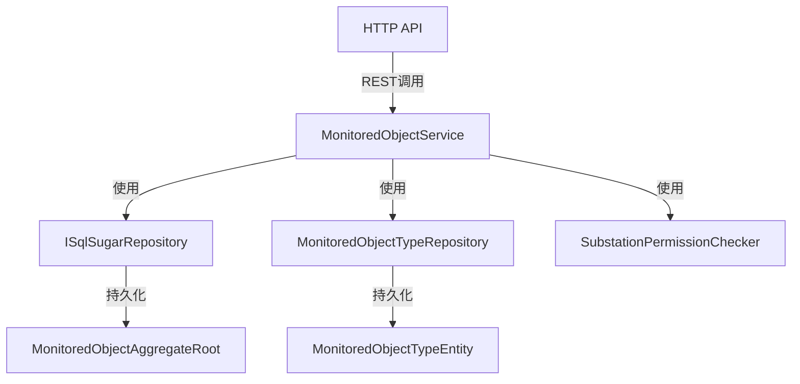

# MonitoredObjectService

## 概述

监测对象服务，提供监测对象的 CRUD 操作、树形结构查询、统计信息和详情获取功能。

**位置**：`module/ast-intellisub/Ast.IntelliSub.Application/Services/MonitoredObjectService.cs`
**层**：Application
**模块**：ast-intellisub
**依赖注入**：Scoped

---

## 架构位置



## 核心职责

1. 监测对象的创建、更新、删除操作
2. 监测对象树形结构查询
3. 子监测对象列表获取
4. 监测对象统计信息
5. 监测对象详情查询
6. 监测对象树搜索

## 主要接口

### 基础 CRUD

```csharp
/// <summary>
/// 创建监测对象
/// </summary>
Task<MonitoredObjectDto> CreateAsync(MonitoredObjectCreateUpdateDto input);

/// <summary>
/// 更新监测对象
/// </summary>
Task<MonitoredObjectDto> UpdateAsync(Guid id, MonitoredObjectCreateUpdateDto input);

/// <summary>
/// 删除监测对象（级联删除子对象）
/// </summary>
Task DeleteAsync(Guid id);

/// <summary>
/// 获取监测对象详情
/// </summary>
Task<MonitoredObjectDetailDto> GetDetailAsync(Guid id);
```

### 树形结构查询

```csharp
/// <summary>
/// 获取监测对象树形结构
/// </summary>
Task<List<MonitoredObjectTreeDto>> GetTreeAsync(MonitoredObjectTreeInputDto input);

/// <summary>
/// 获取子监测对象列表
/// </summary>
Task<List<MonitoredObjectDto>> GetChildrenAsync(Guid? parentId, MonitoredObjectCategoryEnum? category);

/// <summary>
/// 搜索监测对象树
/// </summary>
Task<List<MonitoredObjectTreeDto>> SearchTreeAsync(string keyword);
```

### 统计功能

```csharp
/// <summary>
/// 获取监测对象统计信息
/// </summary>
Task<MonitoredObjectStatisticsDto> GetStatisticsAsync(MonitoredObjectStatisticsInputDto input);
```

---

## 数据处理流程

### 创建监测对象

```
前端请求
  ↓
[验证名称唯一性]
  ↓
[验证站点访问权限]
  ↓
[验证监测对象类型]
  ↓
[验证父级对象]
  ↓
[检查父级类型是否为分组]
  ↓
[创建对象记录]
  ↓
[返回创建结果]
```

### 删除监测对象（级联删除）

```
前端请求
  ↓
[收集所有子对象ID]
  ↓
[递归删除子对象]
  ↓
[删除主对象]
  ↓
[清理关联关系]
```

---

## 依赖服务

| 服务 | 用途 |
|------|------|
| `ISqlSugarRepository<MonitoredObjectAggregateRoot, Guid>` | 监测对象数据访问 |
| `ISqlSugarRepository<MonitoredObjectTypeEntity, Guid>` | 监测对象类型数据访问 |
| `ISubstationPermissionChecker` | 站点权限验证 |
| `IMonitoredPointService` | 关联点位服务 |

---

## 相关实体

### MonitoredObjectAggregateRoot

```csharp
public class MonitoredObjectAggregateRoot : FullAuditedAggregateRoot<Guid>
{
    public string Name { get; set; }
    public Guid? ParentId { get; set; }
    public Guid MonitoredObjectTypeId { get; set; }
    public Guid SubstationId { get; set; }
    public int? OrderNum { get; set; }
    public string? Description { get; set; }
}
```

### MonitoredObjectTypeEntity

```csharp
public class MonitoredObjectTypeEntity : Entity<Guid>
{
    public string Name { get; set; }
    public MonitoredObjectCategoryEnum Category { get; set; }
    // Category: 0=分组, 1=设备, 2=部件
}
```

---

## 相关 DTO

### MonitoredObjectTreeDto

```csharp
public class MonitoredObjectTreeDto
{
    public Guid Id { get; set; }
    public string Name { get; set; }
    public Guid? ParentId { get; set; }
    public MonitoredObjectCategoryEnum Category { get; set; }
    public List<MonitoredObjectTreeDto> Children { get; set; }
}
```

### MonitoredObjectStatisticsDto

```csharp
public class MonitoredObjectStatisticsDto
{
    public int TotalCount { get; set; }
    public int AbnormalTotalCount { get; set; }
    public List<MonitoredObjectStatisticsItemDto> Items { get; set; }
}
```

---

## 权限控制

服务使用 `[Authorize]` 特性进行权限控制，所有操作需要用户认证。

站点权限验证：
- 创建/更新操作会检查用户对指定站点的访问权限
- 使用 `ISubstationPermissionChecker.CheckSubstationPermissionAsync()` 验证

---

## 配置项

无特定配置项，依赖全局 ABP 配置。

---

## 注意事项

### 创建验证

1. **名称唯一性**：同一站点下监测对象名称必须唯一
2. **父级验证**：父级对象必须存在且类型为分组（Category = 0）
3. **权限验证**：用户必须具有对站点的访问权限

### 删除操作

- 支持级联删除：删除父对象会自动删除所有子对象
- 使用 `CollectChildIdsRecursively()` 递归收集所有子对象ID

### 树形结构

- 支持多级树形结构
- 只有分组类型的对象才能作为父级
- 支持按类别（分组/设备/部件）筛选

### 性能考虑

- 树形查询使用 LeftJoin 关联类型表
- 统计查询使用 CountAsync 聚合函数
- 级联删除使用递归处理

---

## 相关文档

- [[Modules/ast-intellisub/变电站监视范围概览]] - 监视对象、物理量与数据流总览
- [[MonitoredObjectTypeService]] - 监测对象类型服务
- [[MonitoredPointService]] - 监测点位服务
- [[设备管理服务]] - 设备管理相关文档
- [[设备告警流程]] - 告警处理流程

---

**状态**：🟡 学习中
