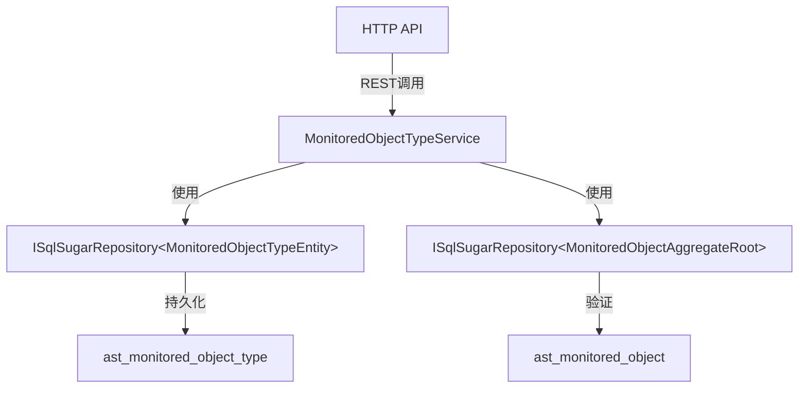

# MonitoredObjectTypeService

## 概述

监测对象类型服务，管理监测对象的类型定义（如主变压器、断路器、隔离开关等设备类型），支持按分类（分组/设备/子设备）进行管理。

**位置**：`module/ast-intellisub/Ast.IntelliSub.Application/Services/MonitoredObjectTypeService.cs`
**层**：Application
**模块**：ast-intellisub
**依赖注入**：Scoped

---

## 架构位置



## 核心职责

1. 监测对象类型的创建、更新、删除操作
2. 监测对象类型列表查询（分页和全量）
3. 类型名称唯一性验证
4. 类型与设备绑定的关系验证

## 主要接口

### 基础 CRUD

```csharp
/// <summary>
/// 创建监测对象类型
/// </summary>
/// <exception cref="UserFriendlyException">当类型名称重复时抛出异常</exception>
[OperLog("创建监测对象类型", OperEnum.Insert)]
Task<MonitoredObjectTypeDto> CreateAsync(MonitoredObjectTypeCreateUpdateDto input);

/// <summary>
/// 更新监测对象类型
/// </summary>
/// <exception cref="UserFriendlyException">当类型名称重复时抛出异常</exception>
[OperLog("更新监测对象类型", OperEnum.Update)]
Task<MonitoredObjectTypeDto> UpdateAsync(Guid id, MonitoredObjectTypeCreateUpdateDto input);

/// <summary>
/// 删除监测对象类型
/// </summary>
/// <exception cref="ApplicationException">当类型已经绑定设备时抛出异常</exception>
[OperLog("删除监测对象类型", OperEnum.Delete)]
Task DeleteAsync(IEnumerable<Guid> id);
```

### 查询接口

```csharp
/// <summary>
/// 获取监测对象类型列表（分页）
/// </summary>
/// <param name="input">查询参数，支持关键字搜索和分类筛选</param>
/// <returns>分页的类型列表</returns>
Task<PagedResultDto<MonitoredObjectTypeDto>> GetListAsync(MonitoredObjectTypeGetListInputDto input);

/// <summary>
/// 获取所有监测对象类型列表
/// </summary>
/// <param name="input">查询参数，支持关键字搜索和分类筛选</param>
/// <returns>所有匹配的类型列表</returns>
Task<List<MonitoredObjectTypeDto>> GetAllListAsync(MonitoredObjectTypeGetListInputDto input);
```

---

## 数据处理流程

### 创建监测对象类型

```
前端请求
  ↓
[验证名称唯一性]
  ↓
[创建类型记录]
  ↓
[返回创建结果]
```

### 更新监测对象类型

```
前端请求
  ↓
[验证名称唯一性]（排除自身）
  ↓
[更新类型记录]
  ↓
[返回更新结果]
```

### 删除监测对象类型

```
前端请求
  ↓
[检查类型是否绑定设备]
  ↓
[遍历每个待删除的类型]
  ↓
[验证无设备使用该类型]
  ↓
[删除类型记录]
```

### 查询类型列表

```
前端请求
  ↓
[关键字搜索]（名称或描述）
  ↓
[分类筛选]（可选）
  ↓
[分页/全量查询]
  ↓
[返回结果]
```

---

## 依赖服务

| 服务 | 用途 |
|------|------|
| `ISqlSugarRepository<MonitoredObjectTypeEntity, Guid>` | 监测对象类型数据访问 |
| `ISqlSugarRepository<MonitoredObjectAggregateRoot, Guid>` | 监测对象数据访问（用于删除验证） |
| `ILogger<MonitoredObjectTypeService>` | 日志记录 |

---

## 相关实体

### MonitoredObjectTypeEntity

```csharp
[SugarTable("ast_monitored_object_type")]
public class MonitoredObjectTypeEntity : Entity<Guid>
{
    public string Key { get; set; }                            // UI形状的key标识
    public string Name { get; set; }                            // 显示名称
    public MonitoredObjectCategoryEnum Category { get; set; }   // 分类（0:分组,1:设备,2:子设备）
    public string? Description { get; set; }                   // 描述
    public string? Icon { get; set; }                           // 图标
}
```

### MonitoredObjectCategoryEnum

监测对象分类枚举：

- **0 - 分组 (Group)**：用于组织其他类型的容器节点
- **1 - 设备 (Device)**：实际的设备类型，如主变压器、断路器等
- **2 - 子设备 (SubDevice)**：设备的部件或子组件

---

## 相关 DTO

### MonitoredObjectTypeDto

```csharp
public class MonitoredObjectTypeDto : EntityDto<Guid>
{
    public string Name { get; set; }                      // 名称
    public string Key { get; set; }                       // UI形状key标识
    public string? Description { get; set; }             // 描述
    public MonitoredObjectCategoryEnum Category { get; set; } // 分类
    public string Icon { get; set; }                      // 图标
}
```

### MonitoredObjectTypeCreateUpdateDto

```csharp
public class MonitoredObjectTypeCreateUpdateDto
{
    public string Name { get; set; }                      // 名称
    public string Key { get; set; }                       // UI形状key标识
    public string? Description { get; set; }              // 描述
    public MonitoredObjectCategoryEnum Category { get; set; } // 分类
    public string Icon { get; set; }                      // 图标
}
```

### MonitoredObjectTypeGetListInputDto

```csharp
public class MonitoredObjectTypeGetListInputDto : PagedAndSortedResultRequestDto
{
    public string? Keyword { get; set; }                  // 关键字（搜索名称或描述）
    public MonitoredObjectCategoryEnum? Category { get; set; } // 分类筛选（可选）
}
```

---

## 权限控制

服务使用 `[Authorize]` 特性进行权限控制，所有操作需要用户认证。

---

## 配置项

无特定配置项，依赖全局 ABP 配置。

---

## 注意事项

### 创建验证

1. **名称唯一性**：类型名称在全局范围内必须唯一
2. **分类指定**：创建时必须明确指定分类（分组/设备/子设备）

### 更新验证

1. **名称唯一性**：验证名称唯一性时排除自身
2. **分类变更**：更新时可以修改分类，但需注意已绑定的设备可能会受到影响

### 删除验证

1. **设备绑定检查**：删除前检查是否有监测对象正在使用该类型
2. **异常类型**：删除验证失败时抛出 `ApplicationException` 而非 `UserFriendlyException`

### 查询功能

1. **关键字搜索**：支持按名称和描述进行模糊搜索
2. **分类筛选**：支持按分类（分组/设备/子设备）筛选
3. **双查询模式**：提供分页查询（`GetListAsync`）和全量查询（`GetAllListAsync`）

### UI 形状标识

- **Key 字段**：用于前端渲染时识别不同类型的UI形状
- **Icon 字段**：用于在界面上显示对应的图标

### 业务场景

监测对象类型用于定义设备的不同类型，常见的类型包括：

**分组类型（Category = 0）**：
- 一次设备分组
- 二次设备分组
- 辅助设备分组

**设备类型（Category = 1）**：
- 主变压器
- 断路器
- 隔离开关
- 电流互感器
- 电压互感器

**子设备类型（Category = 2）**：
- 变压器绕组
- 断路器机构
- 冷却系统

---

## 相关文档

- [[MonitoredObjectService]] - 监测对象服务
- [[设备类型管理流程]] - 设备类型的配置和管理流程
- [[设备分类体系]] - 设备分类和层级结构说明
- [[Modules/ast-intellisub/DeviceService]] - 设备管理相关文档

---

**状态**：🟡 学习中
