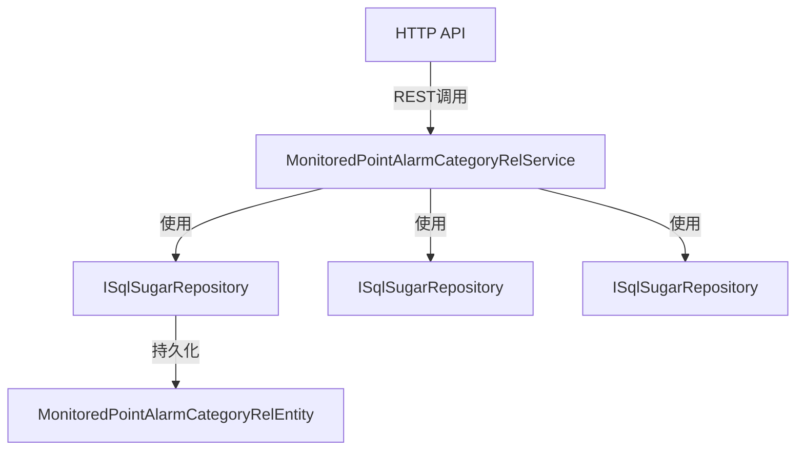
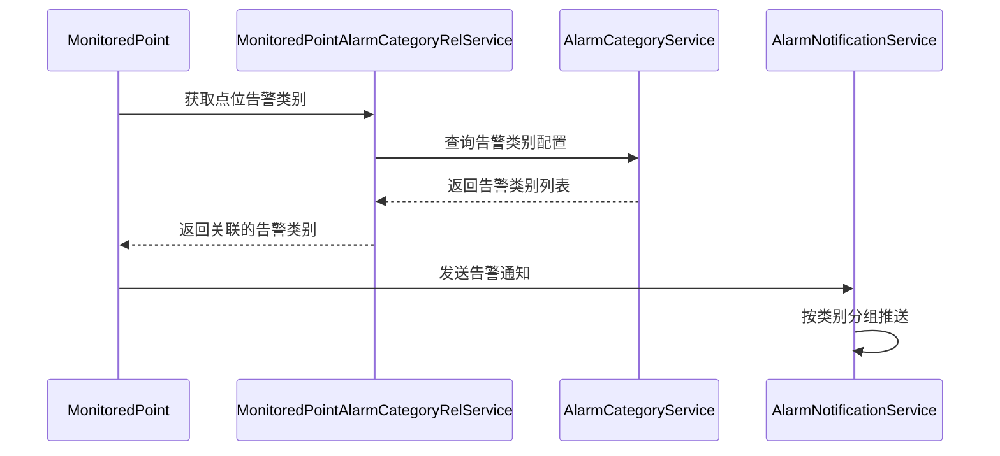

# MonitoredPointAlarmCategoryRelService

## 概述

监测点位告警分类关联服务，负责管理监测点位与告警类别的多对多关联关系。

**位置**：`module/ast-intellisub/Ast.IntelliSub.Application/Services/MonitoredPointAlarmCategoryRelService.cs`
**层**：Application
**模块**：ast-intellisub
**依赖注入**：Scoped

---

## 架构位置



## 核心职责

1. 管理监测点位与告警类别的关联关系
2. 支持批量设置点位的告警类别
3. 查询点位的告警类别配置
4. 删除关联关系
5. 告警分类的动态配置

## 主要接口

### 关联关系管理

```csharp
/// <summary>
/// 获取关系列表
/// </summary>
Task<List<MonitoredPointAlarmCategoryRelDto>> GetListAsync(MonitoredPointAlarmCategoryRelGetListInputDto input);

/// <summary>
/// 创建关系
/// </summary>
Task<MonitoredPointAlarmCategoryRelDto> CreateAsync(MonitoredPointAlarmCategoryRelCreateDto input);

/// <summary>
/// 删除关系
/// </summary>
Task DeleteAsync(Guid id);
```

### 批量操作

```csharp
/// <summary>
/// 批量设置监测点位的告警类别
/// </summary>
Task SetAlarmCategoriesAsync(Guid monitoredPointId, List<Guid> alarmCategoryIds);

/// <summary>
/// 获取监测点位的告警类别
/// </summary>
Task<List<AlarmCategoryDto>> GetAlarmCategoriesByPointAsync(Guid monitoredPointId);
```

---

## 数据处理流程

### 创建关联关系

```
前端请求
  ↓
[验证监测点位存在]
  ↓
[验证告警类别存在]
  ↓
[验证关系未重复]
  ↓
[创建关联记录]
  ↓
[返回创建结果]
```

### 批量设置告警类别

```
前端请求
  ↓
[删除现有关联]
  ↓
[验证告警类别ID]
  ↓
[批量创建新关联]
  ↓
[返回设置结果]
```

---

## 依赖服务

| 服务 | 用途 |
|------|------|
| `ISqlSugarRepository<MonitoredPointAlarmCategoryRelEntity, Guid>` | 关联关系数据访问 |
| `ISqlSugarRepository<AlarmCategoryAggregateRoot, Guid>` | 告警类别数据访问 |
| `ISqlSugarRepository<MonitoredPointEntity, Guid>` | 监测点位数据访问 |

---

## 相关实体

### MonitoredPointAlarmCategoryRelEntity

```csharp
public class MonitoredPointAlarmCategoryRelEntity : Entity<Guid>
{
    public Guid MonitoredPointId { get; set; }
    public Guid AlarmCategoryId { get; set; }
    public DateTime CreationTime { get; set; }
}
```

### AlarmCategoryAggregateRoot

```csharp
public class AlarmCategoryAggregateRoot : FullAuditedAggregateRoot<Guid>
{
    public string Name { get; set; }
    public AlarmCategoryTypeEnum Type { get; set; }
    public string? Description { get; set; }
    public int? OrderNum { get; set; }
}
```

### AlarmCategoryTypeEnum

```csharp
public enum AlarmCategoryTypeEnum
{
    Temperature = 0,    // 温度告警
    Vibration = 1,      // 振动告警
    Noise = 2,          // 噪声告警
    PartialDischarge = 3, // 局放告警
    Environmental = 4, // 环境告警
    Equipment = 5       // 设备告警
}
```

---

## 相关 DTO

### MonitoredPointAlarmCategoryRelDto

```csharp
public class MonitoredPointAlarmCategoryRelDto
{
    public Guid Id { get; set; }
    public Guid MonitoredPointId { get; set; }
    public Guid AlarmCategoryId { get; set; }
    public AlarmCategoryDto AlarmCategory { get; set; }
}
```

### AlarmCategoryDto

```csharp
public class AlarmCategoryDto
{
    public Guid Id { get; set; }
    public string Name { get; set; }
    public AlarmCategoryTypeEnum Type { get; set; }
    public string? Description { get; set; }
    public int? OrderNum { get; set; }
}
```

---

## 使用场景

### 配置点位告警类型

```
监测点位：变压器温度测点
  ↓
关联告警类别：
  - 温度告警（高温）
  - 温度告警（低温）
  - 温度告警（温差过大）
```

### 动态告警分类

- 不同类型的监测点位可配置不同的告警类别
- 支持一个点位关联多个告警类别
- 告警类别按类型分组（温度、振动、噪声等）

---

## 配置项

无特定配置项，使用数据库配置。

---

## 注意事项

### 唯一性约束

- 同一监测点位与告警类别的组合唯一
- 创建前检查是否已存在关联

### 级联删除

- 删除监测点位时，自动删除关联的告警类别关系
- 删除告警类别时，自动删除关联关系

### 批量操作

- `SetAlarmCategoriesAsync` 会替换现有关联
- 使用事务确保批量操作的原子性

### 查询优化

- 使用 LeftJoin 关联查询告警类别详情
- 支持按监测点位或告警类别过滤

---

## 告警处理流程中的使用



---

## 相关文档

- [[AlarmCategoryService]] - 告警分类服务
- [[AlarmRecordService]] - 告警记录服务
- [[AlarmNotificationService]] - 告警通知服务
- [[设备告警流程]] - 告警处理流程

---

**状态**：🟡 学习中
