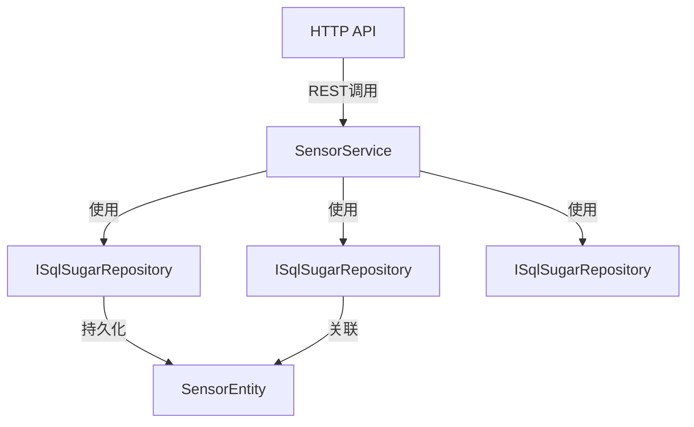

# SensorService

## 概述

传感器服务，提供传感器（预置点位）的 CRUD 操作、按设备查询和状态管理功能。

**位置**：`module/ast-intellisub/Ast.IntelliSub.Application/Services/SensorService.cs`
**层**：Application
**模块**：ast-intellisub
**依赖注入**：Scoped

---

## 架构位置



## 核心职责

1. 传感器的创建、更新、删除操作
2. 按设备查询传感器列表
3. 传感器与点位关联管理
4. 传感器状态同步
5. 批量传感器操作

## 主要接口

### 基础 CRUD

```csharp
/// <summary>
/// 创建传感器
/// </summary>
Task<SensorDto> CreateAsync(SensorCreateUpdateDto input);

/// <summary>
/// 更新传感器
/// </summary>
Task<SensorDto> UpdateAsync(Guid id, SensorCreateUpdateDto input);

/// <summary>
/// 删除传感器
/// </summary>
Task DeleteAsync(Guid id);

/// <summary>
/// 获取传感器详情
/// </summary>
Task<SensorDto> GetAsync(Guid id);
```

### 按设备查询

```csharp
/// <summary>
/// 获取设备下的传感器列表
/// </summary>
Task<List<SensorDto>> GetByDeviceAsync(SensorByDeviceRequestDto input);
```

### 同步接口（ISensorSyncService）

```csharp
/// <summary>
/// 同步单个传感器/预置点位
/// </summary>
Task<SyncSensorResultDto> SyncSingleSensorAsync(SyncSensorDto sensor);

/// <summary>
/// 批量同步传感器/预置点位
/// </summary>
Task<SyncSensorResultDto> BatchSyncSensorsAsync(BatchSyncSensorInputDto input);

/// <summary>
/// 从ISAPI接口同步预置点位
/// </summary>
Task<SyncSensorResultDto> SyncPresetsFromISAPIAsync(string deviceId, int channelId = 1);

/// <summary>
/// 删除传感器/预置点位
/// </summary>
Task<bool> DeleteSensorAsync(string deviceId, string sensorKey);
```

---

## 数据处理流程

### 创建传感器

```
前端请求
  ↓
[验证设备存在]
  ↓
[验证传感器Key唯一性]
  ↓
[创建传感器记录]
  ↓
[关联到设备]
  ↓
[返回创建结果]
```

### 传感器同步（从流媒体网关）

```
触发同步
  ↓
[连接流媒体API]
  ↓
[获取设备通道列表]
  ↓
[获取预置位列表]
  ↓
[比对本地传感器数据]
  ↓
[新增/更新传感器]
  ↓
[标记删除不存在的传感器]
  ↓
[返回同步结果]
```

---

## 依赖服务

| 服务 | 用途 |
|------|------|
| `ISqlSugarRepository<SensorEntity, Guid>` | 传感器数据访问 |
| `ISqlSugarRepository<DeviceEntity, string>` | 设备数据访问 |
| `ISqlSugarRepository<AstPointEntity, Guid>` | 点位数据访问 |
| `ISensorSyncService` | 传感器同步服务 |
| `IStreamingApiService` | 流媒体API服务 |

---

## 相关实体

### SensorEntity

```csharp
public class SensorEntity : Entity<Guid>
{
    public string SensorKey { get; set; }
    public string Name { get; set; }
    public string DeviceId { get; set; }
    public int? ChannelId { get; set; }
    public int? PresetId { get; set; }
    public bool? IsEnabled { get; set; }
    public DateTime CreationTime { get; set; }
    public MonitoredObjectAggregateRoot MonitoredObject { get; set; }
}
```

### DeviceEntity

```csharp
public class DeviceEntity : Entity<string>
{
    public string Name { get; set; }
    public string GatewayId { get; set; }
    public DeviceStatusEnum Status { get; set; }
    public string HardwareName { get; set; }
    public string Type { get; set; }
}
```

---

## 相关 DTO

### SensorDto

```csharp
public class SensorDto
{
    public Guid Id { get; set; }
    public string SensorKey { get; set; }
    public string Name { get; set; }
    public string DeviceId { get; set; }
    public int? ChannelId { get; set; }
    public int? PresetId { get; set; }
    public bool? IsEnabled { get; set; }
}
```

### SensorStatusDto

```csharp
public class SensorStatusDto
{
    public string Id { get; set; }
    public string Name { get; set; }
    public string SensorKey { get; set; }
    public CommonStatusEnum Status { get; set; }
}
```

### SyncSensorResultDto

```csharp
public class SyncSensorResultDto
{
    public int SuccessCount { get; set; }
    public int UpdateCount { get; set; }
    public int DeleteCount { get; set; }
    public List<string> Errors { get; set; }
}
```

---

## 传感器类型

### 预置点位（Preset）

- 从流媒体网关同步的摄像机预置位
- 用于视频巡检和监控
- 关联到设备和通道

### 数据传感器

- 用于采集环境数据
- 通过网关上报数据
- 关联到监测点位

---

## 同步机制

### 从流媒体网关同步

```csharp
// 触发同步
await streamingApiService.SyncDeviceChannelsAsync(deviceId);

// 获取预置位
var presets = await streamingApiService.GetPresetsAsync(deviceId, channelId);

// 批量创建或更新
foreach (var preset in presets)
{
    var sensor = new SensorEntity
    {
        SensorKey = preset.PresetId.ToString(),
        Name = preset.Name,
        DeviceId = deviceId,
        ChannelId = channelId,
        PresetId = preset.PresetId,
        IsEnabled = true
    };
    
    await _repository.InsertOrUpdateAsync(sensor);
}
```

### 从 ISAPI 同步

- 支持从 IEC104/IEC61850 网关同步传感器
- 使用 `ISensorSyncService.SyncPresetsFromISAPIAsync()`
- 自动映射到本地传感器实体

---

## 配置项

无特定配置项，依赖网关配置。

---

## 注意事项

### 唯一性约束

- 传感器 Key（`SensorKey`）在同一设备下必须唯一
- 预置位使用预设 ID 作为 SensorKey

### 关联关系

- 传感器必须关联到设备
- 可选关联到监测对象（MonitoredObject）
- 可选关联到点位（AstPoint）

### 同步策略

- 增量同步：只同步变化的数据
- 软删除：标记删除而不物理删除
- 批量操作：支持批量同步以提高性能

### 状态管理

- 传感器状态：启用/禁用（IsEnabled）
- 设备状态：正常/离线（DeviceStatusEnum）
- 定期同步状态变化

---

## 相关文档

- [[DeviceService]] - 设备服务
- [[StreamingGatewayService]] - 流媒体网关服务
- [[MonitoredPointService]] - 监测点位服务
- [[设备管理服务]] - 设备管理相关文档

---

**状态**：🟡 学习中
