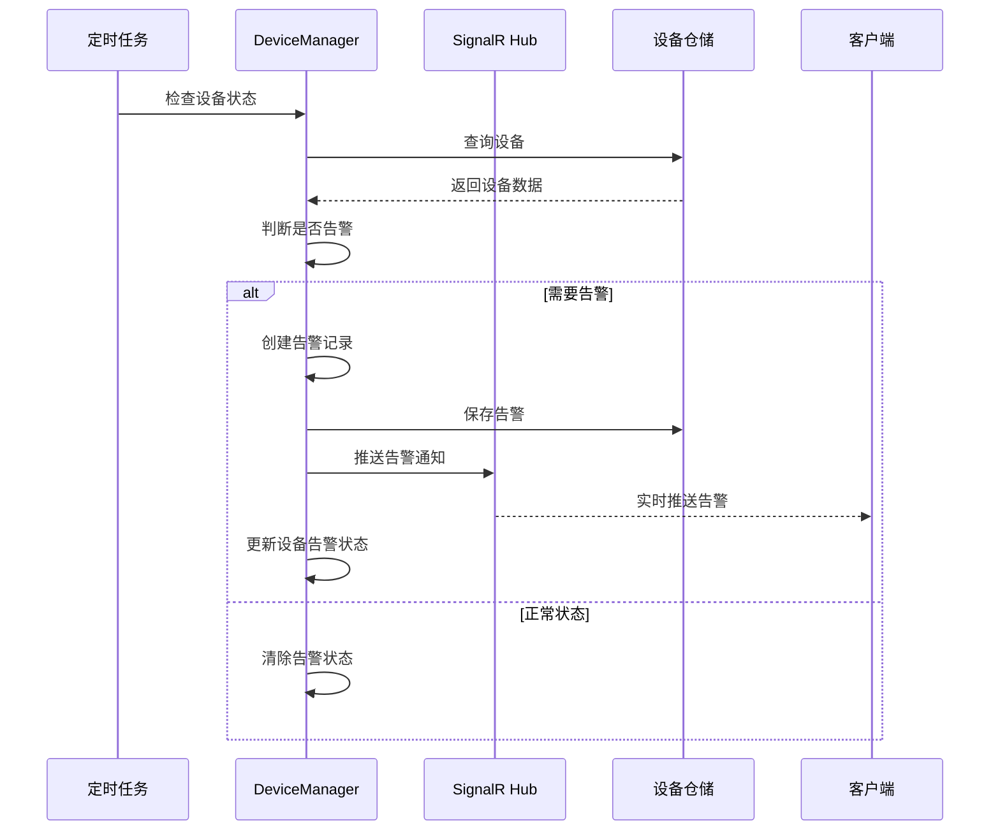

# 设备告警处理流程

## 流程概述

描述从设备状态异常到告警推送的完整处理流程。

**触发方式**：
1. 定时任务检测设备状态
2. 设备主动上报异常
3. 手动触发告警测试

---

## 完整流程图



---

## 详细步骤

### 步骤 1：设备状态检测

**负责组件**：[[CheckDeviceStatusJob]]

**操作**：
1. 从数据库获取所有活跃设备
2. 检查每个设备的最新状态
3. 判断是否满足告警条件

**输入**：无（定时触发）

**输出**：异常设备列表

---

### 步骤 2：告警规则判断

**负责组件**：[[AlarmRuleService]]

**操作**：
1. 加载设备的告警规则配置
2. 比对当前状态与规则阈值
3. 确定告警级别（严重/警告/提示）

**告警条件**：
- 设备离线超过 N 分钟
- 传感器数据异常
- 连续失败次数超过阈值

---

### 步骤 3：创建告警记录

**负责组件**：[[AlarmManager]]

**操作**：
1. 创建告警实体
2. 记录告警时间、设备、级别、消息
3. 关联相关设备信息

**数据结构**：
```csharp
public class Alarm : FullAuditedAggregateRoot<Guid>
{
    public Guid DeviceId { get; set; }
    public AlarmLevel Level { get; set; }
    public string Message { get; set; }
    public bool IsResolved { get; set; }
    public DateTime? ResolvedTime { get; set; }
}
```

---

### 步骤 4：实时推送

**负责组件**：[[AlarmHub]]

**操作**：
1. 通过 SignalR 推送告警消息
2. 发送给订阅的客户端
3. 客户端显示告警弹窗

**推送消息格式**：
```json
{
  "type": "alarm",
  "deviceId": "guid",
  "level": "Critical",
  "message": "设备离线",
  "timestamp": "2026-06-02T10:30:00Z"
}
```

---

### 步骤 5：告警历史记录

**负责组件**：[[AlarmRepository]]

**操作**：
1. 持久化告警记录
2. 支持告警历史查询
3. 支持告警统计分析

---

## 数据流向

```
定时任务触发
  ↓
[CheckDeviceStatusJob] - 设备状态检测
  ↓
[AlarmRuleService] - 告警规则判断
  ↓
[AlarmManager] - 创建告警记录
  ↓
[AlarmRepository] - 保存告警
  ↓
[SignalR Hub] - 实时推送
  ↓
客户端接收并显示
```

## 涉及的API端点

| 方法 | 路径 | 服务 | 功能 |
|------|------|------|------|
| GET | `/api/app/intellisub/alarms` | AlarmAppService | 获取告警列表 |
| GET | `/api/app/intellisub/alarms/{id}` | AlarmAppService | 获取告警详情 |
| PUT | `/api/app/intellisub/alarms/{id}/resolve` | AlarmAppService | 解决告警 |
| GET | `/api/app/intellisub/devices/{id}/alarms` | AlarmAppService | 获取设备告警历史 |

## 涉及的实体

| 实体 | 表名 | 说明 |
|------|------|------|
| Device | Devices | 设备信息 |
| Alarm | Alarms | 告警记录 |
| AlarmRule | AlarmRules | 告警规则配置 |

## 错误处理

### 常见错误

| 错误 | 原因 | 处理 |
|------|------|------|
| DeviceNotFound | 设备不存在 | 跳过该设备，记录日志 |
| RuleNotConfigured | 告警规则未配置 | 使用默认规则 |
| PushFailed | 推送失败 | 记录日志，不影响告警保存 |

## 性能考虑

- **批量处理**：一次查询多个设备，减少数据库往返
- **异步推送**：SignalR 推送不阻塞告警保存
- **缓存规则**：告警规则配置缓存在内存中

### 优化建议

1. 使用缓存存储设备当前状态，减少数据库查询
2. 告警推送使用消息队列解耦
3. 告警记录定期归档，保持主表性能

---

## 连续告警机制

当前项目支持"连续五次告警才告警"的机制：

```csharp
// 检查是否连续达到阈值
if (alarmCount >= 5)
{
    // 触发正式告警
    await CreateAlarmAsync(device, level);
}
```

---

## 相关流程

- [[设备状态更新流程]] - 设备状态如何更新
- [[实时推送流程]] - SignalR 推送机制
- [[告警解决流程]] - 告警解决的处理

---

## 实现细节

### 关键代码

```csharp
public async Task CheckDeviceStatusAsync()
{
    var devices = await _deviceRepository.GetActiveDevicesAsync();

    foreach (var device in devices)
    {
        var isAbnormal = await _alarmRuleService.CheckAlarmConditionAsync(device);

        if (isAbnormal)
        {
            await _alarmManager.CreateAlarmAsync(device, AlarmLevel.Warning);
            await _alarmHub.PushAlarmAsync(device);
        }
    }
}
```

## 学习笔记

### 理解要点

1. **告警与状态的分离**：设备状态是数据，告警是基于状态的业务事件
2. **告警级别的重要性**：不同级别对应不同的处理策略
3. **实时性的保障**：使用 SignalR 而非轮询来实现实时推送

### 疑问

- 告警风暴如何处理？（短时间内大量告警）
- 告警去重策略是什么？
- 告警升级机制如何设计？（从警告升级为严重）

---
**状态**：🟡 学习中
