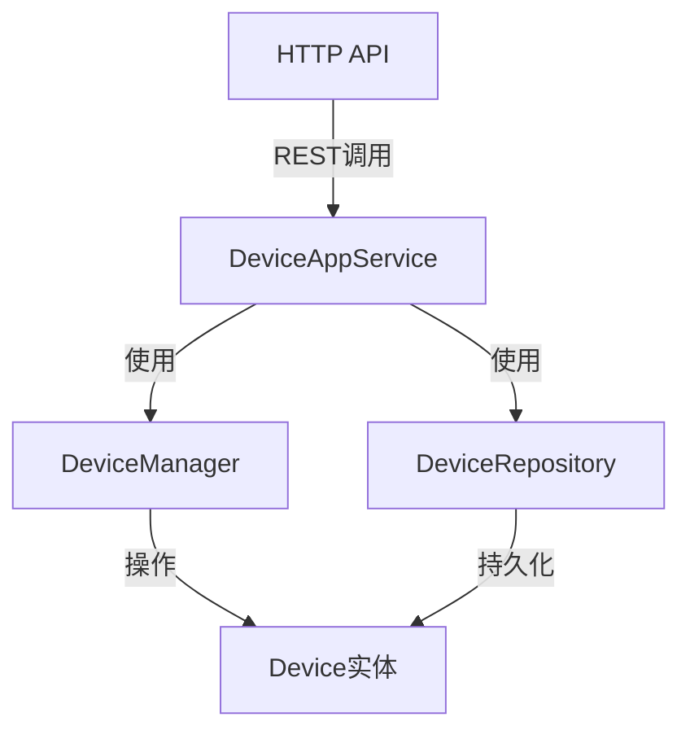

# DeviceAppService

## ⚠️ 已废弃

**本文档已废弃**。该服务（`DeviceAppService`）在当前代码库中不存在。

设备管理功能已重构为以下服务：
- **MonitoredObjectService** - 监控对象管理（原设备管理核心功能）
- **MonitoredPointService** - 监控点位管理
- **GatewayService** - 网关设备管理

请参考以下更新的文档：
- [[MonitoredObjectService]] - 监控对象服务
- [[MonitoredPointService]] - 监控点位服务
- [[GatewayService]] - 网关服务

---

## 历史概述

设备管理应用服务，提供设备的 CRUD 操作、状态管理和查询功能。

**原位置**：`module/ast-intellisub/Yi.Abp.IntelliSub.Application/Devices/DeviceAppService.cs`
**层**：Application
**模块**：ast-intellisub
**依赖注入**：Scoped (Transient)

---

## 架构位置



## 核心职责

1. 设备的创建、更新、删除操作
2. 设备列表查询和分页
3. 设备状态变更管理
4. 设备关联关系维护

## 关键接口

```csharp
// 创建设备
public async Task<DeviceDto> CreateAsync(CreateDeviceDto input);

// 更新设备
public async Task<DeviceDto> UpdateAsync(Guid id, UpdateDeviceDto input);

// 删除设备
public async Task DeleteAsync(Guid id);

// 获取设备详情
public async Task<DeviceDto> GetAsync(Guid id);

// 获取设备列表
public async Task<PagedResultDto<DeviceDto>> GetListAsync(GetDevicesInput input);
```

## 依赖注入配置

```csharp
public override void ConfigureServices(ServiceConfigurationContext context)
{
    context.Services.AddTransient<IDeviceAppService, DeviceAppService>();
}
```

## 数据流

```
前端请求 (HTTP POST /api/app/intellisub/device)
  ↓
[DeviceController] - 路由与权限验证
  ↓
[DeviceAppService] - DTO验证与业务编排
  ↓
[DeviceManager] - 业务逻辑处理
  ↓
[DeviceRepository] - 数据持久化
  ↓
数据库 (SQLite/MySQL/SQL Server)
```

## 重要方法

### `CreateAsync()`

**作用**：创建新的设备记录

**调用链**：
```
DeviceController.Create()
  → DeviceAppService.CreateAsync()
    → DeviceManager.CreateAsync()
      → DeviceRepository.InsertAsync()
```

**实现**：
```csharp
[Authorize(IntelliSubPermissions.Devices.Create)]
public async Task<DeviceDto> CreateAsync(CreateDeviceDto input)
{
    var device = await _deviceManager.CreateAsync(
        input.Name,
        input.DeviceTypeId,
        input.Location
    );

    await _repository.InsertAsync(device);

    return ObjectMapper.Map<Device, DeviceDto>(device);
}
```

### `GetListAsync()`

**作用**：分页查询设备列表

**支持**：
- 关键词搜索
- 设备类型筛选
- 状态筛选
- 分页和排序

---

## 权限控制

```csharp
// 权限定义
public static class IntelliSubPermissions
{
    public const string Devices = "IntelliSub.Devices";
    public static class Devices
    {
        public const string Create = Devices + ".Create";
        public const string Update = Devices + ".Update";
        public const string Delete = Devices + ".Delete";
        public const string Get = Devices + ".Get";
    }
}

// 应用权限
[Authorize(IntelliSubPermissions.Devices.Create)]
public async Task<DeviceDto> CreateAsync(CreateDeviceDto input)
{
    // 需要创建权限
}
```

## 相关组件

- [[Device实体]] - 设备领域实体
- [[DeviceDto]] - 设备数据传输对象
- [[DeviceManager]] - 设备领域服务
- [[DeviceRepository]] - 设备仓储
- [[IntelliSubPermissions]] - 权限定义

## 学习笔记

### 难点理解

1. **ABP 权限系统**：通过特性 + 权限定义类实现细粒度权限控制
2. **DTO 映射**：使用 Mapster 或 AutoMapper 进行实体-DTO 转换
3. **仓储模式**：通过 IRepository 接口实现数据访问抽象

### 疑问

- 设备状态变更时是否需要发布领域事件？
- 如何处理设备删除时的关联数据？

## 参考资料

- [ABP Application Services](https://docs.abp.io/en/abp/latest/Application-Services)
- 项目源码：`module/ast-intellisub/Yi.Abp.IntelliSub.Application/Devices/`

---
**状态**：🟡 学习中
