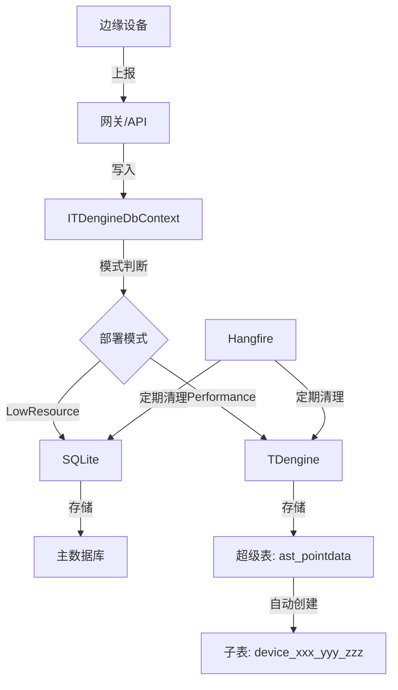

# TDengine 集成

## 问题背景

### 业务场景

智能变电站监控系统需要处理大量传感器时序数据：
- 数千个传感器节点
- 秒级/分钟级采集频率
- 数据量随时间线性增长
- 需要支持高效的时间范围查询和聚合分析

### 技术挑战

**使用传统关系型数据库（SQLite/MySQL）面临的问题**：
1. **写入性能**：高频插入导致数据库锁竞争
2. **存储空间**：索引占用大量存储
3. **查询性能**：时间范围查询慢，聚合分析耗时长
4. **数据压缩**：时序数据高度可压缩，关系型数据库无法有效压缩
5. **分区维护**：需要手动分区和管理历史数据

---

## 设计方案

### 为什么选择 TDengine

#### 方案 A：纯 SQLite 存储

**原理**：使用主数据库（SQLite）存储所有数据

**优点**：
- 部署简单，无需额外组件
- 事务支持完善
- 适合小规模数据

**缺点**：
- 高频写入性能差
- 存储空间占用大
- 时间范围查询慢
- 不支持自动分区

**结论**：适合边缘设备（LowResource 模式），不适合数据中心

#### 方案 B：集成 TDengine 时序数据库

**原理**：使用 TDengine 专门存储时序数据，SQLite 仅存储业务数据

**优点**：
- **写入性能**：百万级 TPS，支持高并发写入
- **存储压缩**：列式存储 + 压缩算法，节省 90% 存储空间
- **查询性能**：时间范围查询速度快 10-100 倍
- **自动分区**：按时间自动分区，自动过期数据清理
- **SQL 兼容**：支持类 SQL 查询，学习成本低
- **超级表**：一个表结构支持多个时间序列

**代价**：
- 需要额外部署 TDengine 服务
- 学习 TDengine 特定概念（超级表、子表）
- 不支持传统事务（单条写入原子性保证）

**结论**：适合数据中心部署（HighPerformance 模式）

---

## 技术细节

### 核心机制

TDengine 使用 **超级表（STable）+ 子表（Child Table）** 架构：

```csharp
// 超级表定义
[STableAttribute(
    STableName = "ast_pointdata",  // 超级表名
    Tag1 = nameof(DeviceId),       // Tag 1
    Tag2 = nameof(SensorKey),      // Tag 2
    Tag3 = nameof(Property)        // Tag 3
)]
public class PointData : STable
{
    // Tags - 标识时间序列
    public string DeviceId { get; set; }
    public string SensorKey { get; set; }
    public string Property { get; set; }

    // Fields - 时序数据字段
    public DateTime Ts { get; set; }  // 主键（时间戳）
    public double? Val { get; set; }  // 数值
    public string? StrVal { get; set; }  // 字符串
    // ...
}
```

**工作原理**：
1. 一个超级表定义表结构
2. 每个时间序列（DeviceId + SensorKey + Property）自动创建一个子表
3. 子表继承超级表的结构，Tags 值固定
4. 写入时自动路由到对应子表

### 数据结构

**超级表**：`ast_pointdata`
```sql
CREATE STABLE ast_pointdata (
    ts TIMESTAMP,
    val DOUBLE,
    str_val NCHAR(4000),
    point_id NCHAR(36),
    group_id NCHAR(36),
    value_type INT,
    alarm_level SMALLINT
) TAGS (
    device_id NCHAR(100),
    sensor_key NCHAR(100),
    property NCHAR(100)
);
```

**子表**：自动创建，命名规则：
```
{DeviceId}_{SensorKey}_{Property}
```

示例：
- `device_001_temperature_temp` - 设备001的温度传感器
- `device_001_humidity_humidity` - 设备001的湿度传感器

### 配置示例

```json
{
  "DbConnOptions": {
    "DeploymentMode": "HighPerformance",
    "Url": "Server=localhost;Port=6030;Database=ast_intellisub;Username=root;Password=taosdata",
    "DbType": "TDengine"
  }
}
```

**LowResource 模式**：
```json
{
  "DbConnOptions": {
    "DeploymentMode": "LowResource",
    "Url": "Data Source=db/ast_intellisub.db",
    "DbType": "Sqlite"
  }
}
```

---

## 架构图



---

## DDD 分层视角

| 层 | 职责 | 示例 |
|----|------|------|
| Application | 应用服务编排 | AstPointDataService |
| Domain | 领域实体定义 | PointData 实体 |
| Infrastructure | 数据库集成 | TDengineDbContext, ITDengineDbContext |

---

## 多数据库兼容设计

### 核心抽象

通过 `ITDengineDbContext` 接口屏蔽数据库差异：

```csharp
public interface ITDengineDbContext
{
    ISqlSugarClient Db { get; }
    DbType CurrentDbType { get; }
}

public class TDengineDbContext : ITDengineDbContext
{
    public ISqlSugarClient Db { get; }
    public DbType CurrentDbType { get; private set; }

    public TDengineDbContext(IOptions<DbConnOptions> dbConfigOptions)
    {
        var dbConfig = dbConfigOptions.Value;

        if (dbConfig.DeploymentMode == DeploymentMode.LowResource)
        {
            // 使用主数据库（SQLite）
            CurrentDbType = dbConfig.DbType;
            Db = new SqlSugarClient(new ConnectionConfig
            {
                DbType = dbConfig.DbType,
                ConnectionString = dbConfig.Url,
                // ...
            });
        }
        else
        {
            // 使用 TDengine
            CurrentDbType = DbType.TDengine;
            Db = new SqlSugarClient(new ConnectionConfig
            {
                DbType = DbType.TDengine,
                ConnectionString = dbConfig.Url,
                // ...
            });
        }
    }
}
```

### 实体兼容性

使用特性标记不同数据库的字段：

```csharp
[SugarTable("ast_pointdata")]
[IgnoreCodeFirst]  // 不在主数据库 CodeFirst 中扫描
[STableAttribute(
    STableName = "ast_pointdata",
    Tag1 = nameof(DeviceId),
    Tag2 = nameof(SensorKey),
    Tag3 = nameof(Property)
)]
public class PointData : STable, IEntity
{
    // SQLite 主键，TDengine 忽略
    [SugarColumn(IsPrimaryKey = true, IsIdentity = true)]
    [TDengineIgnore("TDengine 使用 TIMESTAMP(Ts) 作为主键")]
    public int Id { get; set; }

    // TDengine 主键，SQLite 普通列
    [SugarColumn(ColumnDataType = "TIMESTAMP", IsNullable = false)]
    public DateTime Ts { get; set; }

    // Tags - TDengine 使用，SQLite 普通列
    [SugarColumn(ColumnDataType = "NCHAR(100)")]
    public string DeviceId { get; set; }

    // ...
}
```

---

## 查询优化技巧

### 1. 利用超级表聚合

```csharp
// 查询多个设备的平均温度（自动聚合所有子表）
var query = _tdDb.Db.Queryable<PointData>()
    .Where(x => x.Property == "temperature")
    .Where(x => x.Ts >= startTime && x.Ts <= endTime)
    .GroupBy($"TimeInterval(1h)")  // 1小时聚合
    .Select($"AVG(val) as Value, FIRST(ts) as Ts");
```

### 2. 时间分区查询

```csharp
// TDengine 自动按时间分区，查询会自动优化
var query = _tdDb.Db.Queryable<PointData>()
    .Where(x => x.Ts >= DateTime.Today)  // 今天的数据
    .OrderBy(x => x.Ts, OrderByType.Desc);
```

### 3. 子表查询（高性能）

```csharp
// 直接查询单个子表（最快）
var childTableName = ChildTableNameManager.GetChildTableName(deviceId, sensorKey, property);
var query = _tdDb.Db.Queryable<PointData>()
    .AS(childTableName)  // 指定子表
    .Where(x => x.Ts >= startTime);
```

### 4. 降采样查询

```csharp
// 自动降采样，防止返回过多数据
public async Task<PagedResultDto<DataPointDto>> GetHistoryDataAsync(HistoryDataGetListInputDto input)
{
    // 计算时间间隔（根据查询范围自动调整）
    var interval = CalculateTimeInterval(input.StartTime, input.EndTime);

    var query = _tdDb.Db.Queryable<PointData>()
        .Where(x => x.Ts >= input.StartTime && x.Ts <= input.EndTime)
        .GroupBy($"TimeInterval({interval}u)")
        .Select($"AVG(val) as Value, FIRST(ts) as Ts");

    // 限制返回点数
    var result = await query.Take(MAX_AGGREGATED_POINTS).ToListAsync();
}
```

---

## TDengine 特性利用

### 1. 自动过期数据清理

```sql
-- 修改超级表保留策略（30天）
ALTER STABLE ast_point_data KEEP 30;
```

### 2. 连续查询

```sql
-- 创建流式计算（实时聚合）
CREATE STREAM avg_temp_stream AS
SELECT AVG(val) as avg_temp, _wstart as ts
FROM ast_point_data
WHERE property = 'temperature'
INTERVAL(1h) SLIDING(5m);
```

### 3. 数据压缩

TDengine 自动使用列式存储和压缩算法，存储空间节省 90%：

```
原始数据：100 GB
TDengine：10 GB
压缩比：10:1
```

---

## 相关概念

- [[传感器数据管理服务]] - 数据访问层服务
- [[数据上报流程]] - 数据写入流程
- [时序数据库概念](https://docs.tdengine.com/3.0/getting-started/)

## ABP 集成

### 模块集成

```csharp
[DependsOn(
    typeof(YiFrameworkSqlSugarCoreModule),
    typeof(AbpAutofacModule)
)]
public class AstIntelliSubDataSqlSugarCoreModule : AbpModule
{
    public override void ConfigureServices(ServiceConfigurationContext context)
    {
        // 注册 TDengine 上下文
        context.Services.AddTransient<ITDengineDbContext, TDengineDbContext>();
    }
}
```

### 最佳实践

1. **部署模式选择**：
   - 边缘设备：LowResource（SQLite）
   - 数据中心：HighPerformance（TDengine）

2. **子表管理**：
   - 使用 `ChildTableNameManager` 统一管理命名规则
   - 不要手动创建子表，让 TDengine 自动创建

3. **查询优化**：
   - 时间范围查询必须包含时间条件
   - 使用降采样减少返回数据量
   - 利用超级表聚合能力

4. **数据清理**：
   - 配置 TDengine KEEP 参数自动过期
   - 使用 Hangfire 任务定期清理

---

## 参考资料

- [TDengine 官方文档](https://docs.tdengine.com/)
- [SqlSugar TDengine 文档](https://www.donet5.com/Home/Doc?typeId=2653)
- 项目源码：`module/ast-intelliSubdata/Ast.IntelliSubData.SqlSugarCore/`

---
**状态**：✅ 已完成
