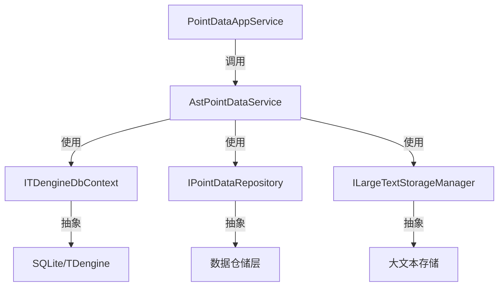

# 传感器数据管理服务

## 概述

**AstPointDataService** 是 ast-intellisubdata 模块的核心服务，负责高频传感器数据的采集、存储、查询和清理。系统支持多种数据库（SQLite、TDengine）部署模式，为边缘设备到数据中心提供灵活的时序数据处理能力。

**位置**：`module/ast-intellisubdata/Ast.IntelliSubData.Application/Services/AstPointDataService.cs`
**层**：Application
**模块**：ast-intellisubdata
**依赖注入**：Scoped

---

## 架构位置



---

## 核心职责

1. **高频数据采集** - 处理边缘设备上报的传感器时序数据
2. **数据查询** - 提供历史数据、最新数据、原始数据的多种查询方式
3. **数据清理** - 支持按保留期清理过期数据，保护关键传感器数据
4. **聚合查询** - 支持时序数据降采样，降低大数据量查询负载
5. **多数据库支持** - 自动适配 SQLite（边缘模式）和 TDengine（数据中心模式）

---

## 关键接口

```csharp
// 新增点位数据
public async Task<PointDataCreateDto> CreateAsync(PointDataCreateDto input);

// 分页查询点位数据列表
public async Task<PagedResultDto<PointDataDto>> GetListAsync(PointDataGetListInputDto input);

// 按点位ID列表查询数据（支持分页）
public async Task<PagedResultDto<PointDataDto>> GetListByPointIdsAsync(PointDataGetListByPointIdsInputDto input);

// 获取每个点位的最新数据（实时监控场景）
public async Task<List<PointDataDto>> GetLatestListByPointIdsAsync(PointDataGetLatestDataByPointIdsInputDto input);

// 历史数据聚合查询（时序降采样）
public async Task<PagedResultDto<DataPointDto>> GetHistoryDataAsync(HistoryDataGetListInputDto input);

// 查询原始点位数据（不分页，供上层二次处理）
public async Task<List<PointDataDto>> QueryRawPointDataAsync(
    Guid pointId, int isOpen, bool isAsc,
    DateTime? startTime = null, DateTime? endTime = null,
    string? deviceId = null, string? sensorKey = null);

// 删除过期的点位数据
public async Task<int> DeleteExpiredDataAsync(int retentionDays, List<string> excludedSensorKeys = null);
```

---

## 依赖注入配置

```csharp
// 在 AstIntelliSubDataApplicationModule 中配置
public override void ConfigureServices(ServiceConfigurationContext context)
{
    context.Services.AddTransient<IAstPointDataService, AstPointDataService>();
}
```

---

## 数据流

```
边缘设备上报
  → PointDataAppService.CreateAsync()
    → AstPointDataService.CreateAsync()
      → ITDengineDbContext.Db.Insertable()
        → SQLite/TDengine 存储
```

---

## 重要方法

### `CreateAsync()`

**作用**：接收边缘设备上报的传感器数据，处理后写入数据库

**核心逻辑**：
1. 处理 ExtInfo 大文本（存储到文件系统或数据库）
2. 创建 PointData 实体
3. 根据 ValueType 设置 Val 或 StrVal
4. 写入 TDengine 或 SQLite

**调用链**：
```
前端/边缘设备
  → PointDataAppService.CreateAsync()
    → AstPointDataService.CreateAsync()
      → ILargeTextStorageManager.ProcessLargeTextAsync()
      → ITDengineDbContext.Db.Insertable()
```

### `GetLatestListByPointIdsAsync()`

**作用**：实时监控场景，获取多个传感器的最新数据

**特点**：
- 使用子查询优化性能
- 返回每个点位的最新一条记录
- 支持按设备、传感器过滤

### `GetHistoryDataAsync()`

**作用**：时序数据聚合查询，支持降采样

**特点**：
- 动态时间间隔计算
- 自动降采样（防止返回过多数据点）
- 支持多种聚合函数（AVG、MAX、MIN、FIRST、LAST）
- 最大聚合点数保护（MAX_AGGREGATED_POINTS = 5000）

### `DeleteExpiredDataAsync()`

**作用**：按保留期清理过期数据，保护关键传感器

**参数**：
- `retentionDays` - 数据保留天数
- `excludedSensorKeys` - 排除的传感器键值列表（这些传感器的数据不会被删除）

**特点**：
- 批量删除（BatchSize 配置）
- 支持排除特定传感器
- 事务保护（TDengine 不支持事务时使用批次）

---

## 源码片段

### 数据创建（含大文本处理）

```csharp
// 文件路径: AstPointDataService.cs:64-100
public async Task<PointDataCreateDto> CreateAsync(PointDataCreateDto input)
{
    // 处理ExtInfo大文本
    string processedExtInfo = null;
    if (!string.IsNullOrEmpty(input.ExtInfo))
    {
        var extInfoStorageDto = new LargeTextStorageDto(
            input.ExtInfo,
            input.DeviceId,
            input.SensorKey,
            $"{input.Property}_ExtInfo",
            input.Ts,
            input.PointId);
        processedExtInfo = await _largeTextStorageManager.ProcessLargeTextAsync(extInfoStorageDto);
    }

    var entity = new PointData
    {
        Ts = input.Ts,
        PointId = input.PointId,
        GroupId = input.GroupId,
        Property = input.Property,
        ValueType = input.ValueType.Value,
        ExtInfo = processedExtInfo,
        DeviceId = input.DeviceId,
        SensorKey = input.SensorKey,
        AlarmLevel = (short)input.AlarmLevel
    };

    // 根据 ValueType 设置对应的值字段
    if (entity.ValueType == (int)ValueTypeEnum.String)
    {
        entity.StrVal = input.Value?.ToString();
    }
    else
    {
        entity.Val = Convert.ToDouble(input.Value);
    }

    await _tdDb.Db.Insertable(entity).ExecuteCommandAsync();
    return input;
}
```

### 历史数据聚合查询

```csharp
// 文件路径: AstPointDataService.cs (GetHistoryDataAsync 方法)
// 支持动态时间间隔和多种聚合函数
private async Task<PagedResultDto<DataPointDto>> ExecuteAggregatedQuery(HistoryDataGetListInputDto input)
{
    // 计算时间间隔（自动降采样）
    var timeInterval = CalculateTimeInterval(input.StartTime, input.EndTime);

    // 执行聚合查询
    var query = _tdDb.Db.Queryable<PointData>()
        .Where(x => x.Ts >= input.StartTime && x.Ts <= input.EndTime)
        .WhereIF(!string.IsNullOrEmpty(input.DeviceId), x => x.DeviceId == input.DeviceId)
        .WhereIF(!string.IsNullOrEmpty(input.SensorKey), x => x.SensorKey == input.SensorKey)
        .WhereIF(input.PointIds != null && input.PointIds.Any(), x => input.PointIds.Contains(x.PointId))
        .GroupBy($"TimeInterval({timeInterval}u)")
        .Select($"AVG(val) as Value, FIRST(ts) as Ts");

    var result = await query.ToDataTableAsync();
    // ... 转换为 DTO
}
```

---

## 权限控制

本服务不直接暴露给 API 层，通过 **PointDataAppService** 进行权限控制：

```csharp
// 在 PointDataAppService 中
[Authorize(IntelliSubPermissions.PointData.Create)]
public async Task<PointDataCreateDto> CreateAsync(PointDataCreateDto input)
{
    return await _astPointDataService.CreateAsync(input);
}
```

---

## 相关组件

- [[PointDataAppService]] - API 应用服务层
- [[ITDengineDbContext]] - 时序数据库上下文
- [[PointData]] - 点位数据实体
- [[数据清理任务]] - PointDataCleanupJob
- [[TDengine集成]] - 时序数据库集成

---

## 数据库支持

### SQLite 模式（LowResource）

- 表名：`ast_pointdata`
- 所有字段作为普通列
- 使用自增 Id 作为主键
- 适合边缘设备部署

### TDengine 模式（HighPerformance）

- 超级表名：`ast_pointdata`
- 三级 Tag：DeviceId、SensorKey、Property
- 使用 TIMESTAMP(Ts) 作为主键
- 自动创建子表
- 适合数据中心部署

---

## 学习笔记

### 难点理解

**时序数据建模**：
- TDengine 使用超级表（STable）+ Tag 结构
- 一个时间序列由 (DeviceId, SensorKey, Property, Ts) 唯一确定
- 自动创建子表（Child Table），每个子表对应一个时间序列

**多数据库兼容**：
- 使用 `[TDengineIgnore]` 特性标记 TDengine 不需要的字段
- 使用 `[IgnoreCodeFirst]` 避免主数据库扫描时序表
- 通过 ITDengineDbContext 抽象层屏蔽差异

### 疑问

1. 大文本存储策略的选择依据是什么？
2. TDengine 子表管理（ChildTableNameManager）的命名规则是什么？

---

## 参考资料

- [TDengine 官方文档](https://docs.tdengine.com/)
- 项目源码：`module/ast-intellisubdata/`

---
**状态**：✅ 已完成
