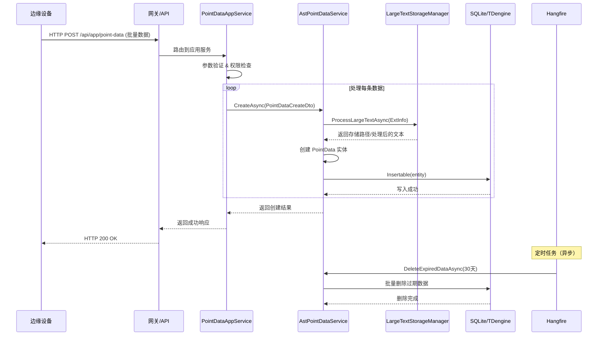

# 数据上报流程

## 流程概述

传感器数据上报流程描述了从边缘设备采集数据到服务端存储的完整数据链路。该流程支持高频数据采集、多设备并发上报、自动数据清理和可选的 TDengine 时序数据库持久化。

**触发方式**：边缘设备定时上报 / 事件触发上报

**数据特点**：
- 高频采集（秒级/分钟级）
- 时序数据（带时间戳）
- 多设备并发
- 数据量随时间线性增长

---

## 完整流程图



---

## 详细步骤

### 步骤 1：边缘设备数据采集

**负责组件**：边缘设备（硬件）

**操作**：
1. 传感器读取物理量（温度、湿度、电流等）
2. 设备网关打包数据（JSON 格式）
3. 生成时间戳（设备本地时间或同步时间）
4. 通过 HTTP/MQTT 上报到服务端

**输入**：物理信号

**输出**：JSON 格式的传感器数据包

---

### 步骤 2：服务端接收与验证

**负责组件**：[[PointDataAppService]]

**操作**：
1. 接收 HTTP 请求
2. JWT 身份验证
3. 权限检查（`IntelliSubPermissions.PointData.Create`）
4. 参数验证（FluentValidation）
5. 调用下层服务

**输入**：HTTP 请求 + JWT Token

**输出**：验证通过的 DTO

---

### 步骤 3：数据处理与存储

**负责组件**：[[AstPointDataService]]

**操作**：
1. 处理 ExtInfo 大文本（存储到文件系统）
2. 创建 PointData 实体
3. 根据 ValueType 设置 Val 或 StrVal
4. 写入数据库（SQLite 或 TDengine）
5. 返回创建结果

**输入**：`PointDataCreateDto`

**输出**：`PointDataCreateDto`（确认）

---

### 步骤 4：大文本存储（可选）

**负责组件**：`ILargeTextStorageManager`

**操作**：
1. 检查文本大小
2. 超过阈值时存储到文件系统
3. 返回存储路径或处理后的文本

**输入**：原始 ExtInfo 字符串

**输出**：文件路径或压缩后的文本

---

### 步骤 5：数据库写入

**负责组件**：`ITDengineDbContext`

**操作**：
1. 根据部署模式选择数据库
2. SQLite 模式：写入主数据库
3. TDengine 模式：写入时序数据库（自动创建子表）
4. 返回写入结果

**输入**：`PointData` 实体

**输出**：写入成功确认

---

### 步骤 6：定期数据清理（异步）

**负责组件**：[[数据清理任务]]

**操作**：
1. Hangfire 定时触发（每天凌晨 2 点）
2. 计算截止时间（当前时间 - 保留天数）
3. 批量删除过期数据
4. 排除关键传感器数据
5. 记录删除日志

**触发**：Cron 表达式 `0 0 2 * * *`

**输出**：删除记录数

---

## 数据流向

```
边缘设备
  ↓
  [HTTP POST] - 批量数据上报
    ↓
  [PointDataAppService] - 验证 & 授权
    ↓
  [AstPointDataService] - 业务逻辑处理
    ↓
  [LargeTextStorageManager] - 大文本处理（可选）
    ↓
  [ITDengineDbContext] - 数据库抽象层
    ↓
  [SQLite/TDengine] - 持久化存储
    ↓
  [Hangfire] - 定期清理（异步）
```

---

## 涉及的 API 端点

| 方法 | 路径 | 服务 | 功能 |
|------|------|------|------|
| POST | `/api/app/point-data` | PointDataAppService | 批量创建点位数据 |
| GET | `/api/app/point-data` | PointDataAppService | 分页查询点位数据 |
| GET | `/api/app/point-data/latest` | PointDataAppService | 获取最新点位数据 |
| GET | `/api/app/point-data/history` | PointDataAppService | 历史数据聚合查询 |
| DELETE | `/api/app/point-data/cleanup` | PointDataAppService | 手动触发数据清理 |

---

## 涉及的实体

| 实体 | 表名 | 说明 |
|------|------|------|
| PointData | ast_pointdata | 点位时序数据 |

**TDengine 模式**：
- 超级表：`ast_pointdata`
- 子表：自动创建，命名规则为 `{DeviceId}_{SensorKey}_{Property}`

---

## 错误处理

### 常见错误

| 错误 | 原因 | 处理 |
|------|------|------|
| AbpAuthorizationException | JWT 无效或权限不足 | 返回 401/403 |
| AbpValidationException | 参数验证失败 | 返回 400 + 详细错误信息 |
| SqlSugarException | 数据库连接失败 | 返回 500 + 日志记录 |
| IOException | 大文本存储失败 | 返回 500 + 回滚事务 |

---

## 性能考虑

### 数据库优化

- **SQLite 模式**：定期 VACUUM，优化索引
- **TDengine 模式**：利用时序数据库特性，自动分区

### 批量处理

- 边缘设备应批量上报数据（100-1000 条/批次）
- 服务端支持批量创建接口

### 缓存策略

- 最新数据查询可使用缓存（Redis/Memory）
- 历史数据查询直接查询数据库

### 异步处理

- 大文本存储异步处理
- 数据清理任务异步执行

---

## 相关流程

- [[声纹分析流程]] - 音频数据采集与分析
- [[IEC61850数据上报流程]] - 工业协议数据上报

---

## 实现细节

### 关键代码

**数据上报接口**：

```csharp
// PointDataAppController.cs
[HttpPost]
[Authorize(IntelliSubPermissions.PointData.Create)]
public async Task<PointDataCreateDto> CreateAsync(PointDataCreateDto input)
{
    return await _pointDataService.CreateAsync(input);
}
```

**批量数据创建**：

```csharp
// AstPointDataService.cs
public async Task<PointDataCreateDto> CreateAsync(PointDataCreateDto input)
{
    // 处理大文本
    var processedExtInfo = await _largeTextStorageManager.ProcessLargeTextAsync(...);

    // 创建实体
    var entity = new PointData
    {
        Ts = input.Ts,
        PointId = input.PointId,
        DeviceId = input.DeviceId,
        SensorKey = input.SensorKey,
        Property = input.Property,
        ValueType = input.ValueType.Value,
        AlarmLevel = (short)input.AlarmLevel,
        ExtInfo = processedExtInfo
    };

    // 设置值字段
    if (entity.ValueType == (int)ValueTypeEnum.String)
        entity.StrVal = input.Value?.ToString();
    else
        entity.Val = Convert.ToDouble(input.Value);

    // 写入数据库
    await _tdDb.Db.Insertable(entity).ExecuteCommandAsync();

    return input;
}
```

**数据库写入（TDengine）**：

```csharp
// TDengine 自动创建子表
// 表名规则：{DeviceId}_{SensorKey}_{Property}
// 例如：device_001_temperature_temp

await _tdDb.Db.Insertable(entity)
    .AS(ChildTableNameManager.GetChildTableName(
        entity.DeviceId,
        entity.SensorKey,
        entity.Property))
    .ExecuteCommandAsync();
```

---

## 学习笔记

### 理解要点

1. **时序数据特点**：数据写入量大、查询通常按时间范围、很少更新/删除单条记录
2. **多数据库支持**：通过抽象层 `ITDengineDbContext` 屏蔽差异
3. **大文本处理**：避免在时序数据库中存储大文本，使用文件系统或主数据库
4. **数据清理策略**：定期清理过期数据，保护关键传感器数据

### 疑问

1. 边缘设备断网期间的数据如何处理？
2. TDengine 子表数量过大时的性能问题？

---
**状态**：✅ 已完成
