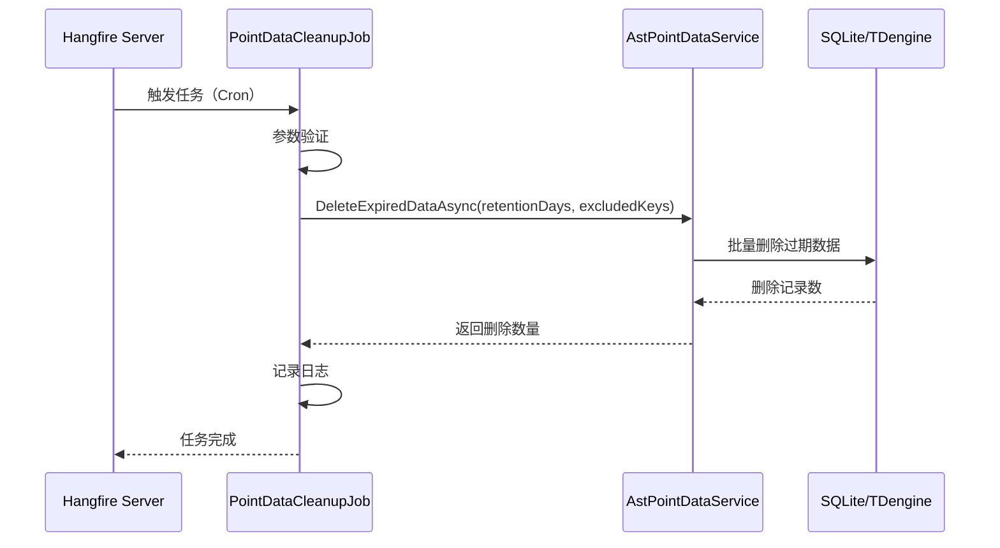

# 数据清理任务

## 任务概述

**功能**：定期清理过期的传感器时序数据，防止数据库无限增长

**触发方式**：Cron 表达式（可配置） / 手动触发

**Cron表达式**：`0 0 2 * * *`（每天凌晨 2 点执行，默认值）

**存储模式**：Memory / SQLite / Redis（根据 Hangfire 配置）

---

## 任务配置

### appsettings.json 配置

```json
{
  "Hangfire": {
    "StorageMode": "Memory",
    "DashboardEnabled": true
  },
  "PointDataCleanupOptions": {
    "Enabled": true,
    "CronExpression": "0 0 2 * * *",
    "RetentionDays": 30,
    "BatchSize": 1000,
    "ExcludedSensorKey": [
      "critical_sensor_1",
      "important_sensor_2"
    ]
  }
}
```

**配置说明**：
- `Enabled` - 是否启用清理任务
- `CronExpression` - Cron 表达式（6 位格式：秒 分 时 日 月 周）
- `RetentionDays` - 数据保留天数（超过此天数的数据将被删除）
- `BatchSize` - 批量删除的批次大小（防止一次性删除过多数据）
- `ExcludedSensorKey` - 排除的传感器键值列表（这些传感器的数据不会被删除）

---

## 任务执行流程



---

## 任务实现

### 任务类

```csharp
[DisableConcurrentExecution(timeoutInSeconds: 60 * 60)] // 防止并发执行，超时 1 小时
public class PointDataCleanupJob : HangfireBackgroundWorkerBase, ITransientDependency
{
    private readonly IAstPointDataService _astPointDataService;
    private readonly PointDataCleanupOptions _options;

    public PointDataCleanupJob(
        IAstPointDataService astPointDataService,
        IOptions<PointDataCleanupOptions> options)
    {
        _astPointDataService = astPointDataService;
        _options = options.Value;

        // 配置定时作业
        RecurringJobId = "point-data-cleanup";
        CronExpression = _options.CronExpression;
    }

    [UnitOfWork]
    public override async Task DoWorkAsync(CancellationToken cancellationToken = default)
    {
        var sw = Stopwatch.StartNew();
        Logger.LogInformation("开始执行点位数据清理作业");

        try
        {
            // 参数验证
            if (_options.RetentionDays <= 0)
            {
                Logger.LogWarning("点位数据保留天数配置无效: {RetentionDays}，跳过清理作业", _options.RetentionDays);
                return;
            }

            // 执行清理操作
            var deletedCount = await _astPointDataService.DeleteExpiredDataAsync(
                _options.RetentionDays,
                _options.ExcludedSensorKey
            );

            var elapsed = sw.ElapsedMilliseconds;
            Logger.LogInformation("点位数据清理作业执行完成 - 删除记录数: {DeletedCount}, 耗时: {ElapsedMs}ms",
                deletedCount, elapsed);
        }
        catch (Exception ex)
        {
            Logger.LogError(ex, "点位数据清理作业执行失败");
            throw;
        }
    }
}
```

---

## 关键逻辑

### 数据获取

清理任务不直接查询数据，而是调用 `AstPointDataService.DeleteExpiredDataAsync()`：

```csharp
// 计算截止时间
var cutoffDate = DateTime.Now.AddDays(-retentionDays);

// 构建查询
var query = _tdDb.Db.Queryable<PointData>()
    .Where(x => x.Ts < cutoffDate);

// 排除关键传感器
if (excludedSensorKeys != null && excludedSensorKeys.Any())
{
    query = query.Where(x => !excludedSensorKeys.Contains(x.SensorKey));
}
```

### 数据处理

采用批量删除策略，防止一次性删除过多数据：

```csharp
// 批量删除
while (true)
{
    var deleted = await query
        .OrderBy(x => x.Ts)
        .Take(batchSize)
        .DeleteAsync();

    totalCount += deleted;

    if (deleted < batchSize)
        break; // 删除完成

    // 避免过载，稍微延迟
    await Task.Delay(100);
}
```

### 结果存储

删除完成后记录日志，不存储结果（删除操作本身就是结果）。

---

## 错误处理

```csharp
try
{
    // 参数验证
    if (_options.RetentionDays <= 0 || _options.BatchSize <= 0)
    {
        Logger.LogWarning("配置无效，跳过清理作业");
        return;
    }

    // 执行清理
    var deletedCount = await _astPointDataService.DeleteExpiredDataAsync(...);

    Logger.LogInformation("清理完成 - 删除 {Count} 条记录", deletedCount);
}
catch (Exception ex)
{
    Logger.LogError(ex, "数据清理作业执行失败");
    throw; // Hangfire 会根据策略重试
}
```

---

## 监控和日志

### 日志记录

```csharp
Logger.LogInformation("开始执行点位数据清理作业");
Logger.LogInformation("配置 - 保留天数: {RetentionDays}, 批次大小: {BatchSize}", ...);
Logger.LogInformation("排除传感器: {ExcludedCount} 个", excludedCount);
Logger.LogInformation("清理完成 - 删除 {DeletedCount} 条记录, 耗时: {ElapsedMs}ms", deletedCount, elapsed);
```

### Hangfire Dashboard

访问路径：`/hangfire`

在 Dashboard 中可以：
- 查看任务执行历史
- 查看任务执行时长
- 查看任务成功/失败状态
- 手动触发任务执行

---

## 性能考虑

- **执行时长**：取决于需要删除的数据量，通常在几分钟到几十分钟
- **资源占用**：主要是数据库 I/O，CPU 占用较低
- **并发控制**：使用 `[DisableConcurrentExecution]` 防止并发执行

### 优化建议

1. **选择低峰期执行**：默认配置为凌晨 2 点，避免影响业务
2. **合理设置批次大小**：默认 1000 条，根据数据库性能调整
3. **保留期设置**：根据实际需求和存储容量设置
4. **监控执行时长**：如果执行时间过长，考虑增加批次大小或优化索引

---

## 任务管理器

提供静态方法用于手动管理任务：

```csharp
public static class PointDataCleanupJobManager
{
    /// <summary>
    /// 立即执行清理作业
    /// </summary>
    public static void ExecuteNow()
    {
        BackgroundJob.Enqueue<PointDataCleanupJob>(job => job.DoWorkAsync(default));
    }

    /// <summary>
    /// 停止定时清理作业
    /// </summary>
    public static void StopCleanupJob()
    {
        RecurringJob.RemoveIfExists("point-data-cleanup");
    }

    /// <summary>
    /// 重新配置清理作业的执行时间
    /// </summary>
    public static void ReconfigureSchedule(string cronExpression)
    {
        RecurringJob.AddOrUpdate<PointDataCleanupJob>(
            "point-data-cleanup",
            job => job.DoWorkAsync(default),
            cronExpression);
    }
}
```

**使用示例**：

```csharp
// 立即执行清理
PointDataCleanupJobManager.ExecuteNow();

// 停止定时任务
PointDataCleanupJobManager.StopCleanupJob();

// 修改执行计划（每小时执行一次）
PointDataCleanupJobManager.ReconfigureSchedule("0 0 * * * *");
```

---

## 相关任务

- [[VoiceprintCaptureJob]] - 声纹采集任务
- [[PatrolSystemCleanupJob]] - 巡视系统清理任务

## 相关服务

- [[AstPointDataService]] - 数据清理逻辑的实现者
- [[传感器数据管理服务]] - 数据管理服务

---

## Cron 表达式说明

| 表达式 | 说明 |
|--------|------|
| `0 0 2 * * *` | 每天凌晨 2 点执行（默认） |
| `0 0 * * * *` | 每小时执行 |
| `0 */30 * * * *` | 每 30 分钟执行 |
| `0 0 0 * * *` | 每天午夜执行 |
| `0 0 0 ? * MON-FRI` | 工作日午夜执行 |

**格式说明**：秒 分 时 日 月 周

---

## 配置选项类

```csharp
public class PointDataCleanupOptions : IBackgroundJobOptions
{
    public string ConfigSectionName => "PointDataCleanupOptions";

    /// <summary>
    /// 是否启用清理任务
    /// </summary>
    public bool Enabled { get; set; } = true;

    /// <summary>
    /// Cron 表达式
    /// </summary>
    public string CronExpression { get; set; } = "0 0 2 * * *";

    /// <summary>
    /// 数据保留天数
    /// </summary>
    public int RetentionDays { get; set; } = 30;

    /// <summary>
    /// 批量删除的批次大小
    /// </summary>
    public int BatchSize { get; set; } = 1000;

    /// <summary>
    /// 排除的传感器键值列表
    /// </summary>
    public List<string> ExcludedSensorKey { get; set; } = new();
}
```

---
**状态**：✅ 已完成
