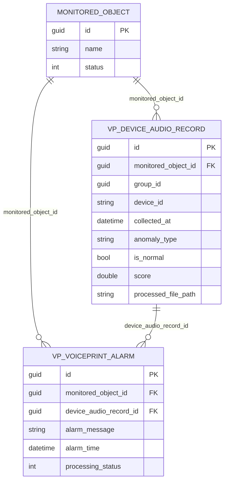
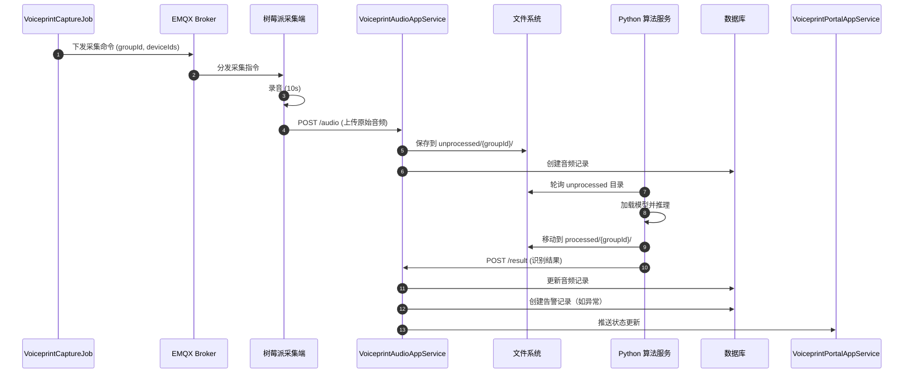
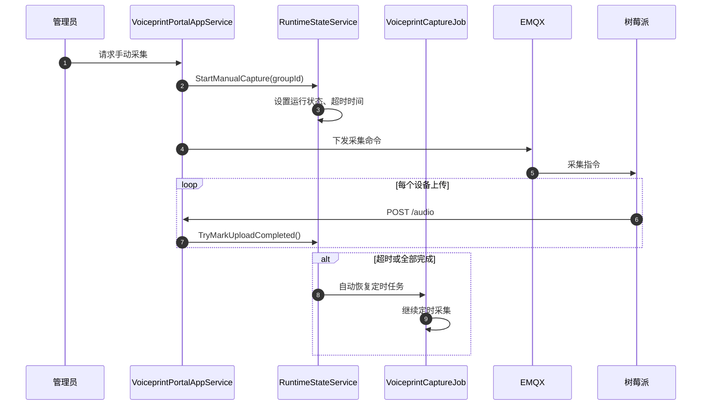

# ast-voiceprint 模块总览

## 模块概述

**ast-voiceprint** 是智能变电站声纹监测系统的核心模块，负责音频采集、声纹识别、异常告警和报告生成。该模块通过 Hangfire 后台任务调度采集任务，与树莓派边缘采集端和 Python 声纹识别服务协同工作，实现设备健康状态的自动化监测。

### 核心职责

- **音频采集调度** - 通过 MQTT 向树莓派采集端下发采集指令
- **音频文件管理** - 接收、存储和分类处理音频文件
- **声纹识别结果处理** - 接收 Python 算法服务的识别结果并持久化
- **异常告警** - 基于声纹识别结果生成告警并推送到前端
- **报告生成** - 生成 DOCX 格式的声纹分析报告
- **标准音频库管理** - 维护正常和异常标准音频样本
- **运行时状态管理** - 跟踪采集批次状态和设备上传进度

## 模块架构

### 分层结构

```
ast-voiceprint/
├── Ast.Voiceprint.Application         # 应用服务层
│   ├── Services/
│   │   ├── VoiceprintAudioAppService.cs      # 音频上传和算法结果处理
│   │   ├── VoiceprintPortalAppService.cs     # 前端门户服务
│   │   └── VoiceprintCaptureRuntimeStateService.cs  # 运行时状态管理
│   └── Jobs/
│       ├── VoiceprintCaptureJob.cs            # 定时采集任务
│       └── VoiceprintProcessedCleanupJob.cs   # 已处理音频清理
├── Ast.Voiceprint.Application.Contracts # 契约和配置
│   ├── Dtos/          # 数据传输对象
│   ├── IServices/     # 服务接口
│   └── Options/       # 配置选项
├── Ast.Voiceprint.Domain             # 领域实体层
│   └── Entities/      # 数据库实体
├── Ast.Voiceprint.Domain.Shared      # 领域共享层
│   └── Enums/         # 枚举定义
└── Ast.Voiceprint.SqlSugarCore       # 数据访问层
    └── YiDbContext.cs  # 数据库上下文
```

### 核心服务列表

#### 1. VoiceprintAudioAppService

**职责：** 处理音频上传和算法识别结果回写

**详细文档：** [[VoiceprintAudioAppService.md|VoiceprintAudioAppService - 音频处理服务]]

**核心功能：**
- 音频上传与批次管理
- 算法识别结果处理
- 单音频报告生成
- 算法模式切换

**API 基础路径：** `/api/app/voiceprint-audio/`

#### 2. VoiceprintPortalAppService

**职责：** 提供前端门户功能的数据接口

**详细文档：** [[VoiceprintPortalAppService.md|VoiceprintPortalAppService - 前端门户服务]]

**核心功能：**
- 首页总览与统计
- 设备资产管理
- 标准音频库管理
- 告警管理与处理
- 综合报告导出

**API 基础路径：** `/api/app/voiceprint/`

#### 3. VoiceprintCaptureRuntimeStateService

**职责：** 管理采集任务的运行时状态

**主要方法：**
- `StartManualCapture` - 启动手动采集批次
- `TryMarkUploadCompleted` - 标记设备上传完成
- `TryRecoverTimeout` - 超时恢复机制
- `CancelManualCapture` - 取消手动采集

**状态跟踪：**
- 当前采集批次 ID
- 预期上传设备列表
- 已完成上传设备列表
- 超时检测与自动恢复

#### 4. VoiceprintCaptureJob

**职责：** Hangfire 定时采集任务

**调度配置：**
- **Cron 表达式：** 默认 `0 */5 * * * *`（每 5 分钟）
- **配置节：** `VoiceprintCaptureJob`
- **任务 ID：** `voiceprint-audio-capture`

**工作流程：**
1. 检查是否有手动采集正在运行（跳过执行）
2. 生成新的采集批次 `groupId`
3. 通过 MQTT 向配置的采集端下发采集指令
4. 等待音频上传和算法处理

## 数据库实体

声纹模块使用统一的前缀 `vp_`，详细实体文档参见：

**[[../../../voiceprint/声纹数据库实体介绍文档.md|声纹数据库实体介绍文档]]**

### 核心实体总览

| 表名 | 实体类 | 主要用途 |
|---|---|---|
| `vp_device_audio_record` | `VoiceprintDeviceAudioRecordEntity` | 设备声纹采集与识别记录表 |
| `vp_voiceprint_alarm` | `VoiceprintAlarmRecordEntity` | 声纹告警记录表 |
| `vp_standard_audio_library` | `VoiceprintStandardAudioEntity` | 标准音频库表 |
| `vp_collector_comm_log` | `VoiceprintCollectorLogEntity` | 采集器通信日志表 |

### 实体关系



### 异常类型枚举

`VoiceprintAnomalyEnum` 定义的异常类型：

| 枚举值 | 数值 | 含义 |
|---|---|---|
| `Normal` | 0 | 正常 |
| `ClampBoltLoose` | 1 | 夹件螺栓松动 |
| `FanBearingFriction` | 2 | 风扇轴承摩擦 |
| `Excitation` | 3 | 励磁 |
| `ConnectionBoltLoose` | 4 | 连接螺栓松动 |
| `WeldingSpatter` | 5 | 焊渣异物 |
| `HalfCoreLooseExcitation` | 6 | 铁芯松动 50% 励磁 |
| `CoilLooseExcitation` | 7 | 线圈完全松动励磁 |

## API 端点

### 前端门户 API (`/api/app/voiceprint/`)

**详细文档：** [[VoiceprintPortalAppService.md|VoiceprintPortalAppService - 前端门户服务]]

| 端点 | 方法 | 功能 |
|---|---|---|
| `/dashboard/overview` | GET | 首页总览统计 |
| `/dashboard/records` | GET | 获取指定日期的巡视记录 |
| `/dashboard/records/{groupId}` | GET | 巡视记录详情 |
| `/dashboard/system-status` | GET | 系统总览状态 |
| `/dashboard/alarms` | GET | 首页告警信息 |
| `/dashboard/generate-alarm-report` | POST | 生成告警报告 |
| `/assets/tree` | GET | 设备台账树 |
| `/assets/{monitoredObjectId}` | GET | 设备基础信息 |
| `/assets/{monitoredObjectId}/trend` | GET | 设备运行趋势 |
| `/assets/{monitoredObjectId}/anomaly-mix` | GET | 设备异常分布 |
| `/assets/{monitoredObjectId}/logs` | GET | 设备巡检日志 |
| `/assets/{monitoredObjectId}/processed-audios/download` | GET | 批量下载处理后音频 |
| `/standard-audios` | GET/POST | 标准音频库管理 |
| `/standard-audios/random` | GET | 随机获取标准音频 |
| `/test-audios/import` | POST | 导入测试音频 |
| `/alarms/monthly-stat` | GET | 近30天告警统计 |
| `/alarms/device-options` | GET | 报警筛选设备下拉 |
| `/alarms` | GET | 报警记录列表 |
| `/alarms/{alarmId}` | PUT | 处理报警 |
| `/reports/export` | POST | 导出综合报告 |
| `/collector/logs` | GET | 采集器通信日志 |

### 内部处理 API (`/api/app/voiceprint-audio/`)

**详细文档：** [[VoiceprintAudioAppService.md|VoiceprintAudioAppService - 音频处理服务]]

| 端点 | 方法 | 功能 | 调用者 |
|---|---|---|---|
| `/upload` | POST | 上传原始音频 | 树莓派采集端 |
| `/result` | POST | 提交算法识别结果 | Python 算法服务 |
| `/reports/generate-from-audio` | POST | 生成单音频报告 | 内部服务 |
| `/cleanup/trigger` | POST | 手动触发清理任务 | 调试用 |
| `/processed-audios/repair-by-group` | POST | 补齐缺失音频 | 维护工具 |
| `/alarms/delete-by-time` | DELETE | 删除告警数据 | 维护工具 |
| `/device-audios/fix-test-audio-anomaly-type` | POST | 修复测试音频类型 | 维护工具 |
| `/alarms/simulate` | POST | 模拟告警 | 测试工具 |
| `/algorithm/switch` | POST | 切换算法模式 | 管理员 |
| `/capture/manual-cancel` | POST | 取消手动采集 | 管理员 |

## 时序流程

### 完整采集到告警流程



### 手动采集流程



## 外部系统边界

### 1. Python 声纹识别服务

**详细方案：** [[../../../voiceprint/02-python-voiceprint-service方案.md|Python 声纹识别服务方案]]

**接口约定：**

```http
POST /api/app/voiceprint-audio/result
Content-Type: application/json
X-Api-Key: <配置的密钥>

{
  "groupId": "5b7e3d6f-...",
  "deviceId": "pi-01",
  "processedFilePath": "/processed/pi-01_1716441800_5b7e3d6f.wav",
  "collectedAt": "2025-05-22T03:30:00+00:00",
  "durationSeconds": "10.5",
  "resultCode": 2,
  "score": 0.86
}
```

**职责分工：**
- **本模块：** 音频存储、批次管理、结果持久化
- **Python 服务：** 音频推理、特征提取、分类识别

### 2. 树莓派边缘采集端

**详细方案：** [[../../../voiceprint/03-raspberry-pi-agent方案.md|树莓派采集程序方案]]

**接口约定：**

```http
POST /api/app/voiceprint-audio/upload
Content-Type: multipart/form-data
X-Api-Key: <配置的密钥>

groupId: "5b7e3d6f-..."
deviceId: "pi-01"
file: <binary WAV data>
```

**职责分工：**
- **本模块：** 下发采集指令、接收音频文件
- **树莓派端：** 监听 MQTT、录音、上传文件、失败重试

### 3. MQTT 通信

**命令格式：**

```json
{
  "command": "voiceprint-capture",
  "data": {
    "groupId": "5b7e3d6f-...",
    "occurredAt": "2025-05-22T03:30:00+00:00",
    "durationSeconds": 10,
    "retry": 3
  }
}
```

**响应处理：**
- 响应通过 `vp_collector_comm_log` 表记录
- 支持按设备查询通信状态

## 配置说明

### appsettings.json 配置节

```json
{
  "VoiceprintCaptureJob": {
    "Enabled": true,
    "CronExpression": "0 */5 * * * *",
    "DurationSeconds": 10,
    "ManualCaptureTimeoutMinutes": 10,
    "Agents": [
      {
        "GatewayId": "gateway-guid-here",
        "DeviceIds": ["pi-01", "pi-02"],
        "RetryLimit": 3
      }
    ]
  },
  "VoiceprintStorage": {
    "Root": "wwwroot/audio",
    "PendingFolderName": "unprocessed",
    "ProcessedFolderName": "processed",
    "LogsFolderName": "logs",
    "StandardLibraryFolderName": "standard_library",
    "ApiKey": "your-secret-api-key"
  },
  "VoiceprintRecognition": {
    "ContinuousAnomalyThreshold": 5,
    "EnableContinuousAnomalySuppression": true
  },
  "VoiceprintReport": {
    "TemplateBasePath": "wwwroot/report_templates",
    "OutputBasePath": "wwwroot/reports"
  }
}
```

### Hangfire 仪表板

访问 `http://your-server/hangfire` 查看：
- `voiceprint-audio-capture` - 定时采集任务
- `voiceprint-processed-cleanup` - 音频清理任务

## 相关文档

### 模块服务文档

**[[VoiceprintAudioAppService.md|VoiceprintAudioAppService - 音频处理服务]]** - 音频上传、算法回写、报告生成、算法切换的详细接口文档

**[[VoiceprintPortalAppService.md|VoiceprintPortalAppService - 前端门户服务]]** - 门户统计、设备管理、告警处理、报告导出的详细接口文档

**[[../../Hangfire/Voiceprint/VoiceprintCaptureRuntimeStateService.md|VoiceprintCaptureRuntimeStateService - 运行时状态管理]]** - 手动采集批次状态管理和超时恢复机制

**[[../../Hangfire/Voiceprint/VoiceprintCaptureJob.md|VoiceprintCaptureJob - 采集任务调度]]** - Hangfire 定时采集任务和 MQTT 命令下发

### 系统架构与设计

**[[../../../voiceprint/00-系统架构与功能实现.md|系统架构与功能实现]]** - 完整的部署拓扑和组件协作说明

**[[../../../voiceprint/01-intelli-substation-voiceprint-backend改造方案.md|intelli-substation-voiceprint-backend 改造方案]]** - 代码改造点、配置项和接口定义

### 外部集成方案

**[[../../../voiceprint/02-python-voiceprint-service方案.md|Python 声纹识别服务方案]]** - 算法服务实现细节、目录结构和监控配置

**[[../../../voiceprint/03-raspberry-pi-agent方案.md|树莓派采集程序方案]]** - 边缘采集端架构、MQTT 集成和重传策略

### 功能文档

**[[../../../voiceprint/声纹数据库实体介绍文档.md|声纹数据库实体介绍文档]]** - 完整的数据模型、字段说明和典型查询

**[[../../../voiceprint/分析报表需求文档.md|分析报表需求文档]]** - 报告生成需求和统计口径

**[[../../../voiceprint/需求变更-算法切换与1分钟分段识别.md|需求变更-算法切换与1分钟分段识别]]** - 算法切换机制和分段识别功能

**[[../../../voiceprint/多设备高频采集下音频时长不足原因分析.md|多设备高频采集下音频时长不足原因分析]]** - 高频场景下的性能分析

### 运维文档

**[[../../../voiceprint/已处理音频定期清理功能代码解释.md|已处理音频定期清理功能代码解释]]** - Hangfire 清理任务说明

**[[../../../voiceprint/已处理音频下载接口优化方案.md|已处理音频下载接口优化方案]]** - 文件下载优化

## 常见问题

### Q: 如何查看采集任务执行状态？

访问 Hangfire 仪表板 `/hangfire`，查看 `voiceprint-audio-capture` 任务的执行历史和日志。

### Q: 如何调试采集批次问题？

查询 `vp_device_audio_record` 表，按 `group_id` 筛选：
```sql
SELECT * FROM vp_device_audio_record WHERE group_id = 'your-group-id'
```

### Q: 告警未生成如何排查？

1. 检查 `vp_device_audio_record.is_normal` 字段
2. 确认 `VoiceprintRecognition.EnableContinuousAnomalySuppression` 配置
3. 查看服务日志中 `TryCreateAlarmAsync` 相关信息

### Q: 如何切换算法模式？

调用 `POST /api/app/voiceprint-audio/switch-algorithm`，或在配置中修改默认设置。

### Q: 标准音频库如何使用？

上传标准音频到 `vp_standard_audio_library` 表，系统会自动用于：
- 报告生成中的对比分析
- 测试音频的快速匹配（基于 MD5）

## 维护建议

1. **定期清理：** 配置 `VoiceprintProcessedCleanupJob` 自动清理过期音频
2. **监控磁盘空间：** 关注 `wwwroot/audio` 目录大小
3. **备份标准库：** 定期备份 `vp_standard_audio_library` 表和音频文件
4. **日志监控：** 关注采集成功率、识别失败率和 API 错误日志

---

**文档版本：** v1.0.0  
**最后更新：** 2025-06-18  
**维护者：** ast-voiceprint 模块团队
