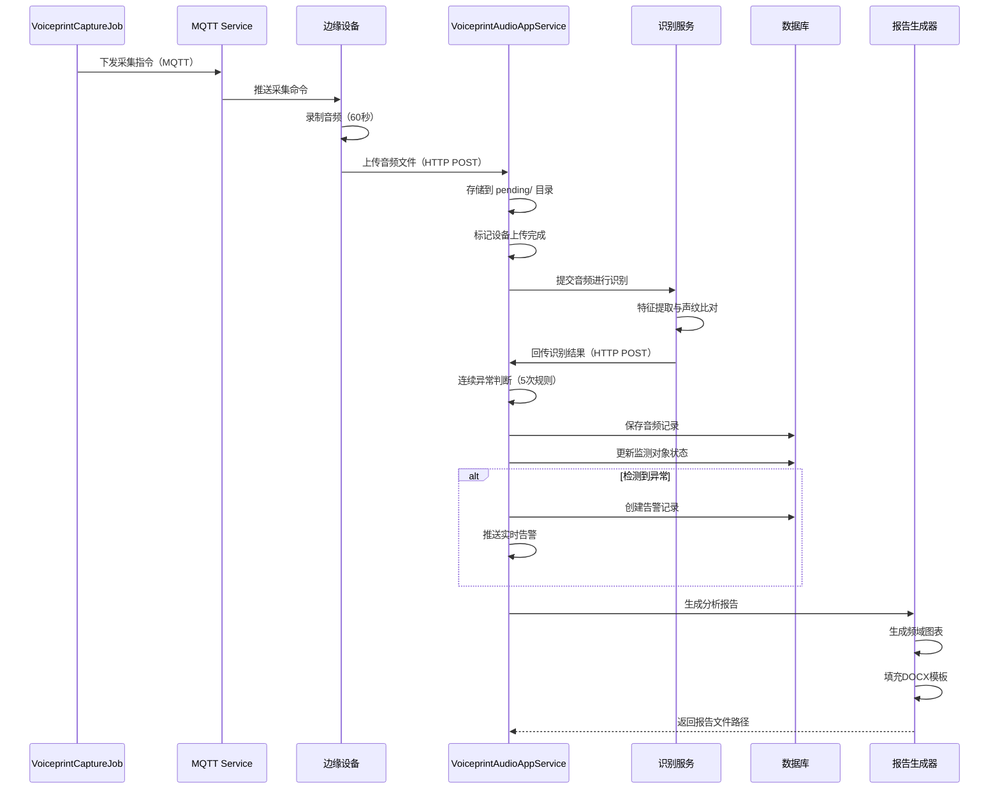

# 声纹分析处理流程

## 流程概述

描述从边缘设备采集音频到生成分析报告的完整声纹处理流程。

**触发方式**：
1. 定时任务触发（自动模式）
2. 手动触发（手动模式）
3. 外部API调用

---

## 完整流程图



---

## 详细步骤

### 步骤 1：采集指令下发

**负责组件**：[[VoiceprintCaptureJob]]

**操作**：
1. 定时任务按Cron表达式触发（默认：每10分钟）
2. 检查是否有手动采集正在进行
3. 生成新的GroupId
4. 通过MQTT向边缘设备下发采集指令

**MQTT消息格式**：
```json
{
  "cmd": "collect_voiceprint",
  "group_id": "guid",
  "occurred_at": "2026-06-02T10:30:00",
  "capture_duration": 60,
  "agents": ["device-001", "device-002"]
}
```

**输入**：定时触发或手动触发

**输出**：MQTT指令下发到边缘设备

---

### 步骤 2：音频采集与上传

**负责组件**：边缘设备（树莓派）

**操作**：
1. 接收MQTT采集指令
2. 录制指定时长的音频（默认60秒）
3. 通过HTTP POST上传音频文件
4. 使用X-API-Key进行身份验证

**API端点**：`POST /api/app/voiceprint/upload`

**上传参数**：
```csharp
public class VoiceprintAudioUploadInput
{
    public Guid GroupId { get; set; }
    public string DeviceId { get; set; }
    public Guid MonitoredObjectId { get; set; }
    public IFormFile File { get; set; }
}
```

---

### 步骤 3：音频文件接收

**负责组件**：[[VoiceprintAudioAppService.UploadAsync]]

**操作**：
1. 验证API Key
2. 验证输入参数
3. 生成安全的文件名
4. 存储到 `pending/` 目录
5. 更新RuntimeState（标记该设备上传完成）

**存储路径**：
```
{StorageRoot}/pending/{GroupId}_{DeviceId}_{Timestamp}.wav
```

---

### 步骤 4：声纹识别处理

**负责组件**：外部声纹识别服务

**操作**：
1. 从pending目录读取音频文件
2. 进行音频特征提取（MFCC、频谱分析等）
3. 与标准声纹库进行比对
4. 输出识别结果（异常类型、置信度）

**识别输出**：
```json
{
  "group_id": "guid",
  "monitored_object_id": "guid",
  "device_id": "device-001",
  "collected_at": "2026-06-02T10:31:00",
  "duration_seconds": "60.5",
  "resultLabel": "运行正常",
  "score": 0.95,
  "processedFilePath": "/processed/audio.wav"
}
```

---

### 步骤 5：识别结果处理

**负责组件**：[[VoiceprintAudioAppService.SubmitResultAsync]]

**操作**：
1. 验证API Key和输入参数
2. 查找或创建VoiceprintDeviceAudioRecordEntity
3. 应用连续异常判断规则（5次规则）
4. 更新监测对象状态
5. 必要时创建告警记录

**连续异常判断逻辑**：
```csharp
// 连续5次异常才判定为异常
var prevRecords = await _deviceAudioRecordRepository._DbQueryable
    .Where(x => x.MonitoredObjectId == input.MonitoredObjectId)
    .OrderByDescending(x => x.CollectedAt)
    .Take(5)
    .ToListAsync();

var hasFivePreviousAbnormal = prevRecords.Count == 5 &&
    prevRecords.All(x => !string.Equals(NormalizeLabel(x.RealAnomalyType), "运行正常"));

if (!hasFivePreviousAbnormal)
{
    normalizedLabel = "运行正常"; // 视作正常，减少误报
}
```

---

### 步骤 6：状态更新与告警

**负责组件**：[[VoiceprintAudioAppService]]

**操作**：
1. 更新监测对象的运行状态
2. 如果检测到异常，创建告警记录
3. 通过SignalR推送实时告警
4. 保存音频记录到数据库

**涉及的实体**：
- `VoiceprintDeviceAudioRecordEntity` - 音频记录
- `MonitoredObjectAggregateRoot` - 监测对象
- `VoiceprintAlarmRecordEntity` - 告警记录

---

### 步骤 7：报告生成

**负责组件**：[[VoiceprintPortalAppService.GenerateReportFromAudioAsync]]

**触发时机**：
1. 手动触发单次分析
2. 告警后自动生成报告
3. 定期报告生成

**操作**：
1. 接收音频文件和诊断类型
2. 计算音频MD5并匹配标准库
3. 生成频域分析图表
4. 根据异常类型选择DOCX模板
5. 填充数据和图表
6. 输出报告文件

**报告模板映射**：
```csharp
["运行正常"] = "运行正常.docx"
["风扇轴承摩擦"] = "风扇轴承摩擦.docx"
["局部放电"] = "局部放电.docx"
["铁芯松动50%励磁"] = "铁芯松动50%励磁.docx"
["连接螺栓松动"] = "连接螺栓松动.docx"
["线圈完全松动励磁"] = "线圈完全松动励磁.docx"
["焊渣异物"] = "焊渣异物.docx"
["夹件螺栓松动"] = "夹件螺栓松动.docx"
["励磁"] = "励磁.docx"
```

---

## 数据流向

```
定时任务触发
  ↓
[VoiceprintCaptureJob] - 生成GroupId，下发MQTT指令
  ↓
[边缘设备] - 录制音频
  ↓
[VoiceprintAudioAppService.UploadAsync] - 接收音频文件
  ↓
文件系统存储 - pending/ 目录
  ↓
[外部识别服务] - 特征提取与比对
  ↓
[VoiceprintAudioAppService.SubmitResultAsync] - 接收识别结果
  ↓
[连续异常判断] - 5次规则验证
  ↓
[数据库] - 保存音频记录、更新状态、创建告警
  ↓
[报告生成] - 生成DOCX分析报告
```

## 涉及的API端点

| 方法 | 路径 | 功能 | 调用者 |
|------|------|------|--------|
| POST | `/api/app/voiceprint/upload` | 上传音频文件 | 边缘设备 |
| POST | `/api/app/voiceprint/result` | 提交识别结果 | 识别服务 |
| POST | `/api/app/voiceprint/reports/generate-from-audio` | 生成分析报告 | 前端/后台任务 |
| POST | `/api/app/voiceprint/algorithm/switch` | 切换手动/自动模式 | 前端 |
| POST | `/api/app/voiceprint/manual-cancel` | 取消手动采集 | 前端 |

## 涉及的实体

| 实体 | 表名 | 说明 |
|------|------|------|
| VoiceprintDeviceAudioRecordEntity | vp_device_audio_record | 设备声纹音频记录 |
| VoiceprintAlarmRecordEntity | vp_alarm_record | 声纹告警记录 |
| MonitoredObjectAggregateRoot | monitored_objects | 监测对象 |
| VoiceprintStandardAudioEntity | vp_standard_audio | 标准音频库 |

## 错误处理

### 常见错误

| 错误 | 原因 | 处理 |
|------|------|------|
| InvalidApiKey | API Key验证失败 | 返回401，记录安全日志 |
| FileTooLarge | 音频文件超过100MB | 返回413，提示文件过大 |
| DeviceNotFound | 设备不存在 | 记录日志，跳过该设备 |
| RecognitionTimeout | 识别服务超时 | 重试或标记为待处理 |
| ReportGenerationFailed | 报告生成失败 | 记录错误，允许重试 |

### 超时处理

系统支持采集超时自动恢复机制：

```csharp
// 手动采集超时（10分钟）后自动恢复定时任务
if (_runtimeState.TryRecoverTimeout(out var recoveredGroupId, out var timeoutReason))
{
    Logger.LogWarning("Voiceprint 手动采集超时，自动恢复: groupId={GroupId}", recoveredGroupId);
    await TrySwitchAnalysisToOriginalAsync($"timeout-recover:{recoveredGroupId}");
}
```

## 性能考虑

- **大文件上传**：支持最大100MB音频文件，使用流式处理避免内存溢出
- **异步处理**：音频识别和报告生成均为异步操作，不阻塞主流程
- **批量操作**：定时任务一次下发多个设备的采集指令
- **文件清理**：定期清理已处理的音频文件，避免磁盘占满

### 优化建议

1. 使用对象存储（OSS）替代本地文件系统
2. 识别服务使用消息队列解耦
3. 报告生成预渲染常用模板
4. 音频文件压缩后存储

---

## 连续告警机制详解

系统采用"连续五次告警"机制来减少误报：

### 工作原理

1. **原始识别结果**：识别服务返回 `resultLabel`（如"夹件螺栓松动"）
2. **历史记录查询**：查询该监测对象最近5次识别记录
3. **连续性判断**：如果最近5次都是异常，才正式判定为异常
4. **记录保存**：
   - `RealAnomalyType`：保存原始识别结果
   - `AnomalyType`：保存校正后的判定结果
   - `IsNormal`：基于 `AnomalyType` 判断

### 示例场景

```
第1次：识别为"夹件螺栓松动" → 判定为"运行正常"（前序记录不足）
第2次：识别为"夹件螺栓松动" → 判定为"运行正常"（前序记录不足）
第3次：识别为"夹件螺栓松动" → 判定为"运行正常"（前序记录不足）
第4次：识别为"夹件螺栓松动" → 判定为"运行正常"（前序记录不足）
第5次：识别为"夹件螺栓松动" → 判定为"夹件螺栓松动"（连续5次异常）✓
```

---

## 手动/自动模式切换

系统支持两种采集模式：

### 自动模式（定时任务）

- 定时任务按Cron表达式触发
- 自动向所有配置的设备下发采集指令
- 适用于常规巡检场景

### 手动模式

- 暂停定时任务执行
- 用户手动触发采集
- 指定特定的设备列表
- 支持取消和超时自动恢复

**切换API**：
```http
POST /api/app/voiceprint/algorithm/switch
{
  "mode": "manual",
  "deviceIds": ["device-001", "device-002"],
  "timeoutMinutes": 10
}
```

---

## 相关流程

- [[声纹采集服务]] - 应用服务详解
- [[VoiceprintCaptureJob]] - 定时任务文档
- [[设备告警流程]] - 告警处理流程
- [[实时推送流程]] - SignalR实时通知

---

## 实现细节

### 关键代码

#### 采集指令下发

```csharp
public override async Task DoWorkAsync(CancellationToken cancellationToken = default)
{
    if (_runtimeState.IsManualCaptureRunning)
    {
        Logger.LogInformation("跳过本轮执行：手动采集中");
        return;
    }

    var groupId = _guidGenerator.Create();
    var occurredAt = DateTime.Now;

    var command = new MqCommandRequestDto
    {
        Cmd = "collect_voiceprint",
        GroupId = groupId.ToString(),
        OccurredAt = occurredAt,
        CaptureDuration = 60
    };

    foreach (var agent in _options.Agents)
    {
        await _mqttService.PublishAsync($"device/{agent}/command", command);
    }
}
```

#### 音频文件上传

```csharp
public async Task<VoiceprintAudioUploadResultDto> UploadAsync([FromForm] VoiceprintAudioUploadInput input)
{
    string pendingDir = Path.Combine(_storageOptions.Root, _storageOptions.PendingFolderName);
    string fileName = GetSafeFileName(input);
    string filePath = Path.Combine(pendingDir, fileName);

    await using (var stream = new FileStream(filePath, FileMode.Create))
    {
        await input.File.CopyToAsync(stream);
    }

    // 标记上传完成
    _runtimeState.TryMarkUploadCompleted(input.GroupId, input.DeviceId, out var allCompleted, out var message);

    return new VoiceprintAudioUploadResultDto
    {
        FileName = fileName,
        FilePath = BuildPublicPath(_storageOptions.PendingFolderName, fileName)
    };
}
```

## 学习笔记

### 理解要点

1. **MQTT与HTTP混合**：控制指令用MQTT，数据传输用HTTP，各取所长
2. **异步解耦**：采集、识别、报告生成为独立步骤，通过状态机连接
3. **容错设计**：超时恢复、连续异常判断、文件重试机制
4. **文件管理**：pending → processed 的文件流转模式

### 疑问

- 识别服务的性能瓶颈在哪里？
- 如何处理识别服务长时间无响应？
- 标准音频库如何扩展和更新？
- 报告模板如何定制化？

---
**状态**：🟡 学习中
