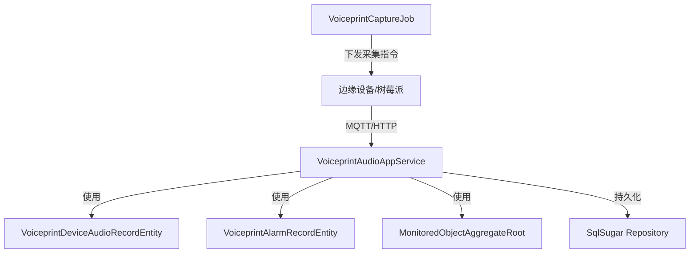

# VoiceprintAudioAppService

## 概述

声纹音频采集应用服务，负责从边缘设备接收音频文件、处理声纹识别结果并生成分析报告。

**位置**：`module/ast-voiceprint/Ast.Voiceprint.Application/Services/VoiceprintAudioAppService.cs`
**层**：Application
**模块**：ast-voiceprint
**依赖注入**：Scoped (Transient)

---

## 架构位置



## 核心职责

1. 接收边缘设备上传的音频文件
2. 处理声纹识别结果回调
3. 生成声纹分析报告（DOCX格式）
4. 管理手动/自动采集模式切换
5. 更新监测对象状态并触发告警

## 关键接口

```csharp
// 上传声纹音频文件（边缘设备调用）
public async Task<VoiceprintAudioUploadResultDto> UploadAsync([FromForm] VoiceprintAudioUploadInput input);

// 声纹识别结果回调（识别服务调用）
public async Task<VoiceprintResultUploadResponseDto> SubmitResultAsync(VoiceprintResultUploadInput input);

// 生成声纹分析报告
public async Task<VoiceprintAudioReportGenerateResultDto> GenerateReportFromAudioAsync([FromForm] VoiceprintAudioReportGenerateInput input);

// 切换算法模式（手动/自动）
public async Task<VoiceprintAlgorithmSwitchResultDto> SwitchAlgorithmAsync(VoiceprintAlgorithmSwitchInput input);

// 取消手动采集
public async Task<VoiceprintManualCancelResultDto> CancelManualCaptureAsync();
```

## 依赖注入配置

```csharp
public override void ConfigureServices(ServiceConfigurationContext context)
{
    context.Services.AddTransient<IVoiceprintAudioAppService, VoiceprintAudioAppService>();
}
```

## 数据流

```
边缘设备采集音频
  ↓
[MQTT指令] - VoiceprintCaptureJob下发采集命令
  ↓
[边缘设备] - 录制音频并上传
  ↓
[VoiceprintAudioAppService.UploadAsync] - 接收音频文件存储到pending目录
  ↓
[声纹识别服务] - 异步处理音频进行识别
  ↓
[VoiceprintAudioAppService.SubmitResultAsync] - 接收识别结果
  ↓
[数据库] - 保存VoiceprintDeviceAudioRecordEntity记录
  ↓
[状态更新] - 更新MonitoredObject状态
  ↓
[告警处理] - 必要时创建VoiceprintAlarmRecordEntity
```

## 重要方法

### `UploadAsync()`

**作用**：接收边缘设备上传的音频文件

**调用链**：
```
边缘设备.HTTP POST
  → VoiceprintAudioAppService.UploadAsync()
    → 文件存储到 pending/ 目录
      → VoiceprintCaptureRuntimeStateService.TryMarkUploadCompleted()
```

**实现**：
```csharp
[AllowAnonymous]
[RequestSizeLimit(104_857_600)] // 100MB
[RequestFormLimits(MultipartBodyLengthLimit = 104_857_600)]
public async Task<VoiceprintAudioUploadResultDto> UploadAsync([FromForm] VoiceprintAudioUploadInput input)
{
    ValidateApiKey();
    ValidateInput(input);

    string pendingDir = Path.Combine(_storageOptions.Root, _storageOptions.PendingFolderName);
    Directory.CreateDirectory(pendingDir);

    string fileName = GetSafeFileName(input);
    string filePath = Path.Combine(pendingDir, fileName);
    string publicPath = BuildPublicPath(_storageOptions.PendingFolderName, fileName);

    await using (var stream = new FileStream(filePath, FileMode.Create))
    {
        await input.File.CopyToAsync(stream);
    }

    // 标记该设备上传完成
    _runtimeState.TryMarkUploadCompleted(input.GroupId, input.DeviceId, out var allCompleted, out var message);

    return new VoiceprintAudioUploadResultDto
    {
        FileName = fileName,
        FilePath = publicPath,
        GroupId = input.GroupId,
        DeviceId = input.DeviceId
    };
}
```

---

### `SubmitResultAsync()`

**作用**：接收声纹识别结果并保存记录

**关键逻辑**：
- 连续5次异常才判定为异常（减少误报）
- 自动更新监测对象状态
- 触发告警创建流程

**实现**：
```csharp
[AllowAnonymous]
[HttpPost("/api/app/voiceprint/result")]
public async Task<VoiceprintResultUploadResponseDto> SubmitResultAsync(VoiceprintResultUploadInput input)
{
    var record = await _deviceAudioRecordRepository._DbQueryable
        .FirstAsync(x => x.GroupId == input.GroupId && x.MonitoredObjectId == input.MonitoredObjectId);

    var normalizedLabel = NormalizeLabel(input.resultLabel);
    if (!string.Equals(normalizedLabel, "运行正常", StringComparison.OrdinalIgnoreCase))
    {
        // 连续五次异常才判定为异常
        var prevRecords = await _deviceAudioRecordRepository._DbQueryable
            .Where(x => x.MonitoredObjectId == input.MonitoredObjectId)
            .OrderByDescending(x => x.CollectedAt)
            .Take(5)
            .ToListAsync();

        var hasFivePreviousAbnormal = prevRecords.Count == 5 &&
            prevRecords.All(x => !string.Equals(NormalizeLabel(x.RealAnomalyType), "运行正常"));

        if (!hasFivePreviousAbnormal)
        {
            normalizedLabel = "运行正常";
        }
    }

    record.AnomalyType = normalizedLabel;
    record.IsNormal = normalizedLabel == "运行正常";
    record.RealAnomalyType = input.resultLabel;

    await _deviceAudioRecordRepository.InsertOrUpdateAsync(record);
    await UpdateMonitoredObjectStatusAsync(record.MonitoredObjectId, record.IsNormal);
    await TryCreateAlarmAsync(record);

    return new VoiceprintResultUploadResponseDto { Success = true };
}
```

---

### `GenerateReportFromAudioAsync()`

**作用**：根据音频文件和诊断类型生成DOCX分析报告

**报告生成流程**：
1. 上传音频文件到pending目录
2. 计算音频MD5并匹配标准音频库
3. 生成频域分析图表
4. 根据异常类型选择报告模板
5. 填充数据并生成DOCX文件

**支持的报告类型**：
- 运行正常.docx
- 夹件螺栓松动.docx
- 风扇轴承摩擦.docx
- 局部放电.docx
- 励磁.docx
- 连接螺栓松动.docx
- 焊渣异物.docx
- 铁芯松动50%励磁.docx
- 线圈完全松动励磁.docx

---

## 权限控制

```csharp
// 大部分端点使用 [AllowAnonymous] 允许边缘设备和识别服务无认证调用
// 通过 API Key 进行身份验证

private void ValidateApiKey()
{
    var configKey = _recognitionOptions.ApiKey;
    var providedKey = _httpContextAccessor.HttpContext?.Request.Headers["X-API-Key"].FirstOrDefault();

    if (string.IsNullOrEmpty(configKey) || string.IsNullOrEmpty(providedKey))
    {
        throw new AbpAuthorizationException("API Key missing");
    }

    if (!string.Equals(configKey, providedKey, StringComparison.Ordinal))
    {
        throw new AbpAuthorizationException("Invalid API Key");
    }
}
```

## 相关组件

- [[VoiceprintDeviceAudioRecordEntity]] - 设备声纹音频记录实体
- [[VoiceprintAlarmRecordEntity]] - 声纹告警记录实体
- [[VoiceprintCaptureJob]] - 声纹采集定时任务
- [[VoiceprintCaptureRuntimeStateService]] - 采集运行状态管理服务
- [[VoiceprintPortalAppService]] - 声纹门户应用服务

## 学习笔记

### 难点理解

1. **连续告警机制**：为减少误报，系统要求连续5次识别结果为异常才真正判定为异常
2. **手动/自动模式切换**：通过RuntimeStateService管理采集模式，手动模式下暂停定时任务
3. **报告模板映射**：根据异常类型自动选择对应的DOCX模板文件

### 声纹类别

系统识别的声纹类别包括：
- 运行正常
- 夹件螺栓松动
- 风扇轴承摩擦
- 局部放电
- 励磁
- 连接螺栓松动
- 焊渣异物
- 铁芯松动50%励磁
- 线圈完全松动励磁
- 模拟故障
- 测试音频

### 疑问

- 如何处理音频文件上传失败的情况？
- 报告生成失败时如何重试？
- 标准音频库如何更新和管理？

## 参考资料

- [ABP Application Services](https://docs.abp.io/en/abp/latest/Application-Services)
- 项目源码：`module/ast-voiceprint/Ast.Voiceprint.Application/Services/`

---
**状态**：🟡 学习中
