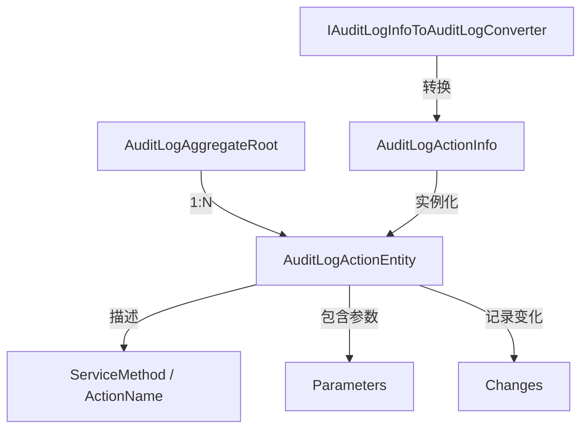

# AuditLogActionService

## 概述

**审计日志操作服务** - 记录审计日志中的具体业务操作动作（如"创建设备"、"更新告警规则"），提供细粒度的操作追踪能力。

**位置**：`module/audit-logging/Yi.Framework.AuditLogging.Domain/`
**层**：Domain (Entity)
**模块**：audit-logging
**依赖注入**：作为 AuditLogAggregateRoot 的导航属性自动持久化

---

## 架构位置



## 核心职责

1. **操作名称记录** - 记录具体的业务操作名称
2. **参数追踪** - 记录操作方法的输入参数
3. **变化记录** - 记录操作前后的数据变化（JSON 格式）
4. **执行时长** - 记录单个操作的执行时间
5. **关联审计日志** - 通过 AuditLogId 关联到主审计日志

## 实体结构

```csharp
public class AuditLogActionEntity : Entity<Guid>, IAggregateRoot<Guid>
{
    [SugarColumn(IsPrimaryKey = true)]
    public override Guid Id { get; protected set; }
    
    /// <summary>
    /// 关联的审计日志ID
    /// </summary>
    public Guid AuditLogId { get; set; }
    
    /// <summary>
    /// 服务名称（如 "Yi.Framework.Rbac.Application.UserService"）
    /// </summary>
    public virtual string ServiceName { get; set; }
    
    /// <summary>
    /// 方法名称（如 "CreateAsync"）
    /// </summary>
    public virtual string MethodName { get; set; }
    
    /// <summary>
    /// 完整方法名（如 "CreateAsync"）
    /// </summary>
    public virtual string ActionName { get; set; }
    
    /// <summary>
    /// 方法参数（JSON 格式）
    /// </summary>
    public virtual string Parameters { get; set; }
    
    /// <summary>
    /// 执行时长（毫秒）
    /// </summary>
    public virtual int ExecutionDuration { get; set; }
    
    /// <summary>
    /// 执行时间
    /// </summary>
    public virtual DateTime ExecutionTime { get; set; }
    
    /// <summary>
    /// 数据变化（JSON 格式）
    /// </summary>
    public virtual string Changes { get; set; }
    
    /// <summary>
    /// 租户ID
    /// </summary>
    public virtual Guid? TenantId { get; set; }
}
```

## 数据流

```
ABP Auditing Interceptor 拦截方法调用
  → 记录 ServiceName, MethodName, Parameters
    → IAuditLogInfoToAuditLogConverter 转换
      → 创建 AuditLogActionInfo (包含 Actions 列表)
        → 转换为 AuditLogActionEntity
          → 通过 InsertNav Include 关联插入
```

## 转换逻辑

```csharp
// module/audit-logging/Yi.Framework.AuditLogging.Domain/AuditLogInfoToAuditLogConverter.cs

var actions = auditLogInfo
    .Actions?
    .Select(auditLogActionInfo => new AuditLogActionEntity(
        GuidGenerator.Create(), 
        auditLogId, 
        auditLogActionInfo, 
        tenantId: auditLogInfo.TenantId
    ))
    .ToList()
    ?? new List<AuditLogActionEntity>();
```

## 持久化机制

```csharp
// SqlSugarCoreAuditLogRepository 重写 InsertAsync
public override async Task<bool> InsertAsync(AuditLogAggregateRoot insertObj)
{
    return await _Db.InsertNav<AuditLogAggregateRoot>(insertObj)
             .Include(z1 => z1.Actions)  // 自动插入关联的 Actions
             .ExecuteCommandAsync();
}
```

## 数据示例

```json
{
  "serviceName": "Yi.Framework.Rbac.Application.UserService",
  "methodName": "CreateAsync",
  "actionName": "CreateAsync",
  "parameters": "{\"input\":{\"name\":\"张三\",\"email\":\"zhangsan@example.com\"}}",
  "executionDuration": 245,
  "executionTime": "2026-06-03T10:30:15",
  "changes": "[{\"propertyName\":\"Email\",\"oldValue\":null,\"newValue\":\"zhangsan@example.com\"}]"
}
```

## 关键字段说明

| 字段 | 说明 | 示例值 |
|-----|------|--------|
| `ServiceName` | 完整的服务类名 | `Yi.Framework.Rbac.Application.UserService` |
| `MethodName` | 被调用的方法名 | `CreateAsync` |
| `ActionName` | 操作动作名称 | `CreateAsync` |
| `Parameters` | 方法参数的 JSON 序列化 | `{"input":{"name":"张三"}}` |
| `ExecutionDuration` | 方法执行耗时（毫秒） | `245` |
| `Changes` | 数据变化记录（JSON 数组） | `[{"propertyName":"Email","oldValue":null,"newValue":"..."}]` |

## 使用场景

1. **细粒度审计** - 追踪具体的服务方法调用
2. **参数回溯** - 查看操作时传递的参数值
3. **性能分析** - 分析单个方法的执行时长
4. **变更追踪** - 记录操作前后的数据变化

## 关联关系

- **1:N 关联到 AuditLogAggregateRoot** - 一个审计日志可包含多个操作记录
- **多对一关系** - 多个 Action 属于同一个 AuditLog

## 相关组件

- [[AuditLogService]] - 主审计日志服务
- [[AuditLogAggregateRoot]] - 审计日志实体
- [[IAuditLogInfoToAuditLogConverter]] - 转换器
- [[EntityChangeEntity]] - 实体变更详情

## 设计特点

1. **自动收集** - 由 ABP Auditing Interceptor 自动收集
2. **导航属性持久化** - 通过 SqlSugar 的 InsertNav 自动插入
3. **JSON 序列化** - Parameters 和 Changes 以 JSON 格式存储
4. **租户隔离** - 支持 TenantId 进行多租户隔离

## 参考资料

- [ABP Auditing 文档](https://docs.abp.io/en/abp/latest/Auditing)
- 项目源码：`module/audit-logging/Yi.Framework.AuditLogging.Domain/`

---
**状态**：✅ 完成
