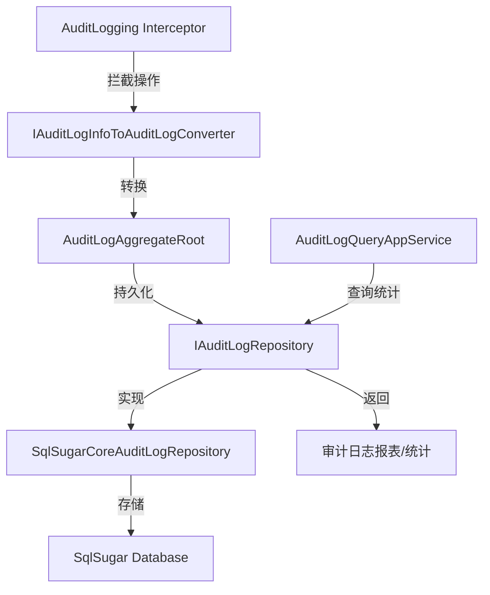

# AuditLogService

## 概述

**审计日志仓储服务** - 提供审计日志的持久化、查询和统计功能，记录系统中所有关键操作的审计跟踪信息。

**位置**：`module/audit-logging/Yi.Framework.AuditLogging.Domain/Repositories/`
**层**：Domain (Repository Interface)
**模块**：audit-logging
**依赖注入**：Transient (在 SqlSugarCore 模块中实现)

---

## 架构位置



## 核心职责

1. **审计日志持久化** - 将运行时操作日志保存到数据库
2. **多维度查询** - 支持按时间、用户、URL、HTTP 方法等条件筛选
3. **实体变更跟踪** - 记录实体属性变更详情（EntityChanges）
4. **性能统计** - 计算平均执行时长、异常率等指标
5. **操作日志关联** - 记录关联的操作动作（Actions）

## 关键接口

```csharp
// 获取审计日志列表（支持多条件筛选）
public Task<List<AuditLogAggregateRoot>> GetListAsync(
    string sorting = null,
    int maxResultCount = 50,
    int skipCount = 0,
    DateTime? startTime = null,
    DateTime? endTime = null,
    string httpMethod = null,
    string url = null,
    Guid? userId = null,
    string userName = null,
    string applicationName = null,
    string clientIpAddress = null,
    string correlationId = null,
    int? maxExecutionDuration = null,
    int? minExecutionDuration = null,
    bool? hasException = null,
    HttpStatusCode? httpStatusCode = null,
    bool includeDetails = false
);

// 获取日志总数
public Task<long> GetCountAsync(/* 筛选参数同上 */);

// 获取实体变更记录
public Task<EntityChangeEntity> GetEntityChange(Guid entityChangeId);

// 获取实体变更列表
public Task<List<EntityChangeEntity>> GetEntityChangeListAsync(
    string sorting = null,
    int maxResultCount = 50,
    int skipCount = 0,
    Guid? auditLogId = null,
    DateTime? startTime = null,
    DateTime? endTime = null,
    EntityChangeType? changeType = null,
    string entityId = null,
    string entityTypeFullName = null,
    bool includeDetails = false
);

// 获取每日平均执行时长
public Task<Dictionary<DateTime, double>> GetAverageExecutionDurationPerDayAsync(
    DateTime startDate, 
    DateTime endDate
);

// 获取带用户名的实体变更
public Task<EntityChangeWithUsername> GetEntityChangeWithUsernameAsync(Guid entityChangeId);
```

## 依赖注入配置

```csharp
// module/audit-logging/Yi.Framework.AuditLogging.SqlSugarCore/YiFrameworkAuditLoggingSqlSugarCoreModule.cs
public override void ConfigureServices(ServiceConfigurationContext context)
{
    context.Services.AddTransient<IAuditLogRepository, SqlSugarCoreAuditLogRepository>();
}
```

## 数据流

```
ABP Interceptor 拦截操作
  → IAuditLogInfoToAuditLogConverter 转换为实体
    → IAuditLogRepository.InsertAsync() 持久化
      → SqlSugar 导航属性插入 (Include Actions)
        → 数据库
          
查询请求
  → IAuditLogRepository.GetListAsync()
    → SqlSugar 查询构建器 (WhereIF 条件筛选)
      → 分页返回
```

## 重要方法

### `GetListAsync()`

**作用**：多条件查询审计日志，支持时间范围、用户、URL、执行时长、异常状态等筛选

**查询构建器**：
```csharp
var query = await GetListQueryAsync(
    startTime, endTime, httpMethod, url, userId, userName,
    applicationName, clientIpAddress, correlationId,
    maxExecutionDuration, minExecutionDuration, hasException, httpStatusCode
);

return await query
    .OrderBy(sorting.IsNullOrWhiteSpace() ? "ExecutionTime DESC" : sorting)
    .ToPageListAsync(skipCount, maxResultCount);
```

### `InsertAsync()` (重写)

**作用**：支持导航属性插入，自动关联 Actions 和 EntityChanges

**实现特点**：
```csharp
public override async Task<bool> InsertAsync(AuditLogAggregateRoot insertObj)
{
    return await _Db.InsertNav<AuditLogAggregateRoot>(insertObj)
             .Include(z1 => z1.Actions)  // 关联操作日志
             .ExecuteCommandAsync();
}
```

### `GetAverageExecutionDurationPerDayAsync()`

**作用**：统计指定日期范围内每日平均执行时长，用于性能分析

**返回**：`Dictionary<DateTime, double>` - 日期 → 平均时长（毫秒）

## 源码片段

### 关键实现

```csharp
// module/audit-logging/Yi.Framework.AuditLogging.SqlSugarCore/Repositories/SqlSugarCoreAuditLogRepository.cs

public virtual async Task<List<AuditLogAggregateRoot>> GetListAsync(
    string sorting = null, int maxResultCount = 50, int skipCount = 0,
    DateTime? startTime = null, DateTime? endTime = null,
    string httpMethod = null, string url = null,
    Guid? userId = null, string userName = null,
    string applicationName = null, string clientIpAddress = null,
    string correlationId = null, int? maxExecutionDuration = null,
    int? minExecutionDuration = null, bool? hasException = null,
    HttpStatusCode? httpStatusCode = null, bool includeDetails = false)
{
    var query = await GetListQueryAsync(
        startTime, endTime, httpMethod, url, userId, userName,
        applicationName, clientIpAddress, correlationId,
        maxExecutionDuration, minExecutionDuration, hasException, httpStatusCode,
        includeDetails
    );

    var auditLogs = await query
        .OrderBy(sorting.IsNullOrWhiteSpace() ? nameof(AuditLogAggregateRoot.ExecutionTime) + " DESC" : sorting)
        .ToPageListAsync(skipCount, maxResultCount);

    return auditLogs;
}
```

## 实体关系

```csharp
// AuditLogAggregateRoot (审计日志主表)
public class AuditLogAggregateRoot : FullAuditedAggregateRoot<Guid>
{
    public string ApplicationName { get; set; }
    public string UserId { get; set; }
    public string UserName { get; set; }
    public string ClientIpAddress { get; set; }
    public string ClientName { get; set; }
    public string CorrelationId { get; set; }
    public string HttpMethod { get; set; }
    public string Url { get; set; }
    public int? HttpStatusCode { get; set; }
    public DateTime ExecutionTime { get; set; }
    public int ExecutionDuration { get; set; }
    public string Comments { get; set; }
    public string Exceptions { get; set; }
    
    // 导航属性
    public List<AuditLogActionEntity> Actions { get; set; }  // 操作日志
    public List<EntityChangeEntity> EntityChanges { get; set; }  // 实体变更
}
```

## 相关组件

- [[AuditLogActionService]] - 操作日志服务
- [[IAuditLogInfoToAuditLogConverter]] - 日志转换器
- [[AuditLogAggregateRoot]] - 审计日志实体
- [[EntityChangeEntity]] - 实体变更实体
- [[SqlSugarCoreAuditLogRepository]] - SqlSugar 实现

## 使用场景

1. **合规审计** - 满足电力行业的安全审计要求
2. **故障排查** - 通过 CorrelationId 追踪请求链路
3. **性能分析** - 统计接口响应时长、异常率
4. **操作回溯** - 查看特定用户或时间段的操作记录

## 参考资料

- [ABP Auditing 文档](https://docs.abp.io/en/abp/latest/Auditing)
- 项目源码：`module/audit-logging/`

---
**状态**：✅ 完成
