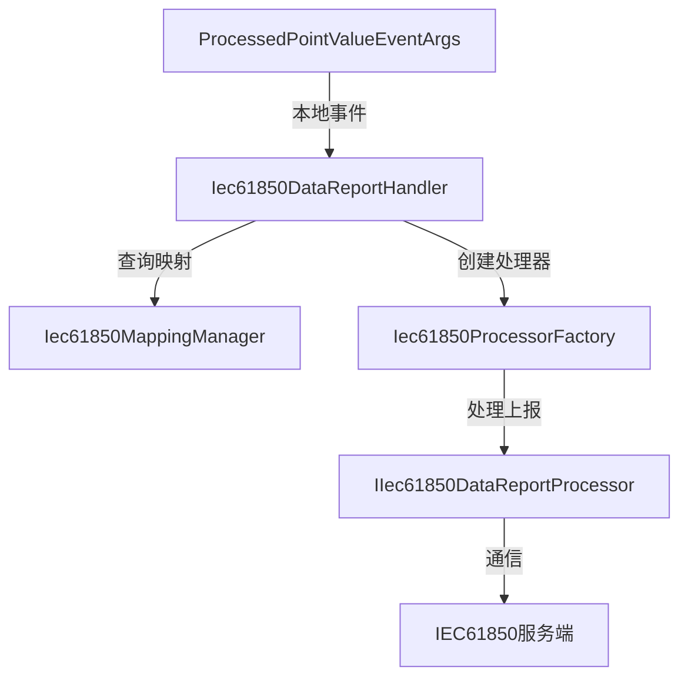

# Iec61850DataReportHandler

## 概述

IEC61850 数据上报事件处理器，负责监听处理后的传感器数据点值，并将其映射到 IEC61850 协议格式后上报到61850服务端。

**位置**：`module/ast-intellisub/Ast.IntelliSub.Application/EventHandlers/Iec61850DataReportHandler.cs`
**层**：Application
**模块**：ast-intellisub (IEC61850 相关功能)
**依赖注入**：Transient

---

## 架构位置



## 核心职责

1. 监听 `ProcessedPointValueEventArgs` 本地事件
2. 根据点位键查找 IEC61850 映射关系
3. 按 ICD 文件分组处理数据上报
4. 调用对应的数据处理器完成实际上报

## 关键接口

```csharp
// 事件处理方法
public async Task HandleEventAsync(ProcessedPointValueEventArgs eventData);
```

## 依赖注入配置

```csharp
// 自动注册为 ITransientDependency
public class Iec61850DataReportHandler : 
    ILocalEventHandler<ProcessedPointValueEventArgs>, 
    ITransientDependency
{
    private readonly IIec61850MappingManager _mappingManager;
    private readonly IIec61850ProcessorFactory _processorFactory;
    private readonly ILogger<Iec61850DataReportHandler> _logger;
    private readonly IOptions<Iec61850Options> _options;
}
```

## 数据流

```
传感器数据采集完成
  → 发布 ProcessedPointValueEventArgs 本地事件
    → Iec61850DataReportHandler 监听事件
      → 构造点位键 (device_id|sensor_key|property)
        → 查询映射关系
          → 按 ICD 文件分组
            → 创建对应处理器
              → 并行处理上报
```

## 重要方法

### `HandleEventAsync()`

**作用**：处理处理后的点位值事件，执行 IEC61850 数据上报

**调用链**：
```
数据采集服务
  → ProcessedPointValueEventArgs 发布
    → Iec61850DataReportHandler.HandleEventAsync()
      → Iec61850ProcessorFactory.CreateProcessor()
        → IIec61850DataReportProcessor.ProcessAsync()
```

**实现逻辑**：
1. 检查配置开关和数据有效性
2. 为每个点位值构造映射查询键
3. 从映射管理器获取 IEC61850 映射关系
4. 按 ICD 文件名分组
5. 并行创建处理器并处理上报

## 源码片段

### 关键实现

```csharp
// 文件路径: module/ast-intellisub/Ast.IntelliSub.Application/EventHandlers/Iec61850DataReportHandler.cs:37
public async Task HandleEventAsync(ProcessedPointValueEventArgs eventData)
{
    if (!_options.Value.EnableDataReport || eventData.Data?.PointVals?.Any() != true)
        return;

    var contexts = new List<IecContext>();

    // 为每个点位值查找映射关系
    foreach (var pointValue in eventData.Data.PointVals)
    {
        // pointKey 由 `device_id|sensor_key|property` 组成
        var pointKey = $"{pointValue.DeviceId}|{pointValue.SensorKey}|{pointValue.Property}";
        var mapping = _mappingManager.GetMapping(pointKey);

        if (mapping != null)
        {
            contexts.Add(new IecContext
            {
                PointKey = mapping.PointKey,
                Reference = mapping.Reference,
                Host = mapping.Host,
                IcdFileName = mapping.IcdFileName,
                DataType = mapping.DataType,
                Value = pointValue.Value,
                Timestamp = pointValue.Ts
            });
        }
    }

    // 按ICD文件名分组并行处理
    var groups = contexts.GroupBy(c => c.IcdFileName);
    var tasks = groups.Select(async group =>
    {
        var processor = _processorFactory.CreateProcessor(group.Key);
        await processor.ProcessAsync(group.ToList());
    });
    await Task.WhenAll(tasks);
}
```

## 配置选项

### Iec61850Options

```csharp
public class Iec61850Options
{
    public string ModelFileDirectory { get; set; } = string.Empty;
    public List<ModelFileConfig> ModelFiles { get; set; } = new();
    public bool EnableDataReport { get; set; } = true;
    public bool EnableAlarmReport { get; set; } = true;
    public int BatchSize { get; set; } = 100;
    public int BatchIntervalMs { get; set; } = 1000;
}
```

**配置位置**：`appsettings.json`

```json
{
  "Iec61850": {
    "EnableDataReport": true,
    "ModelFileDirectory": "Iec61850",
    "ModelFiles": [
      {
        "ModelFile": "GISSF60_104.icd",
        "Processor": "GISSF60DataReportProcessor",
        "Host": "192.168.1.100",
        "Enabled": true
      }
    ]
  }
}
```

## 相关组件

- [[Iec61850MappingManager]] - 映射关系管理器
- [[Iec61850ProcessorFactory]] - 处理器工厂
- [[IIec61850DataReportProcessor]] - 数据上报处理器接口
- [[ProcessedPointValueEventArgs]] - 处理后点位值事件

## 学习笔记

### 难点理解

1. **点位键构造规则**：`device_id|sensor_key|property` 是唯一标识传感器的关键
2. **ICD 文件分组**：不同模型文件对应不同的61850服务器，需要分组处理
3. **并行上报**：使用 `Task.WhenAll` 实现多服务器并行上报，提高性能

### 疑问

- 映射关系是否支持热更新？
- 上报失败时如何处理重试？
- 是否支持批量上报优化？

## 参考资料

- [IEC 61850 标准](https://en.wikipedia.org/wiki/IEC_61850)
- [ABP 事件总线文档](https://docs.abp.io/en/abp/latest/Event-Bus)
- 项目源码：`module/ast-intellisub/Ast.IntelliSub.Application/EventHandlers/`

---
**状态**：🟡 学习中
