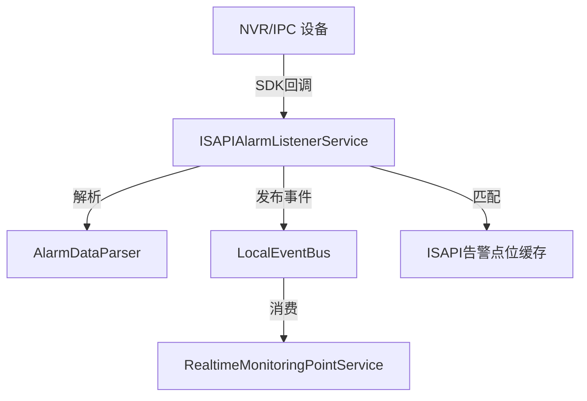

# ISAPIAlarmListenerService - ISAPI 告警监听服务

## 概述

ISAPIAlarmListenerService 是一个基于海康威视 CHCNetSDK 的后台告警监听服务，通过 SDK 回调机制接收 NVR/IPC 设备的各类告警事件（温度报警、移动侦测、视频丢失等），并将告警数据解析后发布到本地事件总线供其他模块消费。

**位置**：`module/isapi/ISAPI.Application/Services/ISAPIAlarmListenerService.cs`
**层**：Application
**模块**：isapi
**依赖注入**：Singleton（ABP BackgroundWorkerBase）
**SDK**：CHCNetSDK（海康威视设备SDK）

---

## 架构位置



## 核心职责

1. **SDK生命周期管理** - 初始化/清理 CHCNetSDK，设置回调函数
2. **多类型告警接收** - 支持温度、ISAPI透传、移动侦测、规则报警等
3. **告警数据解析** - 解析二进制告警数据并提取关键信息
4. **事件总线发布** - 将告警转换为标准点位值发布到事件总线
5. **点位智能匹配** - 根据设备IP和通道号匹配实时监测点位

## 关键接口

```csharp
public interface IISAPIAlarmListenerService
{
    // 开始监听
    Task StartListenAsync();

    // 停止监听
    Task StopListenAsync();

    // 监听状态
    bool IsListening { get; }
}
```

## SDK 回调机制

### 回调函数注册

```csharp
// 异常消息回调
private CHCNetSDK.EXCEPYIONCALLBACK m_fExceptionCB = null;
CHCNetSDK.NET_DVR_SetExceptionCallBack_V30(0, IntPtr.Zero, m_fExceptionCB, IntPtr.Zero);

// 报警消息回调（V31版本）
private CHCNetSDK.MSGCallBack_V31 m_falarmData_V31 = null;
CHCNetSDK.NET_DVR_SetDVRMessageCallBack_V31(m_falarmData_V31, IntPtr.Zero);

// 本地端口监听回调（可选）
private CHCNetSDK.MSGCallBack _msgCallback = null;
iListenHandle = CHCNetSDK.NET_DVR_StartListen_V30(listenIP, listenPort, _msgCallback, IntPtr.Zero);
```

### 支持的告警类型

| 告警类型 | 常量 | 处理方法 |
|---------|------|---------|
| 温度报警 | `COMM_THERMOMETRY_ALARM` | `ProcessCommAlarm_Thermometry` |
| ISAPI透传 | `COMM_ISAPI_ALARM` | `ProcessCommAlarm_ISAPIAlarm` |
| V30报警 | `COMM_ALARM_V30` | `ProcessCommAlarm_V30` |
| 规则报警 | `COMM_ALARM_RULE` | `ProcessCommAlarm_RULE` |
| V40报警 | `COMM_ALARM_V40` | `ProcessCommAlarm_V40` |

## 依赖注入配置

```csharp
public class ISAPIAlarmListenerService : BackgroundWorkerBase, IISAPIAlarmListenerService
{
    private readonly ILogger<ISAPIAlarmListenerService> _logger;
    private readonly AlarmDataParser _alarmDataParser;
    private readonly IConfiguration _configuration;
    private readonly ILocalEventBus _localEventBus;
    private readonly IRealtimeMonitoringPointService _realtimeMonitoringPointService;

    // 缓存匹配的点位数据
    private List<RtMonitoredPointBindingDto> _isapiAlarmPoints = new();
}
```

## 启动流程

```csharp
public async Task StartListenAsync()
{
    // 1. 检查是否启用监听
    var isEnabled = _configuration.GetValue<bool>("ISAPI:Enabled", true);

    // 2. 加载匹配的点位数据
    await LoadIsapiAlarmPointsAsync();

    // 3. 初始化SDK
    bool m_bInitSDK = CHCNetSDK.NET_DVR_Init();

    // 4. 保存SDK日志
    CHCNetSDK.NET_DVR_SetLogToFile(3, "C:\\SdkLog\\", true);

    // 5. 设置透传报警信息类型
    CHCNetSDK.NET_DVR_SetSDKLocalCfg(17, ptrLocalCfg);

    // 6. 设置异常消息回调
    CHCNetSDK.NET_DVR_SetExceptionCallBack_V30(0, IntPtr.Zero, m_fExceptionCB, IntPtr.Zero);

    // 7. 设置报警回调函数（V31）
    CHCNetSDK.NET_DVR_SetDVRMessageCallBack_V31(m_falarmData_V31, IntPtr.Zero);

    // 8. 启动本地端口监听（可选）
    iListenHandle = CHCNetSDK.NET_DVR_StartListen_V30(listenIP, listenPort, _msgCallback, IntPtr.Zero);
}
```

## 数据流

```
NVR/IPC 设备告警
  → CHCNetSDK 回调
    → AlarmMessageHandle (分发)
      → ProcessCommAlarm_* (具体处理)
        → ReportAlarmToEventBusAsync (匹配点位 + 发布事件)
          → LocalEventBus.PublishAsync
            → 消费者处理（实时监测等）
```

## 重要方法

### `AlarmMessageHandle()`

**作用**：SDK 回调入口，根据告警类型分发到不同处理方法

**代码示例**：
```csharp
public void AlarmMessageHandle(int lCommand, ref CHCNetSDK.NET_DVR_ALARMER pAlarmer,
                             IntPtr pAlarmInfo, uint dwBufLen, IntPtr pUser)
{
    string strIP = System.Text.Encoding.UTF8.GetString(pAlarmer.sDeviceIP).TrimEnd('\0');

    switch (lCommand)
    {
        case CHCNetSDK.COMM_THERMOMETRY_ALARM:
            _ = Task.Run(async () => await ProcessCommAlarm_Thremometry(...));
            break;
        case CHCNetSDK.COMM_ISAPI_ALARM:
            _ = Task.Run(async () => await ProcessCommAlarm_ISAPIAlarm(...));
            break;
        // ... 其他类型
    }
}
```

### `ProcessCommAlarm_Thermometry()`

**作用**：处理温度报警，解析报警信息并保存可见光图片

**关键逻辑**：
1. 从 IntPtr 反序列化 `NET_DVR_THERMOMETRY_ALARM` 结构
2. 解析报警时间（位操作）
3. 保存可见光图片到本地文件
4. 上报到事件总线

**代码示例**：
```csharp
private async Task ProcessCommAlarm_Thermometry(CHCNetSDK.NET_DVR_ALARMER pAlarmer,
                                               IntPtr pAlarmInfo, uint dwBufLen, IntPtr pUser)
{
    var strThermometryInfo = Marshal.PtrToStructure(pAlarmInfo, typeof(CHCNetSDK.NET_DVR_THERMOMETRY_ALARM));

    // 解析报警时间
    string strTime = ((strThermometryInfo.dwAbsTime >> 26) + 2000).ToString() + "-" +
                     ((strThermometryInfo.dwAbsTime >> 22) & 15).ToString("d2") + "-" +
                     // ... 更多位操作

    // 保存可见光图片
    if (strThermometryInfo.dwPicLen != 0 && strThermometryInfo.pPicBuff != IntPtr.Zero)
    {
        await SaveTemperatureImageAsync(strThermometryInfo, strIP, pAlarmer.lUserID);
    }
}
```

### `ProcessCommAlarm_ISAPIAlarm()`

**作用**：处理 ISAPI 透传报警，解析 multipart/form-data 格式的告警数据

**关键逻辑**：
1. 将 IntPtr 转换为 byte 数组
2. 解析报文中的 channelID 和 deviceID
3. 调用 `ParseAlarmDataAsync` 解析 boundary 分段数据

**代码示例**：
```csharp
private async Task ProcessCommAlarm_ISAPIAlarm(CHCNetSDK.NET_DVR_ALARMER pAlarmer,
                                                IntPtr pAlarmInfo, uint dwBufLen, IntPtr pUser)
{
    byte[] alarmData = new byte[dwBufLen];
    Marshal.Copy(pAlarmInfo, alarmData, 0, (int)dwBufLen);

    string payload = Encoding.UTF8.GetString(alarmData);

    // 提取通道和设备信息
    string channel = TryExtractValue(payload, new[] {
        "\"channelID\"\\s*:\\s*\"?(?<v>\\d+)\"?",
        "<channelID>(?<v>\\d+)</channelID>"
    });

    await ParseAlarmDataAsync(alarmData);
}
```

### `ProcessCommAlarm_V40()`

**作用**：处理 V40 版本报警（移动侦测、视频丢失等）

**难点**：V40 报警包含可变长数据，需要从 `pAlarmData` 中解析通道号

**代码示例**：
```csharp
private async Task ProcessCommAlarm_V40(CHCNetSDK.NET_DVR_ALARMER pAlarmer,
                                         IntPtr pAlarmInfo, uint dwBufLen, IntPtr pUser)
{
    var alarmInfo = Marshal.PtrToStructure(pAlarmInfo, typeof(CHCNetSDK.NET_DVR_ALARMINFO_V40));

    // 尝试从可变数据中解析通道信息
    int channel = -1;
    uint variableDataLen = dwBufLen - (uint)fixedHeaderSize;

    if (alarmInfo.pAlarmData != IntPtr.Zero && variableDataLen > 0)
    {
        if (alarmInfo.struAlarmFixedHeader.dwAlarmType == 3) // 移动侦测
        {
            channel = TryParseChannelFromV40Data(alarmInfo.pAlarmData, variableDataLen);
        }
    }

    await ReportAlarmToEventBusAsync(strIP, channel, alarmTypeDesc, rawData);
}
```

### `TryParseChannelFromV40Data()`

**作用**：从 V40 可变数据中尝试解析通道号（1-64 范围）

**安全措施**：
- 指针有效性检查
- 数据长度验证
- 异常捕获
- 限制最大读取长度

**代码示例**：
```csharp
private int TryParseChannelFromV40Data(IntPtr pAlarmData, uint dwBufLen)
{
    // 安全检查
    if (pAlarmData == IntPtr.Zero || dwBufLen < 4) return -1;

    int maxReadable = Math.Min((int)dwBufLen, 32);
    byte[] data = new byte[maxReadable];
    Marshal.Copy(pAlarmData, data, 0, data.Length);

    // 查找可能的通道号（1-64范围内的值）
    for (int i = 0; i <= data.Length - 4; i += 4)
    {
        int value = BitConverter.ToInt32(data, i);
        if (value > 0 && value <= 64) return value;
    }

    return -1;
}
```

### `ReportAlarmToEventBusAsync()`

**作用**：将告警数据转换为标准点位值并发布到事件总线

**匹配逻辑**：
1. 按 DeviceIP 和 SensorKey（格式：`channel_{通道号}`）匹配点位
2. 如果精确匹配失败，尝试仅按通道匹配
3. 将告警类型转换为标准值和告警级别

**代码示例**：
```csharp
private async Task ReportAlarmToEventBusAsync(string deviceIp, int? channel, string alarmTypeDesc, string rawData)
{
    // 匹配点位
    var matchedPoints = MatchPoints(deviceIp, channel);
    if (!matchedPoints.Any()) return;

    var pointValues = new List<MqPointValueItemDto>();
    var groupId = Guid.NewGuid().ToString();

    foreach (var point in matchedPoints)
    {
        pointValues.Add(new MqPointValueItemDto
        {
            PointId = point.AstPointId.Value.ToString(),
            Ts = DateTime.Now,
            Value = ConvertAlarmTypeToValue(alarmTypeDesc),
            AlarmLevel = ConvertAlarmTypeToAlarmLevel(alarmTypeDesc),
            ExtInfo = JsonSerializer.Serialize(new { alarmType = alarmTypeDesc, deviceIp, channel, rawData })
        });
    }

    // 发布事件
    await _localEventBus.PublishAsync(new PointValueEventArgs
    {
        Type = "isapi_alarm",
        Data = new MqPointValueDto { PointVals = pointValues }
    });
}
```

### `MatchPoints()`

**作用**：根据设备IP和通道号匹配实时监测点位

**匹配规则**：
1. 按算法类型筛选：`EnvironmentDetectionAnalysis`（环境检测分析）
2. 按 DeviceIP 匹配
3. 按 SensorKey 匹配（格式：`channel_{通道号}`）
4. 如果精确匹配失败，尝试仅按通道匹配

**代码示例**：
```csharp
private List<RtMonitoredPointBindingDto> MatchPoints(string deviceIp, int? channel)
{
    var channelKey = channel.HasValue && channel.Value > 0 ? $"channel_{channel.Value}" : null;

    var query = _isapiAlarmPoints.AsEnumerable();

    // 按设备IP匹配
    if (!string.IsNullOrWhiteSpace(deviceIp))
    {
        query = query.Where(p => string.Equals(p.DeviceId, deviceIp, StringComparison.OrdinalIgnoreCase));
    }

    // 按通道号匹配
    if (!string.IsNullOrWhiteSpace(channelKey))
    {
        query = query.Where(p => string.Equals(p.SensorKey, channelKey, StringComparison.OrdinalIgnoreCase));
    }

    var matched = query.ToList();

    // 如果精确匹配没有结果，尝试仅按通道匹配
    if (!matched.Any() && !string.IsNullOrWhiteSpace(channelKey))
    {
        matched = _isapiAlarmPoints.Where(p => string.Equals(p.SensorKey, channelKey, StringComparison.OrdinalIgnoreCase)).ToList();
    }

    return matched;
}
```

## 告警类型映射

```csharp
private string ConvertAlarmTypeToValue(string alarmType)
{
    return alarmType switch
    {
        "移动侦测" => "motion_detected",
        "视频丢失" => "video_lost",
        "遮挡" => "occlusion",
        "IO信号" => "io_signal",
        "温度报警" => "temperature_alarm",
        "规则报警" => "rule_alarm",
        _ => "unknown_alarm"
    };
}

private AlarmLevelEnum ConvertAlarmTypeToAlarmLevel(string alarmType)
{
    return alarmType switch
    {
        "移动侦测" => AlarmLevelEnum.Warning,
        "视频丢失" => AlarmLevelEnum.Alarm,
        "遮挡" => AlarmLevelEnum.Warning,
        "IO信号" => AlarmLevelEnum.Warning,
        "温度报警" => AlarmLevelEnum.Alarm,
        "规则报警" => AlarmLevelEnum.Warning,
        _ => AlarmLevelEnum.Normal
    };
}
```

## 配置项

```json
{
  "ISAPI": {
    "Enabled": true,
    "ListenIP": "0.0.0.0",
    "ListenPort": 7200
  }
}
```

## 源码片段

### SDK 回调入口

```csharp
// 文件路径: ISAPIAlarmListenerService.cs:240-254
public bool MsgCallback_V31(int lCommand, ref CHCNetSDK.NET_DVR_ALARMER pAlarmer,
                           IntPtr pAlarmInfo, uint dwBufLen, IntPtr pUser)
{
    try
    {
        AlarmMessageHandle(lCommand, ref pAlarmer, pAlarmInfo, dwBufLen, pUser);
    }
    catch (Exception ex)
    {
        _logger.LogError(ex, "处理报警消息失败");
    }

    return true; // 必须返回 true 表示正常接收
}
```

### 点位加载

```csharp
// 文件路径: ISAPIAlarmListenerService.cs:920-942
private async Task LoadIsapiAlarmPointsAsync()
{
    var input = new RtMonitoredPointBindingGetListInputDto
    {
        AlgorithmType = AlgorithmTypeEnum.EnvironmentDetectionAnalysis,
        IncludeUnbound = false,
        DataSrcType = DataSrcTypeEnum.RealTimeMonitoring,
        MaxResultCount = 100000
    };

    var result = await _realtimeMonitoringPointService.GetListAsync(input);
    _isapiAlarmPoints = result.Items?.ToList() ?? new List<RtMonitoredPointBindingDto>();

    _logger.LogInformation("加载ISAPI报警匹配点位: {Count} 条", _isapiAlarmPoints.Count);
}
```

## 注意事项

1. **SDK 资源管理** - 必须正确调用 `NET_DVR_Cleanup()` 释放 SDK 资源
2. **回调线程安全** - SDK 回调在独立线程执行，需要使用 `Task.Run` 处理异步操作
3. **指针安全** - 处理 IntPtr 时需要验证有效性和长度
4. **点位缓存** - 启动时加载点位到内存，运行时不再查询数据库
5. **告警级别** - 根据 `AlarmLevelEnum` 转换，影响告警中心展示

## 相关组件

- [[AlarmDataParser]] - 告警数据解析器
- [[LocalEventBus]] - 本地事件总线
- [[RealtimeMonitoringPointService]] - 实时监测点位服务
- [[CHCNetSDK]] - 海康威视设备SDK
- [[MqPointValueDto]] - 点位值数据传输对象

## 使用场景

1. **温度监控** - 接收热像仪温度告警并保存可见光图片
2. **移动侦测** - 接收摄像头移动侦测告警并触发录像
3. **规则报警** - 接收智能分析规则告警（越界、徘徊等）
4. **设备异常** - 接收设备离线、视频丢失等告警

---
**状态**：🟢 已完成
