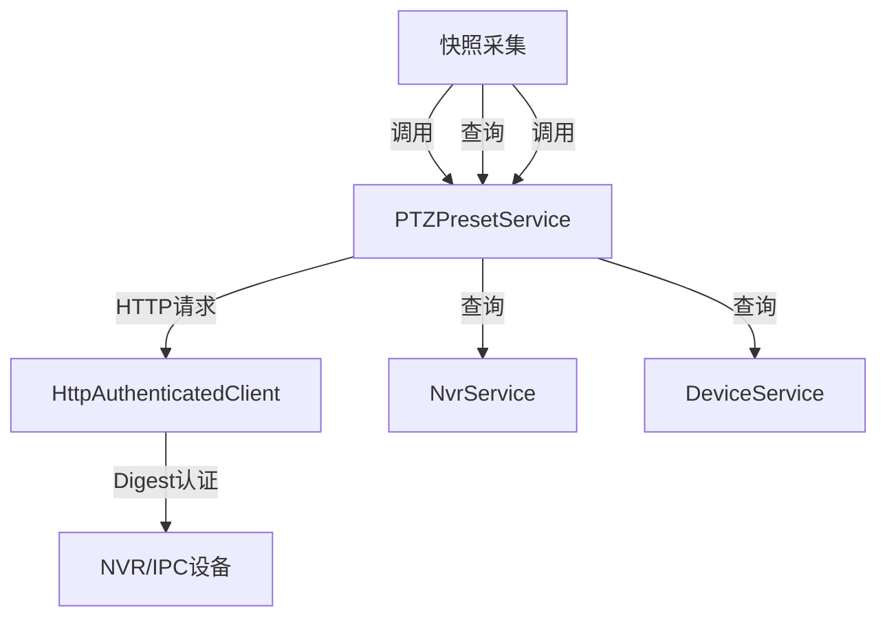

# PTZPresetService - PTZ 预置位管理服务

## 概述

PTZPresetService 提供 PTZ（云台）预置位的完整生命周期管理，包括预置点的查询、创建、删除、调用、状态获取等功能，支持通过 NVR 透传和直接访问子设备两种方式操作，并提供预置位到达检测和快照拍摄等高级功能。

**位置**：`module/isapi/ISAPI.Application/Services/PtzPresetAppService.cs`
**层**：Application
**模块**：isapi
**依赖注入**：Transient（ABP ApplicationService 默认）
**认证方式**：Digest 认证

---

## 架构位置



## 核心职责

1. **预置点管理** - 提供预置点的增删改查功能
2. **PTZ控制** - 调用预置点、获取PTZ状态
3. **快照采集** - 调用预置位并拍摄快照
4. **到达检测** - 等待并验证云台是否到达指定预置位
5. **双访问模式** - 支持 NVR 透传和子设备直连两种访问方式

## 关键接口

```csharp
public interface IPTZPresetService
{
    // 查询所有数字通道信息
    Task<string> GetInputProxyChannelsAsync();

    // 获取预置点列表
    Task<PTZPresetList> GetPresetListAsync(string deviceNo, int channelId);

    // 设置预置点
    Task<bool> SetPresetAsync(string deviceNo, int channelId, PTZPreset preset);

    // 删除预置点
    Task<bool> DeletePresetAsync(string deviceNo, int channelId, int presetId);

    // 调用预置点
    Task<bool> GotoPresetAsync(string deviceNo, int channelId, int presetId);

    // 调用预置位并拍摄快照
    Task<bool> GotoPresetAndCaptureAsync(string deviceNo, int channelId, int presetId, string savePath, string deviceId);

    // 获取PTZ状态信息
    Task<PtzStatus> GetPtzStatusAsync(string deviceNo, int channelId);

    // 等待摄像头到达指定预置位
    Task<bool> WaitForPresetArrivalAsync(string deviceIndex, int channelId, int presetId, string deviceId);

    // 拍摄快照（不调用预置位）
    Task<bool> CaptureSnapshotAsync(string deviceNo, int channelId, string savePath);

    // 通过默认 NVR 直连获取预置点列表
    Task<PTZPresetList> GetPresetListFromNvrAsync(int channelId);

    // 直接通过子设备IP获取预置点列表
    Task<PTZPresetList> GetPresetListByDeviceIpAsync(string deviceIp, int channelId);

    // 直接通过子设备IP删除预置点
    Task<bool> DeletePresetByDeviceIpAsync(string deviceIp, int channelId, int presetId);
}
```

## 依赖注入配置

```csharp
public class PTZPresetService : ApplicationService, IPTZPresetService
{
    private readonly IDeviceService _deviceService;
    private readonly INvrService _nvrService;
    private readonly HttpAuthenticatedClient _authClient;

    // 配置参数
    private const int _timeoutSeconds = 120; // 等待超时时间
    private const int _intervalMs = 500; // 状态查询间隔
    private const int _stableCountThreshold = 3; // 坐标稳定次数阈值
}
```

## ISAPI 接口格式

### 预置点列表响应

```xml
<?xml version="1.0" encoding="UTF-8"?>
<PTZPresetList version="2.0" xmlns="http://www.isapi.org/ver20/XMLSchema">
  <PTZPreset>
    <enabled>true</enabled>
    <id>1</id>
    <presetName>预置点1</presetName>
  </PTZPreset>
  <!-- 更多预置点... -->
</PTZPresetList>
```

### PTZ 状态响应

```xml
<?xml version="1.0" encoding="UTF-8"?>
<PTZStatus version="2.0" xmlns="http://www.hikvision.com/ver20/XMLSchema">
  <AbsoluteHigh>
    <azimuth>1234</azimuth>
    <elevation>567</elevation>
    <absoluteZoom>89</absoluteZoom>
  </AbsoluteHigh>
</PTZStatus>
```

## 访问模式

### 1. NVR 透传模式

通过 NVR 的透传接口访问子设备，URL 格式：

```
ISAPI/PTZCtrl/channels/{channelId}/presets?devIndex={deviceNo}
ISAPI/PTZCtrl/channels/{channelId}/presets/{presetId}/goto?devIndex={deviceNo}
```

**优点**：统一认证、便于管理
**缺点**：依赖 NVR 可用性

### 2. 子设备直连模式

直接访问子设备 IP，使用 .NET 内置 Digest 认证：

```csharp
var handler = new HttpClientHandler();
handler.Credentials = new NetworkCredential(username, password);
handler.PreAuthenticate = true;

var url = $"http://{deviceIp}/ISAPI/PTZCtrl/channels/{channelId}/presets";
```

**优点**：不依赖 NVR、性能更好
**缺点**：需要单独管理子设备认证

## 数据流

```
调用方请求
  → PTZPresetService 方法
    → HttpAuthenticatedClient（Digest认证）
      → NVR/IPC 设备 ISAPI 接口
        → XML 响应
          → 反序列化为实体对象
            → 返回给调用方
```

## 重要方法

### `GetPresetListAsync()`

**作用**：获取指定通道的预置点列表（NVR 透传模式）

**请求格式**：
```
GET /ISAPI/PTZCtrl/channels/{channelId}/presets?devIndex={deviceNo}
```

**关键逻辑**：
1. 获取默认 NVR 信息
2. 构造带 `devIndex` 参数的 URL
3. 发送 Digest 认证请求
4. 解析 XML 响应为 `PTZPresetList` 对象

**代码示例**：
```csharp
public async Task<PTZPresetList> GetPresetListAsync(string deviceNo, int channelId)
{
    var nvr = await GetDefaultNvrAsync();
    SetupAuthClient(nvr.HostAddress);

    var devIndex = Uri.EscapeDataString(deviceNo ?? string.Empty);
    var url = $"ISAPI/PTZCtrl/channels/{channelId}/presets?devIndex={devIndex}";

    var response = await _authClient.SendAuthenticatedRequestAsync(
        HttpMethod.Get, url, nvr.Username, nvr.Password);

    var xmlSerializer = new XmlSerializer(typeof(PTZPresetList));
    using (var stream = new MemoryStream(Encoding.UTF8.GetBytes(await response.Content.ReadAsStringAsync())))
    {
        return (PTZPresetList)xmlSerializer.Deserialize(stream);
    }
}
```

### `GetPresetListFromNvrAsync()`

**作用**：通过默认 NVR 直连获取预置点列表

**特点**：
- 使用 .NET 内置 `HttpClient` 和 `NetworkCredential`
- 自动处理 Digest 认证
- 不依赖 `HttpAuthenticatedClient`

**代码示例**：
```csharp
public async Task<PTZPresetList> GetPresetListFromNvrAsync(int channelId)
{
    var nvr = await GetDefaultNvrAsync();

    var handler = new HttpClientHandler();
    handler.Credentials = new NetworkCredential(nvr.Username, nvr.Password);
    handler.PreAuthenticate = true;

    using var httpClient = new HttpClient(handler);
    var url = $"http://{nvr.HostAddress}/ISAPI/PTZCtrl/channels/{channelId}/presets";

    var response = await httpClient.GetAsync(url);
    response.EnsureSuccessStatusCode();

    var xmlContent = await response.Content.ReadAsStringAsync();
    var xmlSerializer = new XmlSerializer(typeof(PTZPresetList));

    using (var stream = new StringReader(xmlContent))
    {
        return (PTZPresetList)xmlSerializer.Deserialize(stream);
    }
}
```

### `GetPresetListByDeviceIpAsync()`

**作用**：直接通过子设备 IP 获取预置点列表

**特点**：
- 绕过 NVR，直接访问子设备
- 使用 Digest 认证
- 包含参数验证（IP 地址格式）

**代码示例**：
```csharp
public async Task<PTZPresetList> GetPresetListByDeviceIpAsync(string deviceIp, int channelId)
{
    // 参数验证
    if (string.IsNullOrWhiteSpace(deviceIp) || !IPAddress.TryParse(deviceIp, out _))
    {
        return null;
    }

    var nvr = await GetDefaultNvrAsync();
    var handler = new HttpClientHandler();
    handler.Credentials = new NetworkCredential(nvr.Username, nvr.Password);

    using var httpClient = new HttpClient(handler);
    var url = $"http://{deviceIp}/ISAPI/PTZCtrl/channels/{channelId}/presets";

    var response = await httpClient.GetAsync(url);
    response.EnsureSuccessStatusCode();

    // 解析XML...
}
```

### `GotoPresetAsync()`

**作用**：调用云台移动到指定预置位

**请求格式**：
```
PUT /ISAPI/PTZCtrl/channels/{channelId}/presets/{presetId}/goto?devIndex={deviceNo}
Body: <?xml version='1.0'?><PTZPresetGoto></PTZPresetGoto>
```

**代码示例**：
```csharp
public async Task<bool> GotoPresetAsync(string deviceNo, int channelId, int presetId)
{
    var nvr = await GetDefaultNvrAsync();
    SetupAuthClient(nvr.HostAddress);

    var devIndex = Uri.EscapeDataString(deviceNo ?? string.Empty);
    var url = $"ISAPI/PTZCtrl/channels/{channelId}/presets/{presetId}/goto?devIndex={devIndex}";

    var xmlContent = @"<?xml version='1.0'?><PTZPresetGoto></PTZPresetGoto>";
    var content = new StringContent(xmlContent, Encoding.UTF8, "application/xml");

    var response = await _authClient.SendAuthenticatedRequestAsync(
        HttpMethod.Put, url, nvr.Username, nvr.Password, content);

    return response.IsSuccessStatusCode;
}
```

### `WaitForPresetArrivalAsync()`

**作用**：等待云台到达指定预置位并静止

**检测机制**：
1. 先发送调用预置位指令
2. 循环查询 PTZ 状态
3. 检查坐标（Azimuth、Elevation、Zoom）是否连续 N 次不变
4. 超时时间：120 秒
5. 查询间隔：500 毫秒
6. 稳定阈值：3 次

**代码示例**：
```csharp
public async Task<bool> WaitForPresetArrivalAsync(string deviceIndex, int channelId, int presetId, string deviceId)
{
    var gotoSuccess = await GotoPresetAsync(deviceIndex, channelId, presetId);
    if (!gotoSuccess) return false;

    var startTime = DateTime.Now;
    PtzStatus previousStatus = null;
    int stableCount = 0;

    var deviceIp = await GetDeviceIpByDeviceNoAsync(deviceId);

    while (DateTime.Now - startTime < TimeSpan.FromSeconds(_timeoutSeconds))
    {
        var currentStatus = await GetPtzStatusByDeviceIpAsync(deviceIp, channelId);
        if (currentStatus == null)
        {
            await Task.Delay(_intervalMs);
            continue;
        }

        // 检查坐标是否稳定
        if (previousStatus != null)
        {
            bool isStable = currentStatus.Azimuth == previousStatus.Azimuth &&
                           currentStatus.Elevation == previousStatus.Elevation &&
                           currentStatus.Zoom == previousStatus.Zoom;

            if (isStable)
            {
                stableCount++;
                if (stableCount >= _stableCountThreshold)
                {
                    return true;
                }
            }
            else
            {
                stableCount = 0;
            }
        }

        previousStatus = currentStatus;
        await Task.Delay(_intervalMs);
    }

    return false; // 超时
}
```

### `GotoPresetAndCaptureAsync()`

**作用**：调用预置位并拍摄快照（组合操作）

**执行流程**：
1. 等待设备到达预置位并静止
2. 拍摄快照
3. 返回操作结果

**代码示例**：
```csharp
public async Task<bool> GotoPresetAndCaptureAsync(string deviceNo, int channelId, int presetId, string savePath, string deviceId)
{
    // 步骤1：等待设备到达预置位并静止
    var isArrived = await WaitForPresetArrivalAsync(deviceNo, channelId, presetId, deviceId);
    if (!isArrived) return false;

    // 步骤2：拍摄快照
    return await CaptureSnapshotAsync(deviceNo, channelId, savePath);
}
```

### `CaptureSnapshotAsync()`

**作用**：拍摄快照（不调用预置位）

**请求格式**：
```
GET /ISAPI/Streaming/channels/{channelCode}/picture?devIndex={deviceNo}&videoResolutionWidth={width}&videoResolutionHeight={height}
```

**通道码规则**：`{channelId}01`（例如：通道1 → 101）

**路径处理**：
- 支持目录路径（自动生成文件名）
- 支持完整文件路径
- 根目录回退到 `wwwroot/snapshots`
- 自动创建目录

**代码示例**：
```csharp
public async Task<bool> CaptureSnapshotAsync(string deviceNo, int channelId, string savePath)
{
    var mainStreamSuffix = 1; // 01 主码流
    var channelCode = (channelId * 100 + mainStreamSuffix).ToString();

    var nvr = await GetDefaultNvrAsync();
    SetupAuthClient(nvr.HostAddress);

    var devIndex = Uri.EscapeDataString(deviceNo ?? string.Empty);
    var url = $"ISAPI/Streaming/channels/{channelCode}/picture?devIndex={devIndex}&videoResolutionWidth=1920&videoResolutionHeight=1080";

    // 路径规范化处理...
    var response = await _authClient.SendAuthenticatedRequestAsync(HttpMethod.Get, url, nvr.Username, nvr.Password);
    response.EnsureSuccessStatusCode();

    using var stream = await response.Content.ReadAsStreamAsync();
    using var fs = new FileStream(finalPath, FileMode.Create, FileAccess.Write);
    await stream.CopyToAsync(fs);

    return true;
}
```

### `GetPtzStatusByDeviceIpAsync()`

**作用**：通过子设备 IP 获取 PTZ 状态（用于到达检测）

**特点**：
- 使用 .NET 内置 Digest 认证
- 包含详细的参数验证
- 返回包含 Azimuth、Elevation、Zoom 的状态对象

**代码示例**：
```csharp
public async Task<PtzStatus> GetPtzStatusByDeviceIpAsync(string deviceIp, int channelId)
{
    // 参数验证
    if (string.IsNullOrWhiteSpace(deviceIp) || !IPAddress.TryParse(deviceIp, out _))
    {
        return null;
    }

    var nvr = await GetDefaultNvrAsync();
    var handler = new HttpClientHandler();
    handler.Credentials = new NetworkCredential(nvr.Username, nvr.Password);

    using var httpClient = new HttpClient(handler);
    var url = $"http://{deviceIp}/ISAPI/PTZCtrl/channels/{channelId}/status";

    var response = await httpClient.GetAsync(url);
    response.EnsureSuccessStatusCode();

    var xmlSerializer = new XmlSerializer(typeof(PtzStatus));
    using (var stream = await response.Content.ReadAsStreamAsync())
    {
        return (PtzStatus)xmlSerializer.Deserialize(stream);
    }
}
```

### `DeletePresetByDeviceIpAsync()`

**作用**：直接通过子设备 IP 删除预置点

**请求格式**：
```
DELETE /ISAPI/PTZCtrl/channels/{channelId}/presets/{presetId}
```

**代码示例**：
```csharp
public async Task<bool> DeletePresetByDeviceIpAsync(string deviceIp, int channelId, int presetId)
{
    var nvr = await GetDefaultNvrAsync();
    var tempClient = _authClient.CreateForDevice(deviceIp);

    var response = await tempClient.SendAuthenticatedRequestAsync(
        HttpMethod.Delete,
        $"ISAPI/PTZCtrl/channels/{channelId}/presets/{presetId}",
        nvr.Username,
        nvr.Password);

    return response.IsSuccessStatusCode;
}
```

### `ParseXmlManually()`

**作用**：手动解析 XML（当标准反序列化失败时的备用方案）

**触发场景**：
- XML 命名空间不匹配
- XML 格式不符合预期
- XmlSerializer 抛出异常

**解析方式**：使用正则表达式直接提取元素值

**代码示例**：
```csharp
private PTZPresetList ParseXmlManually(string xmlContent)
{
    var result = new PTZPresetList();
    var presets = new List<PTZPreset>();

    // 正则匹配 PTZPreset 块
    var presetPattern = @"<PTZPreset>\s*<enabled>([^<]+)</enabled>\s*<id>(\d+)</id>\s*(?:<presetName>([^<]+)</presetName>)?\s*</PTZPreset>";
    var matches = Regex.Matches(xmlContent, presetPattern, RegexOptions.Singleline);

    foreach (Match match in matches)
    {
        var preset = new PTZPreset
        {
            Enabled = bool.Parse(match.Groups[1].Value),
            Id = int.Parse(match.Groups[2].Value),
            PresetName = match.Groups[3].Success ? match.Groups[3].Value : $"预置点{match.Groups[2].Value}"
        };
        presets.Add(preset);
    }

    result.Presets = presets;
    return result;
}
```

## 实体类定义

### PTZPreset

```csharp
public class PTZPreset
{
    [XmlElement("id", Namespace = "http://www.isapi.org/ver20/XMLSchema")]
    public int Id { get; set; }

    [XmlElement("presetName", Namespace = "http://www.isapi.org/ver20/XMLSchema")]
    public string PresetName { get; set; }

    [XmlElement("enabled", Namespace = "http://www.isapi.org/ver20/XMLSchema")]
    public bool Enabled { get; set; }
}
```

### PTZPresetList

```csharp
[XmlRoot("PTZPresetList", Namespace = "http://www.isapi.org/ver20/XMLSchema")]
public class PTZPresetList
{
    [XmlAttribute("version")]
    public string Version { get; set; }

    [XmlElement("PTZPreset", Namespace = "http://www.isapi.org/ver20/XMLSchema")]
    public List<PTZPreset> Presets { get; set; }
}
```

### PtzStatus

```csharp
[XmlRoot("PTZStatus", Namespace = "http://www.hikvision.com/ver20/XMLSchema")]
public class PtzStatus
{
    [XmlAttribute("version")]
    public string Version { get; set; }

    [XmlElement("AbsoluteHigh", Namespace = "http://www.hikvision.com/ver20/XMLSchema")]
    public AbsoluteHigh AbsoluteHigh { get; set; }

    [JsonIgnore]
    public int? Azimuth => AbsoluteHigh?.Azimuth;

    [JsonIgnore]
    public int? Elevation => AbsoluteHigh?.Elevation;

    [JsonIgnore]
    public int? Zoom => AbsoluteHigh?.AbsoluteZoom;
}
```

## 源码片段

### 预置位调用流程

```csharp
// 文件路径: PtzPresetAppService.cs:313-375
public async Task<bool> WaitForPresetArrivalAsync(string deviceIndex, int channelId, int presetId, string deviceId)
{
    // 1. 发送调用指令
    var gotoSuccess = await GotoPresetAsync(deviceIndex, channelId, presetId);
    if (!gotoSuccess) return false;

    // 2. 循环检测到达状态
    var startTime = DateTime.Now;
    PtzStatus previousStatus = null;
    int stableCount = 0;

    while (DateTime.Now - startTime < TimeSpan.FromSeconds(_timeoutSeconds))
    {
        var currentStatus = await GetPtzStatusByDeviceIpAsync(deviceIp, channelId);
        if (currentStatus == null)
        {
            await Task.Delay(_intervalMs);
            continue;
        }

        // 3. 检查坐标稳定性
        if (previousStatus != null)
        {
            bool isStable = currentStatus.Azimuth == previousStatus.Azimuth &&
                           currentStatus.Elevation == previousStatus.Elevation &&
                           currentStatus.Zoom == previousStatus.Zoom;

            if (isStable)
            {
                stableCount++;
                if (stableCount >= _stableCountThreshold)
                {
                    return true;
                }
            }
            else
            {
                stableCount = 0;
            }
        }

        previousStatus = currentStatus;
        await Task.Delay(_intervalMs);
    }

    return false;
}
```

## 配置参数

```csharp
private const int _timeoutSeconds = 120;      // 等待超时时间（秒）
private const int _intervalMs = 500;           // 状态查询间隔（毫秒）
private const int _stableCountThreshold = 3;   // 坐标稳定次数阈值
```

## 注意事项

1. **Digest 认证** - 使用 Digest 认证方式，需要正确配置用户名密码
2. **XML 命名空间** - ISAPI 响应包含特定命名空间，反序列化时需匹配
3. **设备编号编码** - URL 中的 `deviceNo` 需要进行 URL 编码
4. **通道码规则** - 拍照接口使用 `{channelId}01` 格式（如：101）
5. **到达检测** - 基于坐标稳定性判断，可能受设备精度影响
6. **路径处理** - 快照保存路径支持目录和完整路径，需做边界处理

## 相关组件

- [[HttpAuthenticatedClient]] - HTTP 认证客户端
- [[Modules/ast-intellisub/Streaming/NvrService]] - NVR 设备管理服务
- [[Modules/ast-intellisub/DeviceService]] - 设备管理服务
- [[PTZPreset]] - 预置点实体
- [[PTZPresetList]] - 预置点列表实体
- [[PtzStatus]] - PTZ 状态实体

## 使用场景

1. **传感器同步** - 从 NVR 获取预置点列表并同步到传感器表
2. **巡检任务** - 调用预置位并拍摄快照用于巡检分析
3. **手动控制** - 用户手动调用预置点进行云台控制
4. **预置点管理** - 创建、删除、修改预置点配置

---
**状态**：🟢 已完成
