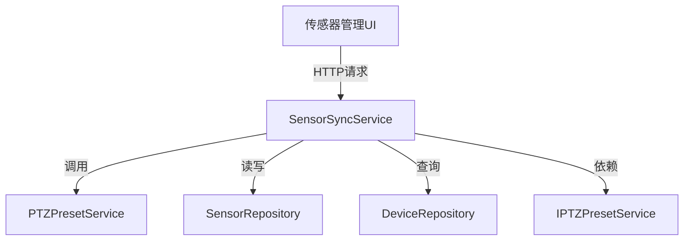

# SensorSyncService - 传感器同步服务

## 概述

SensorSyncService 负责 ISAPI 模块中的传感器/预置点位数据同步，提供从外部 ISAPI 接口获取预置点信息并同步到本地数据库的能力，支持单条和批量同步操作。

**位置**：`module/isapi/ISAPI.Application/Services/SensorSyncService.cs`
**层**：Application
**模块**：isapi
**依赖注入**：Transient（ABP ApplicationService 默认）

---

## 架构位置



## 核心职责

1. **预置点位同步** - 从 NVR ISAPI 接口获取预置点列表并同步到传感器表
2. **批量数据管理** - 支持单条和批量传感器数据的创建、更新、删除
3. **数据一致性保证** - 通过设备验证和去重逻辑确保数据质量
4. **灵活覆盖策略** - 支持可配置的覆盖模式，保护已启用的传感器

## 关键接口

```csharp
// 同步单个传感器/预置点位
Task<SyncSensorResultDto> SyncSingleSensorAsync(SyncSensorDto sensor);

// 批量同步传感器/预置点位
Task<SyncSensorResultDto> BatchSyncSensorsAsync(BatchSyncSensorInputDto input);

// 从ISAPI接口同步预置点位
Task<SyncSensorResultDto> SyncPresetsFromISAPIAsync(string deviceId, int channelId = 1);

// 删除传感器/预置点位
Task<bool> DeleteSensorAsync(string deviceId, string sensorKey);
```

## 依赖注入配置

```csharp
public class SensorSyncService : ApplicationService, ISensorSyncService
{
    private readonly IRepository<SensorEntity, Guid> _sensorRepository;
    private readonly IRepository<DeviceEntity, string> _deviceRepository;
    private readonly IPTZPresetService _ptzPresetService;
    private readonly ILogger<SensorSyncService> _logger;
}
```

## 数据流

```
NVR 设备
  → PTZPresetService.GetPresetListFromNvrAsync()
    → 生成 SyncSensorDto 列表
      → SensorSyncService.BatchSyncSensorsAsync()
        → SensorRepository.InsertAsync/UpdateAsync
          → SensorEntity 数据表
```

## 重要方法

### `SyncSingleSensorAsync()`

**作用**：同步单个传感器/预置点位，支持创建新记录或更新现有记录

**关键逻辑**：
1. 验证设备存在性
2. 查找是否已存在相同 DeviceId + SensorKey 的传感器
3. 不存在则创建，存在则更新
4. 返回同步结果

**代码示例**：
```csharp
var existingSensor = await _sensorRepository.FindAsync(s =>
    s.DeviceId == sensor.DeviceId &&
    s.SensorKey == sensor.SensorKey);

if (existingSensor != null)
{
    // 更新现有传感器
    existingSensor.Name = sensor.Name;
    existingSensor.Type = (SensorTypeEnum)sensor.Type;
    await _sensorRepository.UpdateAsync(existingSensor);
}
else
{
    // 创建新传感器
    var newSensor = new SensorEntity { /* ... */ };
    await _sensorRepository.InsertAsync(newSensor);
}
```

### `BatchSyncSensorsAsync()`

**作用**：批量同步传感器，支持覆盖策略和已启用传感器保护

**关键逻辑**：
- 设备存在性验证
- 根据 `Overwrite` 标志决定是否更新已存在记录
- **保护机制**：已启用 (`IsEnabled=true`) 的传感器不会被覆盖
- 返回详细的成功/失败/跳过统计

**代码示例**：
```csharp
if (existingSensor != null && !input.Overwrite)
{
    result.SkippedCount++;
    continue;
}

if (existingSensor != null)
{
    // 如果传感器已启用，则跳过覆盖
    if (existingSensor.IsEnabled == true)
    {
        result.SkippedCount++;
        continue;
    }
    // 更新未启用的传感器
    await _sensorRepository.UpdateAsync(existingSensor);
}
```

### `SyncPresetsFromISAPIAsync()`

**作用**：从 ISAPI 接口同步预置点位到传感器表

**调用链**：
```
SyncPresetsFromISAPIAsync()
  → PTZPresetService.GetPresetListFromNvrAsync()
    → 生成 SyncSensorDto 列表（preset{Id} 作为 SensorKey）
      → BatchSyncSensorsAsync(Overwrite=true)
```

**数据映射**：
```csharp
var sensors = presetList.Presets.Select(preset => new SyncSensorDto
{
    SensorKey = $"preset{preset.Id}",
    DeviceId = deviceId,
    Name = preset.PresetName ?? $"预置点{preset.Id}",
    Type = 1, // 预置点位类型
    PresetNo = (short)preset.Id,
    Remark = $"从ISAPI同步的预置点{preset.Id}"
}).ToList();
```

### `DeleteSensorAsync()`

**作用**：删除传感器（软删除，设置 IsEnabled = true）

**注意**：代码中实际执行的是软删除操作，将 `IsEnabled` 设置为 `true` 而不是物理删除。

## DTO 结构

```csharp
public class SyncSensorDto
{
    public string SensorKey { get; set; }      // 传感器唯一标识
    public string DeviceId { get; set; }       // 所属设备ID
    public string Name { get; set; }          // 显示名称
    public int Type { get; set; }             // 0:传感器, 1:预置点位
    public int Status { get; set; }           // 0:正常, 1:异常
    public short? PresetNo { get; set; }      // 预置位号
    public string PresetFilePath { get; set; } // 预置位文件路径
    public string PresetPtz { get; set; }     // PTZ参数JSON
    public string Remark { get; set; }        // 详情描述
    public string ExtInfo { get; set; }       // 扩展参数
}

public class SyncSensorResultDto
{
    public int SuccessCount { get; set; }      // 成功数量
    public int FailedCount { get; set; }      // 失败数量
    public int SkippedCount { get; set; }     // 跳过数量
    public List<string> Errors { get; set; }  // 错误信息列表
    public List<Guid> SuccessIds { get; set; } // 成功的传感器ID列表
}
```

## 源码片段

### 批量同步核心逻辑

```csharp
// 文件路径: SensorSyncService.cs:121-211
public async Task<SyncSensorResultDto> BatchSyncSensorsAsync(BatchSyncSensorInputDto input)
{
    var result = new SyncSensorResultDto();

    foreach (var sensor in input.Sensors)
    {
        try
        {
            var device = await _deviceRepository.FindAsync(sensor.DeviceId);
            if (device == null)
            {
                result.FailedCount++;
                result.Errors.Add($"设备不存在: {sensor.DeviceId}");
                continue;
            }

            var existingSensor = await _sensorRepository.FindAsync(s =>
                s.DeviceId == sensor.DeviceId &&
                s.PresetNo == sensor.PresetNo);

            // 保护已启用的传感器
            if (existingSensor?.IsEnabled == true)
            {
                result.SkippedCount++;
                continue;
            }

            // 创建或更新传感器...
        }
        catch (Exception ex)
        {
            result.FailedCount++;
            result.Errors.Add($"同步传感器失败: {ex.Message}");
        }
    }

    return result;
}
```

## 错误处理

1. **设备不存在** - 跳过该传感器并记录错误
2. **数据库操作异常** - 记录错误日志，继续处理下一条
3. **日志记录** - 使用 ILogger 记录详细的操作日志和异常信息

## 相关组件

- [[PTZPresetService]] - 预置点位管理服务
- [[DeviceRepository]] - 设备数据仓储
- [[SensorRepository]] - 传感器数据仓储
- [[SensorEntity]] - 传感器领域实体
- [[PTZPresetList]] - 预置点列表实体

## 使用场景

1. **设备初始化** - 新增设备后从 NVR 同步预置点到传感器表
2. **批量巡检配置** - 快速创建多个预置点位对应的传感器
3. **手动同步** - 用户触发的单条或批量数据同步

## 注意事项

- 已启用 (`IsEnabled=true`) 的传感器在批量同步时会被跳过，防止覆盖运行时配置
- 传感器删除实际是软删除（设置 `IsEnabled=true`）
- 同步操作不会自动启用传感器，需手动设置 `IsEnabled=true`

---
**状态**：🟢 已完成
