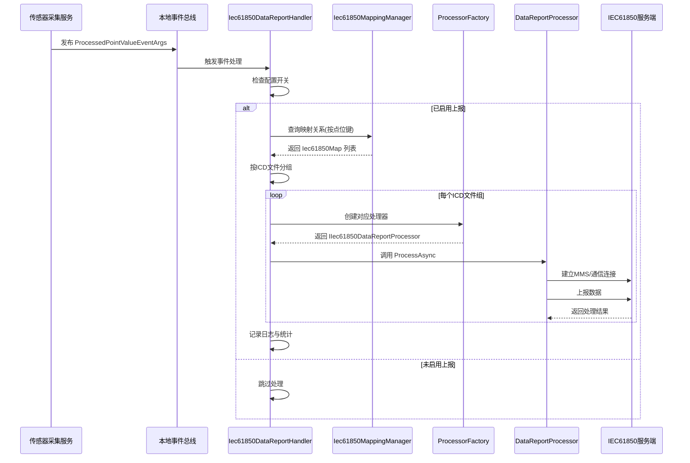

# IEC61850数据上报流程

## 流程概述

描述从传感器数据采集完成到上报至IEC61850服务端的完整数据流转过程。

**触发方式**：传感器数据处理完成后发布本地事件

---

## 完整流程图



---

## 详细步骤

### 步骤 1：传感器数据采集完成

**负责组件**：传感器采集服务

**操作**：
1. 从边缘设备/传感器采集原始数据
2. 数据清洗与格式转换
3. 发布 `ProcessedPointValueEventArgs` 事件

**输入**：传感器原始数据

**输出**：`ProcessedPointValueEventArgs` 本地事件

---

### 步骤 2：事件监听与配置检查

**负责组件**：[[Iec61850DataReportHandler]]

**操作**：
1. 监听 `ProcessedPointValueEventArgs` 本地事件
2. 检查 `Iec61850Options.EnableDataReport` 配置
3. 验证事件数据有效性

**配置检查**：
```csharp
if (!_options.Value.EnableDataReport || eventData.Data?.PointVals?.Any() != true)
    return;
```

---

### 步骤 3：映射关系查询

**负责组件**：[[Iec61850MappingManager]]

**操作**：
1. 为每个点位值构造映射键：`device_id|sensor_key|property`
2. 从内存映射字典查询 IEC61850 映射关系
3. 构造上报上下文 `IecContext`

**映射键示例**：
```
"device-001|temperature|current"
"device-002|voltage|phase_a"
```

**映射信息包含**：
- PointKey：点位键
- Reference：61850 对象引用
- Host：61850 服务器地址
- IcdFileName：ICD 模型文件名
- DataType：数据类型

---

### 步骤 4：按ICD文件分组

**负责组件**：[[Iec61850DataReportHandler]]

**操作**：
1. 按 `IecContext.IcdFileName` 分组
2. 每个分组对应一个 IEC61850 服务器
3. 准备并行处理

**分组示例**：
```csharp
var groups = contexts.GroupBy(c => c.IcdFileName);
// 结果:
//   Group 1: IcdFile = "GISSF60_104.icd", Count = 15
//   Group 2: IcdFile = "OtherDevice.icd", Count = 8
```

---

### 步骤 5：创建数据处理器

**负责组件**：[[Iec61850ProcessorFactory]]

**操作**：
1. 根据 ICD 文件名查找处理器配置
2. 通过反射动态创建处理器实例
3. 返回 `IIec61850DataReportProcessor` 接口

**处理器创建逻辑**：
```csharp
var processorTypeName = $"Ast.IntelliSub.Application.Processors.{config.Processor}";
var processorType = Type.GetType(processorTypeName);
var processor = _serviceProvider.GetService(processorType) as IIec61850DataReportProcessor;
```

---

### 步骤 6：并行数据上报

**负责组件**：具体的数据处理器实现 (如 `GISSF60DataReportProcessor`)

**操作**：
1. 建立与61850服务端的MMS通信连接
2. 构造IEC61850数据报文
3. 发送数据到服务端
4. 处理响应与异常

**并行处理**：
```csharp
var tasks = groups.Select(async group =>
{
    var processor = _processorFactory.CreateProcessor(group.Key);
    await processor.ProcessAsync(group.ToList());
});
await Task.WhenAll(tasks);
```

---

## 数据流向

```
传感器数据采集
  ↓
[ProcessedPointValueEventArgs] - 本地事件发布
  ↓
[Iec61850DataReportHandler] - 事件处理
  ↓
[Iec61850MappingManager] - 映射查询
  ↓
[按ICD文件分组] - 分组处理
  ↓
[Iec61850ProcessorFactory] - 创建处理器
  ↓
[IIec61850DataReportProcessor] - 实际上报
  ↓
IEC61850服务端
```

## 涉及的API端点

本流程是内部事件驱动，不涉及 HTTP API 端点

## 涉及的实体

| 实体/类 | 作用 | 说明 |
|------|------|------|
| ProcessedPointValueEventArgs | 事件参数 | 处理后的传感器数据点值 |
| IecContext | 上报上下文 | 包含映射信息和实际值 |
| Iec61850Map | 映射实体 | 点位键到61850对象的映射 |
| Iec61850Options | 配置选项 | IEC61850 功能配置 |

## 错误处理

### 常见错误

| 错误 | 原因 | 处理 |
|------|------|------|
| MappingNotFound | 映射关系未配置 | 跳过该点位，记录日志 |
| ProcessorNotFound | 处理器类型未找到 | 抛出 UserFriendlyException |
| ReportFailed | 上报失败 | 记录日志，不影响其他分组 |

### 异常处理逻辑

```csharp
try
{
    var processor = _processorFactory.CreateProcessor(group.Key);
    await processor.ProcessAsync(group.ToList());
}
catch (Exception ex)
{
    _logger.LogError(ex, "处理61850数据上报失败: IcdFile={IcdFile}", group.Key);
    // 继续处理其他分组，不中断整个流程
}
```

## 性能考虑

- **并行处理**：多服务器并行上报，提高吞吐量
- **内存映射**：映射关系缓存在内存中（ConcurrentDictionary）
- **批量处理**：支持配置批量大小和时间间隔
- **异步处理**：全程使用 async/await 避免阻塞

### 优化建议

1. 使用消息队列解耦事件发布与处理
2. 实现上报失败重试机制
3. 添加上报数据缓存，支持断线续传
4. 监控上报延迟和成功率

---

## 配置与初始化

### 映射关系初始化

系统启动时，`Iec61850MappingManager` 自动从 ICD 文件加载映射关系：

```csharp
public async Task InitializeAsync()
{
    foreach (var config in _options.Value.ModelFiles.Where(c => c.Enabled))
    {
        var icdFilePath = Path.Combine(modelFileDirectory, config.ModelFile);
        var maps = await _icdFileParser.ParseAsync(icdFilePath, config.Host);
        
        foreach (var map in maps)
        {
            _mappings.TryAdd(map.PointKey, map);
        }
    }
}
```

### 配置示例

```json
{
  "Iec61850": {
    "EnableDataReport": true,
    "ModelFileDirectory": "Iec61850",
    "BatchSize": 100,
    "BatchIntervalMs": 1000,
    "ModelFiles": [
      {
        "ModelFile": "GISSF60_104.icd",
        "Processor": "GISSF60DataReportProcessor",
        "Host": "192.168.1.100",
        "Enabled": true
      }
    ]
  }
}
```

## 相关流程

- [[传感器数据采集流程]] - 数据如何被采集
- [[IEC61850告警上报流程]] - 告警数据上报
- [[映射关系初始化流程]] - 映射关系如何加载

---

## 实现细节

### 关键代码

#### 事件处理入口
```csharp
public async Task HandleEventAsync(ProcessedPointValueEventArgs eventData)
{
    if (!_options.Value.EnableDataReport || eventData.Data?.PointVals?.Any() != true)
        return;

    var contexts = new List<IecContext>();

    foreach (var pointValue in eventData.Data.PointVals)
    {
        var pointKey = $"{pointValue.DeviceId}|{pointValue.SensorKey}|{pointValue.Property}";
        var mapping = _mappingManager.GetMapping(pointKey);

        if (mapping != null)
        {
            contexts.Add(new IecContext { /* ... */ });
        }
    }

    var groups = contexts.GroupBy(c => c.IcdFileName);
    var tasks = groups.Select(async group =>
    {
        var processor = _processorFactory.CreateProcessor(group.Key);
        await processor.ProcessAsync(group.ToList());
    });
    await Task.WhenAll(tasks);
}
```

#### 映射查询
```csharp
public Iec61850Map? GetMapping(string pointKey)
{
    _mappings.TryGetValue(pointKey, out var mapping);
    return mapping;
}
```

## 学习笔记

### 理解要点

1. **事件驱动架构**：使用 ABP 本地事件总线实现松耦合
2. **动态处理器创建**：通过反射和 DI 实现处理器工厂模式
3. **并行处理策略**：按 ICD 文件分组并行上报，提高性能
4. **映射关系缓存**：使用 ConcurrentDictionary 实现线程安全的内存缓存

### 疑问

- 映射关系变更时如何通知所有实例刷新？
- 上报失败是否需要持久化到队列？
- 如何实现上报数据的时序一致性？

---
**状态**：🟡 学习中
