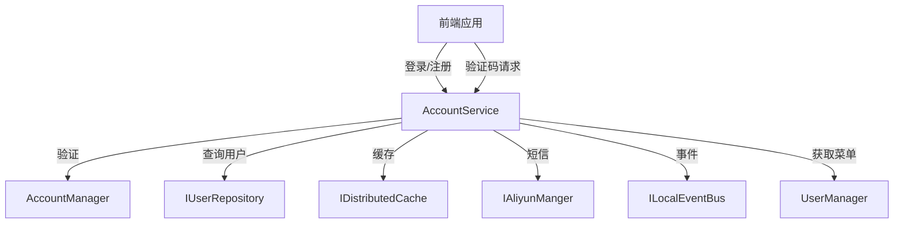

# AccountService

## 概述

AccountService 是账号认证的核心服务，负责用户登录、注册、密码管理、验证码生成等核心认证功能。该服务集成了图形验证码、短信验证码、JWT Token 生成和刷新等功能。

**位置**：`module/rbac/Yi.Framework.Rbac.Application/Services/AccountService.cs`
**层**：Application
**模块**：rbac
**依赖注入**：Scoped（继承自 ApplicationService）

---

## 架构位置



## 核心职责

1. 处理用户登录（用户名密码）
2. 处理用户注册（支持手机号验证）
3. 管理密码（重置、更新、找回）
4. 生成和管理验证码（图形验证码、短信验证码）
5. JWT Token 生成和刷新
6. 获取用户信息和路由菜单

## 关键接口

```csharp
// 用户登录
[AllowAnonymous]
[OperLog("用户登录", OperEnum.Login)]
public async Task<LoginOutputDto> PostLoginAsync(LoginInputVo input);

// 用户注册
[AllowAnonymous]
[UnitOfWork]
[OperLog("用户注册", OperEnum.Insert)]
public async Task PostRegisterAsync(RegisterDto input);

// 刷新 Token
[Authorize(AuthenticationSchemes = TokenTypeConst.Refresh)]
public async Task<object> PostRefreshAsync([FromQuery] string refresh_token);

// 获取当前用户信息
[Route("account")]
[Authorize]
public async Task<UserRoleMenuDto> GetAsync();

// 获取前端路由
[Authorize]
[Route("account/Vue3Router/{routerType?}")]
public async Task<object> GetVue3Router([FromRoute] string? routerType);

// 生成图形验证码
[AllowAnonymous]
public async Task<CaptchaImageDto> GetCaptchaImageAsync();

// 发送短信验证码
[HttpPost("account/captcha-phone")]
[AllowAnonymous]
public async Task<object> PostCaptchaPhoneForRegisterAsync(PhoneCaptchaImageDto input);

// 找回密码
[AllowAnonymous]
[UnitOfWork]
public async Task<string> PostRetrievePasswordAsync(RetrievePasswordDto input);

// 更新密码
[OperLog("更新密码", OperEnum.Update)]
public async Task<bool> UpdatePasswordAsync(UpdatePasswordDto input);

// 重置密码（管理员）
[HttpPut]
[OperLog("重置密码", OperEnum.Update)]
public async Task<bool> RestPasswordAsync(Guid userId, RestPasswordDto input);

// 退出登录
public async Task<bool> PostLogout();
```

## 依赖注入配置

```csharp
// AccountService 的核心依赖
public AccountService(
    IUserRepository userRepository,
    ICurrentUser currentUser,
    IAccountManager accountManager,
    ISqlSugarRepository<MenuAggregateRoot> menuRepository,
    IDistributedCache<CaptchaPhoneCacheItem, CaptchaPhoneCacheKey> phoneCache,
    IDistributedCache<UserInfoCacheItem, UserInfoCacheKey> userCache,
    ICaptcha captcha,
    IGuidGenerator guidGenerator,
    IOptions<RbacOptions> options,
    IAliyunManger aliyunManger,
    UserManager userManager,
    IHttpContextAccessor httpContextAccessor,
    ISqlSugarRepository<UserRoleEntity> userRole,
    ISqlSugarRepository<RoleAggregateRoot> role)
```

## 数据流

```
登录请求
  → AccountService.PostLoginAsync()
    → ValidationImageCaptcha() - 验证图形验证码
      → AccountManager.LoginValidationAsync() - 验证用户名密码
        → PostLoginAsync(userId) - 生成 Token
          → AccountManager.GetTokenByUserIdAsync() - 获取 JWT
            → LocalEventBus.PublishAsync() - 发布登录事件
              → 返回 LoginOutputDto
```

## 重要方法

### `PostLoginAsync()`

**作用**：处理用户登录，验证用户名密码和图形验证码，生成 JWT Token

**调用链**：
```
前端登录请求
  → AccountService.PostLoginAsync()
    → ValidationImageCaptcha() - 验证图形验证码
      → AccountManager.LoginValidationAsync() - 验证用户名密码
        → PostLoginAsync(userId) - 生成 Token
          → AccountManager.GetTokenByUserIdAsync() - 生成 JWT
            → LocalEventBus.PublishAsync() - 发布登录事件
```

**返回**：`LoginOutputDto` 包含 Token、RefreshToken、UserName

### `PostRegisterAsync()`

**作用**：处理用户注册，支持手机号验证码验证

**流程**：
1. 检查系统是否开放注册功能（`EnableRegister` 配置）
2. 验证手机号格式
3. 验证账号名称不能以 `ls_` 开头（临时账号前缀）
4. 验证短信验证码
5. 调用 `AccountManager.RegisterAsync()` 创建用户

### `GetCaptchaImageAsync()`

**作用**：生成图形验证码，用于登录和注册

**实现**：
```csharp
[AllowAnonymous]
public async Task<CaptchaImageDto> GetCaptchaImageAsync()
{
    var uuid = _guidGenerator.Create();
    var captcha = _captcha.Generate(uuid.ToString());
    var enableCaptcha = _rbacOptions.EnableCaptcha;
    return new CaptchaImageDto { Img = captcha.Bytes, Uuid = uuid, IsEnableCaptcha = enableCaptcha };
}
```

### `PostCaptchaPhoneForRegisterAsync()`

**作用**：发送注册短信验证码

**验证流程**：
1. 验证图形验证码
2. 验证手机号格式
3. 检查手机号是否已被注册
4. 防暴刷检查（10分钟内不能重复发送）
5. 调用阿里云短信服务发送验证码
6. 将验证码存储到 Redis 缓存（10分钟过期）

### `GetVue3Router()`

**作用**：根据用户权限生成前端路由（支持 Ruoyi 和 Pure 两种前端框架）

**路由类型**：
- `ruoyi` 或空：若依前端框架路由
- `pure`：Pure 管理后台框架路由

**特殊处理**：
- 超级管理员（`admin`）返回全部菜单路由
- 包含"管理员"的角色返回全部菜单路由
- 普通用户返回根据权限过滤的菜单路由

## 源码片段

### 关键实现 - 登录流程

```csharp
// 文件路径: module/rbac/Yi.Framework.Rbac.Application/Services/AccountService.cs:105-122
[AllowAnonymous]
[OperLog("用户登录", OperEnum.Login)]
public async Task<LoginOutputDto> PostLoginAsync(LoginInputVo input)
{
    if (string.IsNullOrEmpty(input.Password) || string.IsNullOrEmpty(input.UserName))
    {
        throw new UserFriendlyException("请输入合理数据！");
    }

    //校验验证码
    ValidationImageCaptcha(input.Uuid, input.Code);

    UserAggregateRoot user = new();
    //校验
    await _accountManager.LoginValidationAsync(input.UserName, input.Password, x => user = x);

    return await PostLoginAsync(user.Id);
}
```

### 关键实现 - 短信验证码发送

```csharp
// 文件路径: module/rbac/Yi.Framework.Rbac.Application/Services/AccountService.cs:230-267
[RemoteService(isEnabled: false)]
private async Task<object> PostCaptchaPhoneAsync(ValidationPhoneTypeEnum validationPhoneType,
    PhoneCaptchaImageDto input)
{
    //验证uuid 和 验证码
    ValidationImageCaptcha(input.Uuid, input.Code);

    await ValidationPhone(input.Phone);

    if (validationPhoneType == ValidationPhoneTypeEnum.Register &&
        await _userRepository.IsAnyAsync(x => x.Phone.ToString() == input.Phone))
    {
        throw new UserFriendlyException("该手机号已被注册！");
    }

    var value = await _phoneCache.GetAsync(new CaptchaPhoneCacheKey(validationPhoneType, input.Phone));

    //防止暴刷
    if (value is not null)
    {
        throw new UserFriendlyException($"{input.Phone}已发送过验证码，10分钟后可重试");
    }

    //生成一个4位数的验证码
    var code = Guid.NewGuid().ToString().Substring(0, 4);
    var uuid = Guid.NewGuid();
    await _aliyunManger.SendSmsAsync(input.Phone, code);

    await _phoneCache.SetAsync(new CaptchaPhoneCacheKey(validationPhoneType, input.Phone),
        new CaptchaPhoneCacheItem(code),
        new DistributedCacheEntryOptions { SlidingExpiration = TimeSpan.FromMinutes(10) });
    return new { Uuid = uuid };
}
```

## 权限控制

```csharp
// 匿名访问
[AllowAnonymous]
public async Task<LoginOutputDto> PostLoginAsync(LoginInputVo input);

// 匿名访问
[AllowAnonymous]
public async Task PostRegisterAsync(RegisterDto input);

// 需要认证
[Authorize]
public async Task<UserRoleMenuDto> GetAsync();

// 刷新 Token 使用独立的认证方案
[Authorize(AuthenticationSchemes = TokenTypeConst.Refresh)]
public async Task<object> PostRefreshAsync([FromQuery] string refresh_token);
```

## 配置选项

AccountService 依赖 `RbacOptions` 配置：

```json
{
  "RbacOptions": {
    "EnableCaptcha": true,           // 是否启用图形验证码
    "EnableRegister": true,           // 是否开放注册功能
    "JwtSecret": "your-secret-key",
    "JwtExpireMinutes": 120,
    "RefreshTokenExpireDays": 7
  }
}
```

## 缓存策略

1. **验证码缓存**：
   - 图形验证码：内存缓存（Lazy.Captcha）
   - 短信验证码：Redis 分布式缓存，10分钟过期

2. **用户信息缓存**：
   - `UserInfoCacheItem`：存储用户的角色和菜单信息，减少数据库查询

## 事件发布

登录时发布 `LoginEventArgs` 事件：

```csharp
// 文件路径: module/rbac/Yi.Framework.Rbac.Application/Services/AccountService.cs:138-145
var loginEntity = new LoginLogAggregateRoot().GetInfoByHttpContext(_httpContextAccessor.HttpContext);
var loginEto = loginEntity.Adapt<LoginEventArgs>();
loginEto.UserName = userInfo.User.UserName;
loginEto.UserId = userInfo.User.Id;
await LocalEventBus.PublishAsync(loginEto);
```

## 相关组件

- [[AccountManager]] - 账号领域管理器，处理认证逻辑
- [[UserManager]] - 用户管理器，获取用户完整信息
- [[IAccountService]] - 服务接口定义
- [[LoginLogService]] - 登录日志服务，处理登录事件
- [[AuthService]] - 第三方 OAuth 认证服务

## 业务规则

1. **账号命名规则**：
   - 注册账号不能以 `ls_` 开头（保留给临时账号）
   - 用户名必须唯一

2. **验证码规则**：
   - 短信验证码为 4 位随机字符
   - 短信验证码 10 分钟内不能重复发送
   - 图形验证码验证后立即失效

3. **Token 规则**：
   - JWT Token 默认有效期 2 小时
   - Refresh Token 默认有效期 7 天
   - 刷新 Token 时会生成新的 Access Token 和 Refresh Token

4. **登出处理**：
   - JWT 采用去中心化设计，登出时只需清除用户信息缓存
   - Token 仍然有效直到过期，但缓存清除后会重新验证用户信息

## 学习笔记

### 难点理解

1. **双重验证码机制**：先验证图形验证码，再发送短信验证码，防止短信接口被滥用
2. **Token 刷新机制**：使用独立的 Refresh 认证方案，与主 JWT 分离
3. **路由生成**：根据用户角色和权限动态生成前端路由，支持多种前端框架

### 疑问

- 如何扩展支持更多短信服务商（当前仅支持阿里云）？
- 临时账号（ls_）的具体使用场景是什么？

## 参考资料

- [ABP Framework 认证文档](https://docs.abp.io/en/abp/latest/Authentication)
- [Lazy.Captcha 验证码库](https://github.com/pjbilling/Lazy.Captcha)
- 项目源码：`module/rbac/Yi.Framework.Rbac.Application/Services/AccountService.cs`

---
**状态**：✅ 完成
