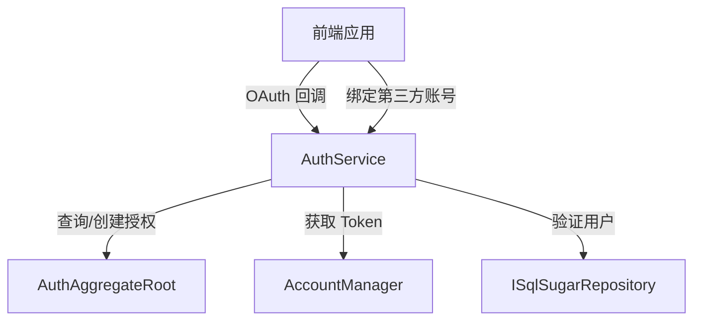

# AuthService

## 概述

AuthService 是第三方 OAuth 授权的核心服务，处理用户的第三方登录绑定、授权管理等功能。该服务支持 QQ、Gitee 等第三方 OAuth 提供商的集成。

**位置**：`module/rbac/Yi.Framework.Rbac.Application/Services/Authentication/AuthService.cs`
**层**：Application
**模块**：rbac
**依赖注入**：Scoped（继承自 YiCrudAppService）

---

## 架构位置



## 核心职责

1. 处理第三方 OAuth 登录流程（QQ、Gitee）
2. 管理用户与第三方账号的绑定关系
3. 验证第三方授权信息
4. 查询用户已绑定的授权列表

## 关键接口

```csharp
// 第三方 OAuth 登录
[HttpGet("auth/oauth/login/{scheme}")]
public async Task<object> AuthOauthLoginAsync([FromRoute] string scheme, [FromQuery] string code);

// 绑定第三方账号
[HttpPost("auth/oauth/bind/{scheme}")]
[Authorize]
public async Task AuthOauthBindAsync([FromRoute] string scheme, [FromQuery] string code);

// 获取当前账户的授权信息
[Authorize]
public async Task<IReadOnlyList<AuthOutputDto>> GetListAccountAsync(AuthGetListInput input);

// 尝试获取授权信息（内部使用）
public async Task<AuthOutputDto?> TryGetAuthInfoAsync(string? openId, string authType, Guid? userId = null);

// 删除第三方授权
public override Task DeleteAsync(IEnumerable<Guid> id);
```

## 依赖注入配置

```csharp
// 在模块类中的配置（通过 YiCrudAppService 基类自动注册）
public override void ConfigureServices(ServiceConfigurationContext context)
{
    // AuthService 作为 Application Service 自动注册
    // 依赖项：IHttpContextAccessor, ILogger, ISqlSugarRepository, IAccountManager
}
```

## 数据流

```
OAuth 回调
  → AuthService.AuthOauthLoginAsync()
    → 从 HttpContext 获取 OpenId
      → 查询 AuthAggregateRoot
        → AccountManager.GetTokenByUserIdAsync()
          → 返回 JWT Token
```

## 重要方法

### `AuthOauthLoginAsync()`

**作用**：处理第三方 OAuth 登录，根据 scheme 和 code 获取 OpenId，查找已绑定的授权记录并生成 JWT Token

**调用链**：
```
前端 OAuth 回调
  → AuthService.AuthOauthLoginAsync()
    → GetOpenIdAndNameAsync() - 从 HttpContext 获取 OpenId
      → ISqlSugarRepository.GetAsync() - 查询授权记录
        → AccountManager.GetTokenByUserIdAsync() - 生成 JWT
```

**流程**：
1. 从 HttpContext AuthenticateAsync 获取 OpenId
2. 根据 OpenId 和 AuthType 查询数据库
3. 如果未绑定，抛出友好异常
4. 如果已绑定，通过 AccountManager 获取 JWT Token

### `AuthOauthBindAsync()`

**作用**：将已登录用户的账号与第三方账号绑定

**调用链**：
```
用户请求绑定
  → AuthService.AuthOauthBindAsync()
    → GetOpenIdAndNameAsync() - 获取第三方 OpenId
      → ISqlSugarRepository.IsAnyAsync() - 检查是否已被绑定
        → ISqlSugarRepository.InsertAsync() - 创建绑定记录
```

**验证逻辑**：
- 检查第三方账号是否已被其他用户绑定
- 一个用户对一个 AuthType 只能绑定一个第三方账号

### `GetOpenIdAndNameAsync()`

**作用**：从 HttpContext 的认证结果中提取 OpenId 和名称

**实现**：
```csharp
private async Task<(string, string)> GetOpenIdAndNameAsync(string scheme)
{
    var authenticateResult = await HttpContext.AuthenticateAsync(scheme);
    if (!authenticateResult.Succeeded)
    {
        throw new UserFriendlyException(authenticateResult.Failure.Message);
    }

    var openidClaim = authenticateResult.Principal.Claims.Where(x => x.Type == "urn:openid").FirstOrDefault();
    var nameClaim = authenticateResult.Principal.Claims.Where(x => x.Type == "urn:name").FirstOrDefault();
    return (openidClaim.Value, nameClaim.Value);
}
```

## 权限控制

```csharp
// 登录接口允许匿名访问
[HttpGet("auth/oauth/login/{scheme}")]
public async Task<object> AuthOauthLoginAsync([FromRoute] string scheme, [FromQuery] string code);

// 绑定接口需要认证
[HttpPost("auth/oauth/bind/{scheme}")]
[Authorize]
public async Task AuthOauthBindAsync([FromRoute] string scheme, [FromQuery] string code);

// 查询接口需要认证
[Authorize]
public async Task<IReadOnlyList<AuthOutputDto>> GetListAccountAsync(AuthGetListInput input);
```

## 源码片段

### 关键实现

```csharp
// 文件路径: module/rbac/Yi.Framework.Rbac.Application/Services/Authentication/AuthService.cs:49-62
/// <summary>
/// 第三方oauth登录
/// </summary>
[HttpGet("auth/oauth/login/{scheme}")]
public async Task<object> AuthOauthLoginAsync([FromRoute] string scheme, [FromQuery] string code)
{
    (var openId, var _) = await GetOpenIdAndNameAsync(scheme);
    var authEntity = await _repository.GetAsync(x => x.OpenId == openId && x.AuthType == scheme);

    if (authEntity is null)
    {
        throw new UserFriendlyException("第三方登录失败，请先注册后，在个人中心进行绑定该第三方后使用");
    }

    var accessToken = await _accountManager.GetTokenByUserIdAsync(authEntity.UserId);
    return new { token = accessToken };
}
```

## 相关组件

- [[AccountService]] - 主账号服务，提供 JWT Token 生成
- [[AuthAggregateRoot]] - 授权聚合根实体
- [[AccountManager]] - 账号管理器，处理 Token 生成
- [[IAuthService]] - 服务接口定义

## OAuth 提供商支持

系统支持的 OAuth 提供商在 `appsettings.json` 中配置：

```json
{
  "Authentication": {
    "QQ": {
      "ClientId": "your-client-id",
      "ClientSecret": "your-client-secret"
    },
    "Gitee": {
      "ClientId": "your-client-id",
      "ClientSecret": "your-client-secret"
    }
  }
}
```

## 业务规则

1. **唯一绑定规则**：一个用户对一个 AuthType 只能绑定一个第三方账号
2. **唯一 OpenId**：一个第三方账号（OpenId）只能被一个用户绑定
3. **先注册后绑定**：用户需要先注册账号，然后在个人中心绑定第三方账号
4. **解绑功能**：用户可以删除已绑定的第三方授权

## 学习笔记

### 难点理解

1. **Claims 处理**：OAuth 认证结果中的 Claims 类型（`urn:openid`、`urn:name`）需要与中间件配置一致
2. **双唯一约束**：需要同时检查 UserId 和 OpenId 的唯一性，避免重复绑定

### 疑问

- 如何扩展支持更多的 OAuth 提供商？
- OAuth 回调的 code 参数在 Swagger 中的处理方式

## 参考资料

- [ABP Framework 认证文档](https://docs.abp.io/en/abp/latest/Authentication)
- [ASP.NET Core OAuth](https://docs.microsoft.com/en-us/aspnet/core/security/authentication/social/)
- 项目源码：`module/rbac/Yi.Framework.Rbac.Application/Services/Authentication/AuthService.cs`

---
**状态**：✅ 完成
