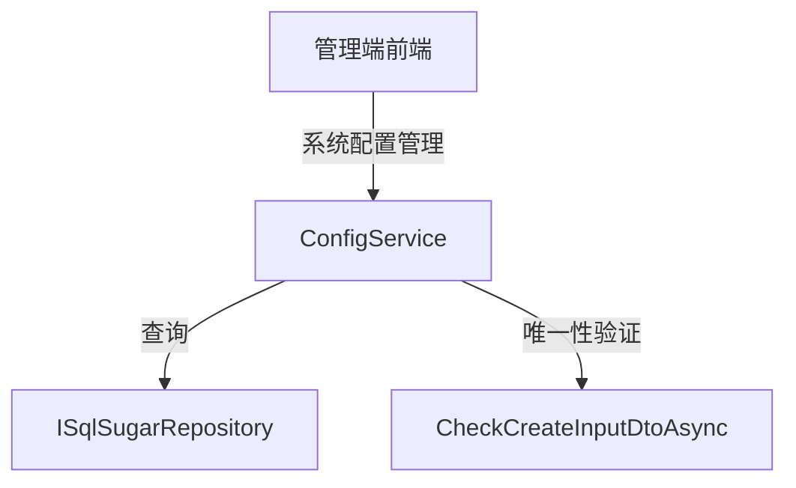

# ConfigService

## 概述

ConfigService 是系统配置管理的核心服务，提供系统参数的 CRUD 操作。系统配置用于存储系统的运行参数、开关配置等动态配置信息。

**位置**：`module/rbac/Yi.Framework.Rbac.Application/Services/ConfigService.cs`
**层**：Application
**模块**：rbac
**依赖注入**：Scoped（继承自 YiCrudAppService）

---

## 架构位置



## 核心职责

1. 系统配置 CRUD 操作（创建、查询、更新、删除）
2. 配置键值对管理
3. 配置唯一性验证

## 关键接口

```csharp
// 查询配置列表
public override async Task<PagedResultDto<ConfigGetListOutputDto>> GetListAsync(ConfigGetListInputVo input);

// 创建配置
[OperLog("添加配置", OperEnum.Insert)]
public override Task<ConfigGetOutputDto> CreateAsync(ConfigCreateInputVo input);

// 更新配置
[OperLog("更新配置", OperEnum.Update)]
public override Task<ConfigGetOutputDto> UpdateAsync(Guid id, ConfigUpdateInputVo input);

// 删除配置
[OperLog("删除配置", OperEnum.Delete)]
public override Task DeleteAsync(IEnumerable<Guid> id);
```

## 依赖注入配置

```csharp
// ConfigService 的核心依赖
public ConfigService(ISqlSugarRepository<ConfigAggregateRoot, Guid> repository) : base(repository)
{
    _repository = repository;
}
```

## 数据流

```
创建系统配置
  → ConfigService.CreateAsync()
    → CheckCreateInputDtoAsync() - 验证配置键唯一性
      → MapToEntityAsync() - DTO 映射
        → ISqlSugarRepository.InsertAsync() - 插入数据库
          → MapToGetOutputDtoAsync() - 返回结果
```

## 重要方法

### `GetListAsync()`

**作用**：查询系统配置列表，支持多条件过滤

**查询条件**：
- `ConfigKey`：配置键模糊查询
- `ConfigName`：配置名称模糊查询
- `StartTime` / `EndTime`：创建时间范围

### `CheckCreateInputDtoAsync()`

**作用**：创建时验证配置键和配置名称的唯一性

**实现**：
```csharp
protected override async Task CheckCreateInputDtoAsync(ConfigCreateInputVo input)
{
    var isExist =
        await _repository.IsAnyAsync(x => x.ConfigKey == input.ConfigKey || x.ConfigName == input.ConfigName);
    if (isExist)
    {
        throw new UserFriendlyException(ConfigConst.Exist);
    }
}
```

### `CheckUpdateInputDtoAsync()`

**作用**：更新时验证配置键和配置名称的唯一性（排除自身）

**实现**：
```csharp
protected override async Task CheckUpdateInputDtoAsync(ConfigAggregateRoot entity, ConfigUpdateInputVo input)
{
    var isExist = await _repository._DbQueryable.Where(x => x.Id != entity.Id)
        .AnyAsync(x => x.ConfigKey == input.ConfigKey || x.ConfigName == input.ConfigName);
    if (isExist)
    {
        throw new UserFriendlyException(ConfigConst.Exist);
    }
}
```

## 源码片段

### 关键实现 - 配置列表查询

```csharp
// 文件路径: module/rbac/Yi.Framework.Rbac.Application/Services/ConfigService.cs:33-44
public override async Task<PagedResultDto<ConfigGetListOutputDto>> GetListAsync(ConfigGetListInputVo input)
{
    RefAsync<int> total = 0;

    var entities = await _repository._DbQueryable.WhereIF(!string.IsNullOrEmpty(input.ConfigKey),
            x => x.ConfigKey.Contains(input.ConfigKey!))
        .WhereIF(!string.IsNullOrEmpty(input.ConfigName), x => x.ConfigName!.Contains(input.ConfigName!))
        .WhereIF(input.StartTime is not null && input.EndTime is not null,
            x => x.CreationTime >= input.StartTime && x.CreationTime <= input.EndTime)
        .ToPageListAsync(input.SkipCount, input.MaxResultCount, total);
    return new PagedResultDto<ConfigGetListOutputDto>(total, await MapToGetListOutputDtosAsync(entities));
}
```

### 关键实现 - 创建唯一性验证

```csharp
// 文件路径: module/rbac/Yi.Framework.Rbac.Application/Services/ConfigService.cs:46-54
protected override async Task CheckCreateInputDtoAsync(ConfigCreateInputVo input)
{
    var isExist =
        await _repository.IsAnyAsync(x => x.ConfigKey == input.ConfigKey || x.ConfigName == input.ConfigName);
    if (isExist)
    {
        throw new UserFriendlyException(ConfigConst.Exist);
    }
}
```

## 权限控制

```csharp
// 所有操作都需要操作日志记录
[OperLog("添加配置", OperEnum.Insert)]
public override Task<ConfigGetOutputDto> CreateAsync(ConfigCreateInputVo input);

[OperLog("更新配置", OperEnum.Update)]
public override Task<ConfigGetOutputDto> UpdateAsync(Guid id, ConfigUpdateInputVo input);

[OperLog("删除配置", OperEnum.Delete)]
public override Task DeleteAsync(IEnumerable<Guid> id);
```

## 相关组件

- [[ConfigAggregateRoot]] - 配置聚合根实体
- [[RbacOptions]] - RBAC 模块配置选项

## 业务规则

1. **配置唯一性**：
   - 配置键（`ConfigKey`）必须唯一
   - 配置名称（`ConfigName`）必须唯一

2. **配置结构**：
   - `ConfigKey`：配置键（如 `sys.user.initPassword`）
   - `ConfigName`：配置名称（如 `用户初始密码`）
   - `ConfigValue`：配置值
   - `ConfigType`：配置类型（字符串、数字、布尔等）

## 常见系统配置

系统预定义的配置项：

| 配置键 | 配置名称 | 说明 |
|-------|---------|------|
| `sys.user.initPassword` | 用户初始密码 | 新用户默认密码 |
| `sys.user.registerEnabled` | 开启注册功能 | 是否允许用户自主注册 |
| `sys.upload.maxFileSize` | 上传文件大小限制 | 最大上传文件大小（MB） |
| `sys.upload.allowedExtensions` | 允许上传的文件类型 | 允许的文件扩展名列表 |

## 配置与 appsettings.json 的区别

| 特性 | ConfigService | appsettings.json |
|-----|---------------|------------------|
| 存储位置 | 数据库 | 配置文件 |
| 修改方式 | 运行时修改 | 需要重启应用 |
| 适用场景 | 动态配置、用户配置 | 系统级静态配置 |
| 优先级 | 可覆盖静态配置 | 基础配置 |

## 学习笔记

### 难点理解

1. **双重唯一性约束**：配置键和配置名称都必须唯一
2. **配置层次设计**：使用点号分隔的层级结构（如 `sys.user.initPassword`）

### 疑问

- 配置变更后如何通知应用层？
- 是否支持配置的加密存储？

## 参考资料

- [ABP Framework 设置管理](https://docs.abp.io/en/ab/latest/Settings)
- [ASP.NET Core 配置模式](https://docs.microsoft.com/en-us/aspnet/core/fundamentals/configuration/)
- 项目源码：`module/rbac/Yi.Framework.Rbac.Application/Services/ConfigService.cs`

---
**状态**：✅ 完成
