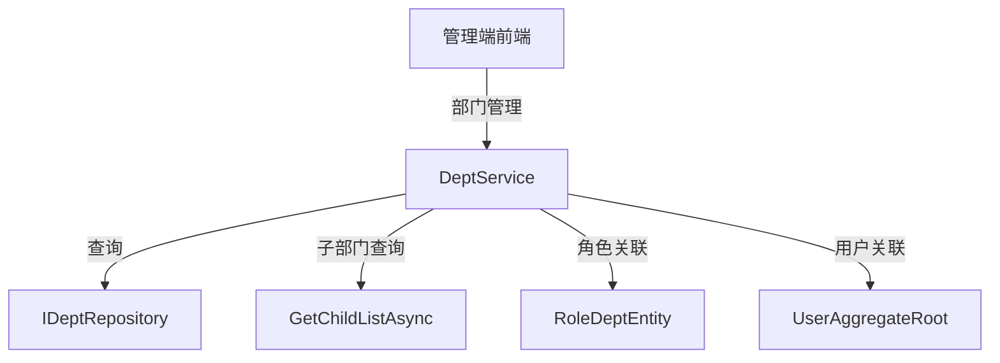

# DeptService

## 概述

DeptService 是部门管理的核心服务，提供部门的 CRUD 操作、部门树结构管理、子部门查询等功能。部门是组织架构的基础，也用于数据权限控制。

**位置**：`module/rbac/Yi.Framework.Rbac.Application/Services/System/DeptService.cs`
**层**：Application
**模块**：rbac
**依赖注入**：Scoped（继承自 YiCrudAppService）

---

## 架构位置



## 核心职责

1. 部门 CRUD 操作（创建、查询、更新、删除）
2. 部门树结构管理
3. 子部门递归查询
4. 角色-部门关联查询（数据权限）
5. 部门唯一性验证

## 关键接口

```csharp
// 查询部门列表
public override async Task<PagedResultDto<DeptGetListOutputDto>> GetListAsync(DeptGetListInputVo input);

// 获取子部门列表
[RemoteService(false)]
public async Task<List<Guid>> GetChildListAsync(Guid deptId);

// 查询角色的部门
public async Task<List<DeptGetListOutputDto>> GetRoleIdAsync(Guid roleId);

// 创建部门
public override async Task<DeptGetOutputDto> CreateAsync(DeptCreateInputVo input);

// 更新部门
public override async Task<DeptGetOutputDto> UpdateAsync(Guid id, DeptUpdateInputVo input);

// 删除部门
public override Task DeleteAsync(IEnumerable<Guid> id);
```

## 依赖注入配置

```csharp
// DeptService 的核心依赖
public DeptService(IDeptRepository repository) : base(repository)
{
    _repository = repository;
}
```

## 数据流

```
查询部门列表
  → DeptService.GetListAsync()
    → IDeptRepository._DbQueryable - 构建查询
      → WhereIF - 动态条件过滤
        → OrderBy(OrderNum) - 按排序号排序
          → ToPageListAsync - 分页查询
            → 返回分页结果
```

## 重要方法

### `GetListAsync()`

**作用**：查询部门列表，支持多条件过滤

**查询条件**：
- `DeptName`：部门名称模糊查询
- `State`：状态过滤（启用/禁用）

**排序**：按 `OrderNum` 升序排列

### `GetChildListAsync()`

**作用**：递归获取指定部门的所有子部门 ID

**实现**：
```csharp
[RemoteService(false)]
public async Task<List<Guid>> GetChildListAsync(Guid deptId)
{
    return await _repository.GetChildListAsync(deptId);
}
```

**用途**：
- 数据权限查询时需要包含所有子部门
- 用于 UserService 和 RoleService 的数据权限过滤

### `GetRoleIdAsync()`

**作用**：查询指定角色的所有部门（用于数据权限）

**实现**：
```csharp
public async Task<List<DeptGetListOutputDto>> GetRoleIdAsync(Guid roleId)
{
    var entities = await _repository.GetListRoleIdAsync(roleId);
    return await MapToGetListOutputDtosAsync(entities);
}
```

## 源码片段

### 关键实现 - 部门列表查询

```csharp
// 文件路径: module/rbac/Yi.Framework.Rbac.Application/Services/System/DeptService.cs:48-61
public override async Task<PagedResultDto<DeptGetListOutputDto>> GetListAsync(DeptGetListInputVo input)
{
    RefAsync<int> total = 0;
    var entities = await _repository._DbQueryable
        .WhereIF(!string.IsNullOrEmpty(input.DeptName), u => u.DeptName.Contains(input.DeptName!))
        .WhereIF(input.State is not null, u => u.State == input.State)
        .OrderBy(u => u.OrderNum, OrderByType.Asc)
        .ToPageListAsync(input.SkipCount, input.MaxResultCount, total);
    return new PagedResultDto<DeptGetListOutputDto>
    {
        Items = await MapToGetListOutputDtosAsync(entities),
        TotalCount = total
    };
}
```

### 关键实现 - 部门唯一性验证

```csharp
// 文件路径: module/rbac/Yi.Framework.Rbac.Application/Services/System/DeptService.cs:63-71
protected override async Task CheckCreateInputDtoAsync(DeptCreateInputVo input)
{
    var isExist =
        await _repository.IsAnyAsync(x => x.DeptName == input.DeptName);
    if (isExist)
    {
        throw new UserFriendlyException(DeptConst.Exist);
    }
}
```

## 权限控制

```csharp
// 子部门查询不暴露给远程服务
[RemoteService(false)]
public async Task<List<Guid>> GetChildListAsync(Guid deptId);

// 其他操作通过基类 YiCrudAppService 自动处理
```

## 相关组件

- [[DeptAggregateRoot]] - 部门聚合根实体
- [[IDeptRepository]] - 部门仓储接口
- [[RoleDeptEntity]] - 角色-部门关联实体（数据权限）
- [[UserAggregateRoot]] - 用户实体（关联部门）
- [[RoleService]] - 角色服务（数据权限）

## 业务规则

1. **部门唯一性**：
   - 部门名称必须唯一

2. **部门树结构**：
   - 通过 `ParentId` 构建树形结构
   - 使用 `OrderNum` 排序

3. **数据权限关联**：
   - 通过 `RoleDeptEntity` 中间表维护角色-部门关联
   - 一个角色可以关联多个部门（自定义数据权限）

4. **用户关联**：
   - 用户通过 `DeptId` 字段关联部门
   - 一个用户只能属于一个部门

## 部门树结构

部门实体包含树结构所需的信息：

```csharp
public class DeptAggregateRoot
{
    public string DeptName { get; set; }        // 部门名称
    public Guid? ParentId { get; set; }         // 父部门 ID
    public int OrderNum { get; set; }          // 排序号
    public StateEnum State { get; set; }         // 状态
    // ...
}
```

前端通过 `ParentId` 递归构建树形结构，后端提供 `GetChildListAsync()` 方法获取所有子部门 ID 用于数据权限过滤。

## 学习笔记

### 难点理解

1. **递归查询子部门**：在 Repository 层实现递归查询所有子部门 ID
2. **数据权限关联**：部门与角色的关联用于实现数据权限控制
3. **树形结构构建**：前端负责树形结构的展示，后端只提供平铺数据和子部门查询

### 疑问

- 部门删除时如何处理子部门和关联用户？
- 如何实现部门的跨树移动？

## 参考资料

- [ABP Framework 仓储模式](https://docs.abp.io/en/ab/latest/Repositories)
- [树形结构数据库设计](https://docs.microsoft.com/en-us/previous-versions/sql/sql-server-2008/cc965672(v=sql.100))
- 项目源码：`module/rbac/Yi.Framework.Rbac.Application/Services/System/DeptService.cs`

---
**状态**：✅ 完成
