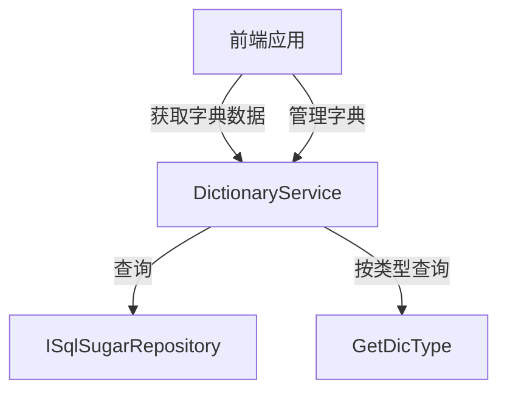

# DictionaryService

## 概述

DictionaryService 是字典数据管理的核心服务，提供字典的 CRUD 操作和按字典类型查询功能。字典用于系统配置、下拉选项、状态码等静态数据的维护。

**位置**：`module/rbac/Yi.Framework.Rbac.Application/Services/DictionaryService.cs`
**层**：Application
**模块**：rbac
**依赖注入**：Scoped（继承自 YiCrudAppService）

---

## 架构位置



## 核心职责

1. 字典 CRUD 操作（创建、查询、更新、删除）
2. 按字典类型查询字典列表
3. 字典排序管理
4. 字典状态管理（启用/禁用）

## 关键接口

```csharp
// 查询字典列表
public override async Task<PagedResultDto<DictionaryGetListOutputDto>> GetListAsync(DictionaryGetListInputVo input);

// 根据字典类型获取字典列表
[Route("dictionary/dic-type/{dicType}")]
public async Task<List<DictionaryGetListOutputDto>> GetDicType([FromRoute] string dicType);

// 创建字典
[OperLog("添加字典", OperEnum.Insert)]
public override Task<DictionaryGetOutputDto> CreateAsync(DictionaryCreateInputVo input);

// 更新字典
[OperLog("更新字典", OperEnum.Update)]
public override Task<DictionaryGetOutputDto> UpdateAsync(Guid id, DictionaryUpdateInputVo input);

// 删除字典
[OperLog("删除字典", OperEnum.Delete)]
public override Task DeleteAsync(IEnumerable<Guid> id);
```

## 依赖注入配置

```csharp
// DictionaryService 的核心依赖
public DictionaryService(ISqlSugarRepository<DictionaryEntity, Guid> repository) : base(repository)
{
    _repository = repository;
}
```

## 数据流

```
按类型查询字典
  → DictionaryService.GetDicType(dicType)
    → ISqlSugarRepository.GetListAsync() - 查询指定类型且启用的字典
      → MapToGetListOutputDtosAsync() - DTO 映射
        → 返回字典列表
```

## 重要方法

### `GetListAsync()`

**作用**：查询字典列表，支持多条件过滤

**查询条件**：
- `DictType`：字典类型过滤
- `DictLabel`：字典标签模糊查询
- `State`：状态过滤（启用/禁用）

**排序**：按 `OrderNum` 降序排列

### `GetDicType()`

**作用**：根据字典类型获取启用的字典列表

**实现**：
```csharp
[Route("dictionary/dic-type/{dicType}")]
public async Task<List<DictionaryGetListOutputDto>> GetDicType([FromRoute] string dicType)
{
    var entities = await _repository.GetListAsync(u => u.DictType == dicType && u.State == true);
    var result = await MapToGetListOutputDtosAsync(entities);
    return result;
}
```

**用途**：
- 前端获取下拉选项
- 获取状态码映射
- 获取系统配置常量

## 源码片段

### 关键实现 - 字典列表查询

```csharp
// 文件路径: module/rbac/Yi.Framework.Rbac.Application/Services/DictionaryService.cs:31-45
public override async Task<PagedResultDto<DictionaryGetListOutputDto>> GetListAsync(DictionaryGetListInputVo input)
{
    RefAsync<int> total = 0;
    var entities = await _repository._DbQueryable
        .WhereIF(input.DictType is not null, x => x.DictType == input.DictType)
        .WhereIF(input.DictLabel is not null, x => x.DictLabel!.Contains(input.DictLabel!))
        .WhereIF(input.State is not null, x => x.State == input.State)
        .OrderByDescending(x => x.OrderNum)
        .ToPageListAsync(input.SkipCount, input.MaxResultCount, total);
    return new PagedResultDto<DictionaryGetListOutputDto>
    {
        TotalCount = total,
        Items = await MapToGetListOutputDtosAsync(entities)
    };
}
```

### 关键实现 - 按类型查询

```csharp
// 文件路径: module/rbac/Yi.Framework.Rbac.Application/Services/DictionaryService.cs:53-59
[Route("dictionary/dic-type/{dicType}")]
public async Task<List<DictionaryGetListOutputDto>> GetDicType([FromRoute] string dicType)
{
    var entities = await _repository.GetListAsync(u => u.DictType == dicType && u.State == true);
    var result = await MapToGetListOutputDtosAsync(entities);
    return result;
}
```

## 权限控制

```csharp
// 所有操作都需要操作日志记录
[OperLog("添加字典", OperEnum.Insert)]
public override Task<DictionaryGetOutputDto> CreateAsync(DictionaryCreateInputVo input);

[OperLog("更新字典", OperEnum.Update)]
public override Task<DictionaryGetOutputDto> UpdateAsync(Guid id, DictionaryUpdateInputVo input);

[OperLog("删除字典", OperEnum.Delete)]
public override Task DeleteAsync(IEnumerable<Guid> id);
```

## 相关组件

- [[DictionaryEntity]] - 字典实体
- [[DictionaryTypeService]] - 字典类型服务
- [[DictionaryTypeAggregateRoot]] - 字典类型聚合根

## 业务规则

1. **字典结构**：
   - `DictType`：字典类型，用于分组（如 `sys_user_sex`、`sys_job_status`）
   - `DictLabel`：字典标签，显示名称
   - `DictValue`：字典值，实际使用的值
   - `OrderNum`：排序号，数值越大越靠前
   - `State`：状态，true 表示启用

2. **字典类型**：
   - 通过 `DictionaryTypeService` 管理字典类型
   - 字典类型与字典是一对多的关系

3. **字典用途**：
   - 下拉选项数据源
   - 状态码映射
   - 系统配置常量

## 常见字典类型

系统预定义的字典类型：

| 字典类型 | 说明 | 示例 |
|---------|------|------|
| `sys_user_sex` | 用户性别 | 0=男, 1=女, 2=未知 |
| `sys_job_status` | 任务状态 | 0=正常, 1=暂停 |
| `sys_notice_type` | 通知类型 | 1=通知, 2=公告 |
| `sys_oper_type` | 操作类型 | 0=其它, 1=新增, 2=修改, 3=删除 |
| `sys_common_status` | 通用状态 | 0=正常, 1=停用 |

## 学习笔记

### 难点理解

1. **字典类型与字典的关系**：字典类型是分组，字典是具体的数据项
2. **路由定制**：使用 `[Route]` 特性定制 RESTful 路由

### 疑问

- 字典数据是否支持国际化？
- 字典变更后如何通知前端刷新缓存？

## 参考资料

- [ABP Framework 路由定制](https://docs.abp.io/en/ab/latest/API-Routing)
- 项目源码：`module/rbac/Yi.Framework.Rbac.Application/Services/DictionaryService.cs`

---
**状态**：✅ 完成
