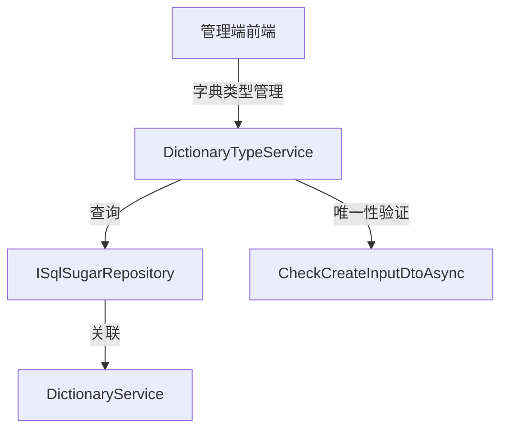

# DictionaryTypeService

## 概述

DictionaryTypeService 是字典类型管理的核心服务，提供字典类型的 CRUD 操作。字典类型用于分组管理字典数据，是字典数据的分类标签。

**位置**：`module/rbac/Yi.Framework.Rbac.Application/Services/DictionaryTypeService.cs`
**层**：Application
**模块**：rbac
**依赖注入**：Scoped（继承自 YiCrudAppService）

---

## 架构位置



## 核心职责

1. 字典类型 CRUD 操作（创建、查询、更新、删除）
2. 字典类型唯一性验证
3. 字典类型状态管理

## 关键接口

```csharp
// 查询字典类型列表
public override async Task<PagedResultDto<DictionaryTypeGetListOutputDto>> GetListAsync(DictionaryTypeGetListInputVo input);

// 创建字典类型
public override async Task<DictionaryTypeGetOutputDto> CreateAsync(DictionaryTypeCreateInputVo input);

// 更新字典类型
public override async Task<DictionaryTypeGetOutputDto> UpdateAsync(Guid id, DictionaryTypeUpdateInputVo input);

// 删除字典类型
public override Task DeleteAsync(IEnumerable<Guid> id);
```

## 依赖注入配置

```csharp
// DictionaryTypeService 的核心依赖
public DictionaryTypeService(ISqlSugarRepository<DictionaryTypeAggregateRoot, Guid> repository) : base(repository)
{
    _repository = repository;
}
```

## 数据流

```
创建字典类型
  → DictionaryTypeService.CreateAsync()
    → CheckCreateInputDtoAsync() - 验证字典类型唯一性
      → MapToEntityAsync() - DTO 映射
        → ISqlSugarRepository.InsertAsync() - 插入数据库
          → MapToGetOutputDtoAsync() - 返回结果
```

## 重要方法

### `GetListAsync()`

**作用**：查询字典类型列表，支持多条件过滤

**查询条件**：
- `DictName`：字典类型名称模糊查询
- `DictType`：字典类型编码模糊查询
- `State`：状态过滤（启用/禁用）
- `StartTime` / `EndTime`：创建时间范围

### `CheckCreateInputDtoAsync()`

**作用**：创建时验证字典类型唯一性

**实现**：
```csharp
protected override async Task CheckCreateInputDtoAsync(DictionaryTypeCreateInputVo input)
{
    var isExist =
        await _repository.IsAnyAsync(x => x.DictType == input.DictType);
    if (isExist)
    {
        throw new UserFriendlyException(DictionaryConst.Exist);
    }
}
```

### `CheckUpdateInputDtoAsync()`

**作用**：更新时验证字典类型唯一性（排除自身）

**实现**：
```csharp
protected override async Task CheckUpdateInputDtoAsync(DictionaryTypeAggregateRoot entity, DictionaryTypeUpdateInputVo input)
{
    var isExist = await _repository._DbQueryable.Where(x => x.Id != entity.Id)
        .AnyAsync(x => x.DictType == input.DictType);
    if (isExist)
    {
        throw new UserFriendlyException(DictionaryConst.Exist);
    }
}
```

## 源码片段

### 关键实现 - 字典类型列表查询

```csharp
// 文件路径: module/rbac/Yi.Framework.Rbac.Application/Services/DictionaryTypeService.cs:26-41
public override async Task<PagedResultDto<DictionaryTypeGetListOutputDto>> GetListAsync(DictionaryTypeGetListInputVo input)
{
    RefAsync<int> total = 0;
    var entities = await _repository._DbQueryable.WhereIF(input.DictName is not null, x => x.DictName.Contains(input.DictName!))
              .WhereIF(input.DictType is not null, x => x.DictType!.Contains(input.DictType!))
              .WhereIF(input.State is not null, x => x.State == input.State)
              .WhereIF(input.StartTime is not null && input.EndTime is not null, x => x.CreationTime >= input.StartTime && x.CreationTime <= input.EndTime)
              .ToPageListAsync(input.SkipCount, input.MaxResultCount, total);

    return new PagedResultDto<DictionaryTypeGetListOutputDto>
    {
        TotalCount = total,
        Items = await MapToGetListOutputDtosAsync(entities)
    };
}
```

### 关键实现 - 创建唯一性验证

```csharp
// 文件路径: module/rbac/Yi.Framework.Rbac.Application/Services/DictionaryTypeService.cs:43-51
protected override async Task CheckCreateInputDtoAsync(DictionaryTypeCreateInputVo input)
{
    var isExist =
        await _repository.IsAnyAsync(x => x.DictType == input.DictType);
    if (isExist)
    {
        throw new UserFriendlyException(DictionaryConst.Exist);
    }
}
```

## 权限控制

```csharp
// 操作通过基类 YiCrudAppService 自动处理
// 无额外的权限特性或操作日志记录
```

## 相关组件

- [[DictionaryTypeAggregateRoot]] - 字典类型聚合根实体
- [[DictionaryService]] - 字典服务
- [[DictionaryEntity]] - 字典实体

## 业务规则

1. **字典类型唯一性**：
   - 字典类型编码（`DictType`）必须唯一

2. **字典类型结构**：
   - `DictType`：字典类型编码（如 `sys_user_sex`、`sys_job_status`）
   - `DictName`：字典类型名称（如 `用户性别`、`任务状态`）
   - `State`：状态（启用/禁用）

3. **与字典的关系**：
   - 一个字典类型可以包含多个字典项
   - 字典通过 `DictType` 字段关联到字典类型

## 字典类型设计模式

字典类型采用"类型分组"设计模式：

```
DictionaryType (字典类型)
  └── Dictionary (字典数据)
      ├── { DictLabel: "男", DictValue: "0" }
      ├── { DictLabel: "女", DictValue: "1" }
      └── { DictLabel: "未知", DictValue: "2" }
```

这种设计的优点：
- 便于按类型批量查询
- 便于前端按类型加载下拉选项
- 便于统一管理相关配置

## 学习笔记

### 难点理解

1. **唯一性验证的双重逻辑**：创建时检查全局唯一，更新时排除自身
2. **类型与数据的关系**：字典类型是分类标签，字典是具体数据

### 疑问

- 删除字典类型时是否需要级联删除关联的字典数据？
- 字典类型是否支持层级结构？

## 参考资料

- [ABP Framework 值对象模式](https://docs.abp.io/en/ab/latest/Value-Objects)
- 项目源码：`module/rbac/Yi.Framework.Rbac.Application/Services/DictionaryTypeService.cs`

---
**状态**：✅ 完成
