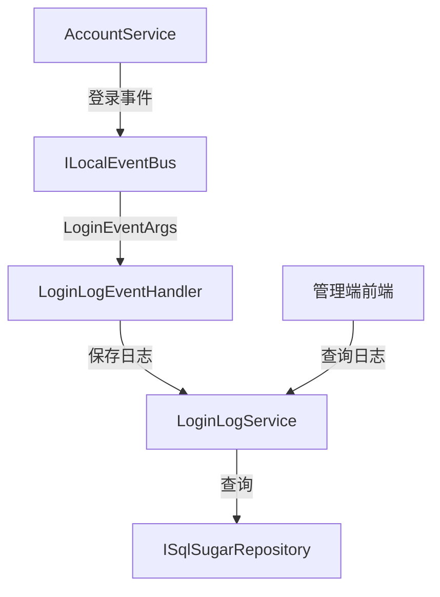

# LoginLogService

## 概述

LoginLogService 是登录日志管理的核心服务，记录用户登录行为，包括登录 IP、浏览器、操作系统、登录位置等信息。登录日志通过事件总线自动记录，无需手动调用。

**位置**：`module/rbac/Yi.Framework.Rbac.Application/Services/RecordLog/LoginLogService.cs`
**层**：Application
**模块**：rbac
**依赖注入**：Scoped（继承自 YiCrudAppService）

---

## 架构位置



## 核心职责

1. 登录日志查询（IP、用户名、时间范围）
2. 登录日志记录（通过事件总线）
3. 登录行为审计

## 关键接口

```csharp
// 查询登录日志列表
public override async Task<PagedResultDto<LoginLogGetListOutputDto>> GetListAsync(LoginLogGetListInputVo input);
```

## 依赖注入配置

```csharp
// LoginLogService 的核心依赖
public LoginLogService(ISqlSugarRepository<LoginLogAggregateRoot, Guid> repository) : base(repository)
{
    _repository = repository;
}
```

## 数据流

```
用户登录
  → AccountService.PostLoginAsync()
    → ILocalEventBus.PublishAsync(LoginEventArgs) - 发布登录事件
      → LoginLogEventHandler.HandleEventAsync() - 事件处理器
        → LoginLogAggregateRoot.GetInfoByHttpContext() - 提取登录信息
          → ISqlSugarRepository.InsertAsync() - 保存日志
```

## 重要方法

### `GetListAsync()`

**作用**：查询登录日志列表，支持多条件过滤

**查询条件**：
- `LoginIp`：登录 IP 模糊查询
- `LoginUser`：登录用户名模糊查询
- `StartTime` / `EndTime`：登录时间范围

**排序**：按 `CreationTime` 降序排列

## 源码片段

### 关键实现 - 登录日志查询

```csharp
// 文件路径: module/rbac/Yi.Framework.Rbac.Application/Services/RecordLog/LoginLogService.cs:20-31
public override async Task<PagedResultDto<LoginLogGetListOutputDto>> GetListAsync(LoginLogGetListInputVo input)
{
    RefAsync<int> total = 0;
    var entities = await _repository._DbQueryable.WhereIF(!string.IsNullOrEmpty(input.LoginIp), x => x.LoginIp.Contains(input.LoginIp!))
                  .WhereIF(!string.IsNullOrEmpty(input.LoginUser), x => x.LoginUser!.Contains(input.LoginUser!))
                  .WhereIF(input.StartTime is not null && input.EndTime is not null, x => x.CreationTime >= input.StartTime && x.CreationTime <= input.EndTime)
                  .OrderByDescending(it => it.CreationTime) //降序
                  .ToPageListAsync(input.SkipCount, input.MaxResultCount, total);
    return new PagedResultDto<LoginLogGetListOutputDto>(total, await MapToGetListOutputDtosAsync(entities));
}
```

## 权限控制

```csharp
// 禁用更新操作（日志不可修改）
[RemoteService(false)]
public override Task<LoginLogGetListOutputDto> UpdateAsync(Guid id, LoginLogGetListOutputDto input)
{
    return base.UpdateAsync(id, input);
}
```

## 相关组件

- [[LoginLogAggregateRoot]] - 登录日志聚合根实体
- [[LoginLogEventHandler]] - 登录日志事件处理器
- [[AccountService]] - 账号服务，发布登录事件
- [[ILocalEventBus]] - ABP 本地事件总线

## 业务规则

1. **日志记录方式**：
   - 通过事件总线自动记录
   - 在 AccountService 登录成功后发布 `LoginEventArgs` 事件

2. **日志信息来源**：
   - 从 `HttpContext` 中提取登录信息
   - 包括 IP、浏览器、操作系统等

3. **日志不可修改**：
   - 禁用更新接口（`[RemoteService(false)]`）
   - 保证日志的真实性和完整性

## 登录日志信息

登录日志记录的信息：

```csharp
public class LoginLogAggregateRoot
{
    public string? LoginIp { get; set; }         // 登录 IP
    public string? LoginUser { get; set; }       // 登录用户名
    public string? Browser { get; set; }         // 浏览器
    public string? Os { get; set; }              // 操作系统
    public string? LoginLocation { get; set; }   // 登录位置
    public DateTime CreationTime { get; set; }    // 登录时间
    // ...
}
```

## 事件驱动日志记录

登录日志采用事件驱动模式：

```csharp
// AccountService 中发布事件
var loginEntity = new LoginLogAggregateRoot().GetInfoByHttpContext(_httpContextAccessor.HttpContext);
var loginEto = loginEntity.Adapt<LoginEventArgs>();
loginEto.UserName = userInfo.User.UserName;
loginEto.UserId = userInfo.User.Id;
await LocalEventBus.PublishAsync(loginEto);

// LoginLogEventHandler 中处理事件
public async Task HandleEventAsync(LoginEventArgs eventData)
{
    var loginLog = new LoginLogAggregateRoot
    {
        LoginIp = eventData.LoginIp,
        LoginUser = eventData.UserName,
        Browser = eventData.Browser,
        Os = eventData.Os,
        LoginLocation = eventData.LoginLocation
    };
    await _repository.InsertAsync(loginLog);
}
```

## 学习笔记

### 难点理解

1. **事件驱动模式**：通过事件总线解耦日志记录与业务逻辑
2. **日志不可修改**：禁用更新接口保证日志完整性

### 疑问

- 如何实现登录失败日志的记录？
- 如何根据登录日志实现异地登录检测？

## 参考资料

- [ABP Framework 事件总线文档](https://docs.abp.io/en/ab/latest/EventBus)
- 项目源码：`module/rbac/Yi.Framework.Rbac.Application/Services/RecordLog/LoginLogService.cs`

---
**状态**：✅ 完成
