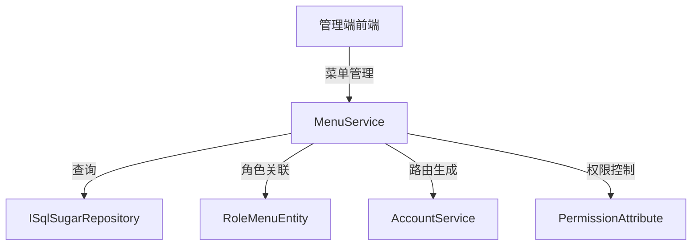

# MenuService

## 概述

MenuService 是菜单管理的核心服务，提供菜单的 CRUD 操作、角色-菜单关联查询等功能。菜单是系统的前端路由和权限控制的基础，支持多种前端框架（Ruoyi、Pure）。

**位置**：`module/rbac/Yi.Framework.Rbac.Application/Services/System/MenuService.cs`
**层**：Application
**模块**：rbac
**依赖注入**：Scoped（继承自 YiCrudAppService）

---

## 架构位置



## 核心职责

1. 菜单 CRUD 操作（创建、查询、更新、删除）
2. 角色-菜单关联查询
3. 菜单树结构管理
4. 前端路由数据源（支持多种前端框架）

## 关键接口

```csharp
// 查询菜单列表
public override async Task<PagedResultDto<MenuGetListOutputDto>> GetListAsync(MenuGetListInputVo input);

// 查询角色的菜单
public async Task<List<MenuGetListOutputDto>> GetListRoleIdAsync(Guid roleId);

// 创建菜单
[OperLog("添加菜单", OperEnum.Insert)]
public override Task<MenuGetOutputDto> CreateAsync(MenuCreateInputVo input);

// 更新菜单
[OperLog("更新菜单", OperEnum.Update)]
public override Task<MenuGetOutputDto> UpdateAsync(Guid id, MenuUpdateInputVo input);

// 删除菜单
[OperLog("删除菜单", OperEnum.Delete)]
public override Task DeleteAsync(IEnumerable<Guid> id);
```

## 依赖注入配置

```csharp
// MenuService 的核心依赖
public MenuService(ISqlSugarRepository<MenuAggregateRoot, Guid> repository) : base(repository)
{
    _repository = repository;
}
```

## 数据流

```
查询角色菜单
  → MenuService.GetListRoleIdAsync()
    → 子查询：RoleMenuEntity 过滤角色关联
      → 返回角色的菜单列表
```

## 重要方法

### `GetListAsync()`

**作用**：查询菜单列表，支持多条件过滤

**查询条件**：
- `MenuName`：菜单名称模糊查询
- `State`：状态过滤（启用/禁用）
- `MenuSource`：菜单来源过滤（Ruoyi、Pure）

**排序**：按 `OrderNum` 降序排列

### `GetListRoleIdAsync()`

**作用**：查询指定角色的所有菜单

**实现**：
```csharp
public async Task<List<MenuGetListOutputDto>> GetListRoleIdAsync(Guid roleId)
{
    var entities = await _repository._DbQueryable
        .Where(m => SqlFunc.Subqueryable<RoleMenuEntity>()
            .Where(rm => rm.RoleId == roleId && rm.MenuId == m.Id).Any())
        .ToListAsync();

    return await MapToGetListOutputDtosAsync(entities);
}
```

**SQL 逻辑**：
```sql
SELECT * FROM Menu m
WHERE EXISTS (
    SELECT 1 FROM RoleMenu rm
    WHERE rm.RoleId = @roleId AND rm.MenuId = m.Id
)
```

## 源码片段

### 关键实现 - 查询角色菜单

```csharp
// 文件路径: module/rbac/Yi.Framework.Rbac.Application/Services/System/MenuService.cs:41-46
public async Task<List<MenuGetListOutputDto>> GetListRoleIdAsync(Guid roleId)
{
    var entities = await _repository._DbQueryable.Where(m => SqlFunc.Subqueryable<RoleMenuEntity>().Where(rm => rm.RoleId == roleId && rm.MenuId == m.Id).Any()).ToListAsync();

    return await MapToGetListOutputDtosAsync(entities);
}
```

### 关键实现 - 菜单列表查询

```csharp
// 文件路径: module/rbac/Yi.Framework.Rbac.Application/Services/System/MenuService.cs:25-34
public override async Task<PagedResultDto<MenuGetListOutputDto>> GetListAsync(MenuGetListInputVo input)
{
    RefAsync<int> total = 0;
    var entities = await _repository._DbQueryable.WhereIF(!string.IsNullOrEmpty(input.MenuName), x => x.MenuName.Contains(input.MenuName!))
                .WhereIF(input.State is not null, x => x.State == input.State)
                .Where(x=>x.MenuSource==input.MenuSource)
                .OrderByDescending(x => x.OrderNum)
                .ToListAsync();
    return new PagedResultDto<MenuGetListOutputDto>(total, await MapToGetListOutputDtosAsync(entities));
}
```

## 权限控制

```csharp
// 创建菜单需要操作日志
[OperLog("添加菜单", OperEnum.Insert)]
public override Task<MenuGetOutputDto> CreateAsync(MenuCreateInputVo input);

// 更新菜单需要操作日志
[OperLog("更新菜单", OperEnum.Update)]
public override Task<MenuGetOutputDto> UpdateAsync(Guid id, MenuUpdateInputVo input);

// 删除菜单需要操作日志
[OperLog("删除菜单", OperEnum.Delete)]
public override Task DeleteAsync(IEnumerable<Guid> id);
```

## 相关组件

- [[MenuAggregateRoot]] - 菜单聚合根实体
- [[RoleMenuEntity]] - 角色-菜单关联实体
- [[RoleService]] - 角色服务
- [[AccountService]] - 账号服务，生成前端路由
- [[PermissionAttribute]] - ABP 权限特性

## 业务规则

1. **菜单来源**：
   - `MenuSourceEnum.Ruoyi`：若依前端框架菜单
   - `MenuSourceEnum.Pure`：Pure 管理后台框架菜单

2. **菜单类型**：
   - 目录：不包含路由，用于分组
   - 菜单：包含路由和组件
   - 按钮：权限控制标识，不显示在菜单中

3. **菜单树结构**：
   - 通过 `ParentId` 构建树形结构
   - 使用 `OrderNum` 排序

4. **角色-菜单关联**：
   - 通过 `RoleMenuEntity` 中间表维护
   - 一个角色可以拥有多个菜单权限
   - 一个菜单可以分配给多个角色

## 菜单与前端路由

菜单实体包含前端路由所需的所有信息：

```csharp
public class MenuAggregateRoot
{
    public string MenuName { get; set; }           // 菜单名称
    public string Path { get; set; }               // 路由路径
    public string Component { get; set; }          // 组件路径
    public string Redirect { get; set; }           // 重定向路径
    public string Icon { get; set; }               // 图标
    public int OrderNum { get; set; }             // 排序号
    public Guid? ParentId { get; set; }            // 父菜单 ID
    public MenuSourceEnum MenuSource { get; set; } // 菜单来源
    public MenuTypeEnum MenuType { get; set; }     // 菜单类型
    public string Permission { get; set; }         // 权限标识
    // ...
}
```

前端路由由 `AccountService.GetVue3Router()` 方法根据用户角色和菜单权限动态生成。

## 学习笔记

### 难点理解

1. **子查询关联**：使用 `SqlFunc.Subqueryable()` 实现 EXISTS 子查询，提高查询效率
2. **多前端框架支持**：通过 `MenuSource` 枚举区分不同前端框架的菜单
3. **菜单树构建**：在前端通过 `ParentId` 递归构建树形结构

### 疑问

- 菜单删除时如何处理子菜单？
- 如何实现菜单的动态导入和导出？

## 参考资料

- [ABP Framework 导航菜单](https://docs.abp.io/en/abp/latest/Navigation)
- [Vue Router 动态路由](https://router.vuejs.org/guide/advanced/dynamic-routing.html)
- 项目源码：`module/rbac/Yi.Framework.Rbac.Application/Services/System/MenuService.cs`

---
**状态**：✅ 完成
