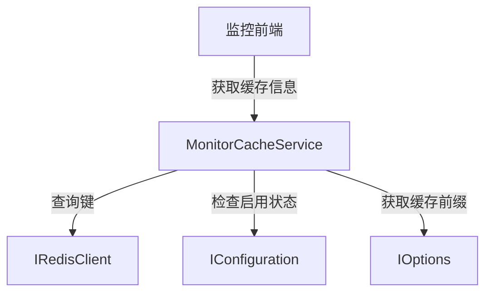

# MonitorCacheService

## 概述

MonitorCacheService 是 Redis 缓存监控的核心服务，提供 Redis 缓存的键名分组和详细信息查询功能。该服务仅在使用 Redis 缓存时可用。

**位置**：`module/rbac/Yi.Framework.Rbac.Application/Services/Monitor/MonitorCacheService.cs`
**层**：Application
**模块**：rbac
**依赖注入**：Scoped（继承自 ApplicationService）

---

## 架构位置



## 核心职责

1. Redis 键名分组查询
2. Redis 缓存详细信息查询
3. Redis 启用状态验证

## 关键接口

```csharp
// 获取键名分组
[HttpGet("monitor-cache/name")]
public List<MonitorCacheNameGetListOutputDto> GetName();

// 获取缓存详细信息
[HttpGet("monitor-cache/info")]
public MonitorCacheInfoGetOutputDto GetInfo([FromQuery] string cacheName);
```

## 依赖注入配置

```csharp
// MonitorCacheService 的核心依赖
public class MonitorCacheService : ApplicationService, IMonitorCacheService
{
    public IAbpLazyServiceProvider LazyServiceProvider { get; set; }
}
```

## 数据流

```
获取键名分组
  → MonitorCacheService.GetName()
    → VerifyRedisCacheEnable() - 验证 Redis 是否启用
      → IRedisClient.Keys() - 获取所有键
        → GroupedKeys() - 按前缀分组
          → 返回分组结果
```

## 重要方法

### `GetName()`

**作用**：获取 Redis 键名的分组列表

**实现**：
```csharp
[HttpGet("monitor-cache/name")]
public List<MonitorCacheNameGetListOutputDto> GetName()
{
    VerifyRedisCacheEnable();
    var keys = RedisClient.Keys(CacheKeyPrefix + "*");
    var result = GroupedKeys(keys.ToList());
    var output = result.Select(x => new MonitorCacheNameGetListOutputDto { CacheName = x }).ToList();
    return output;
}
```

**分组逻辑**：
- 按冒号分隔键名
- 取前两部分作为分组名称
- 例如：`UserInfo:1:...` 分组为 `UserInfo:1`

### `GroupedKeys()`

**作用**：将键列表按前缀分组

**实现**：
```csharp
private List<string> GroupedKeys(List<string> keys)
{
    HashSet<string> resultSet = new HashSet<string>();
    foreach (string str in keys)
    {
        string[] parts = str.Split(':');

        // 如果字符串中包含冒号，则将第一部分和第二部分进行分组
        if (parts.Length >= 2)
        {
            string group = $"{parts[0]}:{parts[1]}";
            resultSet.Add(group);
        }
        // 如果字符串中不包含冒号，则直接进行分组
        else
        {
            resultSet.Add(str);
        }
    }
    return resultSet.ToList();
}
```

### `VerifyRedisCacheEnable()`

**作用**：验证 Redis 缓存是否启用

**实现**：
```csharp
private void VerifyRedisCacheEnable()
{
    if (!EnableRedisCache)
    {
        throw new UserFriendlyException("后端程序未使用Redis缓存，无法对Redis进行监控，可切换使用Redis");
    }
}
```

## 源码片段

### 关键实现 - 获取缓存信息

```csharp
// 文件路径: module/rbac/Yi.Framework.Rbac.Application/Services/Monitor/MonitorCacheService.cs:41-49
[HttpGet("monitor-cache/name")]
public List<MonitorCacheNameGetListOutputDto> GetName()
{
    VerifyRedisCacheEnable();
    var keys = RedisClient.Keys(CacheKeyPrefix + "*");
    var result = GroupedKeys(keys.ToList());
    var output = result.Select(x => new MonitorCacheNameGetListOutputDto { CacheName = x }).ToList();
    return output;
}
```

### 关键实现 - 分组逻辑

```csharp
// 文件路径: module/rbac/Yi.Framework.Rbac.Application/Services/Monitor/MonitorCacheService.cs:51-72
private List<string> GroupedKeys(List<string> keys)
{
    HashSet<string> resultSet = new HashSet<string>();
    foreach (string str in keys)
    {
        string[] parts = str.Split(':');

        // 如果字符串中包含冒号，则将第一部分和第二部分进行分组
        if (parts.Length >= 2)
        {
            string group = $"{parts[0]}:{parts[1]}";
            resultSet.Add(group);
        }
        // 如果字符串中不包含冒号，则直接进行分组
        else
        {
            resultSet.Add(str);
        }
    }
    return resultSet.ToList();
}
```

## 权限控制

```csharp
// 缓存监控可能包含敏感信息，建议添加权限控制
[HttpGet("monitor-cache/name")]
public List<MonitorCacheNameGetListOutputDto> GetName();
```

## 相关组件

- [[IRedisClient]] - Redis 客户端接口
- [[AbpDistributedCacheOptions]] - ABP 分布式缓存选项
- [[IConfiguration]] - 配置接口

## 业务规则

1. **Redis 启用验证**：
   - 通过配置 `Redis:IsEnabled` 判断是否启用
   - 未启用时抛出友好异常

2. **键名分组**：
   - 使用 ABP 缓存前缀过滤
   - 按冒号分隔分组
   - 取前两级作为分组名称

3. **懒加载依赖**：
   - 使用 `IAbpLazyServiceProvider` 延迟加载
   - 避免未启用 Redis 时的依赖错误

## 配置选项

Redis 缓存配置：

```json
{
  "Redis": {
    "IsEnabled": "true"
  },
  "AbpDistributedCache": {
    "KeyPrefix": "Yi.Abp"
  }
}
```

## 缓存键名分组示例

假设 Redis 中有以下键：

```
Yi.Abp:UserInfo:1
Yi.Abp:UserInfo:2
Yi.Abp:RoleInfo:1
Yi.Abp:MenuInfo:1
```

分组结果：

```
Yi.Abp:UserInfo
Yi.Abp:RoleInfo
Yi.Abp:MenuInfo
```

## 学习笔记

### 难点理解

1. **懒加载模式**：使用 `IAbpLazyServiceProvider` 避免不必要的依赖注入
2. **键名分组算法**：按冒号分隔并取前两级作为分组

### 疑问

- `GetInfo` 方法的具体实现如何获取缓存详细信息？
- 如何处理大量键名的性能问题？

## 参考资料

- [FreeRedis 文档](https://github.com/2881099/FreeRedis)
- [ABP Framework 缓存文档](https://docs.abp.io/en/ab/latest/Caching)
- 项目源码：`module/rbac/Yi.Framework.Rbac.Application/Services/Monitor/MonitorCacheService.cs`

---
**状态**：✅ 完成
