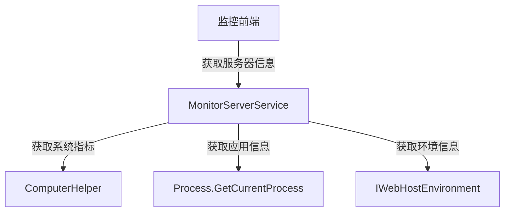

# MonitorServerService

## 概述

MonitorServerService 是服务器监控的核心服务，实时获取服务器的系统信息和应用程序运行状态。该服务提供 CPU、内存、磁盘等系统指标和应用程序运行时间等信息。

**位置**：`module/rbac/Yi.Framework.Rbac.Application/Services/Monitor/MonitorServerService.cs`
**层**：Application
**模块**：rbac
**依赖注入**：Scoped（继承自 ApplicationService）

---

## 架构位置



## 核心职责

1. 服务器系统信息获取（CPU、内存、磁盘）
2. 应用程序运行状态监控
3. 系统运行时间统计

## 关键接口

```csharp
// 获取服务器监控信息
[HttpGet("monitor-server/info")]
public object GetInfo();
```

## 依赖注入配置

```csharp
// MonitorServerService 的核心依赖
public MonitorServerService(IWebHostEnvironment hostEnvironment, IHttpContextAccessor httpContextAccessor)
{
    _hostEnvironment = hostEnvironment;
    _httpContextAccessor = httpContextAccessor;
}
```

## 数据流

```
获取服务器信息
  → MonitorServerService.GetInfo()
    → ComputerHelper.GetMemoryMetrics() - 获取内存指标
    → ComputerHelper.GetCPUMetrics() - 获取 CPU 指标
    → ComputerHelper.GetDiskInfos() - 获取磁盘信息
    → Process.GetCurrentProcess() - 获取应用信息
    → Environment - 获取系统信息
    → 返回聚合结果
```

## 重要方法

### `GetInfo()`

**作用**：获取服务器监控信息的聚合数据

**返回数据结构**：
```csharp
{
  memory: {    // 内存信息
    total,    // 总内存
    free,     // 可用内存
    used,     // 已用内存
    usage     // 使用率
  },
  cpu: {      // CPU 信息
    name,     // CPU 名称
    package,  // CPU 包数
    core,     // CPU 核心数
    usage     // CPU 使用率
  },
  disk: [     // 磁盘信息
    {
      name,    // 磁盘名称
      total,  // 总容量
      free,   // 可用容量
      used,   // 已用容量
      usage   // 使用率
    }
  ],
  sys: {      // 系统信息
    computerName, // 计算机名
    osName,       // 操作系统
    osArch,       // 系统架构
    serverIP,     // 服务器 IP
    runTime       // 系统运行时间
  },
  app: {      // 应用信息
    name,        // 环境名称
    rootPath,    // 根路径
    webRootPath, // Web 根路径
    version,     // .NET 版本
    appRAM,      // 应用内存
    startTime,   // 启动时间
    runTime,     // 运行时间
    host         // 主机地址
  }
}
```

## 源码片段

### 关键实现 - 服务器监控信息

```csharp
// 文件路径: module/rbac/Yi.Framework.Rbac.Application/Services/Monitor/MonitorServerService.cs:22-56
[HttpGet("monitor-server/info")]
public object GetInfo()
{
    string computerName = Environment.MachineName;
    string osName = RuntimeInformation.OSDescription;
    string osArch = RuntimeInformation.OSArchitecture.ToString();
    string version = RuntimeInformation.FrameworkDescription;
    string appRAM = ((double)Process.GetCurrentProcess().WorkingSet64 / 1048576).ToString("N2") + " MB";
    string startTime = Process.GetCurrentProcess().StartTime.ToString("yyyy-MM-dd HH:mm:ss");
    string sysRunTime = ComputerHelper.GetRunTime();
    string serverIP = _httpContextAccessor.HttpContext.Connection.LocalIpAddress.MapToIPv4().ToString() + ":" + _httpContextAccessor.HttpContext.Connection.LocalPort;

    var programStartTime = Process.GetCurrentProcess().StartTime;
    string programRunTime = DateTimeHelper.FormatTime(long.Parse((DateTime.Now - programStartTime).TotalMilliseconds.ToString().Split('.')[0]));
    var data = new
    {
        memory = ComputerHelper.GetMemoryMetrics(),
        cpu = ComputerHelper.GetCPUMetrics(),
        disk = ComputerHelper.GetDiskInfos(),
        sys = new {computerName, osName, osArch, serverIP, runTime = sysRunTime },
        app = new
        {
            name = _hostEnvironment.EnvironmentName,
            rootPath = _hostEnvironment.ContentRootPath,
            webRootPath = _hostEnvironment.WebRootPath,
            version,
            appRAM,
            startTime,
            runTime = programRunTime,
            host = serverIP
        },
    };

    return data;
}
```

## 权限控制

```csharp
// 服务器信息可能包含敏感信息，建议添加权限控制
[HttpGet("monitor-server/info")]
public object GetInfo();
```

## 相关组件

- [[ComputerHelper]] - 计算机信息辅助类
- [[DateTimeHelper]] - 时间格式化辅助类
- [[IWebHostEnvironment]] - Web 主机环境
- [[IHttpContextAccessor]] - HTTP 上下文访问器

## 业务规则

1. **实时获取**：
   - 每次请求实时获取系统信息
   - 不缓存，保证数据的实时性

2. **跨平台支持**：
   - 使用 `RuntimeInformation` 获取系统信息
   - 支持 Windows、Linux、macOS

3. **性能考虑**：
   - 获取 CPU 使用率可能有一定性能开销
   - 建议限制查询频率

## 监控指标说明

### 系统指标

| 指标 | 说明 | 数据来源 |
|-----|------|---------|
| 计算机名 | 服务器计算机名称 | `Environment.MachineName` |
| 操作系统 | 操作系统名称和版本 | `RuntimeInformation.OSDescription` |
| 系统架构 | 操作系统架构 | `RuntimeInformation.OSArchitecture` |
| 服务器 IP | 服务器 IP 地址和端口 | `HttpContext.Connection` |
| 系统运行时间 | 系统启动后的运行时间 | `ComputerHelper.GetRunTime()` |

### 应用指标

| 指标 | 说明 | 数据来源 |
|-----|------|---------|
| 环境名称 | 当前运行环境 | `IWebHostEnvironment.EnvironmentName` |
| 根路径 | 应用根路径 | `IWebHostEnvironment.ContentRootPath` |
| Web 根路径 | Web 根路径 | `IWebHostEnvironment.WebRootPath` |
| .NET 版本 | .NET 运行时版本 | `RuntimeInformation.FrameworkDescription` |
| 应用内存 | 应用占用内存 | `Process.WorkingSet64` |
| 启动时间 | 应用启动时间 | `Process.StartTime` |
| 运行时间 | 应用运行时长 | 计算得出 |

### 硬件指标

| 指标 | 说明 | 数据来源 |
|-----|------|---------|
| CPU 信息 | CPU 名称、核心数、使用率 | `ComputerHelper.GetCPUMetrics()` |
| 内存信息 | 总内存、可用内存、使用率 | `ComputerHelper.GetMemoryMetrics()` |
| 磁盘信息 | 磁盘容量、使用情况 | `ComputerHelper.GetDiskInfos()` |

## 学习笔记

### 难点理解

1. **跨平台系统信息获取**：使用 `RuntimeInformation` 实现跨平台
2. **内存单位换算**：字节转换为 MB（除以 1048576）

### 疑问

- `ComputerHelper` 的具体实现如何获取 CPU 使用率？
- 如何处理 Docker 容器中的磁盘信息获取？

## 参考资料

- [System.Diagnostics.Process](https://docs.microsoft.com/en-us/dotnet/api/system.diagnostics.process)
- [System.Runtime.InteropServices.RuntimeInformation](https://docs.microsoft.com/en-us/dotnet/api/system.runtime.interopservices.runtimeinformation)
- 项目源码：`module/rbac/Yi.Framework.Rbac.Application/Services/Monitor/MonitorServerService.cs`

---
**状态**：✅ 完成
