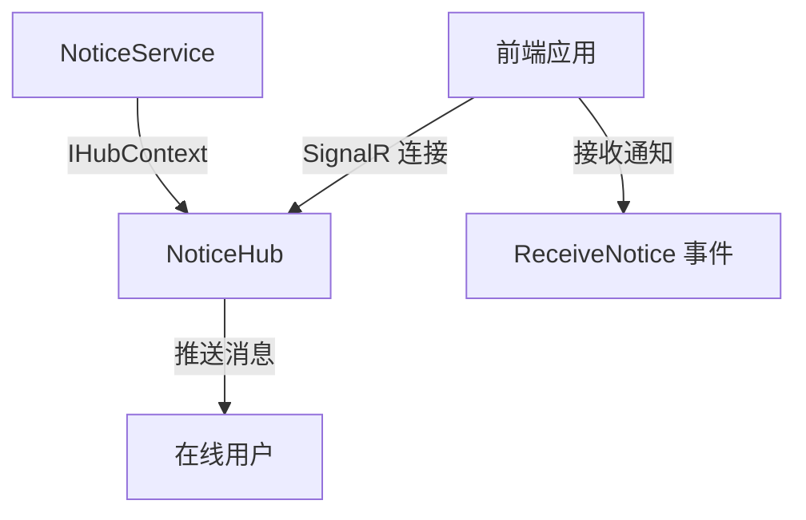

# NoticeHub

## 概述

NoticeHub 是通知公告的 SignalR Hub，用于实时推送通知消息给在线用户。该 Hub 主要由服务端主动推送，客户端只需接收消息。

**位置**：`module/rbac/Yi.Framework.Rbac.Application/SignalRHubs/NoticeHub.cs`
**层**：Application
**模块**：rbac
**依赖注入**：Transient（SignalR Hub 标准生命周期）

---

## 架构位置



## 核心职责

1. 接收服务端推送的通知消息
2. 向在线用户广播通知

## 关键接口

```csharp
// Hub 构造函数
public NoticeHub();
```

## 依赖注入配置

```csharp
// NoticeHub 无额外依赖
public NoticeHub()
{
}
```

## 数据流

```
创建通知
  → NoticeService.SendOnlineAsync()
    → IHubContext<NoticeHub>.Clients.All.SendAsync()
      → NoticeHub 推送消息
        → 客户端接收 ReceiveNotice 事件
```

## 服务端推送

NoticeHub 主要由服务端通过 `IHubContext` 推送消息：

```csharp
public async Task SendOnlineAsync([FromRoute] Guid id)
{
    var entity = await _repository._DbQueryable.FirstAsync(x => x.Id == id);
    await _hubContext.Clients.All.SendAsync("ReceiveNotice", entity.Type.ToString(), entity.Title, entity.Content);
}
```

## 源码片段

### 关键实现 - Hub 定义

```csharp
// 文件路径: module/rbac/Yi.Framework.Rbac.Application/SignalRHubs/NoticeHub.cs:5-17
[HubRoute("/hub/notice")]
[Authorize]
public class NoticeHub : AbpHub
{
    /// <summary>
    /// 由于发布功能，主要是服务端项客户端主动推送
    /// </summary>
    public NoticeHub()
    {
    }
}
```

## 权限控制

```csharp
// Hub 路由定义
[HubRoute("/hub/notice")]

// 需要授权
[Authorize]
```

## 相关组件

- [[NoticeService]] - 通知服务，通过 IHubContext 推送消息
- [[IHubContext]] - SignalR Hub 上下文接口
- [[NoticeAggregateRoot]] - 通知聚合根实体

## 业务规则

1. **服务端推送**：
   - Hub 不提供客户端调用方法
   - 主要由服务端通过 `IHubContext` 主动推送

2. **授权要求**：
   - 连接 Hub 需要用户认证
   - 未登录用户无法接收通知

3. **广播范围**：
   - 当前实现：推送给所有在线用户（`Clients.All`）
   - 扩展方向：支持按用户、角色、部门精准推送

## SignalR 事件

Hub 向客户端推送的事件：

| 事件名 | 数据 | 说明 |
|-------|------|------|
| `ReceiveNotice` | type, title, content | 接收通知消息 |

## 前端连接示例

```javascript
// 建立 SignalR 连接
const connection = new HubConnectionBuilder()
    .withUrl("/hub/notice", {
        accessTokenFactory: () => getToken() // 提供认证令牌
    })
    .build();

// 监听通知事件
connection.on("ReceiveNotice", (type, title, content) => {
    console.log("收到通知：", { type, title, content });
    showNotification(type, title, content);
});

// 启动连接
connection.start().catch(err => console.error(err));
```

## 推送方式对比

### 当前实现：广播给所有用户

```csharp
await _hubContext.Clients.All.SendAsync("ReceiveNotice", type, title, content);
```

### 扩展方向：精准推送

```csharp
// 推送给指定用户
await _hubContext.Clients.User(userId).SendAsync("ReceiveNotice", type, title, content);

// 推送给指定组
await _hubContext.Clients.Group(groupName).SendAsync("ReceiveNotice", type, title, content);

// 推送给指定连接
await _hubContext.Clients.Client(connectionId).SendAsync("ReceiveNotice", type, title, content);
```

## 离线消息处理

当前实现仅支持在线消息推送，离线消息功能预留：

```csharp
public async Task SendOfflineAsync([FromRoute] Guid id)
{
    //先发送一个在线
    await SendOnlineAsync(id);

    //然后将所有用户和通知id进行保留记录，判断是否已读还是未读
    //在首次请求返回全部未读的通知给前端即可
}
```

离线消息实现需要：
1. 维护用户-通知的阅读状态表
2. 用户登录时查询未读通知
3. 前端标记已读后更新状态

## 学习笔记

### 难点理解

1. **服务端推送模式**：Hub 不提供客户端方法，主要由服务端推送
2. **授权认证**：连接时需要提供有效的 JWT Token

### 疑问

- 如何实现按角色或部门精准推送？
- 离线消息的阅读状态表如何设计？

## 参考资料

- [ABP Framework SignalR 集成](https://docs.abp.io/en/ab/latest/SignalR-Integration)
- [ASP.NET Core SignalR](https://docs.microsoft.com/en-us/aspnet/core/signalr/)
- 项目源码：`module/rbac/Yi.Framework.Rbac.Application/SignalRHubs/NoticeHub.cs`

---
**状态**：✅ 完成
