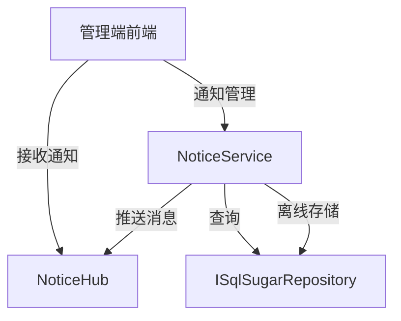
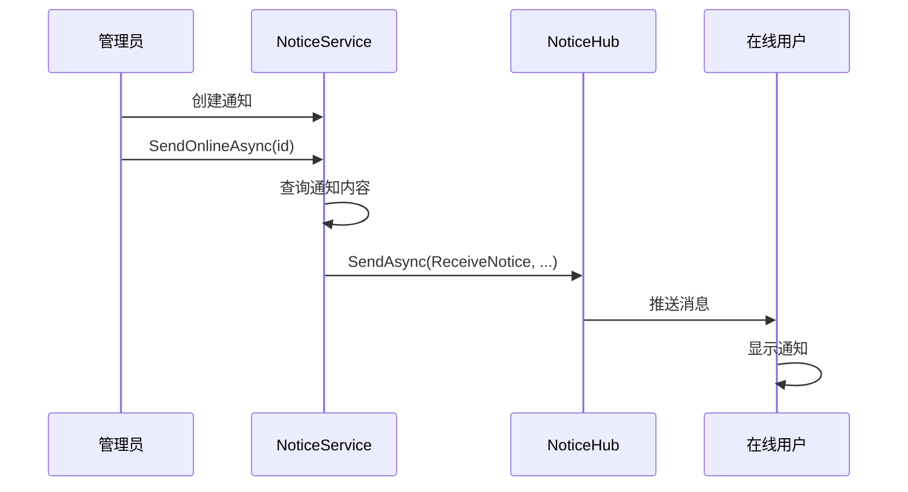

# NoticeService

## 概述

NoticeService 是通知公告管理的核心服务，提供通知的 CRUD 操作和实时推送功能。该服务集成了 SignalR，支持在线消息推送和离线消息存储。

**位置**：`module/rbac/Yi.Framework.Rbac.Application/Services/NoticeService.cs`
**层**：Application
**模块**：rbac
**依赖注入**：Scoped（继承自 YiCrudAppService）

---

## 架构位置



## 核心职责

1. 通知 CRUD 操作（创建、查询、更新、删除）
2. 在线消息实时推送
3. 离线消息存储
4. 通知类型管理（通知、公告）

## 关键接口

```csharp
// 查询通知列表
public override async Task<PagedResultDto<NoticeGetListOutputDto>> GetListAsync(NoticeGetListInput input);

// 创建通知
public override Task<NoticeGetOutputDto> CreateAsync(NoticeCreateInput input);

// 更新通知
public override Task<NoticeGetOutputDto> UpdateAsync(Guid id, NoticeUpdateInput input);

// 删除通知
public override Task DeleteAsync(IEnumerable<Guid> id);

// 发送在线消息
[HttpPost("notice/online/{id}")]
public async Task SendOnlineAsync([FromRoute] Guid id);

// 发送离线消息
[HttpPost("notice/offline/{id}")]
public async Task SendOfflineAsync([FromRoute] Guid id);
```

## 依赖注入配置

```csharp
// NoticeService 的核心依赖
public NoticeService(
    ISqlSugarRepository<NoticeAggregateRoot, Guid> repository,
    IHubContext<NoticeHub> hubContext) : base(repository)
{
    _hubContext = hubContext;
    _repository = repository;
}
```

## 数据流

```
发送在线消息
  → NoticeService.SendOnlineAsync()
    → ISqlSugarRepository.FirstAsync() - 查询通知内容
      → IHubContext.Clients.All.SendAsync() - 推送给所有在线用户
```

## 重要方法

### `GetListAsync()`

**作用**：查询通知列表，支持多条件过滤

**查询条件**：
- `Type`：通知类型过滤（通知、公告）
- `Title`：标题模糊查询
- `StartTime` / `EndTime`：创建时间范围

### `SendOnlineAsync()`

**作用**：发送在线消息给所有连接的客户端

**实现**：
```csharp
[HttpPost("notice/online/{id}")]
public async Task SendOnlineAsync([FromRoute] Guid id)
{
    var entity = await _repository._DbQueryable.FirstAsync(x => x.Id == id);
    await _hubContext.Clients.All.SendAsync("ReceiveNotice", entity.Type.ToString(), entity.Title, entity.Content);
}
```

**推送内容**：
- 通知类型（`Type`）
- 通知标题（`Title`）
- 通知内容（`Content`）

### `SendOfflineAsync()`

**作用**：发送离线消息（先发送在线消息，再存储离线记录）

**实现**：
```csharp
[HttpPost("notice/offline/{id}")]
public async Task SendOfflineAsync([FromRoute] Guid id)
{
    //先发送一个在线
    await SendOnlineAsync(id);

    //然后将所有用户和通知id进行保留记录，判断是否已读还是未读
    //在首次请求返回全部未读的通知给前端即可
}
```

**说明**：
- 离线消息功能预留实现
- 需要维护用户-通知的阅读状态
- 前端首次请求时返回未读通知列表

## 源码片段

### 关键实现 - 在线消息推送

```csharp
// 文件路径: module/rbac/Yi.Framework.Rbac.Application/Services/NoticeService.cs:48-53
[HttpPost("notice/online/{id}")]
public async Task SendOnlineAsync([FromRoute] Guid id)
{
    var entity = await _repository._DbQueryable.FirstAsync(x => x.Id == id);
    await _hubContext.Clients.All.SendAsync("ReceiveNotice", entity.Type.ToString(), entity.Title, entity.Content);
}
```

### 关键实现 - 离线消息处理

```csharp
// 文件路径: module/rbac/Yi.Framework.Rbac.Application/Services/NoticeService.cs:58-66
[HttpPost("notice/offline/{id}")]
public async Task SendOfflineAsync([FromRoute] Guid id)
{
    //先发送一个在线
    await SendOnlineAsync(id);

    //然后将所有用户和通知id进行保留记录，判断是否已读还是未读
    //在首次请求返回全部未读的通知给前端即可
}
```

## 权限控制

```csharp
// 操作通过基类 YiCrudAppService 自动处理
// 无额外的权限特性或操作日志记录
```

## SignalR 集成

NoticeService 通过 `IHubContext<NoticeHub>` 与 SignalR Hub 集成：

```csharp
private IHubContext<NoticeHub> _hubContext;

// 推送消息给所有客户端
await _hubContext.Clients.All.SendAsync("ReceiveNotice", type, title, content);

// 推送消息给特定用户
await _hubContext.Clients.User(userId).SendAsync("ReceiveNotice", type, title, content);

// 推送消息给特定组
await _hubContext.Clients.Group(groupName).SendAsync("ReceiveNotice", type, title, content);
```

## 相关组件

- [[NoticeAggregateRoot]] - 通知聚合根实体
- [[NoticeHub]] - 通知 SignalR Hub
- [[IHubContext]] - SignalR Hub 上下文接口

## 业务规则

1. **通知类型**：
   - 通知：个人通知消息
   - 公告：系统公告（所有用户可见）

2. **消息推送**：
   - 在线消息：通过 SignalR 实时推送
   - 离线消息：存储阅读状态，用户登录后查询未读消息

3. **消息范围**：
   - 当前实现：推送给所有在线用户（`Clients.All`）
   - 扩展方向：支持按用户、按角色、按部门推送

## 通知流程



## 学习笔记

### 难点理解

1. **SignalR Hub 集成**：通过 `IHubContext` 在服务中推送消息
2. **离线消息设计**：需要维护用户-通知的阅读状态表（当前预留实现）

### 疑问

- 如何实现按用户或角色精准推送？
- 离线消息的阅读状态表结构如何设计？
- 如何处理消息推送失败的情况？

## 参考资料

- [ABP Framework SignalR 集成](https://docs.abp.io/en/ab/latest/SignalR-Integration)
- [ASP.NET Core SignalR](https://docs.microsoft.com/en-us/aspnet/core/signalr/)
- 项目源码：`module/rbac/Yi.Framework.Rbac.Application/Services/NoticeService.cs`

---
**状态**：✅ 完成
