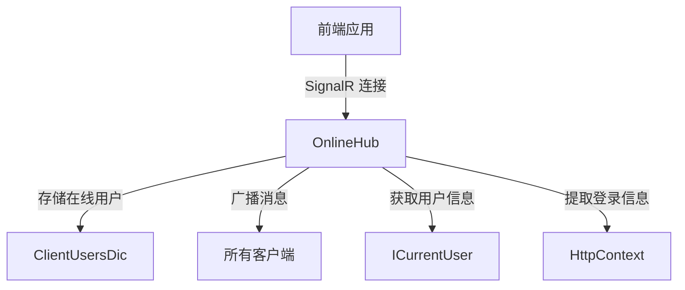

# OnlineHub

## 概述

OnlineHub 是在线用户的 SignalR Hub，实时管理用户连接状态。该 Hub 维护在线用户字典，自动处理用户连接和断开事件，并广播在线用户数量变化。

**位置**：`module/rbac/Yi.Framework.Rbac.Application/SignalRHubs/OnlineHub.cs`
**层**：Application
**模块**：rbac
**依赖注入**：Transient（SignalR Hub 标准生命周期）

---

## 架构位置



## 核心职责

1. 管理用户连接状态（连接、断开）
2. 维护在线用户字典
3. 广播在线用户数量变化
4. 提取用户登录信息

## 关键接口

```csharp
// 连接成功事件
public override Task OnConnectedAsync();

// 断开连接事件
public override Task OnDisconnectedAsync(Exception? exception);
```

## 依赖注入配置

```csharp
// OnlineHub 的核心依赖
public OnlineHub(IHttpContextAccessor httpContextAccessor)
{
    _httpContext = httpContextAccessor?.HttpContext;
}
```

## 数据流

```
用户连接
  → OnlineHub.OnConnectedAsync()
    → 提取用户信息和登录信息
      → 创建 OnlineUserModel
        → 移除旧的连接（多设备登录）
          → 添加到 ClientUsersDic
            → 广播在线用户数量
```

## 重要方法

### `OnConnectedAsync()`

**作用**：处理用户连接事件

**流程**：
1. 提取用户信息和登录信息（IP、浏览器、操作系统等）
2. 创建 `OnlineUserModel` 对象
3. 如果用户已登录，移除旧的连接（支持多设备登录）
4. 添加到 `ClientUsersDic` 字典
5. 广播最新的在线用户数量

**实现**：
```csharp
public override Task OnConnectedAsync()
{
    if (_httpContext is null)
    {
        return Task.CompletedTask;
    }
    var name = CurrentUser.UserName;
    var loginUser = new LoginLogAggregateRoot().GetInfoByHttpContext(_httpContext);

    OnlineUserModel user = new(Context.ConnectionId)
    {
        Browser = loginUser?.Browser,
        LoginLocation = loginUser?.LoginLocation,
        Ipaddr = loginUser?.LoginIp,
        LoginTime = DateTime.Now,
        Os = loginUser?.Os,
        UserName = name ?? "Null",
        UserId = CurrentUser.Id ?? Guid.Empty
    };

    //已登录
    if (CurrentUser.IsAuthenticated)
    {
        ClientUsersDic.RemoveAll(u => u.Value.UserId == CurrentUser.Id);
        _logger.LogDebug(
            $"{DateTime.Now}：{name},{Context.ConnectionId}连接服务端success，当前已连接{ClientUsersDic.Count}个");
    }

    ClientUsersDic.AddOrUpdate(Context.ConnectionId, user, (_, _) => user);

    //当有人加入，向全部客户端发送当前总数
    Clients.All.SendAsync("onlineNum", ClientUsersDic.Count);

    return base.OnConnectedAsync();
}
```

### `OnDisconnectedAsync()`

**作用**：处理用户断开连接事件

**流程**：
1. 如果用户已登录，移除用户的旧连接记录
2. 从 `ClientUsersDic` 中移除当前连接
3. 广播最新的在线用户数量

**实现**：
```csharp
public override Task OnDisconnectedAsync(Exception? exception)
{
    //已登录
    if (CurrentUser.IsAuthenticated)
    {
        ClientUsersDic.RemoveAll(u => u.Value.UserId == CurrentUser.Id);
        _logger.LogDebug($"用户{CurrentUser?.UserName}离开了，当前已连接{ClientUsersDic.Count}个");
    }
    ClientUsersDic.Remove(Context.ConnectionId, out _);
    Clients.All.SendAsync("onlineNum", ClientUsersDic.Count);
    return base.OnDisconnectedAsync(exception);
}
```

## 源码片段

### 关键实现 - 用户连接处理

```csharp
// 文件路径: module/rbac/Yi.Framework.Rbac.Application/SignalRHubs/OnlineHub.cs:32-66
public override Task OnConnectedAsync()
{
    if (_httpContext is null)
    {
        return Task.CompletedTask;
    }
    var name = CurrentUser.UserName;
    var loginUser = new LoginLogAggregateRoot().GetInfoByHttpContext(_httpContext);

    OnlineUserModel user = new(Context.ConnectionId)
    {
        Browser = loginUser?.Browser,
        LoginLocation = loginUser?.LoginLocation,
        Ipaddr = loginUser?.LoginIp,
        LoginTime = DateTime.Now,
        Os = loginUser?.Os,
        UserName = name ?? "Null",
        UserId = CurrentUser.Id ?? Guid.Empty
    };

    //已登录
    if (CurrentUser.IsAuthenticated)
    {
        ClientUsersDic.RemoveAll(u => u.Value.UserId == CurrentUser.Id);
        _logger.LogDebug(
            $"{DateTime.Now}：{name},{Context.ConnectionId}连接服务端success，当前已连接{ClientUsersDic.Count}个");
    }

    ClientUsersDic.AddOrUpdate(Context.ConnectionId, user, (_, _) => user);

    //当有人加入，向全部客户端发送当前总数
    Clients.All.SendAsync("onlineNum", ClientUsersDic.Count);

    return base.OnConnectedAsync();
}
```

## 权限控制

```csharp
// Hub 路由定义
[HubRoute("/hub/main")]

// 开放不需要授权（可选）
//[Authorize]
```

## 相关组件

- [[OnlineService]] - 在线用户服务，查询和管理在线用户
- [[OnlineUserModel]] - 在线用户模型
- [[LoginLogAggregateRoot]] - 登录日志聚合根
- [[ICurrentUser]] - ABP 当前用户接口

## 业务规则

1. **连接存储**：
   - 使用 `ConcurrentDictionary` 存储在线用户
   - 键为 `ConnectionId`，值为 `OnlineUserModel`

2. **多设备登录**：
   - 同一用户多次登录会移除旧的连接
   - 保证一个用户只有一个有效连接

3. **广播机制**：
   - 每次连接或断开都会广播最新的在线用户数量
   - 所有客户端都能收到 `onlineNum` 事件

## 在线用户字典

```csharp
public static ConcurrentDictionary<string, OnlineUserModel> ClientUsersDic { get; set; } = new();
```

- **键**：SignalR 连接 ID（`ConnectionId`）
- **值**：在线用户模型（`OnlineUserModel`）

## SignalR 事件

Hub 向客户端推送的事件：

| 事件名 | 数据 | 说明 |
|-------|------|------|
| `onlineNum` | 数字 | 在线用户总数 |
| `forceOut` | 字符串 | 强制退出消息 |

## 前端连接示例

```javascript
// 建立 SignalR 连接
const connection = new HubConnectionBuilder()
    .withUrl("/hub/main")
    .build();

// 监听在线用户数量
connection.on("onlineNum", (count) => {
    console.log("当前在线用户数：", count);
});

// 监听强制退出事件
connection.on("forceOut", (message) => {
    alert(message);
    logout();
});

// 启动连接
connection.start().catch(err => console.error(err));
```

## 学习笔记

### 难点理解

1. **静态字典存储**：使用静态字典存储在线用户，在内存中共享
2. **多设备登录处理**：新连接会移除旧连接，保证单用户单连接
3. **广播机制**：每次状态变化都广播给所有客户端

### 疑问

- 多服务器部署时如何共享在线用户状态？
- 如何实现用户会话的持久化？

## 参考资料

- [ABP Framework SignalR 集成](https://docs.abp.io/en/ab/latest/SignalR-Integration)
- [ASP.NET Core SignalR Hubs](https://docs.microsoft.com/en-us/aspnet/core/signalr/hubs)
- 项目源码：`module/rbac/Yi.Framework.Rbac.Application/SignalRHubs/OnlineHub.cs`

---
**状态**：✅ 完成
