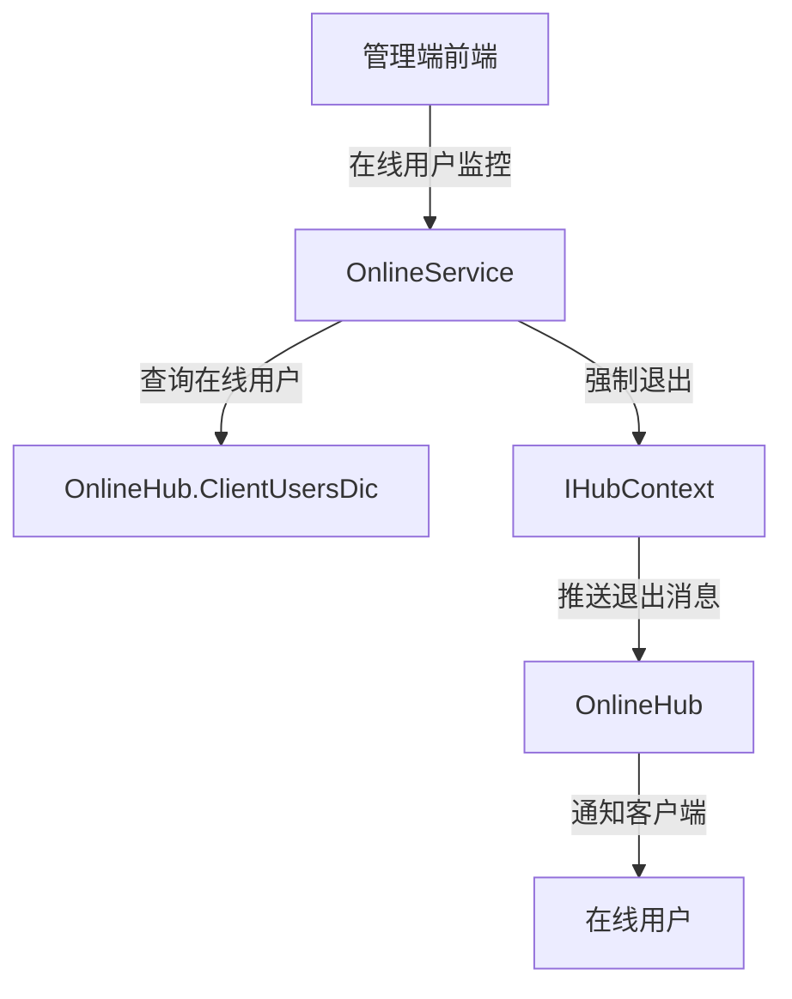
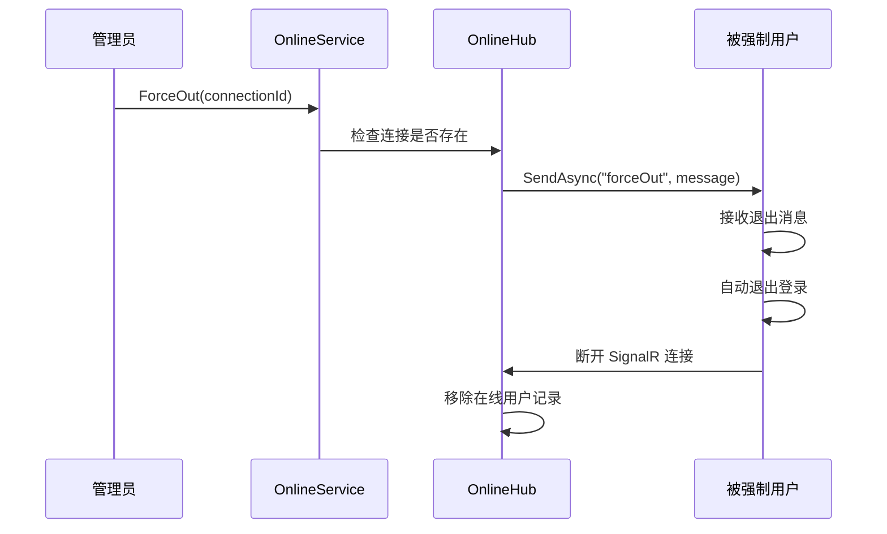

# OnlineService

## 概述

OnlineService 是在线用户监控的核心服务，提供在线用户查询和强制退出功能。该服务通过 SignalR 实时获取在线用户信息，支持管理员强制用户下线。

**位置**：`module/rbac/Yi.Framework.Rbac.Application/Services/Monitor/OnlineService.cs`
**层**：Application
**模块**：rbac
**依赖注入**：Scoped（继承自 ApplicationService）

---

## 架构位置



## 核心职责

1. 在线用户列表查询（IP、用户名过滤）
2. 强制用户退出
3. 在线用户统计

## 关键接口

```csharp
// 查询在线用户列表
public Task<PagedResultDto<OnlineUserModel>> GetListAsync([FromQuery] OnlineUserModel online);

// 强制用户退出
[HttpDelete]
[Route("online/{connnectionId}")]
public async Task<bool> ForceOut(string connnectionId);
```

## 依赖注入配置

```csharp
// OnlineService 的核心依赖
public OnlineService(ILogger<OnlineService> logger, IHubContext<OnlineHub> hub)
{
    _logger = logger;
    _hub = hub;
}
```

## 数据流

```
查询在线用户
  → OnlineService.GetListAsync()
    → OnlineHub.ClientUsersDic - 获取内存中的在线用户字典
      → 动态条件过滤（IP、用户名）
        → 返回分页结果
```

## 重要方法

### `GetListAsync()`

**作用**：查询在线用户列表，支持多条件过滤

**查询条件**：
- `Ipaddr`：IP 地址模糊查询
- `UserName`：用户名模糊查询

**数据来源**：
- 从 `OnlineHub.ClientUsersDic` 静态字典中获取
- 数据存储在内存中，实时更新

### `ForceOutAsync()`

**作用**：强制用户退出系统

**实现**：
```csharp
[HttpDelete]
[Route("online/{connnectionId}")]
public async Task<bool> ForceOut(string connnectionId)
{
    if (OnlineHub.ClientUsersDic.ContainsKey(connnectionId))
    {
        //前端接受到这个事件后，触发前端自动退出
        await _hub.Clients.Client(connnectionId).SendAsync("forceOut", "你已被强制退出！");
        return true;
    }

    return false;
}
```

**流程**：
1. 检查连接 ID 是否存在
2. 向指定连接发送 `forceOut` 事件
3. 前端接收到事件后自动退出登录

## 源码片段

### 关键实现 - 在线用户查询

```csharp
// 文件路径: module/rbac/Yi.Framework.Rbac.Application/Services/Monitor/OnlineService.cs:28-45
public Task<PagedResultDto<OnlineUserModel>> GetListAsync([FromQuery] OnlineUserModel online)
{
    var data = OnlineHub.ClientUsersDic;
    IEnumerable<OnlineUserModel> dataWhere = data.Values.AsEnumerable();

    if (!string.IsNullOrEmpty(online.Ipaddr))
    {
        dataWhere = dataWhere.Where((u) => u.Ipaddr!.Contains(online.Ipaddr));
    }

    if (!string.IsNullOrEmpty(online.UserName))
    {
        dataWhere = dataWhere.Where((u) => u.UserName!.Contains(online.UserName));
    }

    return Task.FromResult(new PagedResultDto<OnlineUserModel>()
        { TotalCount = data.Count, Items = dataWhere.ToList() });
}
```

### 关键实现 - 强制退出

```csharp
// 文件路径: module/rbac/Yi.Framework.Rbac.Application/Services/Monitor/OnlineService.cs:53-65
[HttpDelete]
[Route("online/{connnectionId}")]
public async Task<bool> ForceOut(string connnectionId)
{
    if (OnlineHub.ClientUsersDic.ContainsKey(connnectionId))
    {
        //前端接受到这个事件后，触发前端自动退出
        await _hub.Clients.Client(connnectionId).SendAsync("forceOut", "你已被强制退出！");
        return true;
    }

    return false;
}
```

## 权限控制

```csharp
// 强制退出操作需要管理员权限
[HttpDelete]
[Route("online/{connnectionId}")]
public async Task<bool> ForceOut(string connnectionId);
```

## 相关组件

- [[OnlineHub]] - 在线用户 SignalR Hub
- [[IHubContext]] - SignalR Hub 上下文接口
- [[OnlineUserModel]] - 在线用户模型

## 业务规则

1. **在线用户存储**：
   - 使用 `ConcurrentDictionary` 存储在线用户
   - 存储在内存中，不持久化
   - 断开连接后自动移除

2. **强制退出**：
   - 通过 SignalR 向指定连接推送退出消息
   - 前端接收到消息后自动退出登录
   - 支持管理员强制用户下线

3. **多设备登录**：
   - 同一用户多次登录会移除旧的连接
   - 在 `OnlineHub.OnConnectedAsync()` 中处理

## 在线用户信息

在线用户模型包含的信息：

```csharp
public class OnlineUserModel
{
    public string ConnectionId { get; set; }      // SignalR 连接 ID
    public string? UserName { get; set; }         // 用户名
    public Guid UserId { get; set; }              // 用户 ID
    public string? Ipaddr { get; set; }           // IP 地址
    public string? Browser { get; set; }          // 浏览器
    public string? Os { get; set; }                // 操作系统
    public string? LoginLocation { get; set; }     // 登录位置
    public DateTime LoginTime { get; set; }       // 登录时间
}
```

## 强制退出流程



## 学习笔记

### 难点理解

1. **内存存储**：在线用户信息存储在内存中，不持久化
2. **SignalR 推送**：通过 `IHubContext` 向特定连接推送消息

### 疑问

- 多服务器部署时如何共享在线用户信息？
- 如何实现单用户单设备登录限制？

## 参考资料

- [ABP Framework SignalR 集成](https://docs.abp.io/en/ab/latest/SignalR-Integration)
- [ASP.NET Core SignalR](https://docs.microsoft.com/en-us/aspnet/core/signalr/)
- 项目源码：`module/rbac/Yi.Framework.Rbac.Application/Services/Monitor/OnlineService.cs`

---
**状态**：✅ 完成
