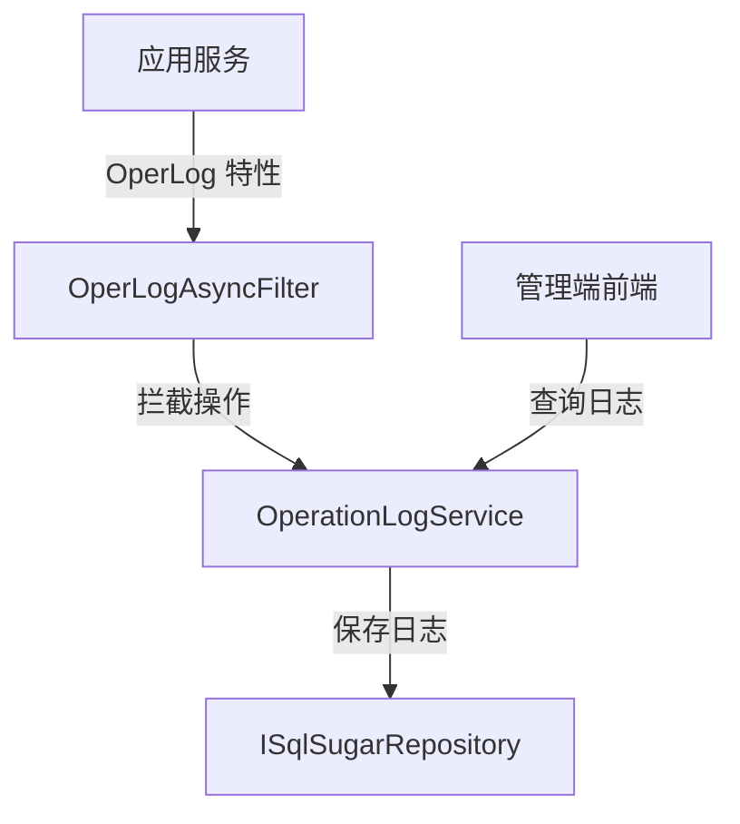

# OperationLogService

## 概述

OperationLogService 是操作日志管理的核心服务，记录用户的增删改操作行为。操作日志通过 `OperLog` 特性自动记录，无需手动调用。

**位置**：`module/rbac/Yi.Framework.Rbac.Application/Services/RecordLog/OperationLogService.cs`
**层**：Application
**模块**：rbac
**依赖注入**：Scoped（继承自 YiCrudAppService）

---

## 架构位置



## 核心职责

1. 操作日志查询（标题、用户、操作类型、时间范围）
2. 操作日志自动记录（通过 AOP 拦截）
3. 操作行为审计

## 关键接口

```csharp
// 查询操作日志列表
public override async Task<PagedResultDto<OperationLogGetListOutputDto>> GetListAsync(OperationLogGetListInputVo input);
```

## 依赖注入配置

```csharp
// OperationLogService 的核心依赖
public OperationLogService(ISqlSugarRepository<OperationLogEntity, Guid> repository) : base(repository)
{
    _repository = repository;
}
```

## 数据流

```
用户执行操作
  → 应用服务方法（标记 OperLog 特性）
    → OperLogAsyncFilter.OnActionExecutionAsync() - AOP 拦截
      → 提取操作信息（方法、参数、结果）
        → ISqlSugarRepository.InsertAsync() - 保存日志
```

## 重要方法

### `GetListAsync()`

**作用**：查询操作日志列表，支持多条件过滤

**查询条件**：
- `Title`：操作标题模糊查询
- `OperUser`：操作用户名模糊查询
- `OperType`：操作类型过滤（新增、修改、删除等）
- `StartTime` / `EndTime`：操作时间范围

**排序**：按 `CreationTime` 降序排列

## 源码片段

### 关键实现 - 操作日志查询

```csharp
// 文件路径: module/rbac/Yi.Framework.Rbac.Application/Services/RecordLog/OperationLogService.cs:30-45
public override async Task<PagedResultDto<OperationLogGetListOutputDto>> GetListAsync(OperationLogGetListInputVo input)
{
    RefAsync<int> total = 0;

    var query = _repository._DbQueryable
        .WhereIF(!string.IsNullOrEmpty(input.Title), x => x.Title.Contains(input.Title!))
        .WhereIF(!string.IsNullOrEmpty(input.OperUser), x => x.OperUser.Contains(input.OperUser!))
        .WhereIF(input.OperType is not null, x => x.OperType == input.OperType)
        .WhereIF(input.StartTime is not null, x => x.CreationTime >= input.StartTime)
        .WhereIF(input.EndTime is not null, x => x.CreationTime <= input.EndTime)
        .OrderByDescending(x => x.CreationTime); // 按创建时间倒序排列

    var entities = await query.ToPageListAsync(input.SkipCount, input.MaxResultCount, total);

    return new PagedResultDto<OperationLogGetListOutputDto>(total, await MapToGetListOutputDtosAsync(entities));
}
```

## 权限控制

```csharp
// 禁用更新操作（日志不可修改）
[RemoteService(false)]
public override Task<OperationLogGetListOutputDto> UpdateAsync(Guid id, OperationLogGetListOutputDto input)
{
    return base.UpdateAsync(id, input);
}
```

## 相关组件

- [[OperationLogEntity]] - 操作日志实体
- [[OperLogAsyncFilter]] - 操作日志 AOP 过滤器
- [[OperLogAttribute]] - 操作日志特性

## 业务规则

1. **日志记录方式**：
   - 通过 AOP 自动拦截标记了 `OperLog` 特性的方法
   - 在方法执行前后记录操作信息

2. **日志不可修改**：
   - 禁用更新接口（`[RemoteService(false)]`）
   - 保证日志的真实性和完整性

3. **操作类型**：
   - `Insert`：新增操作
   - `Update`：修改操作
   - `Delete`：删除操作
   - `Login`：登录操作
   - `Other`：其他操作

## 操作日志特性使用

在应用服务方法上使用 `OperLog` 特性：

```csharp
[OperLog("添加用户", OperEnum.Insert)]
public async Task<UserGetOutputDto> CreateAsync(UserCreateInputVo input)
{
    // 业务逻辑
}

[OperLog("更新用户", OperEnum.Update)]
public async Task<UserGetOutputDto> UpdateAsync(Guid id, UserUpdateInputVo input)
{
    // 业务逻辑
}

[OperLog("删除用户", OperEnum.Delete)]
public Task DeleteAsync(IEnumerable<Guid> id)
{
    // 业务逻辑
}
```

## 操作日志信息

操作日志记录的信息：

```csharp
public class OperationLogEntity
{
    public string? Title { get; set; }          // 操作标题
    public string? OperUser { get; set; }       // 操作用户
    public OperEnum OperType { get; set; }       // 操作类型
    public string? OperMethod { get; set; }      // 操作方法
    public string? OperParam { get; set; }       // 操作参数
    public string? OperResult { get; set; }       // 操作结果
    public DateTime CreationTime { get; set; }    // 操作时间
    // ...
}
```

## AOP 拦截流程

操作日志通过 ASP.NET Core 的 Action Filter 自动记录：

```csharp
public class OperLogAsyncFilter : ActionFilterAttribute
{
    public override async Task OnActionExecutionAsync(ActionExecutingContext context, ActionExecutionDelegate next)
    {
        // 1. 提取操作信息
        var operLogAttr = context.ActionDescriptor.GetMethodInfo().GetCustomAttribute<OperLogAttribute>();
        
        // 2. 执行业务逻辑
        var resultContext = await next();
        
        // 3. 记录操作日志
        var operLog = new OperationLogEntity
        {
            Title = operLogAttr?.Title,
            OperUser = currentUser.UserName,
            OperType = operLogAttr?.OperType,
            OperMethod = context.ActionDescriptor.DisplayName,
            OperParam = JsonConvert.SerializeObject(context.ActionArguments),
            OperResult = resultContext.Exception?.Message ?? "Success"
        };
        
        await _repository.InsertAsync(operLog);
    }
}
```

## 学习笔记

### 难点理解

1. **AOP 拦截模式**：通过 Action Filter 自动拦截操作并记录日志
2. **日志不可修改**：禁用更新接口保证日志完整性

### 疑问

- 如何过滤敏感参数（如密码）的记录？
- 如何实现操作日志的归档和清理？

## 参考资料

- [ABP Framework 审计日志](https://docs.abp.io/en/ab/latest/Audit-Logging)
- [ASP.NET Core Filters](https://docs.microsoft.com/en-us/aspnet/core/mvc/controllers/filters)
- 项目源码：`module/rbac/Yi.Framework.Rbac.Application/Services/RecordLog/OperationLogService.cs`

---
**状态**：✅ 完成
