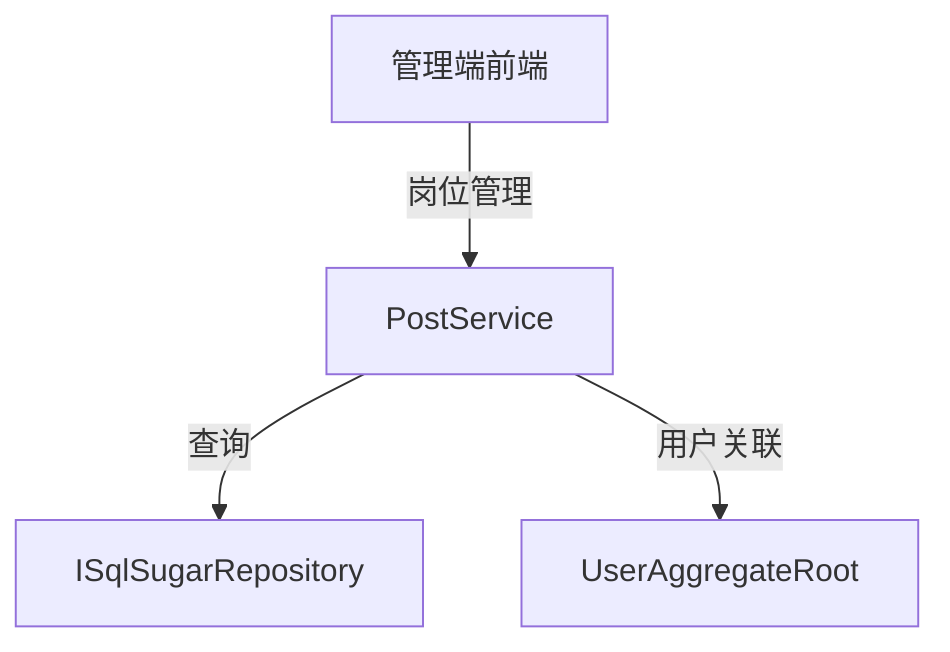

# PostService

## 概述

PostService 是岗位管理的核心服务，提供岗位的 CRUD 操作。岗位用于标识用户的职位信息，是组织架构的细粒度补充。

**位置**：`module/rbac/Yi.Framework.Rbac.Application/Services/System/PostService.cs`
**层**：Application
**模块**：rbac
**依赖注入**：Scoped（继承自 YiCrudAppService）

---

## 架构位置



## 核心职责

1. 岗位 CRUD 操作（创建、查询、更新、删除）
2. 岗位唯一性验证
3. 岗位排序管理

## 关键接口

```csharp
// 查询岗位列表
public override async Task<PagedResultDto<PostGetListOutputDto>> GetListAsync(PostGetListInputVo input);

// 创建岗位
[OperLog("添加岗位", OperEnum.Insert)]
public override Task<PostGetOutputDto> CreateAsync(PostCreateInputVo input);

// 更新岗位
[OperLog("更新岗位", OperEnum.Update)]
public override Task<PostGetOutputDto> UpdateAsync(Guid id, PostUpdateInputVo input);

// 删除岗位
[OperLog("删除岗位", OperEnum.Delete)]
public override Task DeleteAsync(IEnumerable<Guid> id);
```

## 依赖注入配置

```csharp
// PostService 的核心依赖
public PostService(ISqlSugarRepository<PostAggregateRoot, Guid> repository) : base(repository)
{
    _repository = repository;
}
```

## 数据流

```
查询岗位列表
  → PostService.GetListAsync()
    → ISqlSugarRepository._DbQueryable - 构建查询
      → WhereIF - 动态条件过滤
        → OrderByDescending(OrderNum) - 按排序号降序
          → ToPageListAsync - 分页查询
            → 返回分页结果
```

## 重要方法

### `GetListAsync()`

**作用**：查询岗位列表，支持多条件过滤

**查询条件**：
- `PostName`：岗位名称模糊查询
- `State`：状态过滤（启用/禁用）

**排序**：按 `OrderNum` 降序排列

## 源码片段

### 关键实现 - 岗位列表查询

```csharp
// 文件路径: module/rbac/Yi.Framework.Rbac.Application/Services/System/PostService.cs:27-37
public override async Task<PagedResultDto<PostGetListOutputDto>> GetListAsync(PostGetListInputVo input)
{
    RefAsync<int> total = 0;

    var entities = await _repository._DbQueryable.WhereIF(!string.IsNullOrEmpty(input.PostName),
            x => x.PostName.Contains(input.PostName!))
        .WhereIF(input.State is not null, x => x.State == input.State)
        .OrderByDescending(x => x.OrderNum)
        .ToPageListAsync(input.SkipCount, input.MaxResultCount, total);
    return new PagedResultDto<PostGetListOutputDto>(total, await MapToGetListOutputDtosAsync(entities));
}
```

### 关键实现 - 岗位唯一性验证

```csharp
// 文件路径: module/rbac/Yi.Framework.Rbac.Application/Services/System/PostService.cs:39-47
protected override async Task CheckCreateInputDtoAsync(PostCreateInputVo input)
{
    var isExist =
        await _repository.IsAnyAsync(x => x.PostCode == input.PostCode);
    if (isExist)
    {
        throw new UserFriendlyException(PostConst.Exist);
    }
}
```

### 关键实现 - 更新唯一性验证

```csharp
// 文件路径: module/rbac/Yi.Framework.Rbac.Application/Services/System/PostService.cs:49-57
protected override async Task CheckUpdateInputDtoAsync(PostAggregateRoot entity, PostUpdateInputVo input)
{
    var isExist = await _repository._DbQueryable.Where(x => x.Id != entity.Id)
        .AnyAsync(x => x.PostCode == input.PostCode);
    if (isExist)
    {
        throw new UserFriendlyException(RoleConst.Exist);
    }
}
```

## 权限控制

```csharp
// 所有操作都需要操作日志记录
[OperLog("添加岗位", OperEnum.Insert)]
public override Task<PostGetOutputDto> CreateAsync(PostCreateInputVo input);

[OperLog("更新岗位", OperEnum.Update)]
public override Task<PostGetOutputDto> UpdateAsync(Guid id, PostUpdateInputVo input);

[OperLog("删除岗位", OperEnum.Delete)]
public override Task DeleteAsync(IEnumerable<Guid> id);
```

## 相关组件

- [[PostAggregateRoot]] - 岗位聚合根实体
- [[UserAggregateRoot]] - 用户实体（关联岗位）
- [[RoleService]] - 角色服务
- [[DeptService]] - 部门服务

## 业务规则

1. **岗位唯一性**：
   - 岗位编码必须唯一

2. **岗位排序**：
   - 使用 `OrderNum` 字段进行排序
   - 数值越大排序越靠前

3. **岗位-用户关联**：
   - 用户通过 `PostId` 字段关联岗位
   - 一个用户可以拥有多个岗位（根据实体设计）

## 岗位与角色、部门的关系

- **部门**：组织架构的层级结构
- **角色**：权限和功能访问控制
- **岗位**：职位的细粒度标识

三者结合使用可以实现：
- 按部门进行数据权限控制
- 按角色进行功能权限控制
- 按岗位进行业务逻辑区分

## 学习笔记

### 难点理解

1. **岗位编码唯一性**：创建和更新时都需要验证岗位编码的唯一性
2. **排序逻辑**：使用 `OrderNum` 字段进行排序，数值越大越靠前

### 疑问

- 岗位与权限是否有直接的关联关系？
- 一个用户是否可以拥有多个岗位？

## 参考资料

- [ABP Framework 应用服务文档](https://docs.abp.io/en/abp/latest/Application-Services)
- 项目源码：`module/rbac/Yi.Framework.Rbac.Application/Services/System/PostService.cs`

---
**状态**：✅ 完成
