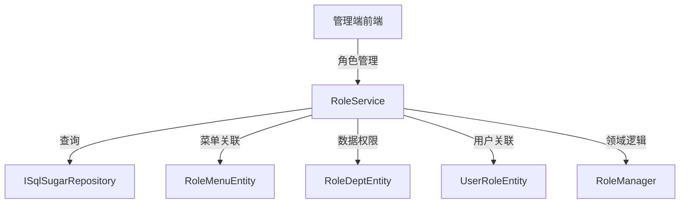

# RoleService

## 概述

RoleService 是角色管理的核心服务，提供角色的 CRUD 操作、角色-菜单关联管理、角色-部门关联（数据权限）等功能。该服务是 RBAC 权限模型的核心组件。

**位置**：`module/rbac/Yi.Framework.Rbac.Application/Services/System/RoleService.cs`
**层**：Application
**模块**：rbac
**依赖注入**：Scoped（继承自 YiCrudAppService）

---

## 架构位置



## 核心职责

1. 角色 CRUD 操作（创建、查询、更新、删除）
2. 角色-菜单关联管理（功能权限）
3. 角色-部门关联管理（数据权限）
4. 角色数据范围控制（全部、本部门、本部门及子部门、自定义）
5. 角色-用户关联管理

## 关键接口

```csharp
// 查询角色列表
public override async Task<PagedResultDto<RoleGetListOutputDto>> GetListAsync(RoleGetListInputVo input);

// 创建角色
[OperLog("添加角色", OperEnum.Insert)]
public override async Task<RoleGetOutputDto> CreateAsync(RoleCreateInputVo input);

// 更新角色
public override async Task<RoleGetOutputDto> UpdateAsync(Guid id, RoleUpdateInputVo input);

// 删除角色
public override Task DeleteAsync(IEnumerable<Guid> id);

// 更新数据权限
public async Task UpdateDataScopeAsync(UpdateDataScopeInput input);
```

## 依赖注入配置

```csharp
// RoleService 的核心依赖
public RoleService(
    RoleManager roleManager,
    ISqlSugarRepository<RoleDeptEntity> roleDeptRepository,
    ISqlSugarRepository<UserRoleEntity> userRoleRepository,
    ISqlSugarRepository<RoleAggregateRoot, Guid> repository,
    ISqlSugarRepository<UserAggregateRoot> userRepository)
```

## 数据流

```
更新角色数据权限
  → RoleService.UpdateDataScopeAsync()
    → 删除旧的部门关联
      → 创建新的部门关联（如果数据范围为自定义）
        → 更新角色的 DataScope 字段
```

## 重要方法

### `GetListAsync()`

**作用**：查询角色列表，支持多条件过滤

**查询条件**：
- `RoleCode`：角色编码模糊查询
- `RoleName`：角色名称模糊查询
- `State`：状态过滤（启用/禁用）

### `CreateAsync()`

**作用**：创建新角色

**验证逻辑**：
```csharp
var isExist = await _repository.IsAnyAsync(x => x.RoleCode == input.RoleCode || x.RoleName == input.RoleName);
if (isExist)
{
    throw new UserFriendlyException(RoleConst.Exist);
}
```

**约束**：
- 角色编码必须唯一
- 角色名称必须唯一

### `UpdateDataScopeAsync()`

**作用**：更新角色的数据权限范围

**数据范围类型**（DataScopeEnum）：
- `ALL`：全部数据权限
- `CUSTOM`：自定义数据权限
- `DEPT`：本部门数据权限
- `DEPT_AND_CHILD`：本部门及子部门数据权限
- `ONLY`：仅本人数据权限

**处理逻辑**：
```csharp
public async Task UpdateDataScopeAsync(UpdateDataScopeInput input)
{
    //只有自定义的需要特殊处理
    if (input.DataScope == DataScopeEnum.CUSTOM)
    {
        await _roleDeptRepository.DeleteAsync(x => x.RoleId == input.RoleId);
        var insertEntities = input.DeptIds.Select(x => new RoleDeptEntity { DeptId = x, RoleId = input.RoleId })
            .ToList();
        await _roleDeptRepository.InsertRangeAsync(insertEntities);
    }

    var entity = new RoleAggregateRoot() { DataScope = input.DataScope };
    EntityHelper.TrySetId(entity, () => input.RoleId);
    await _repository._Db.Updateable(entity).UpdateColumns(x => x.DataScope).ExecuteCommandAsync();
}
```

## 源码片段

### 关键实现 - 数据权限更新

```csharp
// 文件路径: module/rbac/Yi.Framework.Rbac.Application/Services/System/RoleService.cs:46-60
public async Task UpdateDataScopeAsync(UpdateDataScopeInput input)
{
    //只有自定义的需要特殊处理
    if (input.DataScope == DataScopeEnum.CUSTOM)
    {
        await _roleDeptRepository.DeleteAsync(x => x.RoleId == input.RoleId);
        var insertEntities = input.DeptIds.Select(x => new RoleDeptEntity { DeptId = x, RoleId = input.RoleId })
            .ToList();
        await _roleDeptRepository.InsertRangeAsync(insertEntities);
    }

    var entity = new RoleAggregateRoot() { DataScope = input.DataScope };
    EntityHelper.TrySetId(entity, () => input.RoleId);
    await _repository._Db.Updateable(entity).UpdateColumns(x => x.DataScope).ExecuteCommandAsync();
}
```

### 关键实现 - 创建角色

```csharp
// 文件路径: module/rbac/Yi.Framework.Rbac.Application/Services/System/RoleService.cs:79-94
[OperLog("添加角色", OperEnum.Insert)]
public override async Task<RoleGetOutputDto> CreateAsync(RoleCreateInputVo input)
{
    var isExist =
        await _repository.IsAnyAsync(x => x.RoleCode == input.RoleCode || x.RoleName == input.RoleName);
    if (isExist)
    {
        throw new UserFriendlyException(RoleConst.Exist);
    }

    var entity = await MapToEntityAsync(input);
    await _repository.InsertAsync(entity);
    var outputDto = await MapToGetOutputDtoAsync(entity);

    return outputDto;
}
```

## 权限控制

```csharp
// 创建角色需要操作日志
[OperLog("添加角色", OperEnum.Insert)]
public override async Task<RoleGetOutputDto> CreateAsync(RoleCreateInputVo input);

// 其他操作通过基类 YiCrudAppService 自动处理
```

## 相关组件

- [[RoleManager]] - 角色领域管理器
- [[RoleAggregateRoot]] - 角色聚合根实体
- [[RoleDeptEntity]] - 角色-部门关联实体（数据权限）
- [[RoleMenuEntity]] - 角色-菜单关联实体（功能权限）
- [[UserRoleEntity]] - 用户-角色关联实体
- [[MenuService]] - 菜单服务
- [[DeptService]] - 部门服务

## 业务规则

1. **角色唯一性**：
   - 角色编码必须唯一
   - 角色名称必须唯一

2. **数据权限类型**：
   - `ALL`：可以访问所有数据
   - `CUSTOM`：只能访问指定部门的数据（通过 RoleDeptEntity 配置）
   - `DEPT`：只能访问本部门的数据
   - `DEPT_AND_CHILD`：可以访问本部门及子部门的数据
   - `ONLY`：只能访问本人创建的数据

3. **角色-菜单关联**：
   - 通过 `RoleMenuEntity` 中间表维护
   - 一个角色可以拥有多个菜单权限

4. **角色-用户关联**：
   - 通过 `UserRoleEntity` 中间表维护
   - 一个用户可以拥有多个角色

## 学习笔记

### 难点理解

1. **数据权限设计**：通过 `DataScope` 枚举和 `RoleDeptEntity` 关联表实现灵活的数据权限控制
2. **自定义数据权限**：只有 `DataScopeEnum.CUSTOM` 类型才需要维护部门关联表
3. **批量更新优化**：使用 `UpdateColumns` 只更新特定字段，提高性能

### 疑问

- 删除角色时如何处理关联的用户和菜单？
- 如何实现角色之间的继承关系？

## 参考资料

- [ABP Framework 数据过滤文档](https://docs.abp.io/en/abp/latest/Data-Filtering)
- [RBAC 权限模型设计](https://en.wikipedia.org/wiki/Role-based_access_control)
- 项目源码：`module/rbac/Yi.Framework.Rbac.Application/Services/System/RoleService.cs`

---
**状态**：✅ 完成
