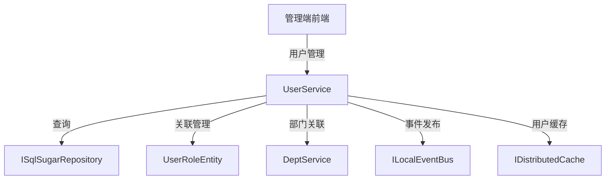

# UserService

## 概述

UserService 是用户管理的核心服务，提供用户的 CRUD 操作、用户-角色关联管理、用户-部门关联等功能。该服务继承自 YiCrudAppService，自动提供标准的增删改查接口。

**位置**：`module/rbac/Yi.Framework.Rbac.Application/Services/System/UserService.cs`
**层**：Application
**模块**：rbac
**依赖注入**：Scoped（继承自 YiCrudAppService）

---

## 架构位置



## 核心职责

1. 用户 CRUD 操作（创建、查询、更新、删除）
2. 用户-角色关联管理
3. 用户-部门关联管理
4. 用户数据权限控制（基于部门）
5. 用户状态管理（启用/禁用）

## 关键接口

```csharp
// 查询用户列表
[Permission("system:user:list")]
public override async Task<PagedResultDto<UserGetListOutputDto>> GetListAsync(UserGetListInputVo input);

// 创建用户
public override async Task<UserGetOutputDto> CreateAsync(UserCreateInputVo input);

// 更新用户
public override async Task<UserGetOutputDto> UpdateAsync(Guid id, UserUpdateInputVo input);

// 删除用户
public override Task DeleteAsync(IEnumerable<Guid> id);

// 获取用户详情
public override async Task<UserGetOutputDto> GetAsync(Guid id);
```

## 依赖注入配置

```csharp
// UserService 的核心依赖
public UserService(
    ISqlSugarRepository<UserAggregateRoot, Guid> repository,
    UserManager userManager,
    IUserRepository userRepository,
    ICurrentUser currentUser,
    IDeptService deptService,
    ILocalEventBus localEventBus,
    IDistributedCache<UserInfoCacheItem, UserInfoCacheKey> userCache,
    ISqlSugarRepository<UserRoleEntity> userRoleRepository,
    ISqlSugarRepository<SubstationUserEntity, Guid> substationUserRepository)
```

## 数据流

```
查询用户列表
  → UserService.GetListAsync()
    → DeptService.GetChildListAsync() - 获取子部门 ID 列表
      → ISqlSugarRepository._DbQueryable - 构建查询
        → WhereIF - 动态条件过滤
          → ToPageListAsync - 分页查询
            → MapToGetListOutputDtosAsync - DTO 映射
              → 返回分页结果
```

## 重要方法

### `GetListAsync()`

**作用**：查询用户列表，支持多条件过滤和部门数据权限

**查询条件**：
- `UserName`：用户名模糊查询
- `Phone`：手机号模糊查询
- `Name`：姓名模糊查询
- `State`：状态过滤（启用/禁用）
- `DeptId`：部门过滤（包含子部门）
- `Ids`：指定 ID 列表查询
- `StartTime` / `EndTime`：创建时间范围

**特殊处理**：
```csharp
// 如果指定了部门，会查询所有子部门
List<Guid> deptIds = null;
if (input.DeptId is not null)
{
    deptIds = await _deptService.GetChildListAsync(input.DeptId ?? Guid.Empty);
}

// 部门过滤会包含所有子部门
.WhereIF(input.DeptId is not null, x => deptIds.Contains(x.DeptId ?? Guid.Empty))
```

### `MapToEntity()`

**作用**：创建用户时处理密码加密

**实现**：
```csharp
protected override UserAggregateRoot MapToEntity(UserCreateInputVo createInput)
{
    var output = base.MapToEntity(createInput);
    // 使用值对象进行密码加密
    output.EncryPassword = new Domain.Entities.ValueObjects.EncryPasswordValueObject(createInput.Password);
    return output;
}
```

## 源码片段

### 关键实现 - 用户列表查询

```csharp
// 文件路径: module/rbac/Yi.Framework.Rbac.Application/Services/System/UserService.cs:59-91
[Permission("system:user:list")]
public override async Task<PagedResultDto<UserGetListOutputDto>> GetListAsync(UserGetListInputVo input)
{
    RefAsync<int> total = 0;
    List<Guid> deptIds = null;
    if (input.DeptId is not null)
    {
        deptIds = await _deptService.GetChildListAsync(input.DeptId ?? Guid.Empty);
    }

    List<Guid> ids = input.Ids?.Split(",").Select(x => Guid.Parse(x)).ToList();
    var outPut = await _repository._DbQueryable.WhereIF(!string.IsNullOrEmpty(input.UserName),
            x => x.UserName.Contains(input.UserName!))
        .WhereIF(input.Phone is not null, x => x.Phone.ToString()!.Contains(input.Phone.ToString()!))
        .WhereIF(!string.IsNullOrEmpty(input.Name), x => x.Name!.Contains(input.Name!))
        .WhereIF(input.State is not null, x => x.State == input.State)
        .WhereIF(input.StartTime is not null && input.EndTime is not null,
            x => x.CreationTime >= input.StartTime && x.CreationTime <= input.EndTime)
        .WhereIF(input.DeptId is not null, x => deptIds.Contains(x.DeptId ?? Guid.Empty))
        .WhereIF(ids is not null, x => ids.Contains(x.Id))
        .LeftJoin<DeptAggregateRoot>((user, dept) => user.DeptId == dept.Id)
        .OrderByDescending(user => user.CreationTime)
        .Select((user, dept) => new UserGetListOutputDto(), true)
        .ToPageListAsync(input.SkipCount, input.MaxResultCount, total);

    return new PagedResultDto<UserGetListOutputDto> { Items = outPut, TotalCount = total };
}
```

## 权限控制

```csharp
// 查询用户列表需要权限
[Permission("system:user:list")]
public override async Task<PagedResultDto<UserGetListOutputDto>> GetListAsync(UserGetListInputVo input);

// 其他操作通过基类 YiCrudAppService 自动处理权限
```

## 相关组件

- [[UserManager]] - 用户领域管理器
- [[UserAggregateRoot]] - 用户聚合根实体
- [[UserRoleEntity]] - 用户-角色关联实体
- [[DeptService]] - 部门服务，用于数据权限
- [[RoleService]] - 角色服务

## 业务规则

1. **密码处理**：
   - 创建用户时自动加密密码
   - 使用 `EncryPasswordValueObject` 值对象进行加密

2. **部门数据权限**：
   - 按部门查询时包含所有子部门
   - 使用 `DeptService.GetChildListAsync()` 递归获取子部门

3. **用户-角色关联**：
   - 通过 `UserRoleEntity` 中间表维护
   - 一个用户可以拥有多个角色

4. **用户-变电站关联**：
   - 通过 `SubstationUserEntity` 中间表维护
   - 支持多变电站访问权限

## 学习笔记

### 难点理解

1. **部门树查询**：查询部门用户时需要递归获取所有子部门 ID
2. **动态条件**：使用 `WhereIF` 实现可选查询条件
3. **关联查询**：使用 `LeftJoin` 关联部门表进行联合查询

### 疑问

- 用户删除时如何处理关联的角色和变电站数据？
- 用户状态禁用后是否会影响已登录的会话？

## 参考资料

- [ABP Framework 应用服务文档](https://docs.abp.io/en/abp/latest/Application-Services)
- 项目源码：`module/rbac/Yi.Framework.Rbac.Application/Services/System/UserService.cs`

---
**状态**：✅ 完成
