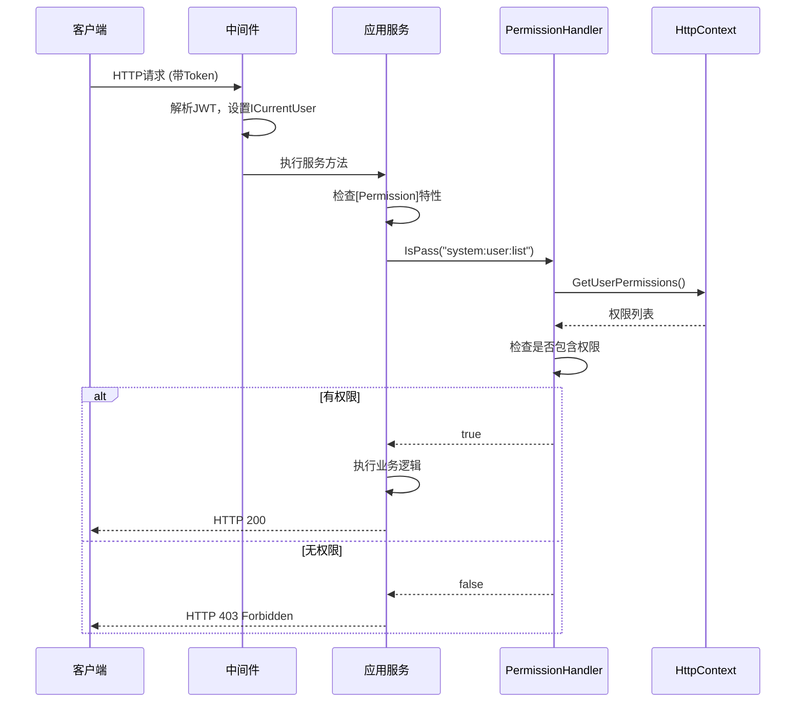

# 权限定义服务

## 概述

权限定义服务是RBAC模块的核心组件，负责定义、管理和验证系统权限。基于ABP Framework的权限系统，实现了细粒度的功能权限控制和数据权限过滤。

**位置**：`module/rbac/Yi.Framework.Rbac.Domain/Authorization`
**层**：Domain
**模块**：rbac
**依赖注入**：Transient

---

## 架构位置

```mermaid
graph TD
    A[应用服务层<br/>UserService/DeviceService] -->|使用[Permission]| B[权限定义服务<br/>PermissionAttribute]
    A -->|检查权限| C[权限处理器<br/>IPermissionHandler]
    C -->|实现| D[默认权限处理器<br/>DefaultPermissionHandler]
    D -->|从| E[HttpContext<br/>User Claims]
    D -->|检查| F[PermissionCollection]
    F -->|包含| G[权限列表<br/>Permission Codes]
```

## 核心职责

1. **权限定义**：通过`PermissionAttribute`特性标记API权限要求
2. **权限验证**：在请求处理时验证用户是否拥有所需权限
3. **权限存储**：在JWT Token的Claims中存储用户权限列表
4. **超级管理员**：支持`*:*:*`超级权限码，拥有所有权限
5. **数据权限**：支持基于部门的数据权限过滤（`DataPermissionExtensions`）

## 关键接口

### IPermissionHandler

```csharp
public interface IPermissionHandler
{
    bool IsPass(string permission);  // 检查是否拥有指定权限
}
```

**说明**：权限检查的核心接口，返回`true`表示有权限，`false`表示无权限

### DefaultPermissionHandler

```csharp
public class DefaultPermissionHandler : IPermissionHandler, ITransientDependency
{
    private ICurrentUser _currentUser { get; set; }
    private IHttpContextAccessor _httpContextAccessor;

    public bool IsPass(string permission)
    {
        var permissions = _httpContextAccessor.HttpContext.GetUserPermissions(TokenTypeConst.Permission);
        if (permissions is not null)
        {
            // 超级管理员拥有所有权限
            if (permissions.Contains("*:*:*"))
            {
                return true;
            }
            return permissions.Contains(permission);
        }
        return false;
    }
}
```

**说明**：从当前HttpContext的用户Claims中提取权限列表，检查是否包含指定权限

### PermissionAttribute

```csharp
[AttributeUsage(AttributeTargets.Method)]
public class PermissionAttribute : Attribute
{
    internal string Code { get; set; }

    public PermissionAttribute(string code)
    {
        Code = code;
    }
}
```

**说明**：用于标记应用服务方法的权限要求，如`[Permission("system:user:list")]`

### DataPermissionExtensions

```csharp
public static class DataPermissionExtensions
{
    // 数据权限扩展，用于基于部门的查询过滤
}
```

**说明**：提供数据权限过滤功能，通常用于限制用户只能查询所属部门或子部门的数据

## 依赖注入配置

```csharp
public override void ConfigureServices(ServiceConfigurationContext context)
{
    // 权限处理器自动注册为ITransientDependency
    // 无需手动配置
}
```

**说明**：`DefaultPermissionHandler`通过ABP的约定自动注册（`ITransientDependency`）

## 数据流

```
用户登录
  → AccountManager.GetTokenByUserIdAsync()
    → 将权限列表添加到JWT Claims (TokenTypeConst.Permission)
      → 客户端请求携带Token
        → 中间件解析Token，设置ICurrentUser
          → 应用服务方法执行前检查[Permission]特性
            → 调用IPermissionHandler.IsPass()
              → 从HttpContext获取用户权限列表
                → 检查是否包含所需权限
                  → 有权限：继续执行
                  → 无权限：抛出403 Forbidden
```

## 重要方法

### `DefaultPermissionHandler.IsPass()`

**作用**：检查当前用户是否拥有指定权限

**调用链**：
```
应用服务方法执行
  → AOP拦截器
    → PermissionHandler.IsPass(permissionCode)
      → HttpContext.GetUserPermissions()
        → 检查权限列表
```

**权限存储位置**：
- JWT Token的Claims中，Key为`TokenTypeConst.Permission`
- 多个权限以数组形式存储
- 超级管理员权限码为`*:*:*`

### 权限在Token中的存储

在`AccountManager.UserInfoToClaim()`方法中：

```csharp
// 如果是管理员，添加管理员权限
if (isAdmin)
{
    AddToClaim(claims, TokenTypeConst.Permission, UserConst.AdminPermissionCode);  // "*:*:*"
    AddToClaim(claims, TokenTypeConst.Roles, UserConst.AdminRolesCode);
}
else
{
    // 普通用户添加具体权限
    dto.PermissionCodes?.ToList()?.ForEach(per => AddToClaim(claims, TokenTypeConst.Permission, per));
    dto.RoleCodes?.ToList()?.ForEach(role => AddToClaim(claims, AbpClaimTypes.Role, role));
}
```

---

## 权限常量定义

### TokenTypeConst

```csharp
public static class TokenTypeConst
{
    public const string Permission = "permission";      // 权限列表
    public const string DeptId = "deptId";             // 部门ID
    public const string RoleInfo = "roleInfo";         // 角色信息
    public const string Refresh = "refresh";           // 刷新Token标识
}
```

### UserConst

```csharp
public static class UserConst
{
    public const string Admin = "admin";                           // 管理员用户名
    public const string AdminPermissionCode = "*:*:*";              // 超级权限码
    public const string AdminRolesCode = "admin";                  // 管理员角色码
}
```

---

## 权限命名规范

系统采用分层的权限命名规范：

```
模块:功能:操作
```

**示例**：
- `system:user:list` - 系统模块-用户管理-列表查询
- `system:user:add` - 系统模块-用户管理-添加用户
- `system:user:edit` - 系统模块-用户管理-编辑用户
- `system:user:delete` - 系统模块-用户管理-删除用户
- `ast-intellisub:device:create` - 变电站模块-设备管理-创建设备
- `ast-voiceprint:audio:download` - 声纹模块-音频管理-下载音频

---

## 源码片段

### 关键实现

**文件路径**：`module/rbac/Yi.Framework.Rbac.Domain/Authorization/DefaultPermissionHandler.cs:19-34`

```csharp
public bool IsPass(string permission)
{
    var permissions = _httpContextAccessor.HttpContext.GetUserPermissions(TokenTypeConst.Permission);
    if (permissions is not null)
    {
        // 超级管理员拥有所有权限
        if (permissions.Contains("*:*:*"))
        {
            return true;
        }
        return permissions.Contains(permission);
    }
    return false;
}
```

**说明**：先检查是否为超级管理员（拥有`*:*:*`权限），再检查具体权限

---

## 权限检查流程



---

## 相关组件

- [[AccountManager]] - 负责在Token生成时添加权限Claims
- [[UserService]] - 使用权限特性保护API
- [[PermissionAttribute]] - 权限标记特性
- [[数据权限扩展]] - 数据权限过滤

---

## 权限与角色的关系

### 角色权限关联

- 用户通过角色获得权限
- 角色拥有多个权限
- 用户可以拥有多个角色
- 权限最终会合并到用户的Token中

### 权限获取流程

```
用户登录
  → 查询用户角色关联
    → 查询角色拥有的菜单（功能权限）
      → 提取菜单的权限标识
        → 合并所有权限列表
          → 存储到JWT Claims
```

---

## 数据权限

数据权限基于部门结构实现：

```csharp
[PermissionGlobal]
public async Task<PagedResultDto<DeviceDto>> GetListAsync(DeviceGetListInput input)
{
    // 自动应用数据权限过滤
    // 用户只能查询所属部门及子部门的数据
}
```

**说明**：`PermissionGlobal`特性会自动应用数据权限过滤

---

## 最佳实践

1. **权限命名**：遵循`模块:功能:操作`的命名规范
2. **细粒度控制**：将增删改查分开定义权限
3. **超级管理员**：仅在必要时使用`*:*:*`权限
4. **数据权限**：对于部门数据，使用`PermissionGlobal`特性
5. **权限检查**：在所有应用服务方法上添加`[Permission]`特性

---

## 学习笔记

### 难点理解

1. **权限存储位置**：权限不存储在数据库中，而是存储在菜单（Menu）表中，通过角色-菜单关联间接获得
2. **权限检查时机**：权限检查在应用服务方法执行前进行，通过AOP实现
3. **超级权限**：`*:*:*`是特殊权限码，代表所有权限，应谨慎授予

### 疑问

<!-- 待解决的问题 -->

---

## 参考资料

- [ABP Framework 权限文档](https://docs.abp.io/en/abp/latest/Authorization)
- 项目源码：
  - `module/rbac/Yi.Framework.Rbac.Domain/Authorization/`
  - `module/rbac/Yi.Framework.Rbac.Domain/Managers/AccountManager.cs`

---
**状态**：🟢 已完成
