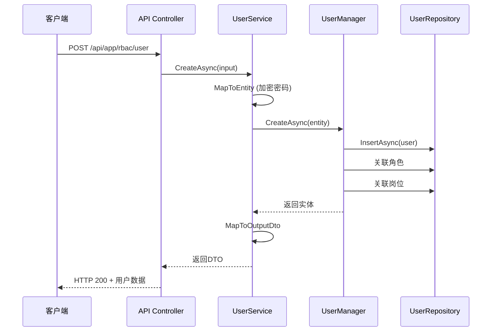

# 用户管理API

## API 概述

**功能**：用户CRUD操作，包括用户查询、创建、更新、删除、状态管理等

**路由**：`/api/app/rbac/user`

**方法**：GET / POST / PUT / DELETE / PATCH

**权限**：基于`system:user`前缀的权限控制

---

## 请求定义

### 查询用户列表

**路由**：`GET /api/app/rbac/user`

**权限**：`system:user:list`

**查询参数**：

| 参数 | 类型 | 必填 | 说明 |
|------|------|------|------|
| UserName | string | 否 | 用户名模糊查询 |
| Name | string | 否 | 真实姓名模糊查询 |
| Phone | long? | 否 | 手机号模糊查询 |
| State | bool? | 否 | 用户状态（true-启用，false-禁用） |
| DeptId | Guid? | 否 | 部门ID（会包含子部门） |
| StartTime | DateTime? | 否 | 创建时间开始 |
| EndTime | DateTime? | 否 | 创建时间结束 |
| Ids | string | 否 | 用户ID列表（逗号分隔） |
| SkipCount | int | 否 | 跳过数量（默认0） |
| MaxResultCount | int | 否 | 最大结果数（默认10） |

**响应示例**：

```json
{
  "result": {
    "items": [
      {
        "id": "3fa85f64-5717-4562-b3fc-2c963f66afa6",
        "userName": "admin",
        "name": "管理员",
        "phone": 13800138000,
        "email": "admin@example.com",
        "dept": {
          "id": "dept-guid",
          "deptName": "技术部"
        },
        "state": true,
        "creationTime": "2024-01-01T00:00:00"
      }
    ],
    "totalCount": 100
  }
}
```

### 获取单个用户

**路由**：`GET /api/app/rbac/user/{id}`

**权限**：`system:user:list`

**路径参数**：

| 参数 | 类型 | 必填 | 说明 |
|------|------|------|------|
| id | Guid | 是 | 用户ID |

**响应示例**：

```json
{
  "result": {
    "id": "3fa85f64-5717-4562-b3fc-2c963f66afa6",
    "userName": "admin",
    "name": "管理员",
    "phone": 13800138000,
    "email": "admin@example.com",
    "dept": {
      "id": "dept-guid",
      "deptName": "技术部"
    },
    "roles": [
      {
        "id": "role-guid",
        "roleName": "系统管理员",
        "roleCode": "admin"
      }
    ],
    "posts": [
      {
        "id": "post-guid",
        "postName": "工程师",
        "postCode": "engineer"
      }
    ],
    "state": true
  }
}
```

### 创建用户

**路由**：`POST /api/app/rbac/user`

**权限**：`system:user:add`

**请求体**：

```json
{
  "userName": "newuser",
  "password": "Password123!",
  "name": "新用户",
  "phone": 13900139000,
  "email": "newuser@example.com",
  "deptId": "dept-guid",
  "roleIds": ["role-guid-1", "role-guid-2"],
  "postIds": ["post-guid-1"]
}
```

**字段说明**：

| 字段 | 类型 | 必填 | 说明 |
|------|------|------|------|
| userName | string | 是 | 登录用户名（唯一） |
| password | string | 是 | 初始密码 |
| name | string | 否 | 真实姓名 |
| phone | long? | 否 | 手机号 |
| email | string? | 否 | 邮箱 |
| deptId | Guid? | 否 | 所属部门ID |
| roleIds | List<Guid> | 是 | 角色ID列表 |
| postIds | List<Guid> | 否 | 岗位ID列表 |

**响应示例**：

```json
{
  "result": {
    "id": "new-user-guid",
    "userName": "newuser",
    "name": "新用户",
    "state": true
  }
}
```

### 更新用户

**路由**：`PUT /api/app/rbac/user/{id}`

**权限**：`system:user:edit`

**请求体**：

```json
{
  "userName": "updateduser",
  "name": "更新用户",
  "password": "NewPassword123!",
  "phone": 13900139001,
  "email": "updated@example.com",
  "deptId": "new-dept-guid",
  "roleIds": ["new-role-guid"],
  "postIds": ["new-post-guid"]
}
```

**注意**：密码字段可选，如不提供则不更新密码

### 更新用户状态

**路由**：`GET /api/app/rbac/user/{id}/{state}`

**权限**：`system:user:update`

**路径参数**：

| 参数 | 类型 | 必填 | 说明 |
|------|------|------|------|
| id | Guid | 是 | 用户ID |
| state | bool | 是 | 新状态（true-启用，false-禁用） |

**响应示例**：

```json
{
  "result": {
    "id": "user-guid",
    "state": false
  }
}
```

### 删除用户

**路由**：`DELETE /api/app/rbac/user`

**权限**：`system:user:delete`

**请求体**：

```json
["user-guid-1", "user-guid-2"]
```

或查询参数：`?ids=user-guid-1,user-guid-2`

---

## 服务端实现

### 应用服务

**类**：`UserService`

**位置**：`module/rbac/Yi.Framework.Rbac.Application/Services/System/UserService.cs`

**方法**：

```csharp
[Permission("system:user:list")]
public async Task<PagedResultDto<UserGetListOutputDto>> GetListAsync(UserGetListInputVo input)
{
    // 支持多条件查询，包括部门层级查询
    // LeftJoin关联部门信息
    // 支持时间范围、用户名、姓名、手机号等过滤
}

[Permission("system:user:add")]
[OperLog("添加用户", OperEnum.Insert)]
public async override Task<UserGetOutputDto> CreateAsync(UserCreateInputVo input)
{
    // 创建用户时自动加密密码
    // 同时关联角色和岗位
}

[Permission("system:user:edit")]
[OperLog("更新用户", OperEnum.Update)]
public async override Task<UserGetOutputDto> UpdateAsync(Guid id, UserUpdateInputVo input)
{
    // 更新用户信息（密码可选）
    // 同时更新角色和岗位关联
}

[Permission("system:user:delete")]
[OperLog("删除用户", OperEnum.Delete)]
public async override Task DeleteAsync(IEnumerable<Guid> id)
{
    // 删除用户时同时删除：
    // - 用户角色关联
    // - 用户变电站绑定关系
    // - 用户实体
}
```

### 数据验证

```csharp
public class UserCreateInputVo
{
    [Required]
    public string UserName { get; set; }

    [Required]
    public string Password { get; set; }

    public string? Name { get; set; }

    public long? Phone { get; set; }

    public string? Email { get; set; }

    public Guid? DeptId { get; set; }

    public List<Guid> RoleIds { get; set; } = new();

    public List<Guid> PostIds { get; set; } = new();
}
```

---

## 业务流程



---

## 权限控制

### 权限定义

所有用户管理API都使用`[Permission]`特性进行权限控制：

```csharp
public static class UserPermissions
{
    public const string List = "system:user:list";
    public const string Add = "system:user:add";
    public const string Edit = "system:user:edit";
    public const string Delete = "system:user:delete";
    public const string Update = "system:user:update";
}
```

### 权限检查

权限检查通过`PermissionAttribute`和`DefaultPermissionHandler`实现：

```csharp
[Permission("system:user:list")]
public async Task<PagedResultDto<UserGetListOutputDto>> GetListAsync(UserGetListInputVo input)
{
    // 只有拥有system:user:list权限的用户才能访问
}
```

### 操作日志

关键操作会记录操作日志：

```csharp
[OperLog("添加用户", OperEnum.Insert)]
[OperLog("更新用户", OperEnum.Update)]
[OperLog("删除用户", OperEnum.Delete)]
```

---

## 使用示例

### cURL

```bash
# 查询用户列表
curl -X GET 'https://api.example.com/api/app/rbac/user?SkipCount=0&MaxResultCount=10' \
  -H 'Authorization: Bearer YOUR_TOKEN'

# 创建用户
curl -X POST 'https://api.example.com/api/app/rbac/user' \
  -H 'Authorization: Bearer YOUR_TOKEN' \
  -H 'Content-Type: application/json' \
  -d '{
    "userName": "newuser",
    "password": "Password123!",
    "name": "新用户",
    "roleIds": ["role-guid"],
    "postIds": ["post-guid"]
  }'

# 更新用户状态
curl -X GET 'https://api.example.com/api/app/rbac/user/user-guid/true' \
  -H 'Authorization: Bearer YOUR_TOKEN'

# 删除用户
curl -X DELETE 'https://api.example.com/api/app/rbac/user?ids=user-guid' \
  -H 'Authorization: Bearer YOUR_TOKEN'
```

### JavaScript (fetch)

```javascript
// 查询用户列表
const response = await fetch('/api/app/rbac/user?SkipCount=0&MaxResultCount=10', {
  headers: {
    'Authorization': `Bearer ${token}`
  }
});

const data = await response.json();
console.log(data.result.items);

// 创建用户
const createResponse = await fetch('/api/app/rbac/user', {
  method: 'POST',
  headers: {
    'Authorization': `Bearer ${token}`,
    'Content-Type': 'application/json'
  },
  body: JSON.stringify({
    userName: 'newuser',
    password: 'Password123!',
    name: '新用户',
    roleIds: ['role-guid'],
    postIds: ['post-guid']
  })
});

const newUser = await createResponse.json();
```

---

## 相关 API

- [[角色管理API]] - 用户角色分配
- [[部门管理API]] - 用户部门管理
- [[岗位管理API]] - 用户岗位分配
- [[登录API]] - 用户登录认证

## 相关组件

- [[UserService]] - 用户应用服务
- [[UserManager]] - 用户领域管理器
- [[UserAggregateRoot]] - 用户聚合根
- [[AccountManager]] - 账户管理器

---

## 错误码

| 错误码 | HTTP状态 | 说明 |
|--------|---------|------|
| VALIDATION_ERROR | 400 | 输入验证失败（如用户名重复） |
| AUTHORIZATION_ERROR | 403 | 权限不足 |
| NOT_FOUND | 404 | 用户不存在 |
| USER_EXIST | 400 | 用户名已存在 |
| USER_NOT_EXIST | 404 | 用户不存在 |

---

## 注意事项

1. **密码安全**：密码在创建和更新时会自动使用SHA256+Salt加密存储
2. **用户名唯一**：用户名在系统中必须唯一
3. **级联删除**：删除用户时会自动删除相关的角色关联和变电站绑定
4. **部门查询**：按部门查询时会包含所有子部门的用户
5. **管理员保护**：admin用户不能被删除或修改用户名
6. **数据权限**：列表查询会受数据权限控制，非管理员只能查看有权限的用户

---
**状态**：🟢 已完成
