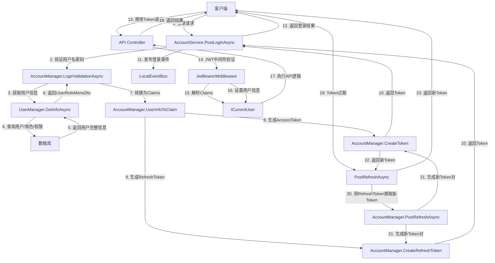
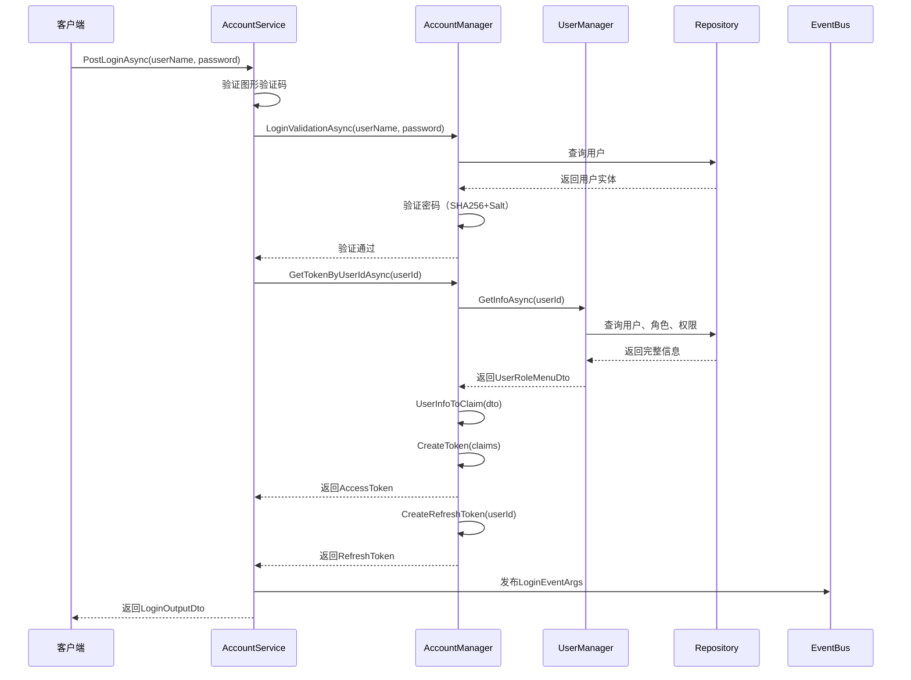
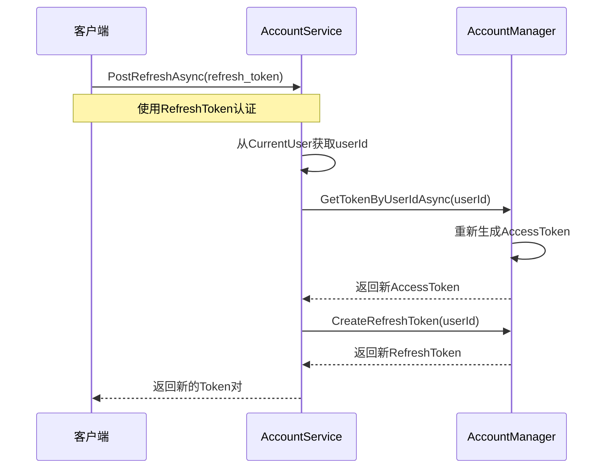
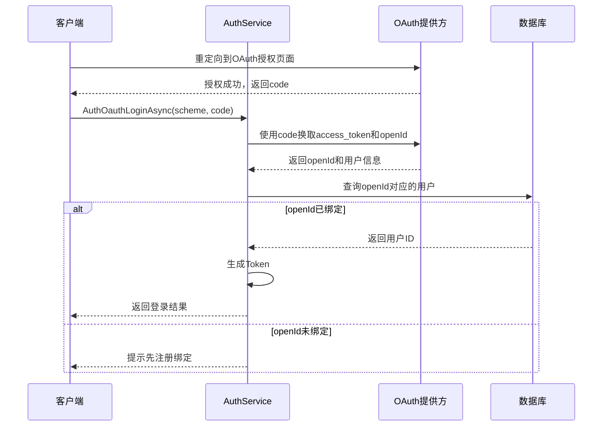

# 认证系统

## 问题背景

### 业务场景

智能变电站监控系统需要实现安全的用户认证机制，支持：
- Web端和移动端登录
- 第三方OAuth登录（QQ、Gitee）
- Token刷新机制
- 权限信息携带
- 登录日志记录

### 技术挑战

1. **安全性**：密码需要安全存储和传输
2. **无状态**：使用JWT实现去中心化的认证
3. **权限传递**：Token中需要携带用户权限信息
4. **Token刷新**：支持AccessToken和RefreshToken双Token机制
5. **多端登录**：支持不同客户端类型的登录

---

## 设计方案

### 为什么使用JWT

#### 方案 A：Session认证

**原理**：用户登录后，服务端创建Session，客户端携带SessionID访问

**优点**：
- 服务端可以主动撤销Session
- 实现简单

**缺点**：
- 需要服务端存储Session状态
- 分布式环境下需要Session共享
- 扩展性差

**结论**：不适合分布式微服务架构

#### 方案 B：JWT认证（采用）

**原理**：用户登录后，服务端生成包含用户信息的JWT Token，客户端每次请求携带Token

**优点**：
- 无状态，服务端无需存储Token
- 支持分布式部署
- Token中可携带用户权限等信息
- 跨域支持良好

**代价**：
- Token无法主动撤销（只能等待过期）
- Token payload较大（包含用户信息）
- 需要妥善保管SecretKey

**结论**：适合本系统的分布式架构需求

---

## 技术细节

### 核心机制

#### Token生成流程

```csharp
// 文件路径：module/rbac/Yi.Framework.Rbac.Domain/Managers/AccountManager.cs:101-116
private string CreateToken(List<KeyValuePair<string, string>> kvs)
{
    var key = new SymmetricSecurityKey(Encoding.UTF8.GetBytes(_jwtOptions.SecurityKey));
    var creds = new SigningCredentials(key, SecurityAlgorithms.HmacSha256);
    var claims = kvs.Select(x => new Claim(x.Key, x.Value.ToString())).ToList();
    var token = new JwtSecurityToken(
       issuer: _jwtOptions.Issuer,
       audience: _jwtOptions.Audience,
       claims: claims,
       expires: DateTime.Now.AddMinutes(_jwtOptions.ExpiresMinuteTime),
       notBefore: DateTime.Now,
       signingCredentials: creds);
    string returnToken = new JwtSecurityTokenHandler().WriteToken(token);
    return returnToken;
}
```

#### 用户信息转Claims

```csharp
// 文件路径：module/rbac/Yi.Framework.Rbac.Domain/Managers/AccountManager.cs:193-237
public List<KeyValuePair<string, string>> UserInfoToClaim(UserRoleMenuDto dto)
{
    var claims = new List<KeyValuePair<string, string>>();
    AddToClaim(claims, AbpClaimTypes.UserId, dto.User.Id.ToString());
    AddToClaim(claims, AbpClaimTypes.UserName, dto.User.UserName);
    AddToClaim(claims, TokenTypeConst.DeptId, dto.User.DeptId.ToString());
    AddToClaim(claims, AbpClaimTypes.Email, dto.User.Email);
    AddToClaim(claims, AbpClaimTypes.PhoneNumber, dto.User.Phone.ToString());

    // 角色信息（包含数据权限范围）
    AddToClaim(claims, TokenTypeConst.RoleInfo,
        JsonConvert.SerializeObject(dto.Roles.Select(x => new RoleTokenInfoModel
        {
            Id = x.Id,
            DataScope = x.DataScope
        })));

    // 权限和角色
    bool isAdmin = UserConst.Admin.Equals(dto.User.UserName) ||
                   dto.Roles.Any(r => r.RoleName.Contains("管理员") || r.RoleCode == "admin");

    if (isAdmin)
    {
        AddToClaim(claims, TokenTypeConst.Permission, UserConst.AdminPermissionCode); // "*:*:*"
        AddToClaim(claims, TokenTypeConst.Roles, UserConst.AdminRolesCode);
    }
    else
    {
        dto.PermissionCodes?.ToList()?.ForEach(per =>
            AddToClaim(claims, TokenTypeConst.Permission, per));
        dto.RoleCodes?.ToList()?.ForEach(role =>
            AddToClaim(claims, AbpClaimTypes.Role, role));
    }

    return claims;
}
```

### 数据结构

#### JwtOptions配置

```csharp
// 文件路径：module/rbac/Yi.Framework.Rbac.Domain.Shared/Options/JwtOptions.cs
public class JwtOptions
{
    public string Issuer { get; set; } = "ccnetcore.com";
    public string Audience { get; set; } = "https//ccnetcore.com";
    public string SecurityKey { get; set; } = "892u4j1803qj23jro0fjkf8bmsdf9nb9mf92834u23jdf923jrnmvasbceqwt347562tgdhdnsv9wevbnop";
    public long ExpiresMinuteTime { get; set; } = 120;  // AccessToken有效期120分钟
}
```

#### RefreshTokenOptions

```csharp
// 文件路径：module/rbac/Yi.Framework.Rbac.Domain.Shared/Options/RefreshJwtOptions.cs
public class RefreshJwtOptions : JwtOptions
{
    // 继承JwtOptions，可单独配置RefreshToken的有效期
}
```

#### 登录请求/响应

```csharp
// 登录请求
public class LoginInputVo
{
    public string UserName { get; set; } = string.Empty;
    public string Password { get; set; } = string.Empty;
    public string? Uuid { get; set; }      // 验证码UUID
    public string? Code { get; set; }       // 验证码
}

// 登录响应
public class LoginOutputDto
{
    public string Token { get; set; }        // AccessToken
    public string RefreshToken { get; set; }
    public string UserName { get; set; }
}
```

### 配置示例

```json
{
  "Jwt": {
    "Issuer": "ccnetcore.com",
    "Audience": "https://ccnetcore.com",
    "SecurityKey": "your-secret-key-at-least-32-chars",
    "ExpiresMinuteTime": 120
  },
  "RefreshJwt": {
    "Issuer": "ccnetcore.com",
    "Audience": "https://ccnetcore.com",
    "SecurityKey": "your-refresh-secret-key",
    "ExpiresMinuteTime": 10080  // 7天
  },
  "Rbac": {
    "EnableCaptcha": true,
    "EnableRegister": false
  }
}
```

---

## 架构图



---

## DDD 分层视角

| 层 | 职责 | 示例 |
|----|------|------|
| Application | 应用服务编排，登录流程控制 | AccountService |
| Domain | 认证核心逻辑，Token生成 | AccountManager, UserManager |
| Domain.Shared | 配置选项，常量定义 | JwtOptions, TokenTypeConst |

---

## 认证流程

### 登录流程



### Token刷新流程



---

## 相关概念

- [[权限定义服务]] - Token中权限信息的来源
- [[用户管理API]] - 用户信息管理
- [[AccountManager]] - 认证领域服务
- [[JWT]] - JSON Web Token标准

---

## ABP 集成

### 模块集成

```csharp
// 文件路径：src/Yi.Abp.Web/YiAbpWebModule.cs
[DependsOn(
    typeof(AbpAspNetCoreAuthenticationJwtBearerModule),  // JWT认证模块
    typeof(YiFrameworkAspNetCoreModule),
    typeof(YiFrameworkAspNetCoreAuthenticationOAuthModule)  // OAuth认证模块
)]
public class YiAbpWebModule : AbpModule
{
    public override void ConfigureServices(ServiceConfigurationContext context)
    {
        // JWT配置在appsettings.json中
    }
}
```

### 最佳实践

1. **Token有效期**：AccessToken设置较短有效期（如2小时），RefreshToken设置较长有效期（如7天）
2. **SecretKey安全**：生产环境务必使用强随机密钥，并妥善保管
3. **权限缓存**：Token中的权限在缓存期内不会更新，重要权限变更需要重新登录
4. **HTTPS传输**：生产环境必须使用HTTPS传输Token
5. **密码加密**：使用SHA256+Salt的方式存储密码

---

## 密码安全

### 密码存储

```csharp
// 文件路径：module/rbac/Yi.Framework.Rbac.Domain/Entities/UserAggregateRoot.cs
public class EncryPasswordValueObject
{
    public string Password { get; set; }
    public string Salt { get; set; }

    public EncryPasswordValueObject(string password)
    {
        Salt = Guid.NewGuid().ToString().Replace("-", "").Substring(0, 10);
        Password = MD5Helper.SHA2Encode(password, Salt);
    }
}
```

**说明**：每个用户使用唯一的Salt，防止彩虹表攻击

### 密码验证

```csharp
// 文件路径：module/rbac/Yi.Framework.Rbac.Domain/Managers/AccountManager.cs:146-162
public async Task LoginValidationAsync(string userName, string password, Action<UserAggregateRoot> userAction = null)
{
    var user = new UserAggregateRoot();
    if (await ExistAsync(userName, o => user = o))
    {
        if (user.EncryPassword.Password == MD5Helper.SHA2Encode(password, user.EncryPassword.Salt))
        {
            return;
        }
        throw new ApplicationException(UserConst.Login_Error);
    }
    throw new ApplicationException(UserConst.Login_User_No_Exist);
}
```

---

## OAuth第三方登录

系统支持QQ和Gitee第三方登录：

### 流程



### API端点

- `GET /api/app/rbac/auth/oauth/login/{scheme}` - OAuth登录
- `POST /api/app/rbac/auth/oauth/bind/{scheme}` - 绑定OAuth账号

---

## 登录日志

每次登录都会记录登录日志：

```csharp
// 文件路径：module/rbac/Yi.Framework.Rbac.Application/Services/AccountService.cs:138-145
var loginEntity = new LoginLogAggregateRoot().GetInfoByHttpContext(_httpContextAccessor.HttpContext);
var loginEto = loginEntity.Adapt<LoginEventArgs>();
loginEto.UserName = userInfo.User.UserName;
loginEto.UserId = userInfo.User.Id;
await LocalEventBus.PublishAsync(loginEto);
```

**记录信息**：
- 用户ID和用户名
- 登录时间
- IP地址
- 浏览器类型
- 操作系统

---

## 参考资料

- [JWT官方规范](https://jwt.io/)
- [ABP Framework 认证文档](https://docs.abp.io/en/abp/latest/Authentication)
- 项目源码：
  - `module/rbac/Yi.Framework.Rbac.Application/Services/AccountService.cs`
  - `module/rbac/Yi.Framework.Rbac.Domain/Managers/AccountManager.cs`
  - `module/rbac/Yi.Framework.Rbac.Domain.Shared/Options/`

---
**状态**：🟢 已完成
