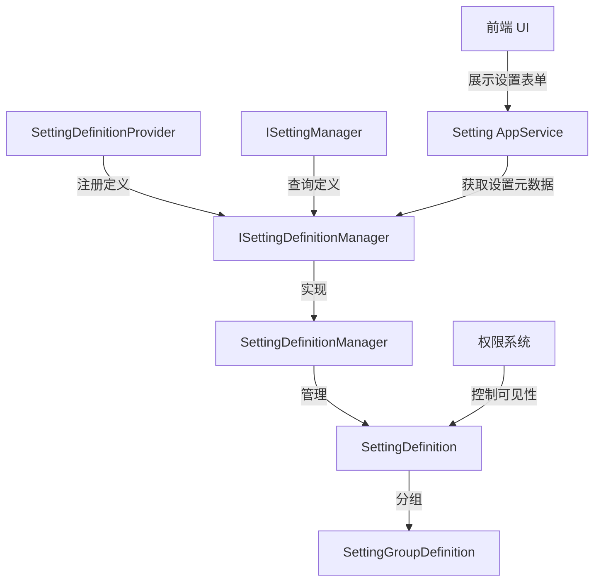

# SettingGroupService

## 概述

**设置组管理服务** - 负责管理系统设置的定义、分组和组织结构，提供设置的元数据管理功能，支持设置的分组显示和权限控制。

**位置**：`module/setting-management/Yi.Framework.SettingManagement.Domain/`
**层**：Domain
**模块**：setting-management
**依赖注入**：Singleton (继承 ABP SettingDefinitionManager)

---

## 架构位置



## 核心职责

1. **设置定义管理** - 管理所有设置的元数据（名称、默认值、数据类型等）
2. **设置分组** - 将设置按业务逻辑分组（如"邮件设置"、"短信设置"）
3. **权限控制** - 控制设置的可见性和可访问性
4. **加密标记** - 标记敏感设置为需要加密存储
5. **客户端可见性** - 控制设置是否对前端暴露

## 关键接口

```csharp
public interface ISettingDefinitionManager
{
    // 获取所有设置定义
    Task<IReadOnlyList<ISettingDefinition>> GetAllAsync();

    // 获取单个设置定义
    Task<ISettingDefinition> GetOrNullAsync(string name);

    // 获取指定设置组
    Task<ISettingGroupDefinition> GetGroupOrNullAsync(string name);

    // 获取所有设置组
    Task<IReadOnlyList<ISettingGroupDefinition>> GetGroupsAsync();

    // 添加设置定义
    void Add(ISettingDefinition definition);

    // 添加设置组定义
    void AddGroup(ISettingGroupDefinition group);
}
```

## 设置定义结构

```csharp
public class SettingDefinition
{
    public string Name { get; set; }                    // 设置名称（唯一标识）
    public string? DisplayName { get; set; }           // 显示名称
    public string? Description { get; set; }            // 描述
    public string? DefaultValue { get; set; }            // 默认值
    public bool? IsVisibleToClients { get; set; }       // 是否对客户端可见
    public bool? IsEncrypted { get; set; }              // 是否加密存储
    public string? GroupName { get; set; }              // 所属组名称
    public ISettingValueProvider? DefaultValueProvider { get; set; }  // 默认值提供者
    public PropertyType? ValueType { get; set; }       // 值类型（String/Boolean/Number）
    public string[]? AllowedValues { get; set; }        // 允许的值列表
}
```

## 设置组定义

```csharp
public class SettingGroupDefinition
{
    public string Name { get; set; }                    // 组名称（唯一标识）
    public string? DisplayName { get; set; }           // 显示名称
    public string? Description { get; set; }           // 描述
}
```

## Provider 配置

```csharp
// module/setting-management/Yi.Framework.SettingManagement.Domain/YiFrameworkSettingManagementDomainModule.cs
public override void ConfigureServices(ServiceConfigurationContext context)
{
    Configure<SettingManagementOptions>(options =>
    {
        // 按优先级添加 Provider
        options.Providers.Add<DefaultValueSettingManagementProvider>();
        options.Providers.Add<ConfigurationSettingManagementProvider>();
        options.Providers.Add<GlobalSettingManagementProvider>();
        options.Providers.Add<TenantSettingManagementProvider>();
        options.Providers.Add<UserSettingManagementProvider>();
    });
}
```

## 设置定义提供者

```csharp
// 自定义设置定义提供者
public class IntelliSubSettingDefinitionProvider : SettingDefinitionProvider
{
    public override void Define(ISettingDefinitionContext context)
    {
        // 1. 添加设置组
        context.AddGroup(
            new SettingGroupDefinition(
                "Smtp",
                displayName: "邮件设置",
                description: "SMTP 邮件服务器配置"
            )
        );

        // 2. 添加邮件设置
        context.Add(
            new SettingDefinition(
                "Smtp.Host",
                defaultValue: "smtp.example.com",
                groupName: "Smtp",
                isVisibleToClients: true
            )
        );

        context.Add(
            new SettingDefinition(
                "Smtp.Port",
                defaultValue: "587",
                groupName: "Smtp",
                isVisibleToClients: true
            )
        );

        context.Add(
            new SettingDefinition(
                "Smtp.UserName",
                defaultValue: null,
                groupName: "Smtp",
                isVisibleToClients: true
            )
        );

        context.Add(
            new SettingDefinition(
                "Smtp.Password",
                defaultValue: null,
                groupName: "Smtp",
                isVisibleToClients: false,  // 敏感信息不暴露给前端
                isEncrypted: true           // 加密存储
            )
        );

        // 3. 添加短信设置组
        context.AddGroup(
            new SettingGroupDefinition(
                "Sms",
                displayName: "短信设置",
                description: "短信网关配置"
            )
        );

        context.Add(
            new SettingDefinition(
                "Sms.Provider",
                defaultValue: "Aliyun",
                groupName: "Sms",
                isVisibleToClients: true
            )
        );

        context.Add(
            new SettingDefinition(
                "Sms.AccessKeyId",
                defaultValue: null,
                groupName: "Sms",
                isVisibleToClients: false,
                isEncrypted: true
            )
        );
    }
}
```

## 数据流

```
应用启动
  → 扫描 SettingDefinitionProvider
    → 调用 Define() 方法
      → 注册 SettingDefinition 和 SettingGroupDefinition
        → 存储到 SettingDefinitionManager
          
运行时查询
  → SettingDefinitionManager.GetAsync(name)
    → 返回 SettingDefinition
      → 获取默认值、数据类型、是否加密等元数据
        → 传递给 SettingManager 进行实际值管理
          
前端请求设置表单
  → SettingAppService.GetSettingsForEditor()
    → 查询所有 isVisibleToClients = true 的设置
      → 按 GroupName 分组
        → 返回给前端渲染表单
```

## 设置值类型

```csharp
public enum PropertyType
{
    String,      // 文本类型（默认）
    Boolean,     // 布尔类型
    Number,      // 数字类型
    Selection    // 选择类型（需要提供 AllowedValues）
}

// 示例：选择类型
context.Add(
    new SettingDefinition(
        "System.DateFormat",
        defaultValue: "yyyy-MM-dd",
        valueType: PropertyType.Selection,
        allowedValues: new[] { "yyyy-MM-dd", "yyyy/MM/dd", "dd-MM-yyyy" }
    )
);

// 示例：布尔类型
context.Add(
    new SettingDefinition(
        "System.EnableRegistration",
        defaultValue: "true",
        valueType: PropertyType.Boolean
    )
);
```

## 设置可见性控制

```csharp
// 控制设置对不同层的可见性
context.Add(
    new SettingDefinition(
        "System.AdminEmail",
        defaultValue: "admin@example.com",
        isVisibleToClients: true  // 前端可见
    )
);

context.Add(
    new SettingDefinition(
        "Payment.SecretKey",
        defaultValue: null,
        isVisibleToClients: false,  // 仅后端可见
        isEncrypted: true            // 加密存储
    )
);
```

## 相关组件

- [[SettingService]] - 设置值管理服务
- [[ISettingDefinitionManager]] - 设置定义管理器
- [[SettingDefinition]] - 设置定义
- [[SettingGroupDefinition]] - 设置组定义

## 使用场景

1. **设置注册** - 应用启动时注册所有可用设置
2. **前端表单生成** - 根据定义动态生成设置表单
3. **权限验证** - 控制用户能访问哪些设置
4. **数据验证** - 根据定义验证输入值类型和范围

## 设置组示例

```
┌─ 邮件设置 (Smtp)
│  ├─ SMTP 主机
│  ├─ SMTP 端口
│  ├─ 用户名
│  └─ 密码（加密，前端不可见）
│
├─ 短信设置 (Sms)
│  ├─ 提供商
│  ├─ AccessKeyId（加密，前端不可见）
│  └─ AccessKeySecret（加密，前端不可见）
│
└─ 系统设置 (System)
   ├─ 日期格式
   ├─ 时区
   └─ 允许注册
```

## 注意事项

1. **设置名称全局唯一** - 即使在不同组中，设置名称也不能重复
2. **敏感信息保护** - 敏感设置必须标记 `isVisibleToClients: false` 和 `isEncrypted: true`
3. **默认值提供者** - 可通过 DefaultValueProvider 动态提供默认值
4. **组定义顺序** - 组在前端按定义顺序显示

## 参考资料

- [ABP Settings 文档](https://docs.abp.io/en/abp/latest/Settings)
- 项目源码：`module/setting-management/`

---
**状态**：✅ 完成
