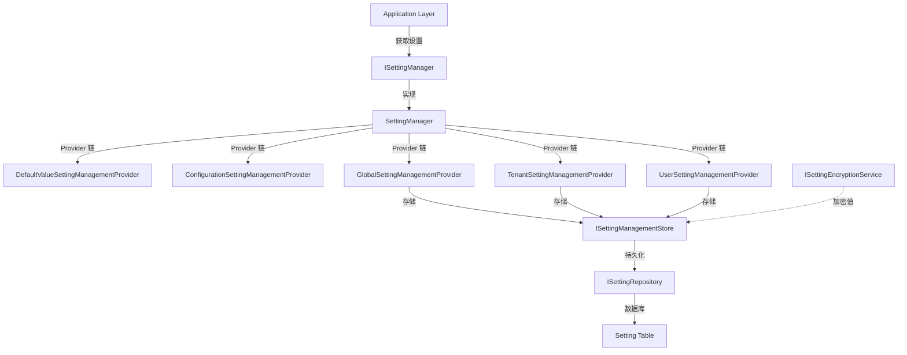

# SettingService

## 概述

**设置管理服务** - 提供系统设置的集中管理，支持全局、租户、用户三个层级的设置值管理，实现设置的继承、覆盖和加密存储功能。

**位置**：`module/setting-management/Yi.Framework.SettingManagement.Domain/SettingManager.cs`
**层**：Domain
**模块**：setting-management
**依赖注入**：Singleton (单例，全局共享)

---

## 架构位置



## 核心职责

1. **设置值读取** - 支持多层级设置继承（全局 → 租户 → 用户）
2. **设置值写入** - 支持不同层级的设置覆盖
3. **设置加密** - 敏感设置值自动加密存储
4. **提供者链** - 按优先级顺序查询多个提供者
5. **缓存优化** - 通过分布式缓存提高查询性能

## 关键接口

```csharp
public interface ISettingManager
{
    // 获取单个设置值（支持回退）
    Task<string> GetOrNullAsync(
        string name, 
        string providerName, 
        string providerKey, 
        bool fallback = true
    );

    // 获取所有设置值
    Task<List<SettingValue>> GetAllAsync(
        string providerName, 
        string providerKey, 
        bool fallback = true
    );

    // 设置单个值
    Task SetAsync(
        string name, 
        string value, 
        string providerName, 
        string providerKey
    );

    // 删除单个值
    Task DeleteAsync(
        string name, 
        string providerName, 
        string providerKey
    );

    // 获取必需的设置值（不能为空）
    Task<string> GetRequiredAsync(
        string name, 
        string providerName = null, 
        string providerKey = null
    );
}
```

## Provider 优先级链

```csharp
// 按优先级从高到低
1. UserSettingManagementProvider        // 用户级设置
2. TenantSettingManagementProvider      // 租户级设置
3. GlobalSettingManagementProvider      // 全局设置
4. ConfigurationSettingManagementProvider // 配置文件
5. DefaultValueSettingManagementProvider // 默认值定义
```

## 数据流

```
读取设置请求
  → SettingManager.GetOrNullAsync()
    → 获取 SettingDefinition
      → 遍历 Provider 链（从用户级到默认值）
        → Provider.GetOrNullAsync()
          → ISettingManagementStore.GetOrNullAsync()
            → 分布式缓存查询
              → 缓存未命中？
                → 是 → ISettingRepository 查询数据库
                  → 返回值（或 null）
              → 缓存命中？
                → 是 → 直接返回缓存值
        → 第一个非 null 值返回
          → 如果设置了加密？
            → 是 → ISettingEncryptionService.Decrypt()
              → 返回明文值
```

## 重要方法

### `GetOrNullAsync()`

**作用**：获取设置值，支持 Provider 链回退

**实现逻辑**：
```csharp
public virtual Task<string> GetOrNullAsync(
    string name, 
    string providerName, 
    string providerKey, 
    bool fallback = true)
{
    Check.NotNull(name, nameof(name));
    Check.NotNull(providerName, nameof(providerName));

    return GetOrNullInternalAsync(name, providerName, providerKey, fallback);
}

protected virtual async Task<string> GetOrNullInternalAsync(
    string name, 
    string providerName, 
    string providerKey, 
    bool fallback)
{
    // 1. 获取设置定义
    var setting = await SettingDefinitionManager.GetOrNullAsync(name);
    if (setting == null)
    {
        return null;
    }

    // 2. 如果不加密，直接从 Provider 获取
    if (!setting.IsEncrypted)
    {
        return await GetProvidersValue(setting, providerName, providerKey, fallback);
    }

    // 3. 加密设置，获取后解密
    var encryptedValue = await GetProvidersValue(
        setting, 
        providerName, 
        providerKey, 
        fallback
    );
    
    if (encryptedValue == null)
    {
        return null;
    }

    return Decrypt(setting, encryptedValue);
}
```

### `GetAllAsync()`

**作用**：获取指定 Provider 的所有设置值

**实现逻辑**：
```csharp
public virtual async Task<List<SettingValue>> GetAllAsync(
    string providerName, 
    string providerKey, 
    bool fallback = true)
{
    Check.NotNull(providerName, nameof(providerName));

    var settingDefinitions = await SettingDefinitionManager.GetAllAsync();
    var providers = Enumerable.Reverse(Providers)
        .SkipWhile(c => c.Name != providerName);

    if (!fallback)
    {
        providers = providers.TakeWhile(c => c.Name == providerName);
    }

    var providerList = providers.Reverse().ToList();
    if (!providerList.Any())
    {
        return new List<SettingValue>();
    }

    var settingValues = new Dictionary<string, SettingValue>();
    foreach (var settingDefinition in settingDefinitions)
    {
        var value = await GetProvidersValue(
            settingDefinition, 
            providerName, 
            providerKey, 
            fallback
        );
        
        if (value != null)
        {
            settingValues[settingDefinition.Name] = new SettingValue(
                settingDefinition.Name, 
                value
            );
        }
    }

    return settingValues.Values.ToList();
}
```

### `SetAsync()`

**作用**：设置指定层级的值

**实现逻辑**：
```csharp
public virtual async Task SetAsync(
    string name, 
    string value, 
    string providerName, 
    string providerKey)
{
    Check.NotNull(name, nameof(name));
    Check.NotNull(providerName, nameof(providerName));

    var setting = await SettingDefinitionManager.GetOrNullAsync(name);
    if (setting == null)
    {
        throw new AbpException($"Undefined setting: {name}");
    }

    // 1. 加密敏感值
    var valueToSet = value;
    if (setting.IsEncrypted)
    {
        valueToSet = Encrypt(setting, value);
    }

    // 2. 调用对应的 Provider 设置
    var provider = Providers.FirstOrDefault(p => p.Name == providerName);
    if (provider == null)
    {
        throw new AbpException($"Unknown setting provider: {providerName}");
    }

    await provider.SetAsync(setting, valueToSet, providerKey);
}
```

## Provider 实现

### GlobalSettingManagementProvider

```csharp
public class GlobalSettingManagementProvider : SettingManagementProvider
{
    public override string Name => GlobalSettingValueProvider.ProviderName;

    public GlobalSettingManagementProvider(
        ISettingManagementStore settingManagementStore
    ) : base(settingManagementStore)
    {
    }

    protected override string NormalizeProviderKey(string providerKey)
    {
        return null;  // 全局设置不需要 ProviderKey
    }
}
```

### TenantSettingManagementProvider

```csharp
public class TenantSettingManagementProvider : SettingManagementProvider
{
    public override string Name => TenantSettingValueProvider.ProviderName;

    protected ICurrentTenant CurrentTenant { get; }

    protected override string NormalizeProviderKey(string providerKey)
    {
        if (providerKey != null)
        {
            return providerKey;
        }

        return CurrentTenant.Id?.ToString();  // 自动使用当前租户 ID
    }
}
```

### UserSettingManagementProvider

```csharp
public class UserSettingManagementProvider : SettingManagementProvider
{
    public override string Name => UserSettingValueProvider.ProviderName;

    protected ICurrentUser CurrentUser { get; }

    protected override string NormalizeProviderKey(string providerKey)
    {
        if (providerKey != null)
        {
            return providerKey;
        }

        return CurrentUser.Id?.ToString();  // 自动使用当前用户 ID
    }
}
```

## SettingManagementStore

**职责**：设置的持久化和缓存

```csharp
public class SettingManagementStore : ISettingManagementStore
{
    public virtual async Task<string> GetOrNullAsync(
        string name, 
        string providerName, 
        string providerKey)
    {
        return (await GetCacheItemAsync(name, providerName, providerKey)).Value;
    }

    public virtual async Task SetAsync(
        string name, 
        string value, 
        string providerName, 
        string providerKey)
    {
        var setting = await SettingRepository.FindAsync(
            name, 
            providerName, 
            providerKey
        );
        
        if (setting == null)
        {
            setting = new SettingAggregateRoot(
                GuidGenerator.Create(), 
                name, 
                value, 
                providerName, 
                providerKey
            );
            await SettingRepository.InsertAsync(setting);
        }
        else
        {
            setting.Value = value;
            await SettingRepository.UpdateAsync(setting);
        }

        // 更新缓存
        await Cache.SetAsync(
            CalculateCacheKey(name, providerName, providerKey), 
            new SettingCacheItem(setting?.Value), 
            considerUow: true
        );
    }

    public virtual async Task DeleteAsync(
        string name, 
        string providerName, 
        string providerKey)
    {
        var setting = await SettingRepository.FindAsync(
            name, 
            providerName, 
            providerKey
        );
        
        if (setting != null)
        {
            await SettingRepository.DeleteAsync(setting);
        }

        // 清除缓存
        await Cache.RemoveAsync(
            CalculateCacheKey(name, providerName, providerKey), 
            considerUow: true
        );
    }
}
```

## 设置继承示例

```
设置定义: "Smtp.Host"
  默认值: "smtp.example.com" (DefaultValueProvider)

全局设置: "smtp.company.com" (GlobalProvider)
  → 覆盖默认值

租户 A 设置: "smtp.tenant-a.com" (TenantProvider)
  → 覆盖全局设置

用户 U1 设置: "smtp.user-u1.com" (UserProvider)
  → 覆盖租户设置

查询结果:
  - 用户 U1 → "smtp.user-u1.com" (用户级)
  - 用户 U2 → "smtp.tenant-a.com" (租户级)
  - 租户 B 用户 → "smtp.company.com" (全局级)
  - 无租户用户 → "smtp.example.com" (默认值)
```

## 相关组件

- [[SettingGroupService]] - 设置组服务
- [[ISettingManagementStore]] - 设置存储
- [[ISettingRepository]] - 设置仓储
- [[ISettingEncryptionService]] - 加密服务

## 使用场景

1. **系统配置** - 邮件服务器、短信网关等全局配置
2. **租户配置** - 允许租户自定义部分设置
3. **用户偏好** - 用户个性化设置（语言、时区等）
4. **敏感信息** - 加密存储 API 密钥、密码等

## 加密设置

```csharp
// 定义加密设置
public class MySettingDefinitionProvider : SettingDefinitionProvider
{
    public override void Define(ISettingDefinitionContext context)
    {
        context.Add(
            new SettingDefinition(
                "Smtp.Password",
                defaultValue: null,
                isVisibleToClients: false,
                isEncrypted: true  // 标记为加密设置
            )
        );
    }
}

// 使用
var password = await SettingManager.GetAsync("Smtp.Password");
// 自动解密后返回明文
```

## 参考资料

- [ABP Settings 文档](https://docs.abp.io/en/abp/latest/Settings)
- 项目源码：`module/setting-management/`

---
**状态**：✅ 完成
