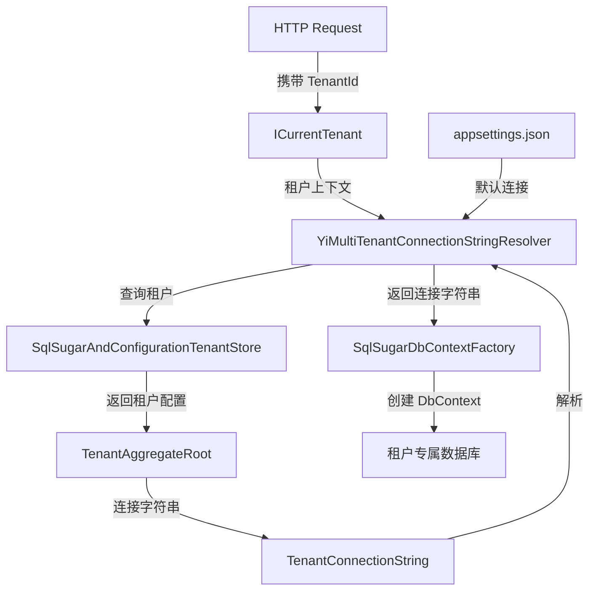

# TenantConnectionService

## 概述

**租户连接字符串解析服务** - 负责在多租户环境中动态解析当前租户的数据库连接字符串，支持租户独立数据库、租户共享数据库、默认数据库等多种部署模式。

**位置**：`module/tenant-management/Yi.Framework.TenantManagement.Domain/`
**层**：Domain (Infrastructure)
**模块**：tenant-management
**依赖注入**：Transient (替换 ABP 默认的 IConnectionStringResolver)

---

## 架构位置



## 核心职责

1. **连接字符串解析** - 根据当前租户 ID 解析对应的连接字符串
2. **多模式支持** - 支持租户独立数据库、共享数据库、默认数据库
3. **回退机制** - 租户无连接字符串时回退到默认配置
4. **缓存优化** - 通过 ITenantStore 缓存租户配置
5. **动态切换** - 支持请求级别的租户上下文切换

## 关键接口

```csharp
public class YiMultiTenantConnectionStringResolver : MultiTenantConnectionStringResolver
{
    // 重写解析逻辑
    public override async Task<string> ResolveAsync(string? connectionStringName = null);
}
```

## 依赖注入配置

```csharp
// module/tenant-management/Yi.Framework.TenantManagement.Domain/YiFrameworkTenantManagementDomainModule.cs
public override void ConfigureServices(ServiceConfigurationContext context)
{
    var services = context.Services;
    
    // 替换默认的租户存储实现
    services.Replace(
        new ServiceDescriptor(
            typeof(ITenantStore), 
            typeof(SqlSugarAndConfigurationTenantStore), 
            ServiceLifetime.Transient
        )
    );

    // 替换默认的连接字符串解析器
    services.Replace(
        new ServiceDescriptor(
            typeof(IConnectionStringResolver), 
            typeof(YiMultiTenantConnectionStringResolver), 
            ServiceLifetime.Transient
        )
    );
}
```

## 数据流

```
HTTP 请求
  → 数据操作
    → SqlSugarDbContextFactory.GetDbContextAsync()
      → YiMultiTenantConnectionStringResolver.ResolveAsync()
        → 获取当前租户 ID (ICurrentTenant.Id)
          → 租户 ID 为空？
            → 是 → 返回全局默认连接字符串
            → 否 → 继续解析
              → SqlSugarAndConfigurationTenantStore.FindAsync(id)
                → 缓存命中？
                  → 是 → 返回缓存的租户配置
                  → 否 → 查询数据库获取租户
                    → 租户有连接字符串？
                      → 是 → 返回租户连接字符串
                      → 否 → 返回全局默认连接字符串
```

## 重要方法

### `ResolveAsync()`

**作用**：解析当前租户的连接字符串

**解析策略**：

```csharp
public override async Task<string> ResolveAsync(string? connectionStringName = null)
{
    // 1. 无当前租户，使用全局默认
    if (_currentTenant.Id == null)
    {
        return await base.ResolveAsync(connectionStringName);
    }

    // 2. 查询租户配置
    var tenant = await FindTenantConfigurationAsync(_currentTenant.Id.Value);

    // 3. 租户未定义连接字符串，回退到默认
    if (tenant == null || tenant.ConnectionStrings.IsNullOrEmpty())
    {
        return await base.ResolveAsync(connectionStringName);
    }

    var tenantDefaultConnectionString = tenant.ConnectionStrings?.Default;

    // 4. 请求默认连接字符串
    if (connectionStringName == null || 
        connectionStringName == ConnectionStrings.DefaultConnectionStringName)
    {
        return !tenantDefaultConnectionString.IsNullOrWhiteSpace()
            ? tenantDefaultConnectionString!
            : Options.ConnectionStrings.Default!;
    }

    // 5. 请求特定连接字符串
    var connString = tenant.ConnectionStrings?.FirstOrDefault().Value;
    if (!connString.IsNullOrWhiteSpace())
    {
        return connString!;
    }

    // 6. 查找映射的数据库
    var database = Options.Databases.GetMappedDatabaseOrNull(connectionStringName);
    if (database != null && database.IsUsedByTenants)
    {
        connString = tenant.ConnectionStrings?.GetOrDefault(database.DatabaseName);
        if (!connString.IsNullOrWhiteSpace())
        {
            return connString!;
        }
    }

    // 7. 最终回退到默认
    return await base.ResolveAsync(connectionStringName);
}
```

### `FindTenantConfigurationAsync()`

**作用**：查找租户配置（支持缓存）

```csharp
protected virtual async Task<TenantConfiguration?> FindTenantConfigurationAsync(Guid id)
{
    using (CurrentTenant.Change(null))  // 以宿主身份查询
    {
        var tenant = await _tenantStore.FindAsync(id);
        if (tenant == null)
        {
            return null;
        }

        return new TenantConfiguration(
            tenant.Id,
            tenant.Name,
            tenant.ConnectionStrings?.ToDictionary(x => x.Key, x => x.Value),
            tenant.ConnectionStrings?.Default
        );
    }
}
```

## 部署模式

### 1. 独立数据库模式（推荐用于大客户）

```json
// appsettings.json
{
  "ConnectionStrings": {
    "Default": "Data Source=host.db"
  }
}

// 租户配置
Tenant A: ConnectionString = "Data Source=tenant_a.db"
Tenant B: ConnectionString = "Data Source=tenant_b.db"
```

### 2. 共享数据库模式（推荐用于中小企业）

```json
// appsettings.json
{
  "ConnectionStrings": {
    "Default": "Data Source=shared.db"
  }
}

// 租户配置（无独立连接字符串，使用默认）
Tenant A: ConnectionString = null
Tenant B: ConnectionString = null
// 所有租户共享 shared.db，通过 TenantId 隔离数据
```

### 3. 混合模式

```json
// 重要客户使用独立数据库
VIP Tenant: ConnectionString = "Data Source=vip.db"

// 普通客户共享数据库
Normal Tenant: ConnectionString = null
```

## 连接字符串配置

```csharp
// 创建租户时配置连接字符串
var tenant = new TenantAggregateRoot(id, "Tenant A");

// SQLite
tenant.SetConnectionString(DbType.Sqlite, "Data Source=tenant_a.db");

// MySQL
tenant.SetConnectionString(DbType.MySql, 
    "Server=localhost;Database=tenant_a;User=root;Password=123456;");

// SQL Server
tenant.SetConnectionString(DbType.SqlServer, 
    "Server=.;Database=TenantA;Trusted_Connection=True;");

// PostgreSQL
tenant.SetConnectionString(DbType.PostgreSQL, 
    "Host=localhost;Database=tenant_a;Username=postgres;Password=123456;");
```

## 租户存储（SqlSugarAndConfigurationTenantStore）

**职责**：从数据库或配置文件中查询租户信息，支持缓存

**查询优先级**：
1. 数据库（`YiTenant` 表）
2. appsettings.json 配置

```csharp
protected virtual async Task<TenantCacheItem> GetCacheItemAsync(Guid? id, string name)
{
    var cacheKey = CalculateCacheKey(id, name);

    // 1. 尝试从缓存获取
    var cacheItem = await Cache.GetAsync(cacheKey, considerUow: true);
    if (cacheItem != null)
    {
        return cacheItem;
    }

    // 2. 从数据库查询
    if (id.HasValue)
    {
        using (CurrentTenant.Change(null))  // 以宿主身份查询
        {
            using (var uow = _unitOfWorkManager.Begin(isTransactional: false))
            {
                var tenant = await TenantRepository.FindAsync(id.Value);
                await uow.CompleteAsync();
                return await SetCacheAsync(cacheKey, tenant);
            }
        }
    }

    throw new AbpException("Both id and name can't be invalid.");
}
```

## 相关组件

- [[TenantService]] - 租户管理服务
- [[SqlSugarAndConfigurationTenantStore]] - 租户存储
- [[ICurrentTenant]] - 当前租户上下文
- [[SqlSugarDbContextFactory]] - DbContext 工厂

## 使用场景

1. **SaaS 多租户** - 每个客户独立数据库
2. **数据隔离** - 不同租户数据物理隔离
3. **性能优化** - 大客户独立数据库避免互相影响
4. **灵活部署** - 支持独立、共享、混合部署模式

## 注意事项

1. **租户查询必须使用宿主身份** - 通过 `CurrentTenant.Change(null)` 切换
2. **缓存一致性** - 租户连接字符串变更后需清除缓存
3. **事务处理** - 查询租户时使用非事务 UoW 避免死锁
4. **回退机制** - 始终提供默认连接字符串作为回退

## 参考资料

- [ABP Connection Strings 文档](https://docs.abp.io/en/abp/latest/Connection-Strings)
- 项目源码：`module/tenant-management/`

---
**状态**：✅ 完成
