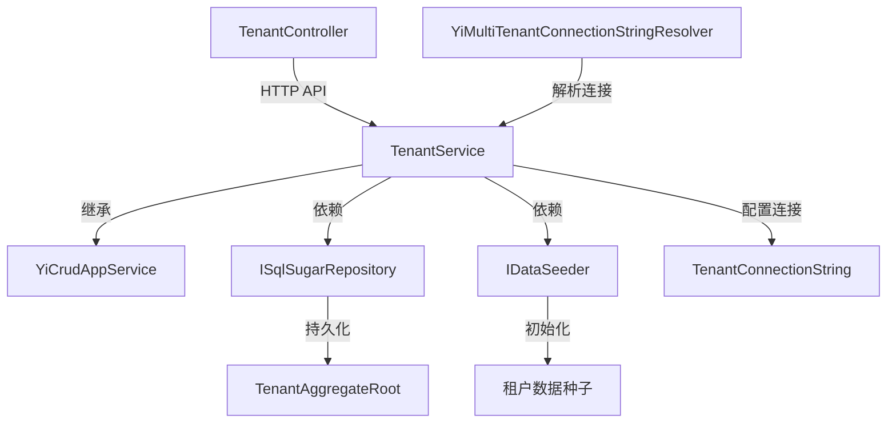

# TenantService

## 概述

**租户管理服务** - 提供多租户系统的租户 CRUD 操作，支持租户隔离的数据库连接、数据种子初始化和租户查询功能。

**位置**：`module/tenant-management/Yi.Framework.TenantManagement.Application/TenantService.cs`
**层**：Application
**模块**：tenant-management
**依赖注入**：Transient (继承 YiCrudAppService)

---

## 架构位置



## 核心职责

1. **租户 CRUD** - 创建、查询、更新、删除租户
2. **租户数据初始化** - 创建租户时自动初始化数据种子
3. **连接字符串管理** - 为租户配置独立的数据库连接
4. **租户查询** - 支持按名称、时间范围等条件筛选
5. **租户选项** - 提供租户下拉选项列表

## 关键接口

```csharp
public interface ITenantService : 
    IYiCrudAppService<TenantGetOutputDto, TenantGetListOutputDto, Guid, 
                     TenantGetListInput, TenantCreateInput, TenantUpdateInput>
{
    // 继承标准的 CRUD 操作
}

// 扩展方法
public async Task<List<TenantSelectOutputDto>> GetSelectAsync();
public async Task<TenantGetOutputDto> CreateAsync(TenantCreateInput input);
public async Task IsAnyAsync(string name);  // 租户名称查重
```

## 依赖注入配置

```csharp
// TenantService 构造函数
public TenantService(
    ISqlSugarRepository<TenantAggregateRoot, Guid> repository,
    IDataSeeder dataSeeder
) : base(repository)
{
    _repository = repository;
    _dataSeeder = dataSeeder;
}
```

## 数据流

```
创建租户请求
  → TenantService.CreateAsync()
    → IsAnyAsync() 检查名称唯一性
      → _repository.InsertAsync() 插入租户
        → SetConnectionString() 配置数据库连接
          → _dataSeeder.SeedAsync() 初始化数据种子
            → 返回创建的租户信息
            
查询租户
  → GetListAsync() / GetAsync()
    → _repository._DbQueryable (支持 WhereIF 动态条件)
      → MapToGetListOutputDtosAsync() 对象映射
        → 返回分页结果
```

## 重要方法

### `CreateAsync()`

**作用**：创建新租户，支持独立的数据库配置和数据种子初始化

**实现逻辑**：
```csharp
public override async Task<TenantGetOutputDto> CreateAsync(TenantCreateInput input)
{
    // 1. 检查租户名称唯一性
    if (await _repository._DbQueryable.AnyAsync(x => x.Name == input.Name))
    {
        throw new UserFriendlyException("租户名称已存在");
    }
    
    // 2. 创建租户实体
    var tenant = new TenantAggregateRoot(
        GuidGenerator.Create(),
        input.Name
    );
    
    // 3. 配置连接字符串（如果提供）
    if (!string.IsNullOrEmpty(input.ConnectionString) && input.DbType.HasValue)
    {
        tenant.SetConnectionString(input.DbType.Value, input.ConnectionString);
    }
    
    // 4. 插入数据库
    await _repository.InsertAsync(tenant);
    
    // 5. 初始化租户数据种子
    if (input.SeedDatabase)
    {
        using (CurrentTenant.Change(tenant.Id))
        {
            await _dataSeeder.SeedAsync(tenant.Id.ToString());
        }
    }
    
    return await MapToGetOutputDtoAsync(tenant);
}
```

### `GetListAsync()`

**作用**：分页查询租户列表，支持多条件筛选

**查询条件**：
- `Name` - 租户名称模糊匹配
- `StartTime` / `EndTime` - 创建时间范围
- `SkipCount` / `MaxResultCount` - 分页参数

```csharp
public override async Task<PagedResultDto<TenantGetListOutputDto>> GetListAsync(
    TenantGetListInput input)
{
    RefAsync<int> total = 0;

    var entities = await _repository._DbQueryable
        .WhereIF(!string.IsNullOrEmpty(input.Name), x => x.Name.Contains(input!))
        .WhereIF(input.StartTime is not null && input.EndTime is not null,
            x => x.CreationTime >= input.StartTime && x.CreationTime <= input.EndTime)
        .ToPageListAsync(input.SkipCount, input.MaxResultCount, total);
        
    return new PagedResultDto<TenantGetListOutputDto>(
        total, 
        await MapToGetListOutputDtosAsync(entities)
    );
}
```

### `GetSelectAsync()`

**作用**：获取租户选项列表（用于下拉选择框）

```csharp
public async Task<List<TenantSelectOutputDto>> GetSelectAsync()
{
    var entities = await _repository._DbQueryable.ToListAsync();
    return entities.Select(x => new TenantSelectOutputDto 
    { 
        Id = x.Id, 
        Name = x.Name 
    }).ToList();
}
```

## DTO 定义

```csharp
// 创建输入
public class TenantCreateInput
{
    public string Name { get; set; }
    public string? ConnectionString { get; set; }
    public DbType? DbType { get; set; }
    public bool SeedDatabase { get; set; } = true;
}

// 更新输入
public class TenantUpdateInput
{
    public string? Name { get; set; }
    public string? ConnectionString { get; set; }
    public DbType? DbType { get; set; }
}

// 查询输入
public class TenantGetListInput : PagedAndSortedResultRequestDto
{
    public string? Name { get; set; }
    public DateTime? StartTime { get; set; }
    public DateTime? EndTime { get; set; }
}

// 输出 DTO
public class TenantGetOutputDto : EntityDto<Guid>
{
    public string Name { get; set; }
    public string? ConnectionString { get; set; }
    public DbType DbType { get; set; }
    public DateTime CreationTime { get; set; }
}

// 选项 DTO
public class TenantSelectOutputDto
{
    public Guid Id { get; set; }
    public string Name { get; set; }
}
```

## 实体关系

```csharp
public class TenantAggregateRoot : FullAuditedAggregateRoot<Guid>
{
    public string Name { get; protected set; }
    public string TenantConnectionString { get; protected set; }
    public DbType DbType { get; protected set; }
    public int EntityVersion { get; protected set; }
    
    public void SetConnectionString(DbType dbType, string connectionString)
    {
        DbType = dbType;
        TenantConnectionString = connectionString;
    }
}
```

## 权限控制

本服务未在代码中显式添加权限特性，实际使用时建议添加：

```csharp
[Authorize(TenantPermissions.Tenants.Create)]
public override async Task<TenantGetOutputDto> CreateAsync(TenantCreateInput input);

[Authorize(TenantPermissions.Tenants.Update)]
public override async Task<TenantGetOutputDto> UpdateAsync(Guid id, TenantUpdateInput input);

[Authorize(TenantPermissions.Tenants.Delete)]
public override async Task DeleteAsync(Guid id);

[Authorize(TenantPermissions.Tenants.Default)]
public override async Task<TenantGetOutputDto> GetAsync(Guid id);
```

## 相关组件

- [[TenantConnectionService]] - 租户连接服务
- [[YiMultiTenantConnectionStringResolver]] - 连接字符串解析器
- [[SqlSugarAndConfigurationTenantStore]] - 租户存储
- [[IDataSeeder]] - 数据种子服务

## 使用场景

1. **SaaS 应用** - 为每个客户创建独立租户
2. **数据隔离** - 不同租户使用独立数据库
3. **租户管理** - 管理后台的租户 CRUD
4. **数据初始化** - 创建租户时自动初始化基础数据

## 多租户解析流程

```
当前请求
  → ICurrentTenant 获取租户 ID
    → YiMultiTenantConnectionStringResolver.ResolveAsync()
      → SqlSugarAndConfigurationTenantStore.FindAsync()
        → 获取租户的 ConnectionString
          → SqlSugarDbContextFactory 创建租户专属 DbContext
```

## 参考资料

- [ABP Multi-Tenancy 文档](https://docs.abp.io/en/abp/latest/Multi-Tenancy)
- 项目源码：`module/tenant-management/`

---
**状态**：✅ 完成
