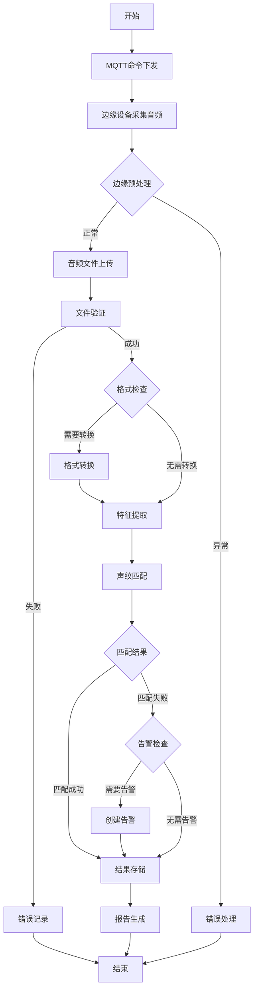

# 音频处理管道

## 概述

音频处理管道是变电站声纹监控系统的核心流程，负责从边缘设备采集音频、上传到服务器、进行格式转换和特征提取，最终完成声纹识别和结果存储。

## 流程图



## 组件说明

### 1. MQTT命令下发

**涉及组件**: `MqttService`, `VoiceprintCaptureJob`

**职责**:
- 通过MQTT协议向边缘设备下发音频采集命令
- 支持定时自动采集和手动采集两种模式
- 维护采集任务状态和超时处理

**配置参数**:
```json
{
  "VoiceprintCaptureJob": {
    "Enabled": true,
    "CronExpression": "0 */10 * * * *",
    "Agents": [
      {
        "GatewayId": "guid",
        "Topic": "ast/audio/capture",
        "CaptureDurationSeconds": 10
      }
    ]
  }
}
```

**关键接口**:
- `IMqttService.PublishAsync()` - 发布MQTT消息
- `VoiceprintCaptureJob.DoWorkAsync()` - 定时任务入口

### 2. 音频文件上传

**涉及组件**: `VoiceprintAudioAppService`, `VoiceprintStorageOptions`

**职责**:
- 接收边缘设备上传的音频文件
- 验证API密钥和文件完整性
- 存储原始音频文件

**API端点**: `POST /api/app/voiceprint/device-audios/upload`

**请求参数**:
```typescript
{
  "apiKey": "string",
  "deviceId": "guid",
  "collectorType": "string",
  "audioFile": "file",
  "occurredAt": "datetime",
  "groupId": "guid"
}
```

**文件大小限制**: 100MB

### 3. 格式转换

**涉及组件**: `VoiceprintAudioAppService`

**职责**:
- 检查音频格式是否符合要求
- 执行必要的格式转换（如MP3转WAV）
- 保持音质和采样率

**支持的格式**:
- 输入: MP3, WAV, M4A
- 输出: WAV (16bit, 16kHz)

**转换策略**:
- 如果上传格式已是标准WAV，直接跳过
- 否则调用FFmpeg进行转换
- 转换失败时记录错误并使用原文件

### 4. 特征提取

**涉及组件**: `VoiceprintRecognitionOptions`, 外部识别服务

**职责**:
- 从音频中提取声纹特征向量
- 生成标准化的特征数据
- 为匹配识别准备数据

**配置参数**:
```json
{
  "VoiceprintRecognition": {
    "AlgorithmApiUrl": "http:// recognition-service/api/extract",
    "AlgorithmSwitchApiUrl": "http:// recognition-service/api/switch",
    "AlgorithmSwitchTimeoutSeconds": 30
  }
}
```

**特征输出**:
- 特征向量（浮点数组）
- 频谱特征
- 时域特征

### 5. 声纹匹配

**涉及组件**: `VoiceprintMatcher`, `VoiceprintStandardAudioEntity`

**职责**:
- 将提取的特征与标准音频库进行比对
- 计算相似度分数
- 生成匹配结果

**匹配策略**:
- 余弦相似度计算
- 阈值判定（默认0.85）
- Top-K相似结果返回

**标准音频库**:
- 存储在 `VoiceprintStandardAudioEntity` 表
- 按设备类型和音频分类组织
- 支持定期更新和维护

### 6. 结果存储

**涉及组件**: `VoiceprintDeviceAudioRecordEntity`, `VoiceprintAlarmRecordEntity`

**职责**:
- 保存音频采集记录
- 存储识别结果和匹配分数
- 创建告警记录（如需要）

**数据库表**:
- `voiceprint_device_audio_record` - 音频记录表
- `voiceprint_alarm_record` - 告警记录表
- `voiceprint_standard_audio` - 标准音频库

### 7. 报告生成

**涉及组件**: `VoiceprintReportOptions`, `WordReportGenerator`

**职责**:
- 生成声纹分析报告（DOCX格式）
- 包含频谱图和对比图表
- 支持批量导出和历史查询

**报告内容**:
- 音频基本信息
- 匹配结果详情
- 频谱对比图
- 告警信息（如有）

## 错误处理策略

### 1. 采集超时处理

**场景**: 边缘设备未在规定时间内完成采集

**处理流程**:
1. `VoiceprintCaptureRuntimeStateService` 检测超时
2. 自动切换回正常运行模式
3. 记录超时事件日志
4. 释放任务锁，允许下次采集

**配置**:
```json
{
  "CaptureTimeoutSeconds": 300
}
```

### 2. 文件上传失败

**场景**: 网络问题、文件损坏、权限问题

**处理流程**:
1. 返回详细错误信息
2. 记录失败日志（包含文件元数据）
3. 不创建数据库记录
4. 客户端可重试上传

**错误码**:
- `FILE_TOO_LARGE` - 文件超过100MB
- `INVALID_FORMAT` - 不支持的音频格式
- `API_KEY_INVALID` - API密钥验证失败
- `DEVICE_NOT_FOUND` - 设备不存在

### 3. 识别服务异常

**场景**: 算法服务不可用或响应超时

**处理流程**:
1. 重试机制（最多3次）
2. 降级处理：标记为"识别失败"但保存原始音频
3. 触发告警通知运维人员
4. 支持后续手动重新识别

**超时配置**:
```json
{
  "RecognitionTimeoutSeconds": 60,
  "MaxRetryCount": 3
}
```

### 4. 存储空间不足

**场景**: 磁盘空间低于阈值

**处理流程**:
1. 触发清理任务（`VoiceprintProcessedCleanupJob`）
2. 删除已处理的旧音频文件
3. 保留数据库记录和特征数据
4. 发送空间告警

**清理策略**:
- 保留最近30天的原始音频
- 清理超过90天的已处理文件
- 告警相关音频永久保留

## 性能指标

### 吞吐量
- 采集频率: 默认10分钟/次（可配置）
- 并发处理: 支持同时处理5个设备
- 文件大小: 平均5-10MB/文件

### 延迟
- 采集命令下发: < 1秒
- 文件上传: 取决于网络（通常5-15秒）
- 格式转换: < 3秒/文件
- 特征提取: 5-10秒/文件
- 匹配识别: < 2秒

### 资源占用
- CPU: 转换和识别时峰值可达80%
- 内存: 单个处理流程约200MB
- 磁盘: 每天约2-5GB（取决于采集频率）

## 监控和告警

### 关键指标
- 采集成功率（目标 > 95%）
- 识别成功率（目标 > 90%）
- 平均处理时延（目标 < 30秒）
- 存储空间使用率

### 告警规则
- 采集连续失败3次触发告警
- 识别服务超时触发告警
- 磁盘空间 < 20% 触发告警
- 处理队列堆积 > 100 触发告警

## 优化建议

### 1. 并发优化
- 使用并行处理多个设备的音频
- 实现采集任务的智能调度
- 优化MQTT连接池

### 2. 存储优化
- 实现音频文件的分层存储
- 采用增量备份策略
- 考虑对象存储（如MinIO）

### 3. 算法优化
- 缓存常用音频的特征向量
- 实现特征提取的批量处理
- 优化匹配算法效率

## 相关文档

- [[音频采集流程]] - 详细的采集步骤说明
- [[声纹识别算法]] - 算法原理和参数配置
- [[MQTT通信协议]] - MQTT消息格式说明
