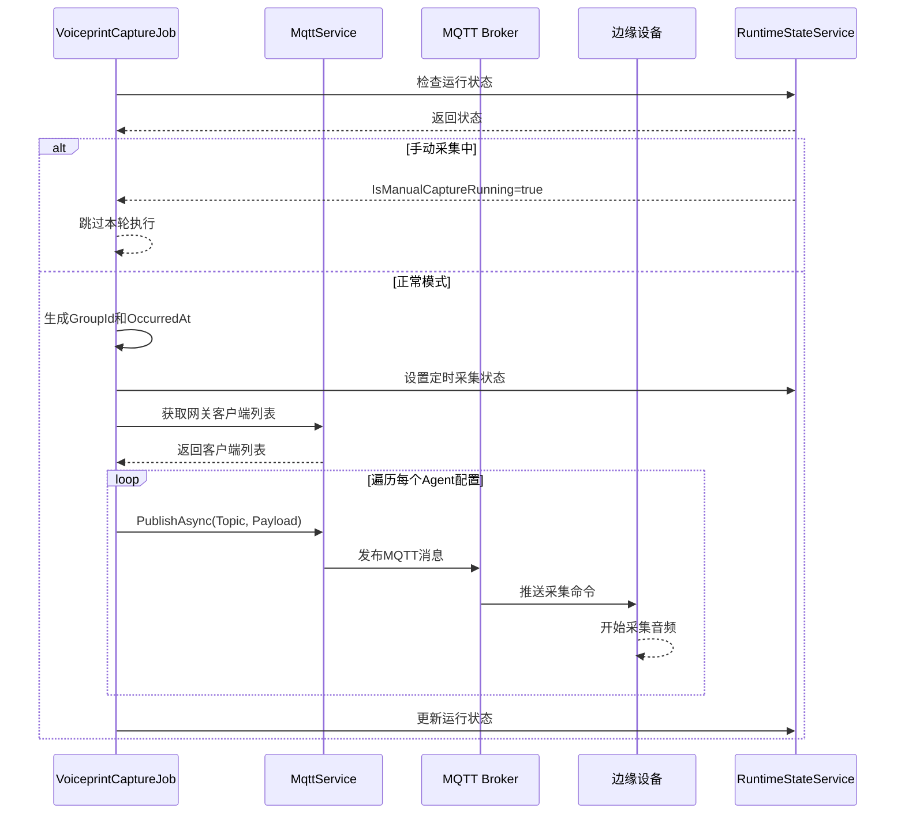
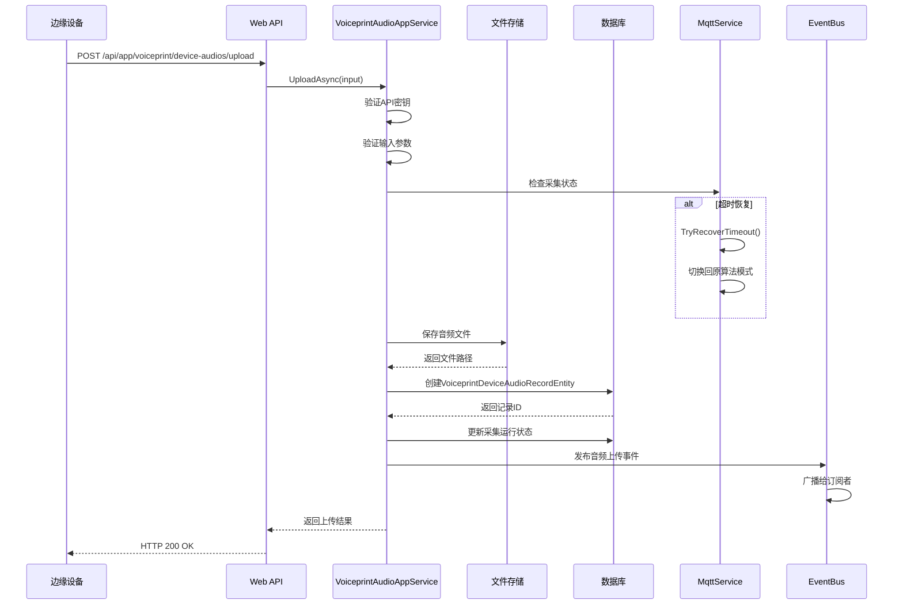
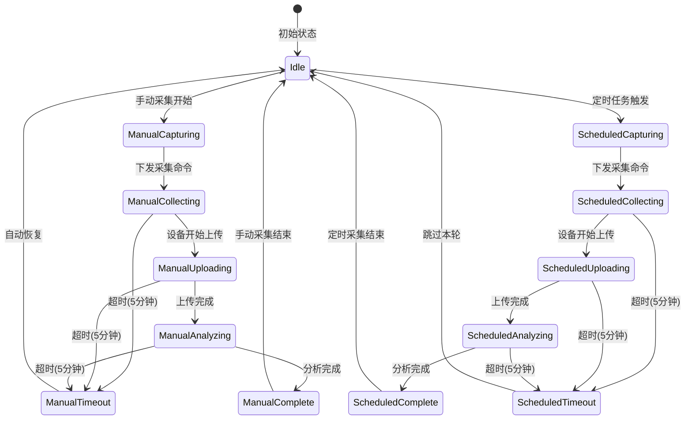

# 音频采集流程

## 概述

音频采集流程描述了通过MQTT协议向边缘设备下发音频采集命令，以及设备上传音频文件的完整过程。包括定时采集和手动采集两种模式，支持采集状态的实时同步。

## 流程分类

### 1. MQTT命令下发流程



**涉及组件**:
- `VoiceprintCaptureJob` - 定时任务
- `MqttService` - MQTT通信服务
- `VoiceprintCaptureRuntimeStateService` - 状态管理

**命令格式**:
```json
{
  "command": "capture_audio",
  "groupId": "guid",
  "occurredAt": "2024-06-03T10:30:00Z",
  "captureDurationSeconds": 10,
  "algorithmMode": "original",
  "deviceId": "device_001"
}
```

**Topic结构**:
```
ast/audio/capture/{gateway_id}/{device_id}
```

**QoS配置**:
- QoS Level: 1 (至少一次)
- Retain: false
- Timeout: 30秒

### 2. 音频文件上传流程



**API端点**: `POST /api/app/voiceprint/device-audios/upload`

**请求参数**:
```typescript
{
  // 必填参数
  apiKey: string;              // API密钥
  deviceId: string;            // 设备ID
  collectorType: string;      // 采集器类型
  audioFile: File;             // 音频文件
  
  // 可选参数
  occurredAt?: string;         // 采集时间 (ISO8601)
  groupId?: string;            // 采集批次ID
  algorithmMode?: string;      // 算法模式
  isManual?: boolean;          // 是否手动采集
  fileIndex?: number;          // 文件索引（多文件上传）
}
```

**响应格式**:
```json
{
  "success": true,
  "audioRecordId": "guid",
  "filePath": "/storage/audio/device_001/20240603_103000.wav",
  "fileSize": 5242880,
  "uploadTime": "2024-06-03T10:30:15Z",
  "processingStatus": "pending"
}
```

**文件命名规则**:
```
{deviceId}_{yyyyMMdd_HHmmss}_{fileIndex}.{ext}
例如: device_001_20240603_103000_0.wav
```

**存储路径**:
```
/storage/voiceprint/{deviceId}/{yyyyMM}/{filename}
例如: /storage/voiceprint/device_001/202406/device_001_20240603_103000_0.wav
```

### 3. 采集状态同步流程



**状态类型**:
```csharp
public enum CaptureState
{
    Idle,              // 空闲
    ManualCapturing,   // 手动采集中
    ScheduledCapturing,// 定时采集中
    ManualCollecting,  // 手动采集数据收集
    ScheduledCollecting,// 定时采集数据收集
    ManualUploading,   // 手动采集中文件上传
    ScheduledUploading,// 定时采集中文件上传
    ManualAnalyzing,   // 手动采集中分析中
    ScheduledAnalyzing,// 定时采集中分析中
    ManualTimeout,     // 手动采集超时
    ScheduledTimeout,  // 定时采集超时
    ManualComplete,    // 手动采集完成
    ScheduledComplete // 定时采集完成
}
```

**状态转换规则**:
1. 只能从 `Idle` 状态进入采集状态
2. 手动采集优先级高于定时采集
3. 定时采集遇到手动采集中会自动跳过
4. 超时状态会自动恢复到 `Idle`
5. 分析完成后自动返回 `Idle`

## 涉及的API端点

### 1. 音频上传接口

**端点**: `POST /api/app/voiceprint/device-audios/upload`

**认证方式**: API Key (Header: `X-API-Key`)

**请求限制**:
- Content-Type: `multipart/form-data`
- Max Body Size: 100MB
- Timeout: 60秒

**错误响应**:
```json
{
  "error": "INVALID_API_KEY",
  "message": "API密钥验证失败",
  "code": 401
}
```

### 2. 采集结果上报接口

**端点**: `POST /api/app/voiceprint/recognition-results`

**请求格式**:
```json
{
  "groupId": "guid",
  "deviceId": "string",
  "results": [
    {
      "audioRecordId": "guid",
      "matchResults": [
        {
          "standardAudioId": "guid",
          "standardAudioName": "string",
          "similarity": 0.95,
          "isMatch": true
        }
      ],
      "abnormalType": "string",
      "processingTimeMs": 5000
    }
  ]
}
```

### 3. 手动采集控制接口

**启动手动采集**:
```
POST /api/app/voiceprint/capture/start
```

**取消手动采集**:
```
POST /api/app/voiceprint/capture/cancel
```

**查询采集状态**:
```
GET /api/app/voiceprint/capture/status
```

## 错误处理策略

### 1. 网络中断处理

**场景**: MQTT连接断开或网络不稳定

**处理策略**:
- 自动重连（指数退避: 1s, 2s, 4s, 8s, 最大30s）
- 消息持久化（QoS=1保证至少一次）
- 重连后重新发送未确认的消息
- 记录连接断开日志

**配置参数**:
```json
{
  "Mqtt": {
    "KeepAlivePeriodSeconds": 60,
    "ConnectionTimeoutSeconds": 30,
    "ReconnectDelaySeconds": 5
  }
}
```

### 2. 设备离线处理

**场景**: 边缘设备未响应采集命令

**处理策略**:
- 等待超时（默认60秒）
- 标记设备为离线状态
- 记录设备离线告警
- 不影响其他设备采集

**健康检查**:
```csharp
public async Task<bool> CheckDeviceHealthAsync(string deviceId)
{
    var lastUpload = await GetLastUploadTimeAsync(deviceId);
    var offlineThreshold = TimeSpan.FromMinutes(30);
    return (DateTime.Now - lastUpload) < offlineThreshold;
}
```

### 3. 上传超时处理

**场景**: 文件上传超时或部分失败

**处理策略**:
- 设置合理的超时时间（60秒）
- 支持断点续传（客户端实现）
- 记录失败文件列表
- 允许重新上传失败的文件

**超时配置**:
```json
{
  "VoiceprintCaptureJob": {
    "UploadTimeoutSeconds": 60,
    "MaxRetries": 3,
    "RetryDelaySeconds": 10
  }
}
```

### 4. 并发冲突处理

**场景**: 定时采集和手动采集冲突

**处理策略**:
- 手动采集优先级更高
- 定时任务检测到手动采集中自动跳过
- 运行时状态服务维护互斥锁
- 记录冲突日志

**互斥逻辑**:
```csharp
if (_runtimeState.IsManualCaptureRunning)
{
    Logger.LogInformation("跳过定时采集：手动采集中");
    return;
}

if (!_runtimeState.TryStartManualCapture(groupId))
{
    throw new Exception("手动采集冲突：已有采集任务运行中");
}
```

### 5. 磁盘空间不足

**场景**: 音频文件存储空间不足

**处理策略**:
- 预检查可用空间（至少预留1GB）
- 触发清理任务（删除旧文件）
- 拒绝新上传并返回错误
- 发送空间告警

**空间检查**:
```csharp
public bool CheckStorageSpace(long requiredBytes)
{
    var drive = DriveInfo.GetDriveInfo(_storageOptions.BasePath);
    var freeSpace = drive.AvailableFreeSpace;
    var minRequired = 1L * 1024 * 1024 * 1024; // 1GB
    return freeSpace > (minRequired + requiredBytes);
}
```

## 配置说明

### MQTT配置

```json
{
  "Mqtt": {
    "Server": "localhost",
    "Port": 1883,
    "ProtocolVersion": "V311",
    "QualityOfService": 1,
    "KeepAlivePeriodSeconds": 60,
    "ConnectionTimeoutSeconds": 30,
    "HealthCheckIntervalMinutes": 5
  }
}
```

### 采集任务配置

```json
{
  "VoiceprintCaptureJob": {
    "Enabled": true,
    "CronExpression": "0 */10 * * * *",
    "CaptureTimeoutSeconds": 300,
    "Agents": [
      {
        "GatewayId": "guid",
        "Topic": "ast/audio/capture",
        "CaptureDurationSeconds": 10,
        "Devices": ["device_001", "device_002"]
      }
    ]
  }
}
```

### 存储配置

```json
{
  "VoiceprintStorage": {
    "BasePath": "/storage/voiceprint",
    "MaxFileSizeMB": 100,
    "MaxTotalSizeGB": 500,
    "RetentionDays": 90
  }
}
```

## 性能指标

### 采集性能

| 指标 | 目标值 | 说明 |
|-----|--------|------|
| 命令下发延迟 | < 1秒 | 从任务触发到MQTT发布 |
| 设备响应时间 | < 5秒 | 从收到命令到开始采集 |
| 文件上传时间 | < 30秒 | 10MB文件，正常网络 |
| 端到端延迟 | < 60秒 | 从命令到上传完成 |

### 可靠性指标

| 指标 | 目标值 | 说明 |
|-----|--------|------|
| 采集成功率 | > 95% | 成功采集次数/总下发次数 |
| 上传成功率 | > 98% | 成功上传次数/总上传次数 |
| 服务可用性 | > 99% | MQTT服务正常时间占比 |

## 相关文档

- [[音频处理管道]] - 音频上传后的处理流程
- [[MQTT通信协议]] - MQTT消息格式规范
- [[边缘设备集成]] - 设备端实现指南
