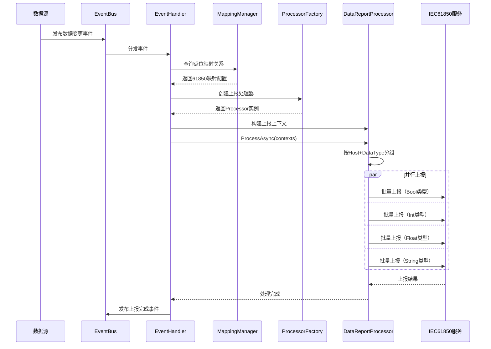
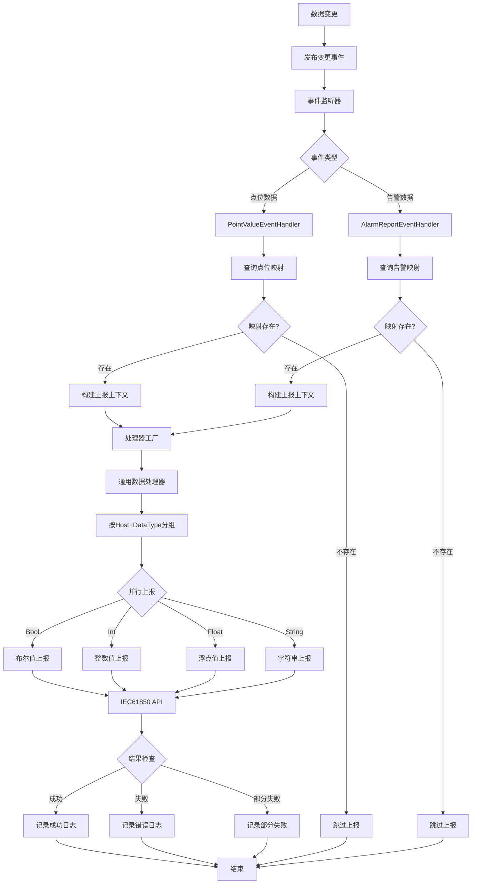

# IEC61850上报管道

## 概述

IEC61850上报管道负责将变电站监测数据（点位数据和告警数据）按照IEC61850标准格式上报到上级调度系统。管道通过事件驱动架构，实现数据变更的实时监听、映射查询、分组处理和并行上报。

## 时序图



## 流程图



## 组件说明

### 1. 事件监听

**涉及组件**: 
- `PointValueEventHandler` - 点位数据变更处理
- `Iec61850AlarmReportHandler` - 告警数据变更处理

**职责**:
- 监听数据变更事件（`PointValueEventArgs`, `AlarmRecordItemCreatedEventArgs`）
- 过滤需要上报的数据
- 触发上报流程

**事件类型**:
```csharp
// 点位数据变更事件
public class PointValueEventArgs
{
    public List<MqPointValueDto> PointValues { get; set; }
    public DateTime OccurredAt { get; set; }
}

// 告警创建事件
public class AlarmRecordItemCreatedEventArgs
{
    public AlarmRecordItemEntity AlarmRecordItem { get; set; }
    public DateTime OccurredAt { get; set; }
}
```

### 2. 映射查询

**涉及组件**: `Iec61850MappingManager`

**职责**:
- 管理点位到IEC61850对象的映射关系
- 从ICD模型文件解析映射配置
- 提供高效的映射查询服务

**映射结构**:
```csharp
public class Iec61850Map
{
    public string PointKey;          // 点位键值
    public string Reference;          // 61850对象引用
    public string Host;              // 61850服务器地址
    public string IcdFileName;       // ICD模型文件名
    public Iec61850DataType DataType; // 数据类型
    public string Description;       // 中文描述
}
```

**点位键值格式**:
- 点位数据: `device_id|sensor_key|property`
- 告警数据: `device_id|sensor_key|property|alarm_category_name`

**示例**:
```
device_001|temperature|value → GISSF60MONT1/SSWG1.UpTmpA
device_001|vibration|alarm|over_speed → GISSF60MONT1/SSWG1.StW.Spd.alm
```

### 3. 上下文构建

**涉及组件**: `IecContext`

**职责**:
- 统一的数据上报上下文
- 拉平点位和告警的数据结构
- 携带映射和值信息

**上下文结构**:
```csharp
public class IecContext
{
    // 映射信息
    public string PointKey;
    public string Reference;
    public string Host;
    public string IcdFileName;
    public Iec61850DataType DataType;
    public string Description;
    
    // 数据值
    public object Value;
    public long TimestampMs;
    public string Quality;
    
    // 元数据
    public string SourceType; // "point" 或 "alarm"
}
```

### 4. 分组处理

**涉及组件**: `GeneralDataReportProcessor`

**职责**:
- 按Host和数据类型分组
- 减少网络请求次数
- 提高上报效率

**分组策略**:
```csharp
// 分组键: (Host, DataType)
var groups = contexts.GroupBy(c => new { c.Host, c.DataType });

// 示例分组结果:
// ("192.168.1.100", Boolean) → 10个上下文
// ("192.168.1.100", Float) → 15个上下文
// ("192.168.1.101", Int) → 8个上下文
```

### 5. 并行上报

**涉及组件**: `IIec61850ApiService`, `GeneralDataReportProcessor`

**职责**:
- 并行调用不同Host的上报接口
- 批量提交同类型数据
- 处理上报结果和错误

**数据类型支持**:

| 数据类型 | IEC61850类型 | API端点 | 示例值 |
|---------|-------------|---------|--------|
| `Boolean` | BOOLEAN | `/api/booleans` | `true`, `false` |
| `Int` | INT32 | `/api/integers` | `100`, `-50` |
| `Float` | FLOAT32 | `/api/floats` | `36.5`, `98.2` |
| `String` | VisibleString | `/api/strings` | `"正常"`, `"告警"` |

**批量上报格式**:
```json
{
  "host": "192.168.1.100:8080",
  "data": [
    {
      "reference": "GISSF60MONT1/SSWG1.UpTmpA",
      "value": 36.5,
      "timestamp": 1717459200000,
      "quality": "good"
    },
    {
      "reference": "GISSF60MONT1/SSWG1.UpTmpB",
      "value": 38.2,
      "timestamp": 1717459200000,
      "quality": "good"
    }
  ]
}
```

## 配置说明

### IEC61850配置

```json
{
  "Iec61850": {
    "EnableDataReport": true,
    "EnableAlarmReport": true,
    "ModelFileDirectory": "Iec61850",
    "ModelFiles": [
      {
        "Enabled": true,
        "ModelFile": "GISSF60_104.icd",
        "Host": "192.168.130.2:8080"
      }
    ],
    "ReportOptions": {
      "BatchSize": 50,
      "Parallelism": 5,
      "TimeoutSeconds": 30,
      "RetryCount": 3
    }
  }
}
```

### 配置参数说明

| 参数 | 说明 | 默认值 |
|-----|------|--------|
| `EnableDataReport` | 是否启点位数据上报 | `false` |
| `EnableAlarmReport` | 是否启用告警上报 | `false` |
| `ModelFileDirectory` | ICD模型文件目录 | `Iec61850` |
| `BatchSize` | 批量上报数量 | `50` |
| `Parallelism` | 并发上报数 | `5` |
| `TimeoutSeconds` | 请求超时时间（秒） | `30` |
| `RetryCount` | 失败重试次数 | `3` |

## 错误处理策略

### 1. 映射查询失败

**场景**: 点位键值未找到映射

**处理策略**:
- 记录Debug级别日志
- 跳过该点位的上报
- 不影响其他点位的上报

**日志示例**:
```
[Debug] 未找到告警的61850映射关系: PointKey=device_001|temperature|value
```

### 2. 上报API超时

**场景**: IEC61850服务响应超时

**处理策略**:
- 重试机制（默认3次）
- 指数退避策略（1s, 2s, 4s）
- 超时后记录错误日志
- 不影响其他Host的上报

**配置**:
```json
{
  "RetryPolicy": {
    "MaxRetries": 3,
    "BaseDelaySeconds": 1,
    "MaxDelaySeconds": 10
  }
}
```

### 3. 部分数据上报失败

**场景**: 批量上报中部分数据失败

**处理策略**:
- 记录失败的数据明细
- 成功的数据不重试
- 失败的数据进入重试队列
- 触发部分失败告警

**失败日志示例**:
```
[Warning] 批量上报部分失败: Total=50, Success=45, Failed=5
```

### 4. IEC61850服务不可用

**场景**: 目标Host连接失败

**处理策略**:
- 标记Host为不可用
- 进入降级模式（停止上报该Host）
- 定期健康检查恢复
- 记录服务不可用告警

**健康检查**:
```csharp
public async Task<bool> HealthCheckAsync(string host)
{
    try
    {
        var client = _httpClientFactory.CreateClient();
        var response = await client.GetAsync($"http://{host}/health");
        return response.IsSuccessStatusCode;
    }
    catch
    {
        return false;
    }
}
```

## 性能说明

### 吞吐量

**上报能力**:
- 单Host: ~1000点位/秒
- 5Host并行: ~5000点位/秒
- 建议配置: 单系统 < 5000点位

**延迟**:
- 数据变更到上报: < 500ms（网络正常）
- 批量上报延迟: < 100ms（50个点位）

### 资源占用

**CPU使用**:
- 正常上报: 5-10%
- 高峰上报: 20-30%

**内存使用**:
- 映射缓存: ~10MB（1000个映射）
- 上报队列: ~20MB（500个待上报上下文）

**网络带宽**:
- 单次批量上报: ~10KB（50个点位）
- 高峰带宽: ~5MB/s

### 优化建议

**1. 映射优化**
- 使用内存缓存提高查询速度
- 预加载常用映射
- 支持热重载映射配置

**2. 批量优化**
- 动态调整批量大小
- 基于网络延迟自适应
- 避免过大批量导致超时

**3. 并发优化**
- 根据Host数量动态调整并发度
- 实现Host级别的隔离
- 避免单个Host影响整体性能

**4. 错误优化**
- 实现断路器模式
- 智能重试策略
- 失败数据持久化

## 监控指标

### 关键指标

| 指标 | 说明 | 目标值 |
|-----|------|--------|
| 上报成功率 | 成功上报数/总上报数 | > 99% |
| 上报延迟 | 数据变更到上报完成 | < 1秒 |
| 映射命中率 | 找到映射数/总查询数 | > 95% |
| API错误率 | API失败数/总请求数 | < 1% |
| 队列堆积 | 待上报上下文数 | < 100 |

### 告警规则

- 上报成功率 < 95% 触发告警
- 上报延迟 > 5秒触发告警
- API错误率 > 5% 触发告警
- 队列堆积 > 500 触发告警

## 相关文档

- [[ICD模型文件配置]] - 映射配置详细说明
- [[IEC61850协议规范]] - 通信协议标准
- [[数据上报API]] - 上报接口文档
